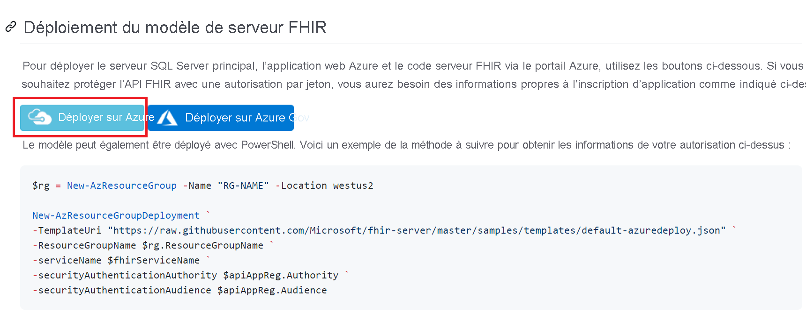
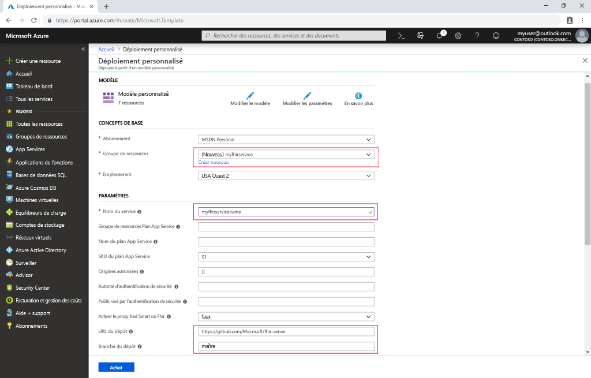

# Démarrage rapide : Déployer le serveur FHIR open source à l’aide du portail Azure

Dans ce guide de démarrage rapide, vous allez apprendre à déployer un serveur FHIR open source sur Azure à l’aide du portail Azure. Nous allons utiliser des liens de déploiement simplifié dans le [dépôt open source](https://github.com/Microsoft/fhir-server)

Si vous n’avez pas d’abonnement Azure, créez un [compte gratuit](https://azure.microsoft.com/free/?WT.mc_id=A261C142F) avant de commencer.

## Dépôt open source GitHub

Accédez à la [page de déploiement de GitHub](https://github.com/Microsoft/fhir-server/blob/master/docs/DefaultDeployment.md), puis recherchez le bouton Déployer sur Azure :

Cliquez sur le bouton de déploiement, et le portail Azure s’ouvre.

## Indiquer les paramètres de déploiement

Choisissez de créer un groupe de ressources, puis donnez-lui un nom. Le seul autre paramètre obligatoire est le nom du service.

Notez que le déploiement entraîne le tirage (pull) du code source directement depuis le dépôt open source vers GitHub. Si vous avez dupliqué (fork) le dépôt, vous pouvez pointer vers votre propre dépôt et vers une branche spécifique.

Après avoir indiqué les détails nécessaires, vous pouvez démarrer le déploiement.

## Vérifier que le serveur FHIR est en cours d’exécution

Une fois le déploiement effectué, vous pouvez faire pointer votre navigateur vers `https://SERVICENAME.azurewebsites.net/metadata` pour obtenir une déclaration de capacité. Il faut environ une minute au serveur pour répondre la première fois.

## Nettoyer les ressources

Quand vous n’en avez plus besoin, vous pouvez supprimer le groupe de ressources et toutes les ressources associées. Pour ce faire, sélectionnez le groupe de ressources contenant les ressources provisionnées, sélectionnez **Supprimer le groupe de ressources**, puis confirmez le nom du groupe de ressources à supprimer.

## Étapes suivantes

Dans ce tutoriel, vous avez déployé le serveur FHIR open source pour Azure de Microsoft sur votre abonnement. Pour savoir comment accéder à l’API FHIR à l’aide de Postman, effectuez le didacticiel Postman.
 
>[!div class="nextstepaction"]
>[Accédez à l’API FHIR à l’aide de Postman](access-fhir-postman-tutorial.md)