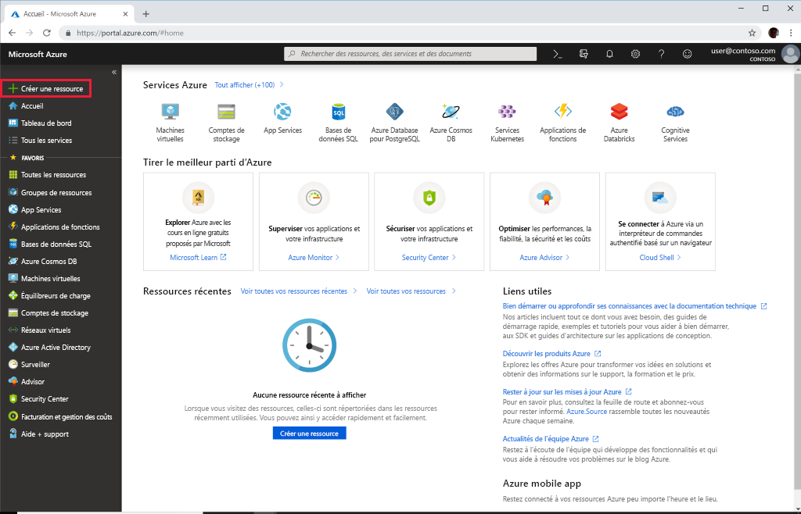
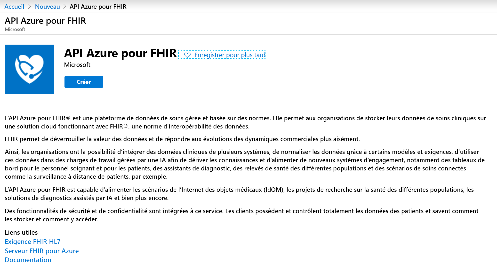
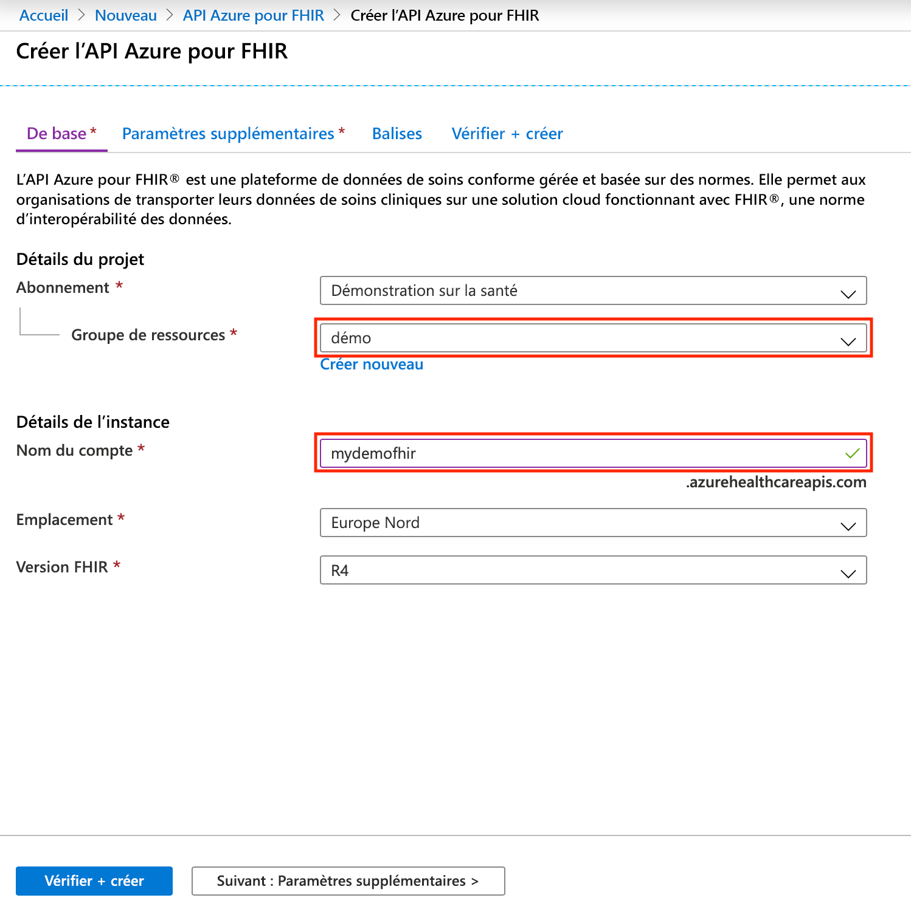

# Démarrage rapide : Déployer l’API Azure pour FHIR à l’aide du portail Azure

Dans ce guide de démarrage rapide, vous allez apprendre à déployer l’API Azure pour FHIR à l’aide du portail Azure.

Si vous n’avez pas d’abonnement Azure, créez un [compte gratuit](https://azure.microsoft.com/free/?WT.mc_id=A261C142F) avant de commencer.

## Créer une ressource

Ouvrez le [portail Azure](https://portal.azure.com), puis cliquez sur **Créer une ressource**

## Rechercher l’API Azure pour FHIR

Vous pouvez trouver l’API Azure pour FHIR en tapant « FHIR » dans la zone de recherche :

## Créer un compte d’API Azure pour FHIR

Sélectionnez **Créer** afin de créer un compte d’API Azure pour FHIR :

## Entrer les détails du compte

Sélectionnez un groupe de ressources existant, ou créez-en un, choisissez un nom pour le compte, puis cliquez sur **Vérifier + créer** :

Confirmez la création et attendez le déploiement de l’API FHIR.

## Paramètres supplémentaires

Cliquez sur **Suivant : Paramètres supplémentaires** pour configurer l’autorité, l’audience et les ID d’objet d’identité autorisés à accéder à cette API Azure pour FHIR, activer SMART sur FHIR le cas échéant, et configurer le débit de base de données :

- **Autorité :** Vous pouvez spécifier un autre locataire Azure AD que celui auquel vous êtes connecté en tant qu’autorité d’authentification pour le service.
- **Audience** : À des fins de bonne pratique et conformément au paramètre par défaut, vous devez affecter l’audience à l’URL du serveur FHIR. Vous pouvez changer cela ici. L’audience identifie le destinataire du jeton. Dans ce contexte, elle doit être définie en fonction d’un élément qui représente l’API FHIR proprement dite.
- **ID d’objet autorisés :** Vous pouvez spécifier les ID d’objet d’identité autorisés à accéder à cette API Azure pour FHIR. Pour plus d’informations sur la recherche de l’ID d’objet des utilisateurs et des principaux de service, consultez le guide pratique [Rechercher des ID d’objet d’identité](find-identity-object-ids.md).  
- **Proxy Smart sur FHIR :** Vous pouvez activer le proxy SMART sur FHIR. Pour plus d’informations sur la configuration du proxy SMART sur FHIR, consultez le tutoriel [Proxy SMART sur FHIR et API Azure pour FHIR](https://docs.microsoft.com/azure/healthcare-apis/use-smart-on-fhir-proxy)  
- **Débit provisionné (RU/s) :** Ici, vous pouvez spécifier les paramètres de débit de la base de données sous-jacente pour votre API Azure pour FHIR. Vous pouvez changer ce paramètre plus tard dans le panneau Base de données. Pour plus d’informations, consultez la page relative à la [configuration des paramètres de base de données](configure-database.md).

## Récupérer une déclaration de capacité relative à l’API FHIR

Pour vérifier que le nouveau compte d’API FHIR est provisionné, récupérez une déclaration de capacité en faisant pointer un navigateur vers `https://<ACCOUNT-NAME>.azurehealthcareapis.com/metadata`.

## Nettoyer les ressources

Quand vous n’en avez plus besoin, vous pouvez supprimer le groupe de ressources, l’API Azure pour FHIR et toutes les ressources associées. Pour ce faire, sélectionnez le groupe de ressources contenant le compte d’API Azure pour FHIR, sélectionnez **Supprimer le groupe de ressources**, puis confirmez le nom du groupe de ressources à supprimer.

## Étapes suivantes

Dans ce guide de démarrage rapide, vous avez déployé l’API Azure pour FHIR sur votre abonnement. Pour définir des paramètres supplémentaires dans votre API Azure pour FHIR, consultez le guide pratique relatif aux paramètres supplémentaires.

>[!div class="nextstepaction"]
>[Paramètres supplémentaires dans l’API Azure pour FHIR](azure-api-for-fhir-additional-settings.md)
