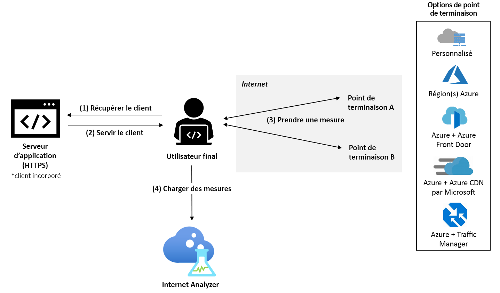

# Qu’est-ce qu’Internet Analyzer ? (Préversion)

Internet Analyzer est une plateforme de mesure côté client servant à tester dans quelle mesure les changements de l’infrastructure réseau ont un impact sur les performances de vos clients. Que vous procédiez à la migration d’un site local vers Azure ou à l’évaluation d’un nouveau service Azure, Internet Analyzer vous permet de tirer des enseignements des données de vos utilisateurs et de l’analytique complète de Microsoft pour mieux comprendre et optimiser votre architecture réseau avec Azure, avant la migration.

Internet Analyzer utilise un petit client JavaScript incorporé dans votre application web pour mesurer la latence de vos utilisateurs finaux sur l’ensemble de destinations réseau sélectionné que nous appelons _points de terminaison_. Internet Analyzer vous permet de configurer plusieurs tests côte à côte, ce qui vous permet d’évaluer un large éventail de scénarios à mesure que vos besoins en matière d’infrastructure et de client évoluent. Internet Analyzer fournit des points de terminaison personnalisés et préconfigurés, ce qui vous offre à la fois la commodité et la flexibilité nécessaires pour prendre des décisions de performance fiables pour vos utilisateurs finaux. 

> [!IMPORTANT]
> Cette préversion publique est fournie sans contrat de niveau de service et ne doit pas être utilisée pour les charges de travail de production. Certaines fonctionnalités peuvent ne pas être prises en charge, disposer de capacités limitées ou ne pas être disponibles dans tous les emplacements Azure. Consultez les [Conditions d’utilisation supplémentaires des préversions de Microsoft Azure](https://azure.microsoft.com/support/legal/preview-supplemental-terms/).
>

## Tests rapides et personnalisables

Internet Analyzer traite les questions liées aux performances pour la migration cloud, le déploiement vers une nouvelle région Azure ou d’autres régions Azure, ou le test de nouvelles plateformes d’application et de distribution de contenu dans Azure, telles que [Azure Front Door](https://azure.microsoft.com/services/frontdoor/) et [Microsoft Azure CDN](https://azure.microsoft.com/services/cdn/). 

Chaque test que vous créez dans Internet Analyzer est composé de deux points de terminaison : le point de terminaison A et le point de terminaison B. Les performances du point de terminaison B sont analysées par rapport au point de terminaison A. 

Vous pouvez configurer votre propre point de terminaison personnalisé ou sélectionner parmi divers points de terminaison Azure préconfigurés. Les points de terminaison personnalisés doivent être utilisés pour évaluer les charges de travail locales, vos instances dans d’autres fournisseurs de cloud ou vos configurations Azure personnalisées. Les tests peuvent être composés de deux points de terminaison personnalisés ; toutefois, au moins un point de terminaison personnalisé doit être hébergé dans Azure. Les points de terminaison Azure préconfigurés sont un moyen simple et rapide d’évaluer les performances des plateformes de mise en réseau Azure populaires, telles que Azure Front Door, Azure Traffic Manager, et Azure CDN. 

Pendant la version préliminaire, les points de terminaison préconfigurés suivants sont disponibles : 

* **Régions Azure**
    * Brésil Sud
    * Inde centrale
    * USA Centre
    * Asie Est
    * USA Est
    * OuJapon Est
    * Europe Nord
    * Afrique du Sud Nord
    * Asie Sud-Est 
    * Émirats arabes unis Nord
    * Ouest du Royaume-Uni  
    * Europe Ouest
    * USA Ouest 
    * USA Ouest 2
* **Plusieurs combinaisons de régions Azure** 
    * USA Est, Brésil Sud 
    * USA Est, Asie Est 
    * Europe Ouest, Brésil Sud
    * Europe Ouest, Asie Sud-Est
    * Europe Ouest, Émirats arabes unis Nord
    * USA Ouest, USA Est 
    * USA Ouest, Europe Ouest
    * USA Ouest, Émirats arabes unis Nord
    * Europe Ouest, Émirats arabes unis Nord, Asie Sud-Est
    * USA Ouest, Europe Ouest, Asie Est
    * USA Ouest, Europe Nord, Asie Sud-Est, Émirats arabes unis Nord, Afrique du Sud Nord 
* **Azure + Azure Front Door** : déployé sur une ou plusieurs combinaisons de régions Azure listées ci-dessus
* **Azure + Azure CDN from Microsoft** : déployé sur une combinaison de régions Azure listées ci-dessus
* **Azure + Azure Traffic Manager** : déployé sur plusieurs combinaisons de régions Azure listées ci-dessus

## Scénarios de test conseillés 

Pour vous aider à prendre les meilleures décisions en matière de performances pour vos clients, Internet Analyzer vous permet d’évaluer deux points de terminaison pour votre population spécifique d’utilisateurs finaux. 

Bien qu’Internet Analyzer puisse répondre à une multitude de questions, voici les plus courantes : 
* Quel est l’impact d’une migration vers le cloud sur les performances ? 
    * *Test suggéré : Personnalisé (votre infrastructure locale actuelle) par rapport à Azure (n’importe quel point de terminaison préconfiguré)*
* Quelle est la différence en termes de valeur d’un placement de mes données en périphérie, par rapport à un placement dans un centre de données ? 
    *  *Test suggéré : Azure, Azure Front Door, Azure par rapport à Azure CDN de Microsoft*
* Quel est l’avantage d’Azure Front Door en matière de performances ?
    *  *Test suggéré : Custom/ Azure/ CDN par rapport à Azure Front Door*
* Quel est l’avantage d’Azure CDN de Microsoft en matière de performances ? 
    *  *Test suggéré : Custom/ Azure/ AFD par rapport à Azure CDN de Microsoft*
* Quels sont les avantages d’Azure CDN de Microsoft ? 
    *  *Test suggéré : Personnalisé (autre point de terminaison CDN) par rapport à Azure CDN de Microsoft*
* Quel est le meilleur cloud pour votre population d’utilisateurs finaux dans chaque région ? 
    *  *Test suggéré : Personnalisé (autre service cloud) par rapport à Azure (n’importe quel point de terminaison préconfiguré)*

## Fonctionnement

Pour utiliser Internet Analyzer, configurez une ressource Internet Analyzer dans le Portail Microsoft Azure et installez le petit client JavaScript dans votre application. Le client mesure la latence de vos utilisateurs finaux à vos points de terminaison sélectionnés en téléchargeant une image d’un pixel sur HTTPS. Après la collecte des mesures de latence, le client envoie les données de mesure à Internet Analyzer.

Lorsqu’un utilisateur visite l’application web, le client JavaScript sélectionne deux points de terminaison à mesurer sur tous les tests configurés. Pour chaque point de terminaison, le client effectue une mesure _à froid_ et _à chaud_. La mesure _à froid_ implique une latence supplémentaire en regard de la latence réseau pure entre l’utilisateur et le point de terminaison, comme pour la résolution DNS, la négociation de connexion TCP et la négociation SSL/TLS. La mesure _à chaud_ s’effectue après la complétion de la mesure _à froid_ et tire parti de la gestion des connexions TCP permanente des navigateurs modernes afin d’obtenir une mesure précise de la latence de bout en bout. Lorsqu’elle est prise en charge par le navigateur de l’utilisateur, l’API de minutage des ressources W3C est utilisée pour un minutage précis des mesures. Actuellement, seules les mesures de latence à chaud sont utilisées pour l’analyse.

## Cartes de performance 

Une fois qu’un test démarre, les données de télémétrie sont visibles dans votre ressource Internet Analyzer sous l’onglet Carte de performance. Ces données sont toujours agrégées. Utilisez les filtres suivants pour modifier l’affichage des données que vous voyez : 

* **Test :** Sélectionnez le test pour lequel vous souhaitez afficher les résultats. Les données de test s’affichent dès que les données sont suffisantes pour effectuer l’analyse, généralement dans les 24 heures. 
* **Période et date de fin :** Internet Analyzer génère quotidiennement trois cartes de performance : chaque carte reflète une période de temps d’agrégation spécifique : les 24 heures précédentes (jour), les sept jours précédents (semaine) et les 30 jours précédents (mois). Utilisez le filtre « Date de fin » pour sélectionner la période que vous souhaitez voir. 
* **Pays :** Utilisez ce filtre pour afficher des données spécifiques aux utilisateurs finaux résidant dans un pays. Le filtre global affiche des données dans toutes les zones géographiques.  

Pour plus d’informations sur les cartes de performance, consultez la page [Interprétation de votre carte de performance](internet-analyzer-scorecard.md). 

## Étapes suivantes

* Apprenez comment [créer votre première ressource Internet Analyzer](internet-analyzer-create-test-portal.md).
* Consultez la [FAQ sur Internet Analyzer](internet-analyzer-faq.md). 
