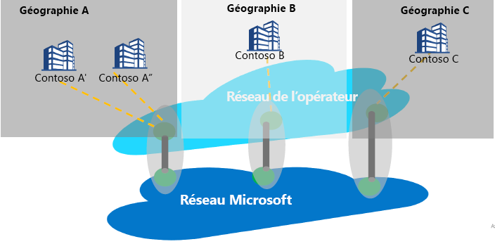

# Peering Internet ou Peering Service

Le peering Internet fait référence aux interconnexions qui existent entre le réseau mondial Microsoft (AS8075) et le réseau des opérateurs ou des fournisseurs de services. Un fournisseur de services peut devenir un partenaire Peering Service en répondant aux exigences de partenariat Peering Service qui sont décrites ci-dessous. Celles-ci visent à fournir une connectivité publique fiable et hautement performante, avec un routage optimal entre le client et le réseau Microsoft.

## À propos de Peering Service
Peering Service est un programme de partenariat avec des fournisseurs de services clés visant à fournir une connectivité Internet publique optimale aux utilisateurs d’entreprise. Les partenaires qui font partie du programme disposeront de connexions directes, géoredondantes et hautement disponibles, ainsi que d’un routage optimisé vers Microsoft. Peering Service est un complément du portefeuille de connectivité Microsoft :
*   ExpressRoute pour la connectivité privée aux ressources IaaS ou PaaS (prise en charge de l’espace IP privé)
    *   Connectivité basée sur les partenaires
    *   Connectivité directe de 100 Go à Microsoft
*   IPSEC sur Internet pour la connectivité VPN au cloud
*   Connectivité SD-WAN à Azure via un WAN virtuel

Pour Peering Service, le segment cible correspond à la connectivité SaaS, aux clients SD-WAN désireux d’effectuer un « Internet breakout » au niveau d’une succursale, et tous les clients disposant d’une stratégie MPLS double et d’un Internet d’entreprise.

L’objectif principal de la connexion à Microsoft Cloud doit être de réduire la latence en réduisant le temps d’aller-retour (RTT) entre un site utilisateur et le réseau mondial Microsoft. Celui-ci constitue le principal réseau public Microsoft et interconnecte tous les centres de données Microsoft, ainsi que plusieurs points d’entrée d’application cloud. Pour plus d’informations, consultez [Getting the best connectivity and performance in Office 365](https://techcommunity.microsoft.com/t5/Office-365-Blog/Getting-the-best-connectivity-and-performance-in-Office-365/ba-p/124694).

> [!div class="mx-imgBorder"]
> 

Dans la figure ci-dessus, chaque succursale d’une entreprise internationale se connecte au réseau de périmètre Microsoft le plus proche via le réseau du partenaire.

**Avantages de Peering Service pour les clients :**
* Le meilleur routage public vers les services Microsoft Cloud via Internet pour des performances et une fiabilité optimales
* Possibilité de sélectionner le fournisseur de services par défaut pour se connecter à Microsoft Cloud
* Insights sur le trafic, telles que la création de rapports sur la latence et la supervision des préfixes
* Tronçons réseau optimaux (tronçons AS) Microsoft Cloud
* Données analytiques et statistiques sur le routage - Événements concernant les anomalies de routage [BGP](https://en.wikipedia.org/wiki/Border_Gateway_Protocol) (fuite, détection d’un détournement) et les routages non optimaux

## Exigences du partenariat Peering Service
* Connectivité à Microsoft Cloud à partir du site le plus proche du client. Un fournisseur de services partenaire route le trafic utilisateur vers le réseau de périmètre Microsoft le plus proche de l’utilisateur. De même, concernant le trafic à destination de l’utilisateur, Microsoft route le trafic (à l’aide d’une étiquette BGP) vers le réseau de périmètre le plus proche de l’utilisateur, puis le fournisseur de services distribue le trafic à l’utilisateur.
* Le partenaire est chargé de garantir une haute disponibilité, un débit élevé et une connectivité géoredondante au réseau mondial Microsoft.
* Le partenaire peut utiliser son peering existant pour prendre en charge Peering Service si celui-ci répond aux exigences.

## Questions fréquentes (FAQ)
Pour connaître les questions fréquemment posées au sujet de Peering Service, consultez [Peering Service - Questions fréquentes (FAQ)](service-faqs.yml).

## Étapes suivantes

* En savoir plus sur les avantages de [Peering Service](../peering-service/index.yml)
* En savoir plus sur l’activation d’un peering direct pour Peering Service dans [Procédure pas à pas pour le partenaire Peering Service](walkthrough-peering-service-all.md)