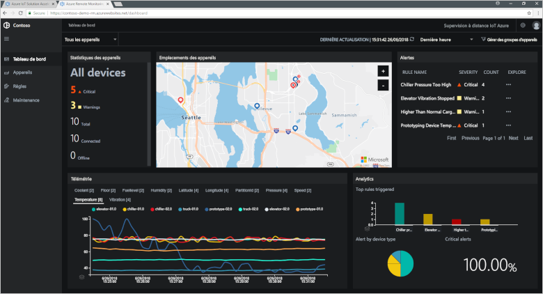

# Que sont les accélérateurs de solution IoT ?

Une solution IoT informatique utilise généralement un code personnalisé et plusieurs services cloud pour gérer la connectivité d’un appareil, le traitement et l’analyse de données et la présentation.

Les accélérateurs de solution IoT sont une collection de solutions IoT complètes et prêtes au déploiement qui implémentent des scénarios IoT communs tels que la surveillance à distance, la fabrique connectée et la maintenance prédictive. Lorsque vous déployez un accélérateur de solution, le déploiement inclut tous les services informatiques nécessaires ainsi que tout code d’application requis.

Les accélérateurs de solution représentent le point de départ de vos solutions IoT. Le code source de tous les accélérateurs de solution est open source et disponible sur GitHub. Nous vous invitons à télécharger et [personnaliser](iot-accelerators-remote-monitoring-customize.md) les accélérateurs de solution afin qu’ils répondent à vos exigences.

Vous pouvez aussi utiliser les accélérateurs de solution en tant qu’outils d’apprentissage, avant de créer une solution IoT personnalisée à partir de zéro. Les accélérateurs de solution implémentent des pratiques éprouvées pour les solutions IoT informatiques, pratiques que vous pouvez suivre.

Le code d’application de chaque accélérateur de solution inclut un tableau de bord qui vous permet de gérer l’accélérateur de solution. Par exemple, vous pouvez utiliser un tableau de bord pour afficher les données de télémétrie de vos appareils connectés, provisionner de nouveaux appareils ou mettre à niveau le microprogramme sur vos appareils connectés :

## Scénarios IoT pris en charge

Vous disposez actuellement de quatre accélérateurs de solution à déployer :

### Surveillance à distance

Utilisez cet accélérateur de solution pour récolter des données de télémétrie de plusieurs appareils distants et pour les contrôler. On peut citer par exemple des systèmes de refroidissement installés dans les locaux de vos clients ou des valves installées dans des stations de pompage distantes.

### Fabrique connectée

Utilisez cet accélérateur de solution pour récolter des données de télémétrie de ressources industrielles avec une interface d’[architecture unifiée OPC](https://opcfoundation.org/about/opc-technologies/opc-ua/) et pour les contrôler. On peut citer par exemple des stations de test et d’assemblage d’une chaîne de production.

### Maintenance prédictive

Utilisez cet accélérateur de solution pour prédire la défaillance d’un appareil distant afin de mener une maintenance en amont. Cet accélérateur de solution utilise des algorithmes de machine Learning pour prédire des défaillances de données de télémétrie. On peut citer par exemple les moteurs d’avion ou les ascenseurs.

### Simulation d’appareil

Utilisez cet accélérateur de solution pour exécuter plusieurs appareils simulés qui génèrent des données de télémétrie réalistes. Vous pouvez utiliser cet accélérateur de solution pour tester le comportement d’autres accélérateurs de solution ou pour tester vos propres solutions IoT personnalisées.

## Principes de conception

Tous les accélérateurs de solution suivent les mêmes principes de conception et les mêmes objectifs. Ils sont conçus pour être :

* **Évolutifs**, vous permettant de vous connecter et de gérer des millions d’appareils connectés.
* **Extensibles**, vous permettant de les personnaliser afin qu’ils répondent à vos exigences.
* **Compréhensibles**, vous permettant de comprendre comment ils fonctionnent et comment ils sont implémentés.
* **Modulaires**, vous permettant de permuter des services avec d’autres.
* **Sécurisés**, combinant la sécurité Azure avec des fonctionnalités de sécurité de connectivité et d’appareils intégrées.

## Architectures et langues

Les accélérateurs de solution originaux ont été conçus avec .NET et une architecture MVC (model-view-controller). Microsoft met à jour les accélérateurs de solution pour une nouvelle architecture basée sur les microservices. Les versions [Java](https://github.com/Azure/azure-iot-pcs-remote-monitoring-java) et [.NET](https://github.com/Azure/azure-iot-pcs-remote-monitoring-dotnet) de chaque microservice sont disponibles sur GitHub. Le tableau suivant présente l’état actuel des accélérateurs de solution :

| Accélérateur de solution   | Architecture  | Langues     |
| ---------------------- | ------------- | ------------- |
| Surveillance à distance      | Microservices | Java et .NET |
| Maintenance prédictive | MVC           | .NET          |
| Fabrique connectée      | MVC           | .NET          |

Pour en savoir plus sur les architectures de microservice, consultez [.NET Application Architecture](https://www.microsoft.com/net/learn/architecture) (Architecture d’application .NET) et [Microservices: An application revolution powered by the cloud](https://azure.microsoft.com/blog/microservices-an-application-revolution-powered-by-the-cloud/) (Microservices: une révolution des applications par le cloud).

## Options de déploiement

Vous pouvez déployer des accélérateurs de solution basés sur des microservices dans les configurations suivantes :

* **Standard :** déploiement étendu de l’infrastructure pour le développement d’un déploiement de production. Azure Container Service déploie les microservices vers plusieurs machines virtuelles Azure. Kubernetes orchestre les conteneurs Docker qui hébergent les microservices individuels.
* **Basic :** version à coût réduit pour une démonstration ou pour tester un déploiement. Tous les microservices se déploient sur une seule machine virtuelle Azure.
* **Locale :** déploiement de machine locale pour développement et test. Cette approche déploie les microservices vers un conteneur Docker local et se connecte à IoT Hub, Azure Cosmos DB et aux services de stockage Azure dans le cloud.

Le coût associé à l’exécution d’un accélérateur de solution est un agrégat du [coût des services Azure sous-jacents](https://azure.microsoft.com/pricing). Vous pouvez voir les détails des services Azure utilisés lors du choix des options de déploiement.

## Étapes suivantes

Pour tester un accélérateur de solution IoT, consultez le guide de démarrage rapide [Déployer une solution de surveillance informatique à distance](quickstart-remote-monitoring-deploy.md).
