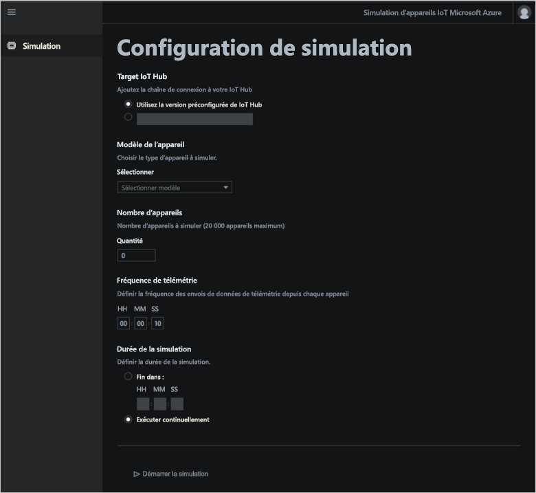

# Que sont les accélérateurs de solution IoT ?

Une solution IoT cloud utilise généralement un code personnalisé et des services cloud pour gérer la connectivité des appareils, le traitement et l’analytique de données et la présentation.

Les accélérateurs de solution IoT sont complets et prêts à déployer des solutions IoT qui implémentent des scénarios IoT courants. Les scénarios incluent la supervision à distance, l’usine connectée, la maintenance prédictive et la simulation d’appareil. Lorsque vous déployez un accélérateur de solution, le déploiement inclut tous les services informatiques nécessaires ainsi que tout code d’application requis.

Les accélérateurs de solution représentent le point de départ de vos solutions IoT. Le code source de tous les accélérateurs de solution est open source et disponible sur GitHub. Nous vous invitons à télécharger et personnaliser les accélérateurs de solution afin qu’ils répondent à vos exigences.

Vous pouvez aussi utiliser les accélérateurs de solution en tant qu’outils d’apprentissage, avant de créer une solution IoT personnalisée à partir de zéro. Les accélérateurs de solution implémentent des pratiques éprouvées pour les solutions IoT informatiques, pratiques que vous pouvez suivre.

Le code d’application de chaque accélérateur de solution inclut une application web qui vous permet de gérer l’accélérateur de solution.

## Scénarios IoT pris en charge

Vous disposez actuellement de quatre accélérateurs de solution à déployer :

### Surveillance à distance

Utilisez l’[accélérateur de solution de supervision à distance](iot-accelerators-remote-monitoring-sample-walkthrough.md) pour collecter des données de télémétrie sur des appareils distants et pour les contrôler. On peut citer par exemple des systèmes de refroidissement installés dans les locaux de vos clients ou des valves installées dans des stations de pompage distantes.

Vous pouvez utiliser le tableau de bord de surveillance à distance pour afficher les données de télémétrie de vos appareils connectés, provisionner de nouveaux appareils ou mettre à niveau le microprogramme sur vos appareils connectés :

### Fabrique connectée

Utilisez l’[accélérateur de solution Fabrique connectée](iot-accelerators-connected-factory-features.md) pour collecter des données de télémétrie de ressources industrielles avec une interface d’[architecture unifiée OPC](https://opcfoundation.org/about/opc-technologies/opc-ua/) et pour les contrôler. On peut citer par exemple des stations de test et d’assemblage d’une chaîne de production.

Vous pouvez utiliser le tableau de bord d’usine connectée pour surveiller et gérer vos appareils industriels :

:::image type="content" source="./media/about-iot-accelerators/cf-dashboard-inline.png" alt-text="Capture d’écran montrant le tableau de bord de la solution d’usine connectée." lightbox="./media/about-iot-accelerators/cf-dashboard-expanded.png":::

### Maintenance prédictive

Utilisez l’[accélérateur de solution Maintenance prédictive](iot-accelerators-predictive-walkthrough.md) pour prédire l’échec d’un appareil distant afin d’effectuer la maintenance en amont avant que l’échec ne se produise. Cet accélérateur de solution utilise des algorithmes de machine Learning pour prédire des défaillances de données de télémétrie. On peut citer par exemple les moteurs d’avion ou les ascenseurs.

Vous pouvez utiliser le tableau de bord de maintenance prédictive pour afficher l’analytique de maintenance prédictive :

:::image type="content" source="./media/about-iot-accelerators/pm-dashboard-inline.png" alt-text="Capture d’écran montrant le tableau de bord de la solution d’usine connectée." lightbox="./media/about-iot-accelerators/pm-dashboard-expanded.png":::

### Simulation d’appareil

Utilisez l’[accélérateur de solution Simulation d’appareil](iot-accelerators-device-simulation-overview.md) pour exécuter des appareils simulés qui génèrent des données de télémétrie réalistes. Vous pouvez utiliser cet accélérateur de solution pour tester le comportement d’autres accélérateurs de solution ou pour tester vos propres solutions IoT personnalisées.

Vous pouvez utiliser l’application web de simulation d’appareils pour configurer et exécuter des simulations :

## Principes de conception

Tous les accélérateurs de solution suivent les mêmes principes de conception et les mêmes objectifs. Ils sont conçus pour être :

* **Évolutifs**, vous permettant de vous connecter et de gérer des millions d’appareils connectés.
* **Extensibles**, vous permettant de les personnaliser afin qu’ils répondent à vos exigences.
* **Compréhensibles**, vous permettant de comprendre comment ils fonctionnent et comment ils sont implémentés.
* **Modulaires**, vous permettant de permuter des services avec d’autres.
* **Sécurisés**, combinant la sécurité Azure avec des fonctionnalités de sécurité de connectivité et d’appareils intégrées.

## Architectures et langues

Les accélérateurs de solution originaux ont été conçus avec .NET et une architecture MVC (model-view-controller). Microsoft met à jour les accélérateurs de solution pour une nouvelle architecture basée sur les microservices. Le tableau suivant présente l’état actuel des accélérateurs de solution avec des liens vers les dépôts GitHub :

| Accélérateur de solution   | Architecture  | Languages     |
| ---------------------- | ------------- | ------------- |
| Surveillance à distance      | Microservices | [Java](https://github.com/Azure/azure-iot-pcs-remote-monitoring-java) et [.NET](https://github.com/Azure/azure-iot-pcs-remote-monitoring-dotnet) |
| Maintenance prédictive | MVC           | [.NET](https://github.com/Azure/azure-iot-predictive-maintenance)          |
| Fabrique connectée      | MVC           | [.NET](https://github.com/Azure/azure-iot-connected-factory)          |
| Simulation d’appareil      | Microservices | [.NET](https://github.com/Azure/device-simulation-dotnet)          |

Pour en savoir plus sur l’architecture de microservices, consultez [Présentation de l’architecture de référence Azure IoT](/azure/architecture/reference-architectures/iot/).

## Options de déploiement

Vous pouvez déployer les accélérateurs de solution à partir du site [Accélérateurs de solution Microsoft Azure IoT](https://www.azureiotsolutions.com/Accelerators#) ou à l’aide de la ligne de commande.

Vous pouvez déployer l’accélérateur de solution de supervision à distance dans les configurations suivantes :

* **Standard :** déploiement étendu de l’infrastructure pour le développement d’un déploiement de production. Azure Container Service déploie les microservices sur plusieurs machines virtuelles Azure. Kubernetes orchestre les conteneurs Docker qui hébergent les microservices individuels.
* **Basic :** version à coût réduit pour une démonstration ou pour tester un déploiement. Tous les microservices se déploient sur une seule machine virtuelle Azure.
* **Locale :** déploiement de machine locale pour développement et test. Cette approche déploie les microservices vers un conteneur Docker local et se connecte à IoT Hub, Azure Cosmos DB et aux services de stockage Azure dans le cloud.

Le coût associé à l’exécution d’un accélérateur de solution est le [coût combiné de l’exécution des services Azure sous-jacents](https://azure.microsoft.com/pricing). Vous pouvez voir les détails des services Azure utilisés lors du choix des options de déploiement.

## Étapes suivantes

Pour essayer l’un des accélérateurs de solution IoT, consultez les démarrages rapides :

* [Essayer une solution de supervision à distance](quickstart-remote-monitoring-deploy.md)
* [Essayer une solution d’usine connectée](quickstart-connected-factory-deploy.md)
* [Essayer une solution de maintenance prédictive](quickstart-predictive-maintenance-deploy.md)
* [Essayer une solution de simulation d’appareil](quickstart-device-simulation-deploy.md)