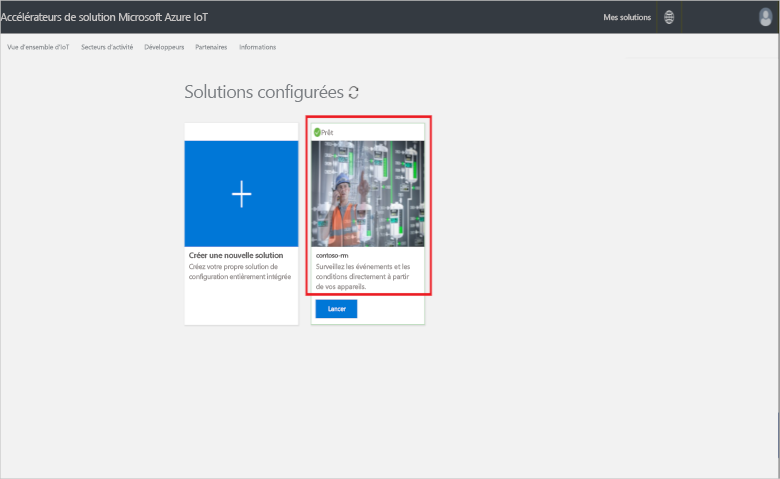

# Connecter un appareil IoT DevKit à l’accélérateur de solution de supervision à distance

[!INCLUDE [iot-suite-selector-connecting](../../includes/iot-suite-selector-connecting.md)]

Ce guide pratique explique comment exécuter un exemple d’application sur un appareil IoT DevKit. L’exemple de code envoie les données de télémétrie des capteurs présents sur l’appareil DevKit à votre accélérateur de solution.

[IoT MXChip DevKit](https://aka.ms/iot-devkit) est une carte tout-en-un compatible Arduino qui est équipée de périphériques et de capteurs élaborés. Vous pouvez développer pour ce kit à l’aide du pack d’extension [Azure IoT Device Workbench](https://aka.ms/iot-workbench) ou [Azure IoT Tools](https://aka.ms/azure-iot-tools) dans Visual Studio Code. Le [catalogue de projets](https://microsoft.github.io/azure-iot-developer-kit/docs/projects/) contient des exemples d’applications permettant de créer des prototypes de solutions IoT.

## Avant de commencer

Pour effectuer les étapes de ce didacticiel, commencez par exécuter les tâches suivantes :

* Préparez le DevKit en suivant les étapes contenues dans l’article [Connecter IoT DevKit AZ3166 à Azure IoT Hub dans le cloud](../iot-hub/iot-hub-arduino-iot-devkit-az3166-get-started.md).

## Ouvrir un exemple de projet

Pour ouvrir l’exemple de supervision à distance dans VS Code :

1. Vérifiez que votre appareil IoT DevKit n’est pas connecté à votre ordinateur. Démarrez d’abord VS Code, puis connectez le DevKit à votre ordinateur.

1. Cliquez sur `F1` pour ouvrir la palette de commandes, puis tapez et sélectionnez **Azure IoT Device Workbench : Ouvrir des exemples...** Puis sélectionnez **IoT DevKit** en tant que carte.

1. Cherchez **Supervision à distance** et cliquez sur **Ouvrir l’exemple**. Une nouvelle fenêtre VS Code s’ouvre sur le dossier de projet :

   

## Configurer l’appareil

Pour configurer la chaîne de connexion de l’appareil IoT Hub sur un appareil DevKit :

1. Passez l’appareil IoT DevKit en **mode Configuration** :

    * Maintenez enfoncé le bouton **A**.
    * Enfoncez et relâchez le bouton **Réinitialiser**.

1. L’écran affiche l’ID de l’appareil DevKit et `Configuration`.

    

1. Appuyez sur **F1** pour ouvrir la palette de commandes, puis tapez et sélectionnez **Azure IoT Device Workbench : Configurer les paramètres de l’appareil... > Configurer la chaîne de connexion d’appareil**.

1. Collez la chaîne de connexion que vous avez copiée tout à l’heure, puis appuyez sur **Entrée** pour configurer l’appareil.

## Générer le code

Pour générer et charger le code de l’appareil :

1. Appuyez sur `F1` pour ouvrir la palette de commandes, puis tapez et sélectionnez **Azure IoT Device Workbench : Charger le code de l’appareil** :

1. VS Code compile et charge le code sur votre appareil DevKit :

    

1. L’appareil DevKit redémarre et exécute le code chargé.

## Tester l’exemple

Pour vérifier que l’exemple d’application que vous avez chargé sur l’appareil DevKit fonctionne, suivez les étapes ci-dessous :

### Afficher les données de télémétrie envoyées à la solution de supervision à distance

Lorsque l’exemple d’application s’exécute, l’appareil DevKit envoie par Wi-Fi les données de télémétrie de ses capteurs à votre accélérateur de solution. Pour afficher les données de télémétrie :

1. Accédez au tableau de bord de votre solution, puis cliquez sur **Explorateur d’appareils**.

1. Cliquez sur le nom de votre appareil DevKit. Sous l’onglet de droite, les données de télémétrie de l’appareil DevKit s’affichent en temps réel :

    

### Contrôler l’appareil DevKit

L’accélérateur de solution de supervision à distance permet de contrôler l’appareil à distance. L’exemple de code implémente trois méthodes, que vous pouvez consulter dans la section **Méthode** si vous sélectionnez l’appareil sur la page **Explorateur d’appareils** :

Pour modifier la couleur d’une des LED de l’appareil DevKit, utilisez la méthode **LedColor** :

1. Sélectionnez le nom de l’appareil dans la liste des appareils, puis cliquez sur **Tâches** :

    

1. Configurez les tâches avec les valeurs suivantes et cliquez sur **Appliquer** :

   * Sélectionner un travail : **Exécuter une méthode**
   * Nom de la méthode : **LedColor**
   * Nom du travail : **ChangeLedColor**

     

1. Au bout de quelques secondes, la couleur de la LED RVB (sous le bouton A) de votre appareil DevKit change :

    

## Nettoyer les ressources

Si vous envisagez de passer aux tutoriels, laissez l’accélérateur de solution de supervision à distance déployé.

Si vous n’avez plus besoin de l’accélérateur de solution, supprimez-le de la page Solutions approvisionnées en le sélectionnant et en cliquant sur Supprimer la solution :

## Problèmes et commentaires

Si vous rencontrez des problèmes, consultez les [FAQ IoT DevKit](https://microsoft.github.io/azure-iot-developer-kit/docs/faq/) ou contactez-nous sur les canaux suivants :

* [Gitter.im](https://gitter.im/Microsoft/azure-iot-developer-kit)
* [Stack Overflow](https://stackoverflow.com/questions/tagged/iot-devkit)

## Étapes suivantes

Vous avez appris à connecter un appareil DevKit à votre accélérateur de solution de supervision à distance ; nous vous suggérons à présent les étapes suivantes :

* [Vue d’ensemble des accélérateurs de solution Azure IoT](./index.yml)
* [Personnaliser l’interface utilisateur](iot-accelerators-remote-monitoring-customize.md)