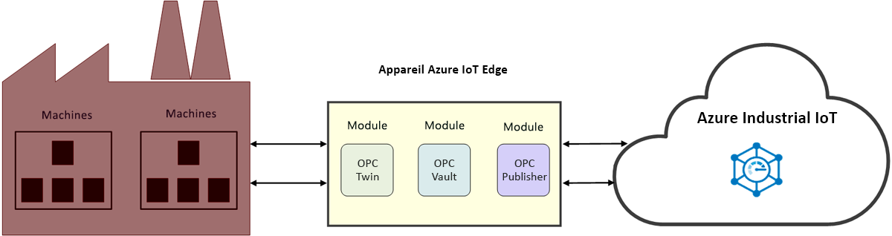

# Définition de l’IoT industriel (IIoT)

L’IIoT est l’Internet des objets industriel. L’IIoT améliore l’efficacité industrielle par le biais de l’application de l’IoT dans le secteur de l’industrie. 

## Améliorer l’efficacité industrielle

Améliorez la productivité et la rentabilité de vos opérations avec un accélérateur de solution d’usine connecté. Connectez et supervisez vos équipements et dispositifs industriels dans le cloud, dont vos machines opérant déjà en usine. Analysez vos données IoT pour en extraire des insights qui vous aident à augmenter les performances de l’usine dans son ensemble.

Réduisez le processus fastidieux d’accès aux machines de l’usine avec OPC Twin et consacrez votre temps à la génération de solutions IIoT. Rationalisez la gestion des certificats et l’intégration des ressources industrielles avec OPC Vault et bénéficiez d’une connectivité sécurisée des ressources. Ces microservices fournissent une API de type REST qui complète les [composants de l’IoT industriel Azure](https://github.com/Azure/azure-iiot-opc-ua). L’API de service vous donne le contrôle des fonctionnalités du module de périphérie. 

> [!NOTE]
> Pour plus d’informations sur les services d’IoT industriel Azure, consultez [ce dépôt](https://github.com/Azure/azure-iiot-services) GitHub.
Si vous n’êtes pas familiarisé avec le fonctionnement des modules Azure IoT Edge, commencez par lire les articles suivants :
- [À propos d’Azure IoT Edge](../iot-edge/about-iot-edge.md)
- [Modules Azure IoT Edge](../iot-edge/iot-edge-modules.md)

## Fabrique connectée

[Usine connectée](../iot-accelerators/iot-accelerators-connected-factory-features.md) est une implémentation de l’architecture de référence sur l’IoT industriel Azure de Microsoft qui peut être personnalisée pour répondre à des exigences métiers spécifiques. Le code complet de la solution est open source et disponible sur le dépôt GitHub Accélérateur de solution Usine connectée. Vous pouvez l’utiliser comme point de départ pour un produit commercial et déployer une solution préconfigurée dans votre abonnement Azure en quelques minutes. 

## Connectivité dans l’usine

OPC Twin est un composant IIoT qui automatise l’inscription et la découverte des appareils et permet de contrôler à distance les appareils industriels via des API REST. OPC Twin utilise Azure IoT Edge et IoT Hub pour connecter le cloud et le réseau de l’usine. OPC Twin permet aux développeurs IIoT de se concentrer sur la génération d’applications IIoT sans avoir à se soucier de la sécurisation de l’accès aux machines locales.

## Sécurité

OPC Vault est une implémentation de GDS (OPC UA Global Discovery Server) qui peut configurer, inscrire et gérer le cycle de vie des certificats pour les applications serveur et clientes OPC UA dans le cloud. OPC Vault simplifie l’implémentation et la maintenance de la connectivité des ressources sécurisée dans l’espace industriel. En automatisant la gestion des certificats, OPC Vault libère les opérateurs en usine des processus manuels et complexes liés à la gestion de la connectivité et des certificats.

## Étapes suivantes

Après cette présentation de l’IoT industriel et de ses composants, nous vous suggérons l’étape suivante :

> [!div class="nextstepaction"]
> [Définition d’OPC Twin](overview-opc-twin.md)
