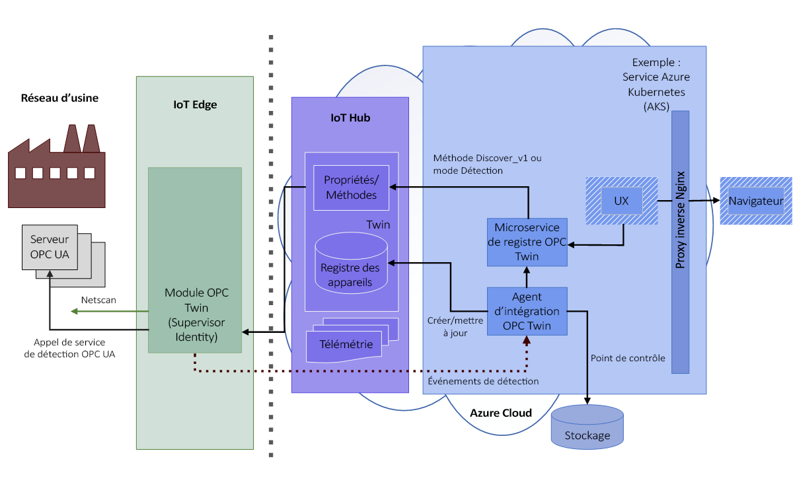
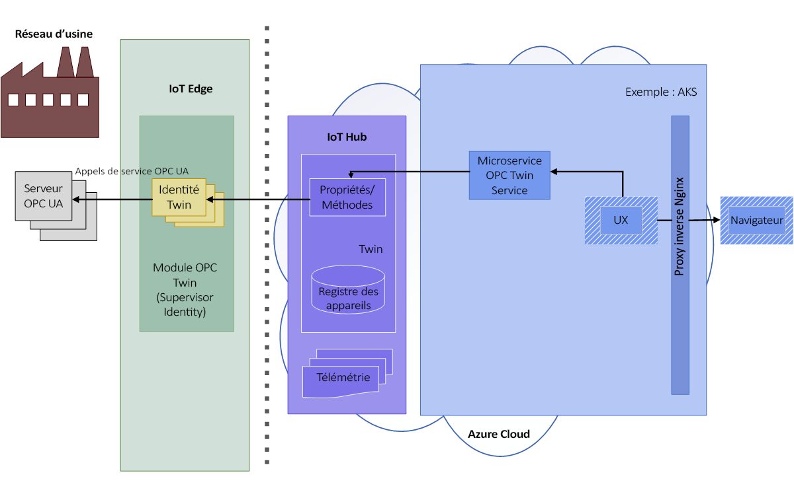
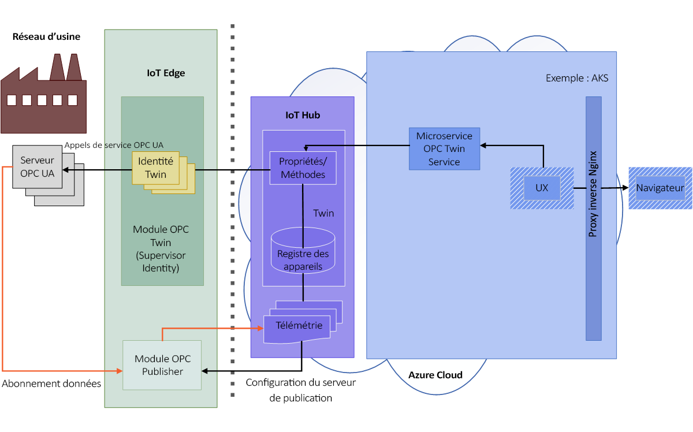

# Architecture d’OPC Twin

> [!IMPORTANT]
> Pendant la mise à jour de cet article, consultez [Azure Industrial IoT](https://azure.github.io/Industrial-IoT/) pour obtenir le contenu le plus récent.

Les schémas suivants illustrent l’architecture d’OPC Twin.

## Découvrir et activer

1. L’opérateur active l’analyse du réseau sur le module ou effectue une détection unique à l’aide d’une URL de découverte. Les informations de l’application et les points de terminaison découverts sont envoyés par le biais de la télémétrie à l’agent d’intégration en vue de leur traitement.  L’agent de l’intégration des appareils OPC UA traite les événements de découverte du serveur OPC UA envoyés par le module IoT Edge OPC Twin en mode de découverte ou d’analyse. Les événements de découverte se traduisent par l’inscription de l’application et des mises à jour dans le registre des appareils OPC UA.

   

1. L’opérateur inspecte le certificat du point de terminaison découvert et active le jumeau de point de terminaison inscrit pour l’accès. 

   

## Parcourir et superviser

1. Une fois l’activation effectuée, l’opérateur peut utiliser l’API REST du service de jumeau pour parcourir ou inspecter le modèle d’information du serveur, lire/écrire des variables d’objet et appeler des méthodes.  L’utilisateur utilise une API OPC UA simplifiée exprimée entièrement en HTTP et JSON.

   

1. L’interface REST du service de jumeau peut également être utilisée pour créer des abonnements et des éléments supervisés dans le serveur de publication OPC. Le serveur de publication OPC permet d’envoyer des données de télémétrie à partir de systèmes serveur OPC UA à IoT Hub. Pour plus d’informations sur OPC Publisher, consultez [Définition d’OPC Publisher](overview-opc-publisher.md).

   
