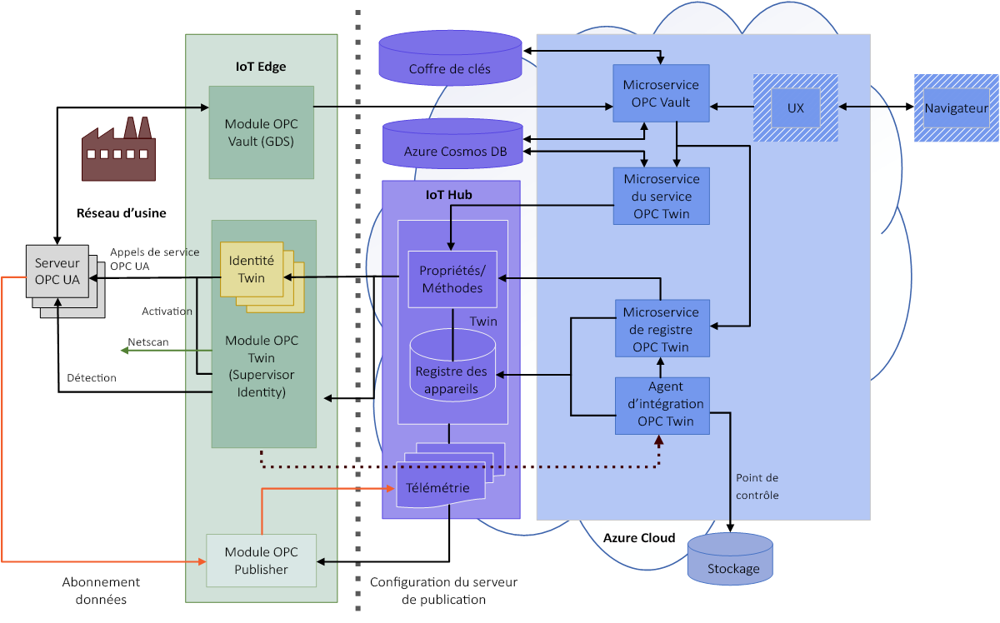

# Architecture d’OPC Vault

Cet article offre une vue d’ensemble du microservice OPC Vault et du module IoT Edge OPC Vault.

Les applications OPC UA utilisent des certificats d’instance d’application pour assurer une sécurité au niveau de l’application. Une connexion sécurisée est établie à l’aide du chiffrement asymétrique, pour lequel les certificats d’application fournissent la paire de clés publique et privée. Les certificats peuvent être auto-signés ou signés par une autorité de certification.

Une application OPC UA dispose d’une liste de certificats approuvés qui représentent les applications qu’elle approuve. Ces certificats peuvent être auto-signés ou signés par une autorité de certification, ou bien être eux-mêmes une autorité de certification racine ou une sous-autorité de certification. Si un certificat approuvé fait partie d’une chaîne de certificats plus grande, l’application approuve tous les certificats liés au certificat dans la liste de confiance. C’est vrai tant que la chaîne de certificats complète peut être validée.

La principale différence entre l’approbation de certificats auto-signés et l’approbation d’un certificat d’autorité de certification est l’effort d’installation nécessaire pour déployer et maintenir la confiance. Un effort supplémentaire est également nécessaire pour héberger une autorité de certification propre à l’entreprise. 

Pour distribuer l’approbation de certificats auto-signés pour plusieurs serveurs avec une seule application cliente, vous devez installer tous les certificats d’application des serveurs dans la liste de confiance de l’application cliente. De plus, vous devez installer le certificat de l’application cliente sur toutes les listes de confiance des applications serveur. Ce travail administratif est assez fastidieux et le devient plus encore quand vous devez prendre en compte la durée de vie des certificats et renouveler les certificats.

L’utilisation d’une autorité de certification propre à l’entreprise peut considérablement simplifier la gestion des approbations en présence de plusieurs serveurs et clients. Dans ce cas, l’administrateur génère un certificat d’instance d’application signé par une autorité de certification une fois pour chaque client et serveur utilisé. Par ailleurs, le certificat d’autorité de certification est installé dans la liste de confiance de chaque application, sur tous les serveurs et clients. Avec cette approche, seuls les certificats arrivés à expiration doivent être renouvelés et remplacés pour les applications concernées.

Le service de gestion de certificats OPC UA d’Azure Industrial IoT vous permet de gérer une autorité de certification propre à une entreprise pour les applications OPC UA. Ce service est basé sur le microservice OPC Vault. OPC Vault propose un microservice destiné à héberger une autorité de certification propre à une entreprise dans un cloud sécurisé. Cette solution s’appuie sur des services sécurisés par Azure Active Directory (Azure AD), Azure Key Vault avec des Modules de sécurité matérielle (HSM), Azure Cosmos DB et éventuellement IoT Hub en tant que magasin d’applications.

Le microservice OPC Vault est conçu pour prendre en charge un workflow basé sur les rôles, où les administrateurs de sécurité et les approbateurs dotés de droits de signature dans Azure Key Vault approuvent ou rejettent les demandes.

Pour assurer la compatibilité avec des solutions OPC UA existantes, les services incluent la prise en charge d’un module de périphérie s’appuyant sur le microservice OPC Vault. Cela permet d’implémenter l’interface de **gestion de certificats et de serveur de détection globale OPC UA** pour distribuer les certificats et les listes de confiance conformément à la partie 12 de la spécification. 

## Architecture

L’architecture s’appuie sur le microservice OPC Vault, avec un module IoT Edge OPC Vault pour le réseau de fabrique et un exemple d’expérience utilisateur web pour contrôler le workflow :

## Microservice OPC Vault

Le microservice OPC Vault est constitué des interfaces suivantes destinées à implémenter le workflow pour la distribution et la gestion d’une autorité de certification propre à une entreprise pour les applications OPC UA.

### Application 
- Une application OPC UA peut être un serveur, un client ou les deux à la fois. Dans ce cas, OPC Vault fait office d’autorité d’inscription d’applications. 
- En plus des opérations de base d’inscription, de mise à jour et de désinscription d’applications, il existe aussi des interfaces permettant de rechercher des applications et de les interroger avec des expressions de recherche. 
- Pour être traitées, les demandes de certificat doivent faire référence à une application valide. Un certificat signé est alors émis avec toutes les extensions propres à OPC UA. 
- Le service d’application s’appuie sur une base de données dans Azure Cosmos DB.

### Groupe de certificats
- Un groupe de certificats est une entité qui stocke un certificat d’autorité de certification racine ou de sous-autorité de certification, avec la clé privée destinée à signer les certificats. 
- La longueur de clé RSA, la longueur du hachage SHA-2 et les durées de vie peuvent être configurées pour l’autorité de certification émettrice et les certificats d’application signés. 
- Vous stockez les certificats d’autorité de certification dans Azure Key Vault, avec un module HSM FIPS 140-2 de niveau 2. La clé privée ne quitte jamais le stockage sécurisé, car la signature est assurée par une opération Key Vault sécurisée par Azure AD. 
- Vous pouvez renouveler les certificats d’autorité de certification au fil du temps et les conserver dans un stockage sécurisé grâce à l’historique Key Vault. 
- La liste de révocation de chaque certificat d’autorité de certification est aussi stockée dans Key Vault en tant que secret. Quand une application est désinscrite, le certificat d’application est également révoqué dans la liste de révocation de certificats par un administrateur.
- Vous pouvez révoquer des certificats uniques, ainsi que des certificats par lots.

### Demande de certificat
Une demande de certificat implémente le workflow chargé de générer une nouvelle paire de clés ou un certificat signé, en utilisant une demande de signature de certificat pour une application OPC UA. 
- La demande est stockée dans une base de données avec des informations connexes, comme l’objet ou une demande de signature de certificat, ainsi qu’une référence à l’application OPC UA. 
- La logique métier du service valide la demande par rapport aux informations stockées dans la base de données d’application. Par exemple, l’URI d’application contenu dans la base de données doit correspondre à l’URI d’application figurant dans la demande de signature de certificat.
- Un administrateur de la sécurité disposant de droits de signature (en d’autres termes, le rôle Approbateur) approuve ou rejette la demande. Si la demande est approuvée, une nouvelle paire de clés ou un certificat signé (ou les deux) sont générés. La nouvelle clé privée est stockée de manière sécurisée dans Key Vault, et le nouveau certificat public signé est stocké dans la base de données des demandes de certificat.
- Le demandeur peut consulter l’état de la demande jusqu’à ce qu’elle soit approuvée ou révoquée. Si la demande a été approuvée, la clé privée et le certificat peuvent être téléchargés et installés dans le magasin de certificats de l’application OPC UA.
- Le demandeur peut maintenant accepter la demande de suppression des informations inutiles de la base de données des demandes. 

Pendant la durée de vie d’un certificat signé, une application peut être supprimée ou une clé peut devenir compromise. Dans ce cas, le gestionnaire d’une autorité de certification peut :
- Supprimer une application, ce qui supprime également toutes les demandes de certificat en attente et approuvées de l’application. 
- Supprimer une seule demande de certificat, si le renouvellement ou la compromission concerne une seule clé.

Désormais, les demandes de certificat approuvées et acceptées compromises sont maintenant marquées comme étant supprimées.

Un gestionnaire peut régulièrement renouveler la liste de révocation de certificats de l’autorité de certification émettrice. Au moment du renouvellement, toutes les demandes de certificat supprimées sont révoquées, et les numéros de série des certificats sont ajoutés à la liste de révocation de certificats. Les demandes de certificat révoquées sont marquées comme étant révoquées. Dans les situations d’urgence, les demandes de certificat uniques peuvent aussi être révoquées.

Enfin, les listes de révocation de certificats mises à jour peuvent être distribuées aux clients et serveurs OPC UA participants.

## Module IoT Edge OPC Vault
Pour prendre en charge le serveur de découverte globale d’un réseau de fabrique, vous pouvez déployer le module OPC Vault en périphérie. Exécutez-le en tant qu’application .Net Core locale ou démarrez-le dans un conteneur Docker. Notez que faute de prise en charge de l’authentification Auth2 dans la pile .NET Standard d’OPC UA, les fonctionnalités du module de périphérie OPC Vault sont limitées à un rôle Lecteur. Un utilisateur ne peut pas faire l’objet d’un emprunt d’identité entre le module de périphérie et le microservice en utilisant l’interface standard GDS d’OPC UA.

## Étapes suivantes

Maintenant que l’architecture OPC Vault n’a plus de secrets pour vous, vous pouvez :

> [!div class="nextstepaction"]
> [Générer et déployer OPC Vault](howto-opc-vault-deploy.md)
