# Démarrage rapide : Essayer une solution informatique pour gérer mes appareils IoT industriels

Ce démarrage rapide vous montre comment déployer l’accélérateur de solution Usine connectée Azure IoT pour exécuter une simulation de supervision et de gestion informatique pour les appareils IoT industriels. Lorsque vous déployez l’accélérateur de solution Usine connectée, il est prérempli avec des ressources simulées qui vous permettent de parcourir un scénario IoT industriel courant. Plusieurs usines simulées sont connectées à la solution et rapportent les valeurs de données nécessaires pour calculer le taux de rendement global (TRG) et les indicateurs de performance clés (KPI). Ce démarrage rapide vous montre comment utiliser le tableau de bord des solutions pour :

* surveiller les valeurs d’usine, de lignes de production, TRG de poste et KPI ;
* analyser les données de télémétrie générées à partir de ces appareils ;
* réagir aux alarmes.

Pour suivre ce guide de démarrage rapide, vous devez avoir un abonnement Azure actif.

Si vous n’avez pas d’abonnement Azure, créez un [compte gratuit](https://azure.microsoft.com/free/?WT.mc_id=A261C142F) avant de commencer.

## Déployer la solution

Quand vous déployez l’accélérateur de solution dans votre abonnement Azure, vous devez définir des options de configuration.

Accédez à [Accélérateurs de solution Microsoft Azure IoT](https://www.azureiotsolutions.com), puis connectez-vous en utilisant les informations d’identification de votre compte Azure.

Cliquez sur la vignette **Fabrique connectée**. Sur la page **Fabrique connectée**, cliquez sur **Essayer dès maintenant** :

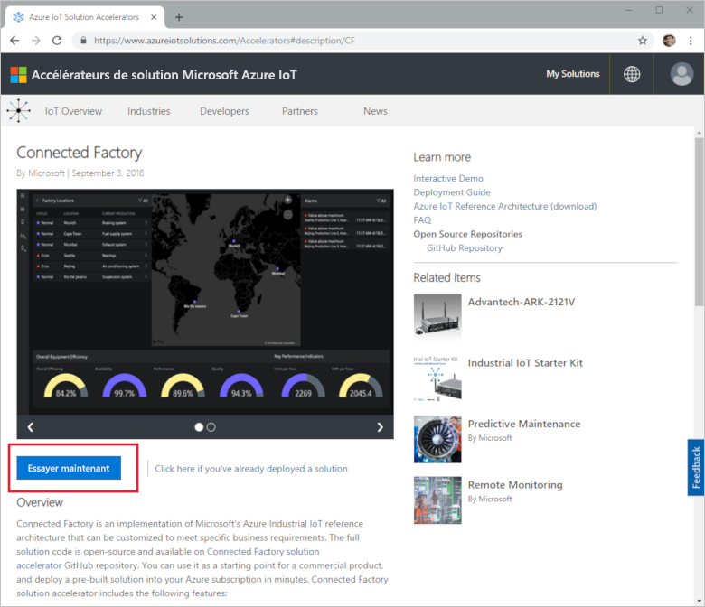

Dans la page **Créer une solution Usine connectée**, entrez un **Nom de solution** unique pour votre accélérateur de solution Usine connectée. Il s’agit du nom du groupe de ressources Azure qui contient toutes les ressources de l’accélérateur de solution. Ce démarrage rapide utilise le nom **MyDemoConnectedFactory**.

Sélectionnez l’**Abonnement** et la **Région** à utiliser pour déployer l’accélérateur de solution. En général, vous choisissez la région la plus proche. Pour ce démarrage rapide, nous allons utiliser **Visual Studio Enterprise** et **USA Est**. Vous devez être [administrateur général ou utilisateur](iot-accelerators-permissions.md) dans l’abonnement.

Cliquez sur **Créer** pour commencer votre déploiement. L’exécution de ce processus prend au moins cinq minutes :

## Se connecter à la solution

Lorsque le déploiement vers votre abonnement Azure est terminé, vous pouvez observer une coche verte ainsi que la mention **Ready** sur la vignette de la solution. À présent, vous pouvez vous connecter au tableau de bord de l’accélérateur de solution Usine connectée.

Dans la page **Solutions approvisionnées**, cliquez sur votre nouvel accélérateur de solution Usine connectée :

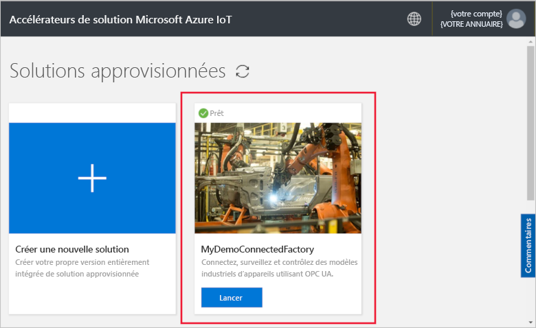

Vous pouvez consulter les informations relatives à votre accélérateur de solution Usine connectée dans la page qui s’affiche. Choisissez **Accéder à votre accélérateur de solution** pour afficher votre accélérateur de solution Usine connectée :

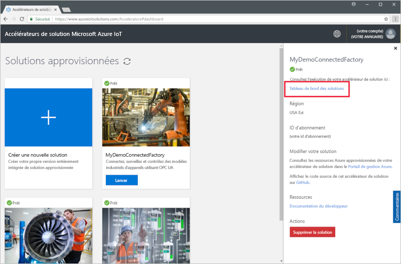

Cliquez sur **Accepter** pour accepter la demande d’autorisation. Le tableau de bord de la solution Usine connectée s’affiche dans votre navigateur. Il affiche un ensemble d’usines, de lignes de production et de postes simulés.

## Afficher le tableau de bord

Il s’ouvre par défaut sur le *tableau de bord*. Utilisez le menu sur le côté gauche de la page pour accéder à d’autres zones du portail :

[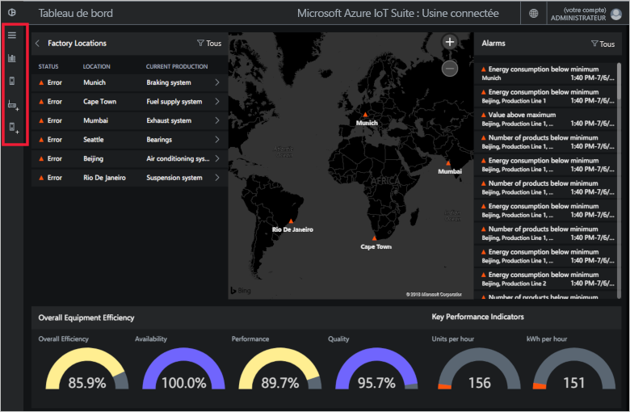](./media/quickstart-connected-factory-deploy/dashboard-expanded.png#lightbox)

Le tableau de bord vous permet de gérer vos appareils IoT industriels. Usine connectée utilise une hiérarchie pour afficher une configuration d’usine globale. Au niveau supérieur de la hiérarchie figure l’entreprise qui contient un ou plusieurs fabriques. Chaque fabrique contient des chaînes de production et chaque chaîne de production est constituée de postes. À chaque niveau, vous pouvez afficher le TRG et les KPI, publier de nouveaux nœuds pour la télémétrie et réagir aux alarmes.

Sur le tableau de bord, vous pouvez observer :

## Taux de rendement global

Le panneau **Taux de rendement global** affiche les valeurs TRG pour l’ensemble de l’entreprise, ou l’usine/la ligne de production/le poste que vous visualisez. Cette valeur est agrégée à partir de la vue du poste au niveau de l’entreprise. La données d’OEE et ses éléments constitutifs peuvent être analysés de manière plus approfondie.

[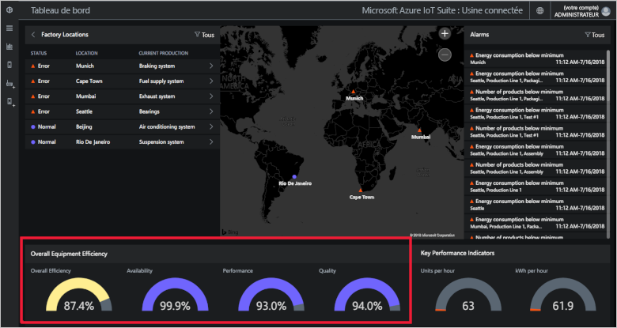](./media/quickstart-connected-factory-deploy/oee-expanded.png#lightbox)

Le TRG évalue l’efficacité du processus de fabrication à l’aide de paramètres opérationnels liés à la production. L’OEE est une mesure standard du secteur calculée en multipliant le taux de disponibilité, le taux de performance et le taux de qualité : OEE = disponibilité x performance x qualité.

Vous pouvez analyser de façon plus approfondie le TRG pour tout niveau des données de la hiérarchie. Cliquez sur le pourcentage de TRG, disponibilité, performance ou qualité. Un panneau de contexte s’affiche avec des visualisations présentant des données sur différentes échelles de temps :

[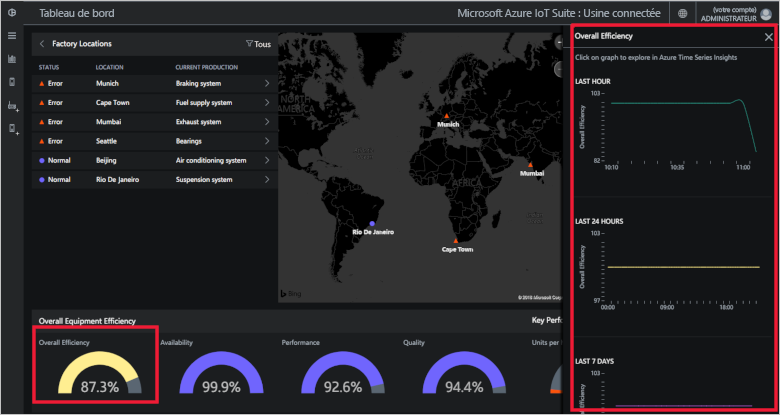](./media/quickstart-connected-factory-deploy/oeedetail-expanded.png#lightbox)

Vous pouvez cliquer sur un graphique pour procéder à une analyse plus approfondie des données.

### Indicateurs de performance clés

Le panneau **Indicateurs de performance clés** affiche le nombre d’unités produites par heure et l’énergie (kWh) utilisée par l’ensemble de l’entreprise ou l’usine/la ligne de production/le poste que vous visualisez. Ces valeurs est agrégées à partir d’une vue du poste au niveau de l’entreprise.

[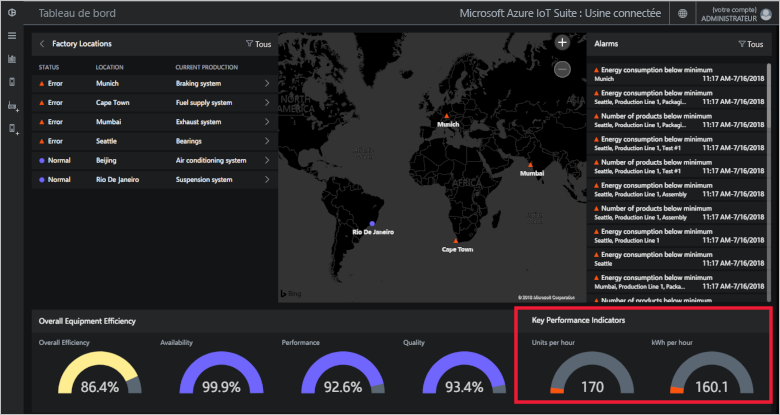](./media/quickstart-connected-factory-deploy/kpis-expanded.png#lightbox)

Vous pouvez analyser de façon plus approfondie les KPI pour tout niveau des données de la hiérarchie. Cliquez sur le pourcentage de TRG, disponibilité, performance ou qualité. Un panneau de contexte s’affiche avec des visualisations présentant des données sur différentes échelles de temps :

[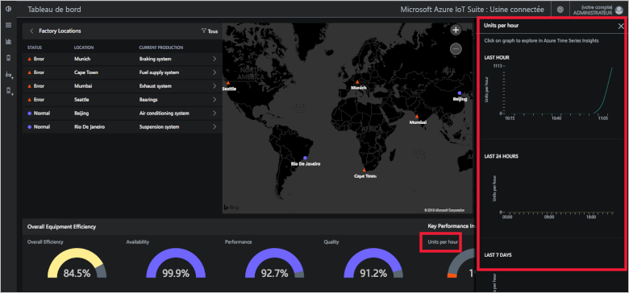](./media/quickstart-connected-factory-deploy/kpidetail-expanded.png#lightbox)

Vous pouvez cliquer sur un graphique pour procéder à une analyse plus approfondie des données.

### Emplacements des usines

Un panneau **Emplacements d’usine** qui indique l’état, l’emplacement et la configuration de production actuelle dans la solution. Lorsque vous utilisez l’accélérateur de solution pour la première fois, le tableau de bord présente un ensemble simulé d’usines. Chaque simulation de ligne de production se compose de trois serveurs OPC UA réels qui exécutent des tâches simulées et partagent des données. Pour plus d’informations sur OPC UA, consultez [FAQ sur l’accélérateur de solution Usine connectée](iot-accelerators-faq-cf.md) :

Vous pouvez parcourir la hiérarchie de la solution et afficher les valeurs TRG et les indicateurs de performance clés à chaque niveau :

1. Dans **Emplacements des usines**, cliquez sur **Mumbai**. Vous pouvez voir les lignes de production à cet emplacement.

1. Cliquez sur **Ligne de production 1**. Vous pouvez observer les postes de cette ligne de production.

1. Cliquez sur **Conditionnement**. Vous pouvez observer les nœuds OPC UA publiés par ce poste.

1. Cliquez sur **EnergyConsumption**. Vous pouvez observer des graphiques représentant cette valeur sur différentes échelles de temps. Vous pouvez cliquer sur un graphique pour procéder à une analyse plus approfondie des données.

[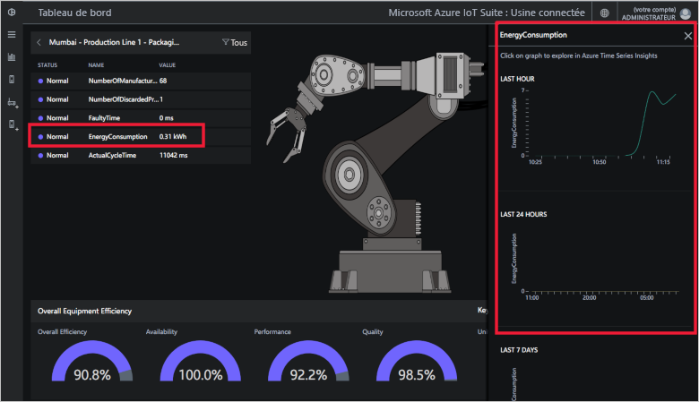](./media/quickstart-connected-factory-deploy/explorelocations-expanded.png#lightbox)

### Mappage

Si votre abonnement a accès à [l’API Bing Cartes](iot-accelerators-faq-cf.md), la carte *Usines* vous présente l’emplacement géographique et l’état de toutes les usines de la solution. Cliquez sur les emplacements indiqués sur la carte pour accéder aux détails de l’emplacement.

[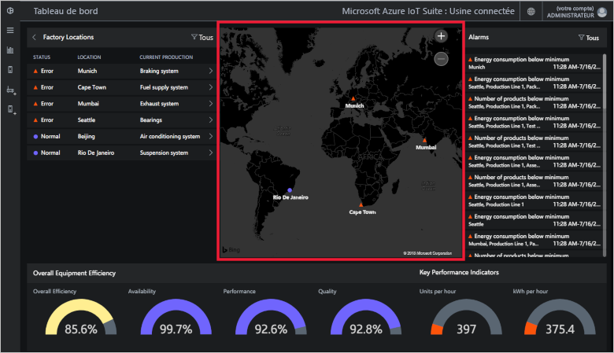](./media/quickstart-connected-factory-deploy/map-expanded.png#lightbox)

### Alarmes

Le panneau **Alarmes** présente les alarmes générées lorsqu’une valeur rapportée ou une valeur TRG/KPI calculée excède un seuil. Ce panneau affiche des alarmes à chaque niveau de la hiérarchie, du niveau du poste à l’entreprise. Chaque alarme contient une description, la date, l’heure, l’emplacement et le nombre d’occurrences :

[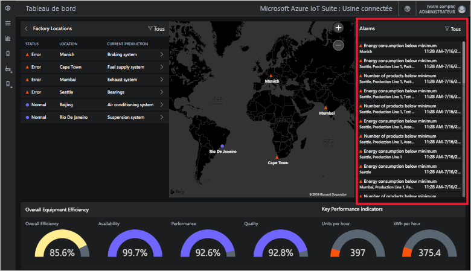](./media/quickstart-connected-factory-deploy/alarms-expanded.png#lightbox)

Vous pouvez analyser les données qui ont provoqué l’alarme à partir du tableau de bord. Si vous êtes un administrateur, vous pouvez effectuer des actions par défaut sur les alarmes :

* Fermez l’alarme.
* Accusez réception de l’alarme.

Cliquez sur l’une des alarmes ; dans la liste déroulante **Choisir une action**, choisissez **Confirmer la réception de l’alerte**, puis cliquez sur **Appliquer** :

[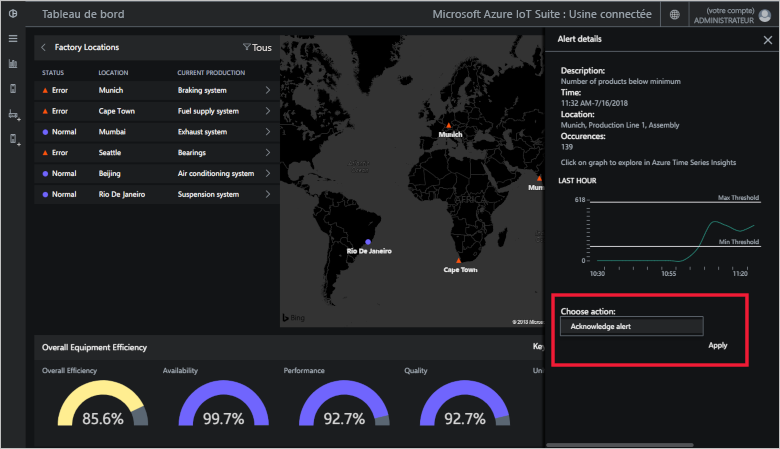](./media/quickstart-connected-factory-deploy/acknowledge-expanded.png#lightbox)

Pour approfondir l’analyse des données d’alarme, cliquez sur le graphique dans le panneau des alarmes.

Ces alarmes sont générées par des règles qui sont spécifiées dans un fichier de configuration de l’accélérateur de solution. Ces règles peuvent générer des alarmes lorsque les données de TRG ou KPI ou les valeurs de nœud OPC UA dépassent un seuil. Vous pouvez définir la valeur de ce seuil.

## Nettoyer les ressources

Si vous envisagez d’explorer davantage, laissez l’accélérateur de solution Usine connectée déployé.

Si vous n’avez plus besoin de l’accélérateur de solution, supprimez-le de la page [Solutions approvisionnées](https://www.azureiotsolutions.com/Accelerators#dashboard) en le sélectionnant et en cliquant sur **Supprimer la solution** :

## Étapes suivantes

Dans ce démarrage rapide, vous avez déployé l’accélérateur de solution Usine connectée et découvert comment naviguer dans vos usines, lignes de production et postes. Vous avez également vu comment afficher les valeurs TRG et KPI à n’importe quel niveau de la hiérarchie et comment réagir aux alarmes.

Pour découvrir comment utiliser d’autres fonctionnalités du tableau de bord pour gérer vos appareils IoT industriels, passez au guide pratique suivant :

> [!div class="nextstepaction"]
> [Utiliser le tableau de bord de l’usine connectée](iot-accelerators-connected-factory-dashboard.md)