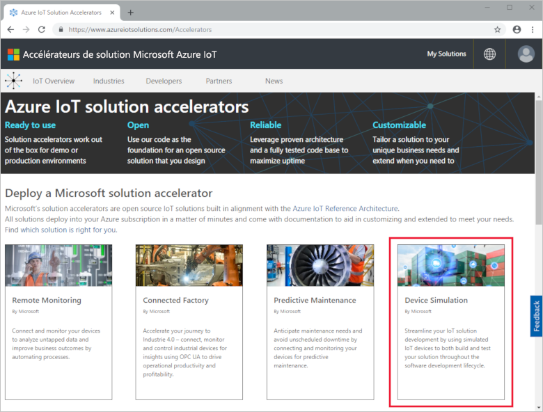
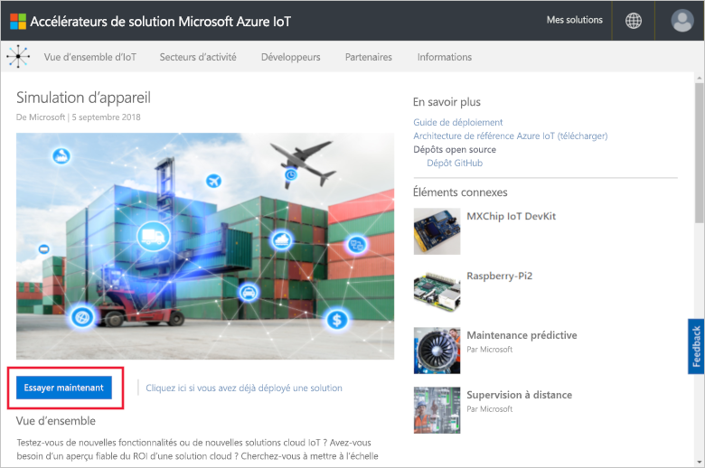
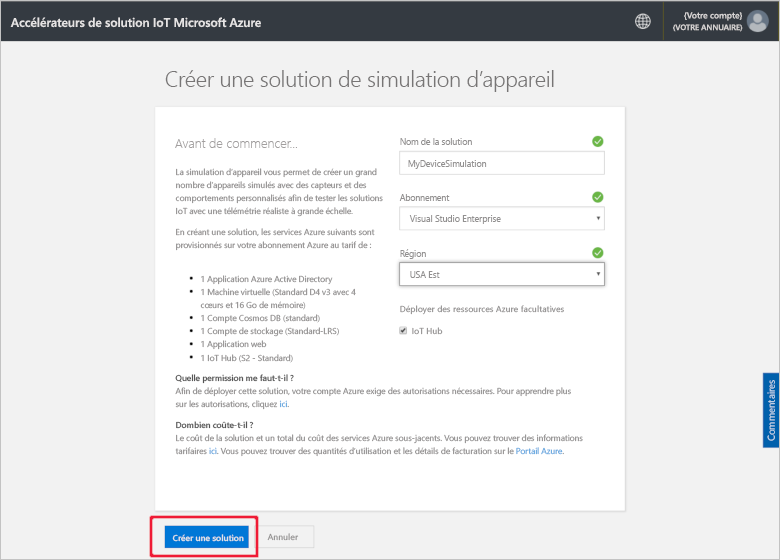
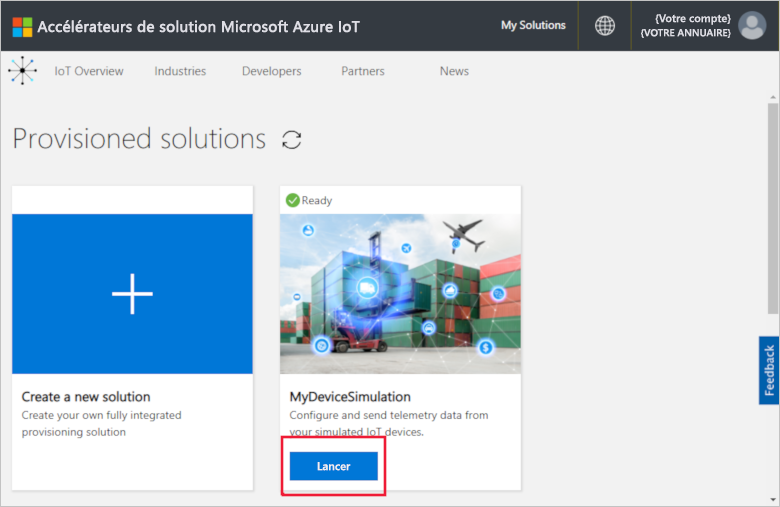
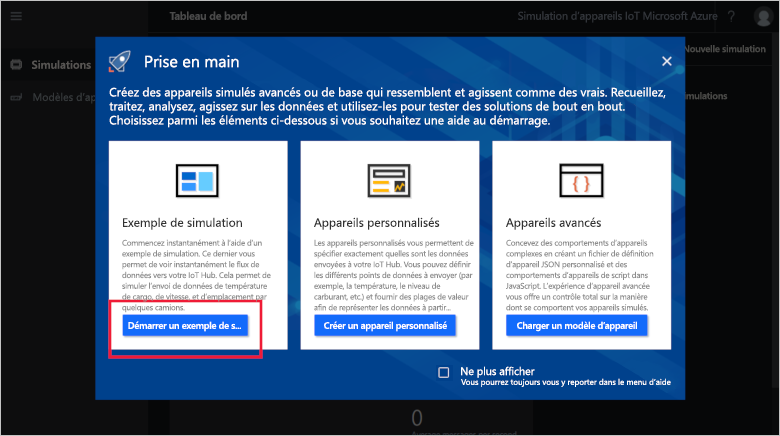
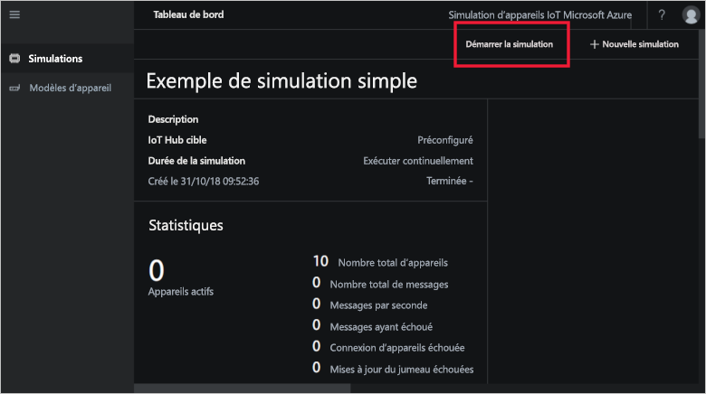
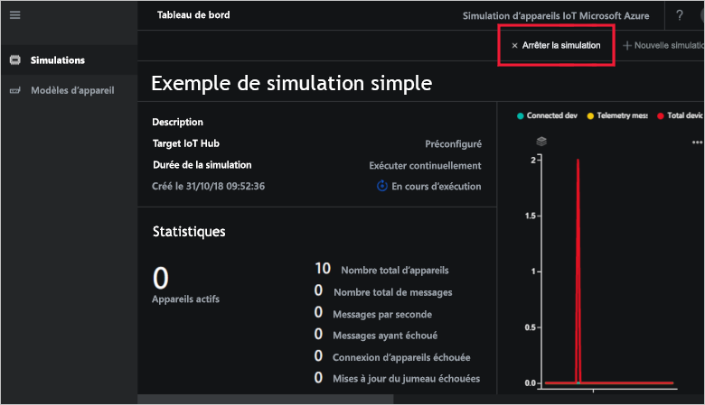
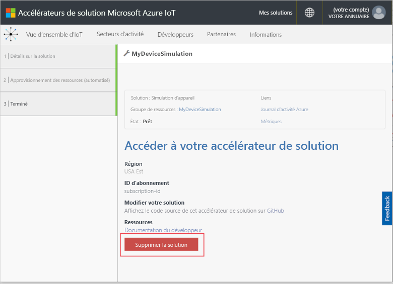

# Démarrage rapide : Déployer et exécuter une solution Simulation d’appareil IoT dans Azure

Ce guide de démarrage rapide vous montre comment déployer la Simulation d’appareil Azure IoT afin de tester votre solution IoT. Une fois l’accélérateur de solution déployé, vous devez exécuter un exemple de simulation pour commencer.

Pour suivre ce guide de démarrage rapide, vous devez avoir un abonnement Azure actif.

Si vous n’avez pas d’abonnement Azure, créez un [compte gratuit](https://azure.microsoft.com/free/?WT.mc_id=A261C142F) avant de commencer.

## Déployer la Simulation d’appareil

Quand vous déployez la Simulation d’appareil dans votre abonnement Azure, vous devez définir des options de configuration.

Connectez-vous à [azureiotsolutions.com](https://www.azureiotsolutions.com/Accelerators) avec les informations d’identification de votre compte Azure.

Cliquez sur la vignette **Simulation d’appareil** :

Cliquez sur **Essayer maintenant** sur la page de description de la Simulation d’appareil :

Sur la page **Créer une solution de simulation d’appareil**, entrez un **nom de solution** unique.

Sélectionnez l’**Abonnement** et la **Région** à utiliser pour déployer l’accélérateur de solution. En général, vous choisissez la région la plus proche. Vous devez être [administrateur général ou utilisateur](iot-accelerators-permissions.md) dans l’abonnement.

Cochez la case pour déployer un hub IoT à utiliser avec votre solution de simulation d’appareil. Vous pourrez toujours modifier le hub IoT que votre simulation utilise plus tard.

Cliquez sur **Créer** pour commencer le provisionnement de votre solution. L’exécution de ce processus prend au moins cinq minutes :

## Se connecter à la solution

Une fois le processus d’approvisionnement terminé, vous pouvez vous connecter à votre instance de Simulation d’appareil en cliquant sur le bouton **Lancer** :

Cliquez sur **Accepter** pour accepter la demande d’autorisation. Le tableau de bord de la solution Simulation d’appareil s’affiche dans votre navigateur.

À la première ouverture, vous voyez le tableau de bord de la Simulation d’appareil avec un guide de **Prise en main**. Cliquez sur la première vignette pour ouvrir un exemple de simulation. Si vous fermez le guide de **Prise en main**, vous pouvez ouvrir l’**exemple simple de simulation** depuis le tableau de bord en cliquant sur sa vignette :

## Exemple de simulation

En tant qu’exemple de simulation, il ne peut pas être modifié. La simulation est configurée à l’aide des paramètres suivants :

| Paramètre             | Valeur                       |
| ------------------- | --------------------------- |
| IoT Hub cible      | Utiliser IoT Hub préapprovisionné |
| Modèle de l'appareil        | Truck (Camion)                       |
| Nombre d’appareils   | 10                          |
| Fréquence de télémétrie | 10 secondes                  |
| Durée de la simulation | Exécuter indéfiniment            |

## Exécuter la simulation

Cliquez sur **Démarrer la simulation**. La simulation s’exécute indéfiniment, conformément à la configuration. Vous pouvez arrêter la simulation n’importe quand en cliquant sur **Arrêter la simulation.** La simulation affiche les statistiques de l’exécution actuelle.

Vous ne pouvez exécuter qu’une seule simulation à la fois à partir d’une instance de Simulation d’appareil.

## Nettoyer les ressources

Si vous prévoyez d’explorer davantage, laissez la Simulation d’appareil déployée.

Si vous n’avez plus besoin de la Simulation d’appareil, supprimez-la de la page [Solutions approvisionnées](https://www.azureiotsolutions.com/Accelerators#dashboard) en cliquant sur sa vignette, puis sur **Supprimer la solution** :

## Étapes suivantes

Dans ce guide de démarrage rapide, vous avez déployé la solution Simulation d’appareil et exécuté un exemple de simulation d’appareil IoT.

> [!div class="nextstepaction"]
> [Créer une simulation avec un ou plusieurs types d’appareils](iot-accelerators-device-simulation-create-simulation.md)