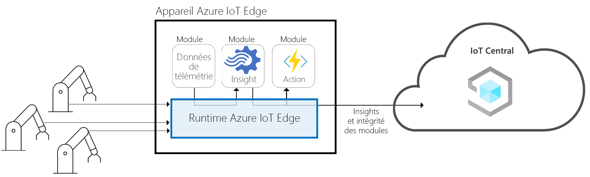
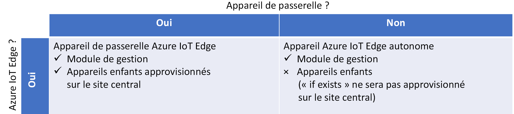
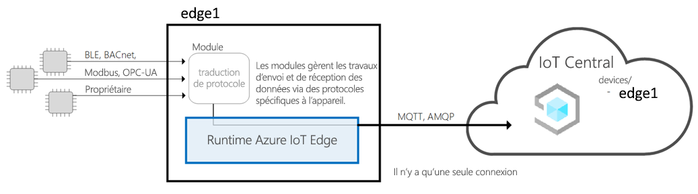
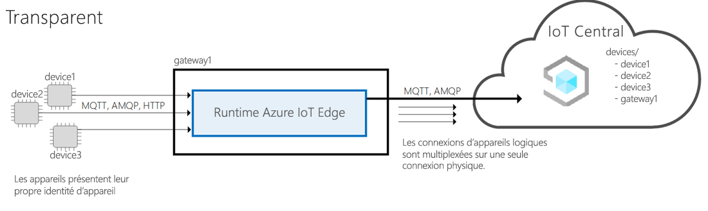
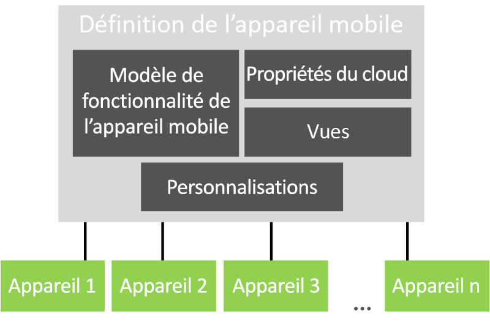

# Architecture d’Azure IoT Central

Cet article donne une vue d’ensemble de l’architecture d’Azure IoT Central.

## Appareils

Les appareils échangent des données avec votre application Azure IoT Central. Un appareil peut :

- Envoyer des mesures, comme de la télémétrie.
- Synchroniser des paramètres avec votre application.

Dans Azure IoT Central, les données qu’un appareil peut échanger avec votre application sont spécifiées dans un modèle d’appareil. Pour plus d’informations sur les modèles d’appareil, consultez [Gestion des métadonnées](#metadata-management).

Pour plus d’informations sur la façon dont les appareils se connectent à votre application Azure IoT Central, consultez [Connectivité des appareils](concepts-get-connected.md).

## Appareil Azure IoT Edge

En plus des appareils créés à l’aide des [kits de développement logiciel (SDK) Azure IoT](https://github.com/Azure/azure-iot-sdks), vous pouvez également connecter des [appareils Azure IoT Edge](../../iot-edge/about-iot-edge.md) à une application IoT Central. IoT Edge vous permet d’exécuter l’intelligence Cloud et une logique personnalisée directement sur les appareils IoT gérés par IoT Central. Le runtime IoT Edge vous permet d’effectuer les opérations suivantes :

- Installer et mettre à jour des charges de travail sur l’appareil.
- Tenir à jour les normes de sécurité IoT Edge sur l’appareil.
- Garantir que les modules IoT Edge sont toujours en cours d’exécution.
- Envoyer des rapports d’intégrité du module dans le cloud pour la supervision à distance.
- Gérer la communication entre les appareils de nœud terminal en aval et un appareil IoT Edge, entre les modules sur un appareil IoT Edge, ainsi qu’entre un appareil IoT Edge et le cloud.

IoT Central offre les fonctionnalités suivantes sur les appareils IoT Edge :

- Modèles d’appareils pour décrire les fonctionnalités d'un appareil IoT Edge, par exemple :
  - Capacité de chargement du manifeste de déploiement, qui vous aide à gérer un manifeste pour une flotte d’appareils.
  - Modules qui fonctionnent sur l’appareil IoT Edge.
  - La télémétrie envoyée par chaque module.
  - Les propriétés signalées par chaque module.
  - Les commandes auxquelles chaque module répond.
  - Les relations entre un appareil de passerelle IoT Edge et un appareil en aval.
  - Les propriétés cloud qui ne sont pas stockées sur l’appareil IoT Edge.
  - Personnalisations, tableaux de bord et formulaires qui font partie de votre application IoT Central.

  Pour plus d’informations, consultez l’article [Connecter des appareils Azure IoT Edge à une application Azure IoT Central](./concepts-iot-edge.md).

- La capacité à provisionner des appareils IoT Edge à grande échelle avec le service Device Provisioning d’Azure IoT
- Règles et actions.
- Tableaux de bord et analyses personnalisés.
- Exportation continue des données de télémétrie depuis les appareils IoT Edge.

### Types d'appareils IoT Edge

IoT Central classifie les types d’appareils IoT Edge comme suit :

- Appareils de nœud terminal. Un appareil IoT Edge peut avoir des appareils de nœud terminal en aval, mais ceux-ci ne sont pas approvisionnés dans IoT Central.
- Appareils de passerelle avec des appareils en aval. L’appareil de passerelle et les appareils en aval sont provisionnés dans IoT Central

### Modèles IoT Edge

IoT Central prend en charge les modèles d’appareils IoT Edge suivants :

#### Appareil de nœud terminal IoT Edge

L’appareil IoT Edge est approvisionné dans IoT Central et dans tous les appareils en aval, et leur télémétrie est représentée comme provenant de l’appareil IoT Edge. Les appareils en aval connectés à l’appareil IoT Edge ne sont pas approvisionnés dans IoT Central.

#### Appareil de passerelle IoT Edge connecté aux appareils en aval avec une identité

L’appareil IoT Edge est approvisionné dans IoT Central avec les appareils en aval connectés à l’appareil IoT Edge. Le runtime pour l’approvisionnement des appareils en aval via la passerelle n'est pas pris en charge actuellement.

#### Appareil de passerelle IoT Edge connecté aux appareils en aval avec une identité fournie par la passerelle IoT Edge

L’appareil IoT Edge est approvisionné dans IoT Central avec les appareils en aval connectés à l’appareil IoT Edge. Le runtime de la passerelle fournissant l’identité aux appareils en aval et le provisionnement des appareils en aval ne sont actuellement pas pris en charge. Si vous apportez votre propre module de traduction d’identité, IoT Central peut prendre en charge ce modèle.

## Passerelle cloud

Azure IoT Central utilise Azure IoT Hub comme passerelle cloud pour la connectivité des appareils. IoT Hub permet :

- L’ingestion de données à grande échelle dans le cloud.
- La gestion des appareils.
- La connectivité sécurisée des appareils.

Pour plus d’informations sur IoT Hub, consultez [Azure IoT Hub](../../iot-hub/index.yml).

Pour plus d’informations sur la connectivité des appareils dans Azure IoT Central, consultez [Connectivité des appareils](concepts-get-connected.md).

## Magasins de données

Azure IoT Central stocke les données d’application dans le cloud. Les données d’application stockées incluent :

- Les modèles d’appareil.
- Les identités des appareils.
- Les métadonnées des appareils.
- Les données des utilisateurs et des rôles.

Azure IoT Central utilise un magasin de séries chronologiques pour les données de mesure envoyées depuis vos appareils. Données de séries chronologiques provenant d’appareils utilisés par le service d’analytique.

## Analytics

Le service d’analytique est chargé de générer les données des rapports personnalisés montrés par l’application. Un opérateur peut [personnaliser l’analytique](howto-create-analytics.md) affichée dans l’application. Le service d’analytique utilise la technologie [Azure Time Series Insights](https://azure.microsoft.com/services/time-series-insights/) et traite les données de mesure envoyées depuis vos appareils.

## Règles et actions

[Les règles et les actions](tutorial-create-telemetry-rules.md) travaillent en étroite collaboration pour automatiser les tâches au sein de l’application. Un concepteur peut définir des règles en fonction de la télémétrie des appareils, par exemple une température dépassant un seuil défini. Azure IoT Central utilise un processeur de flux de données pour déterminer quand les conditions d’une règle sont remplies. Quand une condition de règle est remplie, il déclenche une action définie par le concepteur. Par exemple, une action peut envoyer un e-mail pour notifier à un ingénieur que la température d’un appareil est trop élevée.

## Gestion des métadonnées

Dans une application Azure IoT Central, les modèles d’appareil définissent le comportement et les fonctionnalités des types d’appareils. Par exemple, un modèle de réfrigérateur spécifie la télémétrie qu’un réfrigérateur envoie à votre application.

Un [modèle d’appareil](concepts-device-templates.md) IoT Central contient :

- Un **modèle d’appareil** pour spécifier les capacités d’un appareil, notamment les données de télémétrie qu’il envoie, les propriétés qui définissent l’état de l’appareil et les commandes auxquelles l’appareil répond. Les capacités de l'appareil sont organisées en une ou plusieurs interfaces.
- Les **propriétés du cloud** spécifient les propriétés que l'IoT Central stocke pour un appareil. Ces propriétés sont uniquement stockées dans IoT Central et ne sont jamais envoyées à un appareil.
- Les **vues** spécifient les tableaux de bord et les formulaires créés par le concepteur pour permettre à l'opérateur de surveiller et de gérer les appareils.
- Les **personnalisations** permettent au concepteur de remplacer certaines des définitions du modèle d’appareil afin de les rendre plus pertinentes pour l’application IoT Central.

Une application peut avoir un ou plusieurs appareils simulés et réels basés sur chaque modèle d’appareil.

## Exportation de données

Dans une application Azure IoT Central, vous pouvez [exporter en continu vos données](howto-export-data.md) vers votre propre Azure Event Hubs et les instances Azure Service Bus. Vous pouvez également régulièrement exporter vos données vers votre compte de stockage d’objets blob Azure. IoT Central peut exporter des mesures, des appareils et des modèles d’appareil.

## Mises à jour d’appareils par lots

Dans une application Azure IoT Central, vous pouvez [créer et exécuter des travaux](howto-run-a-job.md) pour gérer des appareils connectés. Ces travaux vous permettent d’effectuer des mises à jour en bloc sur les propriétés ou les paramètres des appareils, ou d’exécuter des commandes. Par exemple, vous pouvez créer un travail pour augmenter la vitesse du ventilateur pour plusieurs distributeurs réfrigérés.

## Contrôle d’accès en fonction du rôle

Chaque application IoT Central possède son propre système RBAC intégré. Un [administrateur peut définir des règles d’accès](howto-manage-users-roles.md) pour une application Azure IoT Central en utilisant un des rôles prédéfinis ou en créant un rôle personnalisé. Les rôles déterminent les zones de l’application auxquelles un utilisateur a accès ainsi que les actions qu’il peut effectuer.

## Sécurité

Les fonctionnalités de sécurité dans Azure IoT Central sont les suivantes :

- Les données sont chiffrées en transit et au repos.
- L’authentification est fournie par Azure Active Directory ou via un compte Microsoft. L’authentification à deux facteurs est prise en charge.
- L’isolation complète des locataires.
- La sécurité au niveau des appareils.

## Le shell d’interface utilisateur

Le shell d’interface utilisateur est une application moderne et réactive, basée sur un navigateur HTML 5.
Un administrateur peut personnaliser l’interface utilisateur de l’application en appliquant des thèmes personnalisés et en modifiant les liens d’aide pour pointer vers vos propres ressources d’aide personnalisée. Pour en savoir plus sur la personnalisation de l’interface utilisateur, consultez l’article [Personnaliser l’interface utilisateur d’Azure IoT Central](howto-customize-ui.md).

Un opérateur peut créer des tableaux de bord des applications personnalisées. Vous pouvez disposer de plusieurs tableaux de bord, qui affichent différentes informations, et basculer de l’un à l’autre.

## Étapes suivantes

Maintenant que vous avez découvert l’architecture d’Azure IoT Central, l’étape suivante suggérée est de découvrir la [connectivité des appareils](concepts-get-connected.md) dans Azure IoT Central.