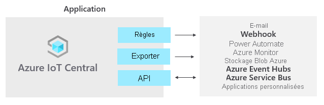

# Qu’est-ce que Azure IoT Central

IoT Central est une plateforme d’application IoT qui réduit les charges et les coûts associés au développement, à la gestion et à la maintenance de solutions IoT de qualité professionnelle. Choisir de créer des applications avec IoT Central vous offre la possibilité de consacrer votre temps, votre argent et votre énergie à transformer votre activité avec des données IoT, au lieu de simplement gérer et mettre à jour une infrastructure IoT complexe et en constante évolution.

L’interface utilisateur web vous permet de superviser les conditions des appareils, de créer des règles et de gérer des millions d’appareils et leurs données tout au long de leur cycle de vie. Elle vous permet également d’agir sur les insights des appareils en élargissant l’intelligence IoT aux applications métier.

Cet article décrit, en ce qui concerne IoT Central :

- Les rôles d'utilisateur types associés à un projet.
- La procédure de création de votre application.
- La connexion de vos appareils à votre application
- Comment gérer votre application.
- Fonctionnalités Azure IoT Edge dans IoT Central
- Comment connecter vos appareils fonctionnant avec Azure IoT Edge à votre application.

## Rôles d'utilisateur

La documentation IoT Central fait référence à quatre rôles d'utilisateur qui interagissent avec une application IoT Central :

- Un _générateur de solutions_ est responsable de la [création d’une d’application](quick-deploy-iot-central.md), de la [configuration des règles et des actions](quick-configure-rules.md), de la [définition des intégrations à d’autres services](howto-export-data.md) et de la personnalisation de l’application pour les opérateurs et les développeurs d’appareils.
- Un _opérateur_ [gère les appareils](howto-manage-devices.md) connectés à l’application.
- Un _administrateur_ est responsable des tâches d’administration comme la gestion des [rôles et des autorisations des utilisateurs](howto-administer.md) au sein de l’application.
- Un _développeur d’appareil_ [crée le code qui s’exécute sur un appareil](concepts-telemetry-properties-commands.md) ou un [module IoT Edge](concepts-iot-edge.md) connecté à votre application.

## Créer votre application IoT Central

En tant que créateur de solution, vous utilisez IoT Central pour créer une solution IoT personnalisée et hébergée dans le cloud pour votre organisation. Une solution IoT personnalisée se compose généralement de :

- Une application basée sur le cloud qui reçoit des données de télémétrie de vos appareils et qui vous permet de gérer ces appareils.
- Un code personnalisé exécuté sur plusieurs appareils, connecté à votre application basée sur le cloud.

Vous pouvez déployer rapidement une nouvelle application IoT Central, puis la personnaliser selon vos propres exigences, depuis dans votre navigateur. Vous pouvez commencer avec un _modèle d’application_ générique ou avec l’un des modèles d’application axés sur la [vente au détail](../retail/overview-iot-central-retail.md), l’[énergie](../energy/overview-iot-central-energy.md), le [secteur public](../government/overview-iot-central-government.md) ou la [santé](../healthcare/overview-iot-central-healthcare.md).

En tant que créateur de solution, vous utilisez les outils web pour créer un _modèle d’appareil_ pour les appareils qui se connectent à votre application. Un modèle d’appareil est le blueprint qui définit les caractéristiques et le comportement d’un type d’appareils tel que :

- Les données de télémétrie qu’il envoie. Par exemple, la température et l’humidité. La télémétrie se présente sous la forme de données en streaming.
- Les propriétés commerciales qu’un opérateur peut modifier. Par exemple, une adresse de client et une date de dernier entretien.
- Les propriétés d’appareil qui sont définies par un appareil et en lecture seule dans l’application. Par exemple, l’état d’une vanne : ouvert ou fermé.
- Les propriétés définies par un opérateur, qui déterminent le comportement de l’appareil. Par exemple, une température cible pour l’appareil.
- Les commandes, qu’un opérateur peut appeler, qui s’exécutent sur un appareil. Par exemple, une commande pour redémarrer un appareil à distance.

Ce [modèle d’appareil](howto-set-up-template.md) inclut les éléments suivants :

- Un _modèle de capacité d’appareil_ qui décrit les fonctionnalités qu’un appareil doit implémenter. Les fonctionnalités de l’appareil sont les suivantes :

  - La télémétrie qu’il diffuse à IoT Central.
  - Les propriétés en lecture seule qu’il utilise pour signaler l’état à IoT Central.
  - Les propriétés accessibles en écriture qu’il reçoit d’IoT Central pour définir l’état de l’appareil.
  - Les commandes appelées à partir d’IoT Central.

- Propriétés cloud qui ne sont pas stockées sur l’appareil.
- Personnalisations, tableaux de bord et formulaires qui font partie de votre application IoT Central.

### Créer des modèles d’appareils

Plusieurs choix s’offrent à vous pour créer des modèles d’appareil :

- Concevez le modèle d’appareil dans IoT Central, puis implémentez son modèle de capacité d’appareil dans le code de votre appareil.
- Créez un de capacité d’appareil avec du code Visual Studio et publiez le modèle de capacité dans un référentiel. Implémentez votre code d’appareil à partir du modèle et connectez votre appareil à votre application IoT Central. IoT Central recherche le modèle de capacité d’appareil dans le référentiel et crée automatiquement un modèle d’appareil simple.
- Créez un modèle de capacité d’appareil avec Visual Studio Code. Implémentez votre code d’appareil à partir du modèle. Importez manuellement le modèle de capacité d’appareil dans votre application IoT Central, puis ajoutez les propriétés cloud, les personnalisations et les tableaux de bord nécessaires à votre application IoT Central.

En tant que créateur de solution, vous pouvez utiliser IoT Central pour générer du code pour les appareils de test afin de valider vos modèles d’appareil.

Si vous êtes un développeur d’appareils, voir [Vue d’ensemble du développement d’appareils IoT Central](./overview-iot-central-developer.md) pour obtenir une présentation de l’implémentation des appareils qui utilisent ces modèles d’appareil.

### Personnaliser l’interface utilisateur

En tant que créateur de solution, vous pouvez également personnaliser l’interface utilisateur de l’application IoT Central pour les opérateurs responsables de l’utilisation quotidienne de l’application. Les personnalisations possibles par un créateur de solution incluent :

- La définition de la mise en page de propriétés et des paramètres au sein d’un modèle d’appareil.
- La configuration de tableaux de bord personnalisés permettant aux opérateurs de découvrir des insights et de résoudre les problèmes plus rapidement.
- La configuration d’analytiques personnalisés pour explorer des données de série chronologiques à partir de vos appareils connectés.

## Gestion de vos appareils

En tant qu’opérateur, vous utilisez l’application IoT Central pour [gérer les appareils](howto-manage-devices.md) dans votre solution IoT Central. Les opérateurs effectuent des tâches telles que :

- Surveiller les appareils connectés à l’application.
- La résolution et la correction des problèmes avec des appareils.
- La configuration de nouveaux appareils.

En tant que créateur de solution, vous pouvez [définir des règles et des actions](howto-configure-rules.md) personnalisées qui s’exécutent sur les flux de données d’appareils connectés. Un opérateur peut activer ou désactiver ces règles au niveau de l’appareil pour contrôler et automatiser des tâches au sein de l’application.

Pour toute solution IoT conçue pour fonctionner à grande échelle, il est important d’avoir une approche structurée de la gestion des appareils. Il ne vous suffit pas de connecter vos appareils au cloud ; ceux-ci doivent rester connectés et sains. Un opérateur peut utiliser les capacités IoT Central suivantes pour gérer vos appareils tout au long du cycle de vie de l’application :

### Tableaux de bord

Les [tableaux de bord](./howto-set-up-template.md#generate-default-views) intégrés proposent une interface utilisateur personnalisable qui permet de superviser la télémétrie et l’intégrité des appareils. Commencez avec un tableau de bord prédéfini dans un [modèle d’application](howto-use-app-templates.md) ou créez vos propres tableaux de bord en fonction des besoins de vos opérateurs. Vous pouvez partager les tableaux de bord avec tous les utilisateurs de votre application ou les maintenir privés.

### Règles et actions

Générez des [règles personnalisées](tutorial-create-telemetry-rules.md) en fonction de l’état et des données de télémétrie des appareils pour identifier ceux qui ont besoin d’attention. Configurez des actions pour notifier les personnes concernées et faire en sorte que des mesures correctives soient prises en temps voulu.

### travaux

Les [travaux](howto-run-a-job.md) vous permettent d’appliquer des mises à jour uniques ou en bloc aux appareils en définissant des propriétés ou en appelant des commandes.

## Intégrer aux autres services

En tant que plateforme d’application, IoT Central vous permet de transformer vos données IoT en insights métier qui permettent d’obtenir des résultats exploitables. Les [règles](./tutorial-create-telemetry-rules.md), l’[exportation de données](./howto-export-data.md)et l’[API REST publique](/learn/modules/manage-iot-central-apps-with-rest-api/) sont des exemples de la façon dont vous pouvez intégrer IoT Central à des applications métier :

Vous pouvez générer des insights métier, comme déterminer l’évolution de l’efficacité des machines ou prédire la consommation future d’énergie dans un atelier de fabrication en créant des pipelines analytiques personnalisés pour traiter les données de télémétrie de vos appareils et stocker les résultats. Configurez des exportations de données dans votre application IoT Central de telle sorte que les données de télémétrie et les modifications apportées aux propriétés et aux modèles d’appareil soient exportées vers d’autres services pour y analyser, stocker et visualiser les données à l’aide de vos outils préférés.

### Générer des solutions et des intégrations IoT personnalisées avec les API REST

Générez les types de solutions IoT suivants :

- Applications compagnes mobiles capables de configurer et contrôler à distance des appareils.
- Intégrations personnalisées qui permettent aux applications métier existantes d’interagir avec vos appareils et données IoT.
- Applications de gestion d’appareils pour la modélisation, l’intégration, la gestion et de l’accès aux données des appareils.

## Gérer votre application

Les applications IoT Central sont entièrement hébergées par Microsoft, ce qui réduit la surcharge administrative liée à la gestion de vos applications. Les administrateurs gèrent l’accès à votre application avec des [rôles d’utilisateur et des autorisations](howto-administer.md).

## Tarifs

Vous pouvez créer une application IoT Central dans le cadre d’un essai gratuit de 7 jours ou utiliser un plan tarifaire standard.

- Les applications que vous créez à partir d’un plan *gratuit* sont gratuites pendant sept jours et prennent en charge jusqu’à cinq appareils. Vous pouvez les convertir de sorte qu’elles utilisent un plan tarifaire standard à tout moment avant leur expiration.
- Les applications que vous créez dans le cadre d’un plan *standard* sont facturées par appareil ; vous pouvez choisir un plan tarifaire **Standard 0**, **Standard 1** ou **Standard 2**, les deux premiers appareils étant gratuits. Apprenez-en davantage sur les [tarifs d’IoT Central](https://aka.ms/iotcentral-pricing).

## Quotas

Chaque abonnement Azure a des quotas par défaut qui peuvent impacter l’étendue de votre solution IoT. IoT Central limite actuellement à 10 le nombre d’applications que vous pouvez déployer dans un abonnement. Pour augmenter cette limite, contactez le [support Microsoft](https://azure.microsoft.com/support/options/).

## Problèmes connus

- L’exportation continue des données ne prend pas en charge le format Avro (incompatibilité).
- GeoJSON n’est pas actuellement pris en charge.
- La mosaïque n’est pas actuellement prise en charge.
- Les types de schémas de tableaux ne sont pas pris en charge.
- Seuls le SDK d’appareil C et les SDK de service et d’appareil Node.js sont pris en charge.
- IoT Central est disponible aux États-Unis, en Europe, en Asie-Pacifique, en Australie, au Royaume-Uni et au Japon.

## Étapes suivantes

Maintenant que vous avez une vue d’ensemble d’IoT Central, voici quelques étapes suggérées :

- Si vous êtes développeur d’appareils et que vous souhaitez vous immerger dans du code, l’étape suivante suggérée consiste à [Créer et connecter une application cliente à votre application Azure IoT Central](./tutorial-connect-device.md).
- Vous familiariser avec [l’interface utilisateur de Azure IoT Central](overview-iot-central-tour.md).
- Mise en route avec la [création d’une application Azure IoT Central](quick-deploy-iot-central.md).
