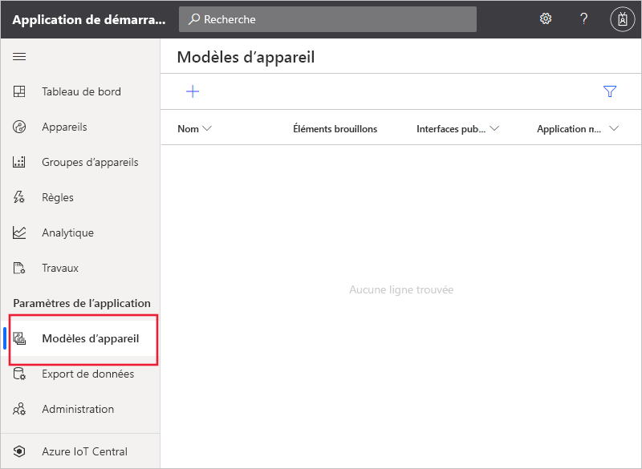
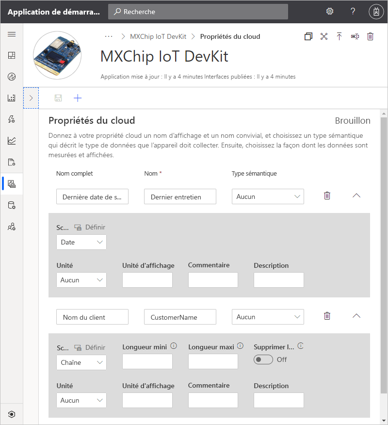
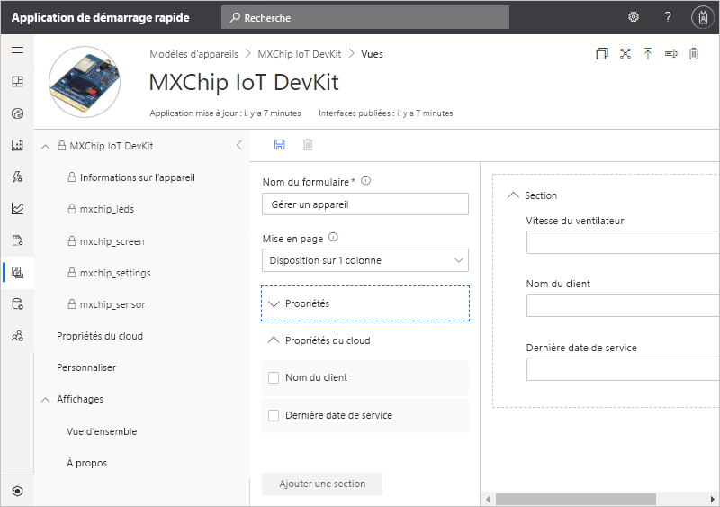
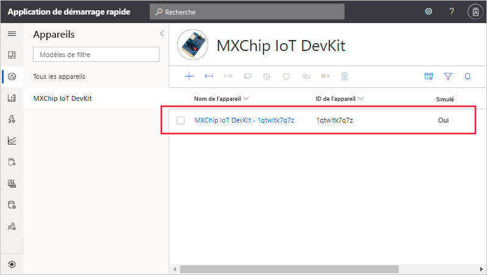
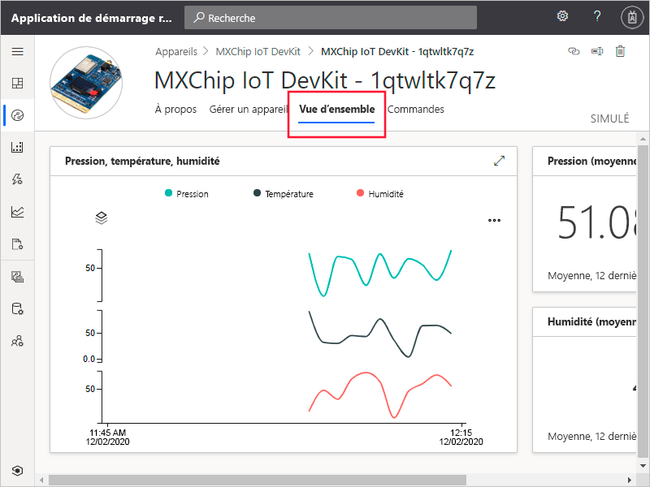

# Démarrage rapide : Ajouter un appareil simulé à votre application IoT Central

*Cet article s’applique aux opérateurs, aux créateurs et aux administrateurs.*

Un modèle d’appareil définit les fonctionnalités d’un appareil qui se connecte à votre application IoT Central. Les capacités incluent la télémétrie que l’appareil envoie, les propriétés de l’appareil et les commandes auxquelles un appareil répond. À partir d’un modèle d’appareil, un créateur ou un opérateur peut ajouter des appareils réels et simulés à une application. Les appareils simulés sont utiles pour tester le comportement de votre application IoT Central avant de connecter des appareils réels.

Dans ce guide de démarrage rapide, vous allez ajouter un modèle d’appareil pour une carte *MXChip IoT DevKit* (DevKit) et créer un appareil simulé. Pour suivre ce guide de démarrage rapide, vous n’avez pas besoin d’appareil réel, vous travaillez avec un appareil simulé. Un appareil DevKit :

* Envoie des données de télémétrie comme la température.
* Signale des propriétés propres à l’appareil, telles que le niveau de luminosité.
* Répond aux commandes telles que Activer et Désactiver.
* Signale des propriétés d’appareil génériques, telles que la version du microprogramme et le numéro de série.

## Prérequis

Suivez le guide de démarrage rapide [Créer une application Azure IoT Central](./quick-deploy-iot-central.md) pour créer une application IoT Central avec le modèle **Application personnalisée > Application personnalisée**.

## Créer un modèle

En tant que créateur, vous pouvez créer et modifier des modèles d’appareil dans votre application IoT Central. Après avoir publié un modèle d’appareil, vous pouvez générer un appareil simulé ou connecter des appareils réels à partir du modèle d’appareil. Les appareils simulés vous permettent de tester le comportement de votre application avant de connecter un appareil physique.

Pour ajouter un nouveau modèle d’appareil à votre application, sélectionnez l’onglet **Modèles d’appareil** dans le volet de gauche.

Un modèle d’appareil comprend un modèle de capacité d’appareil qui définit les données de télémétrie qu’envoie l’appareil, les propriétés d’appareil et les commandes auxquelles l’appareil répond.

### Ajouter un modèle de capacité d’appareil

Vous pouvez ajouter un modèle de capacité d’appareil à votre application IoT Central de plusieurs façons. Vous pouvez créer un modèle en partant de zéro, importer un modèle à partir d’un fichier ou sélectionner un appareil dans le catalogue d’appareils. IoT Central prend aussi en charge une approche « *device-first* » (appareil en premier) dans laquelle un modèle est importé automatiquement à partir d’un référentiel au moment où un appareil se connecte pour la première fois. Dans ce démarrage rapide, vous choisissez un appareil dans le catalogue d’appareils pour en importer le modèle de capacité d’appareil.

Les étapes suivantes vous montrent comment utiliser le catalogue d’appareils pour importer le modèle de capacité d’un appareil **MXChip IoT DevKit**. Ces appareils envoient des données de télémétrie, telles que la température, à votre application :

1. Pour ajouter un nouveau modèle d’appareil, sélectionnez **+** dans la page **Modèles d’appareil**.

1. Dans la page **Sélectionner un type de modèle**, faites défiler l’écran vers le bas jusqu’à la vignette **MXChip IoT DevKit**.

1. Sélectionnez la vignette **MXChip IoT DevKit**, puis **Suivant : Personnaliser**.

1. Dans la page **Vérifier**, sélectionnez **Créer**.

1. Après quelques secondes, vous pouvez voir votre nouveau modèle d’appareil :

    

    Le modèle de capacité MXChip IoT DevKit comprend des interfaces comme **mxchip_sensor**, **mxchip_settings** et **informations sur l’appareil**. Les interfaces définissent les capacités d’un appareil MXChip IoT DevKit. Les capacités incluent la télémétrie que l’appareil envoie, les propriétés signalées par un appareil et les commandes auxquelles un appareil répond.

### Ajouter des propriétés du cloud

Un modèle d’appareil peut inclure des propriétés du cloud. Les propriétés du cloud existent uniquement dans l’application IoT Central, et ne sont jamais envoyées à un appareil ni reçues à partir d’un appareil.

1. Sélectionnez **Propriétés du cloud**, puis **+ Ajouter une propriété cloud**. Utilisez les informations du tableau suivant pour ajouter deux propriétés cloud à votre modèle d’appareil :

    | Nom d’affichage      | Type sémantique | schéma |
    | ----------------- | ------------- | ------ |
    | Dernière date de service | None          | Date   |
    | Nom du client     | None          | String |

1. Cliquez sur **Enregistrer** pour enregistrer vos modifications :

    

## Les vues

En tant que créateur, vous pouvez personnaliser l’application de façon à présenter à un opérateur des informations pertinentes sur l’appareil. Vos personnalisations permettent à l’opérateur de gérer les appareils connectés à l’application. Vous pouvez créer deux types de vues permettant à un opérateur d’interagir avec des appareils :

* Formulaires pour voir et modifier les propriétés de l’appareil et du cloud
* Tableaux de bord permettant de visualiser les appareils, notamment les données de télémétrie qu’ils envoient

### Vues par défaut

Les vues par défaut permettent de visualiser rapidement les informations importantes de votre appareil. Vous pouvez avoir jusqu’à trois vues par défaut générées pour votre modèle d’appareil :

* La vue **Commandes** permet à votre opérateur d’envoyer des commandes à votre appareil.
* La vue **Vue d’ensemble** utilise des graphiques et des métriques pour afficher les données de télémétrie des appareils.
* La vue **À propos** affiche les propriétés de l’appareil.

Sélectionnez le nœud **Vues** dans le modèle d’appareil. Comme vous pouvez le constater, IoT Central a généré automatiquement une vue **Vue d’ensemble** et une vue **À propos** au moment où vous avez ajouté le modèle.

Pour ajouter un nouveau formulaire **Gérer l’appareil** dont peut se servir un opérateur pour gérer l’appareil :

1. Après avoir sélectionné le nœud **Vues**, sélectionnez la vignette **Modification des données de l’appareil et du cloud** pour ajouter une nouvelle vue.

1. Remplacez le nom du formulaire par **Gérer l’appareil**.

1. Sélectionnez les propriétés cloud **Nom du client** et **Date du dernier service** ainsi que la propriété **Vitesse du ventilateur**. Sélectionnez ensuite **Ajouter une section** :

    

1. Sélectionnez **Enregistrer** pour enregistrer votre nouveau formulaire.

## Publier le modèle d’appareil

Avant de pouvoir créer un appareil simulé ou de connecter un appareil réel, vous devez publier votre modèle d’appareil. Même si IoT Central a publié le modèle au moment où vous l’avez créé, vous devez publier la version mise à jour.

Pour publier un modèle d’appareil

1. Accédez à votre modèle d’appareil à partir de la page **Modèles d’appareil**.

1. Sélectionnez **Publier** :

    

1. Dans la boîte de dialogue **Publier ce modèle d’appareil dans l’application**, sélectionnez **Publier**. 

Une fois publié, un modèle d’appareil est visible dans la page **Appareils**. Dans un modèle d’appareil publié, vous ne pouvez pas modifier un modèle de capacité d’appareil sans créer de nouvelle version. En revanche, vous pouvez effectuer des mises à jour des propriétés du cloud, des personnalisations et des vues dans un modèle d’appareil publié sans gestion des versions. Après avoir apporté des modifications, sélectionnez **Publier** pour envoyer ces modifications à votre opérateur.

## Utiliser un appareil simulé

Pour ajouter un appareil simulé à votre application, utilisez le modèle d’appareil **MXChip IoT DevKit** que vous avez créé.

1. Pour ajouter un nouvel appareil en tant qu’opérateur, choisissez **Appareils** dans le volet de gauche. L’onglet **Appareils** affiche **Tous les appareils** et le modèle d’appareil **MXChip IoT DevKit**. Sélectionnez **MXChip IoT DevKit**.

1. Pour ajouter un appareil DevKit simulé, sélectionnez **+** . Utilisez l’**ID d’appareil** suggéré ou entrez votre propre **ID d’appareil** en minuscules. Vous pouvez également entrer un nom pour votre nouvel appareil. Vérifiez que le bouton bascule **Simulé** est défini sur **Activé**, puis sélectionnez **Créer**.

    

Vous pouvez désormais interagir avec les vues qui ont été créées par le créateur pour le modèle d’appareil en utilisant les données simulées :

1. Sélectionnez votre appareil simulé dans la page **Appareils**.

1. La vue **Vue d’ensemble** affiche un tracé des données de télémétrie simulées :

    

1. La vue **À propos** affiche des valeurs de propriétés, notamment les propriétés cloud que vous avez ajoutées à la vue.

1. La vue **Commandes** vous permet d’exécuter des commandes, comme **Clignoter**, sur l’appareil.

1. La vue **Gérer les appareils** est le formulaire que vous avez créé pour permettre à l’opérateur de gérer l’appareil.

## Utiliser un appareil simulé pour améliorer les vues

Une fois que vous avez créé un appareil simulé, le générateur peut utiliser cet appareil pour continuer à améliorer les vues du modèle d’appareil.

1. Choisissez **Modèles d’appareil** dans le volet de gauche, puis sélectionnez le modèle **MXChip IoT DevKit**.

1. Sélectionnez l’une des vues que vous souhaitez modifier, ou créez une nouvelle vue. Sélectionnez **Configurer l’appareil de préversion**, puis **Sélectionner à partir d’un d’appareil en cours d’exécution**. Vous pouvez choisir ici de n’avoir aucun appareil de préversion, d’avoir un appareil réel configuré à des fins de test ou un appareil existant que vous avez ajouté dans IoT Central.

1. Choisissez votre appareil simulé dans la liste. Sélectionnez ensuite **Appliquer**. Vous pouvez maintenant voir le même appareil simulé dans votre expérience de génération de vues de modèle d’appareil. Cette vue est utile pour les graphiques et autres visualisations.

    

## Étapes suivantes

Dans ce démarrage rapide, vous avez appris à créer un modèle d’appareil **MXChip IoT DevKit** et à ajouter un appareil simulé à votre application.

Pour en savoir plus sur la surveillance des appareils connectés à votre application, passez au démarrage rapide :

> [!div class="nextstepaction"]
> [Configurer des règles et des actions](./quick-configure-rules.md)
