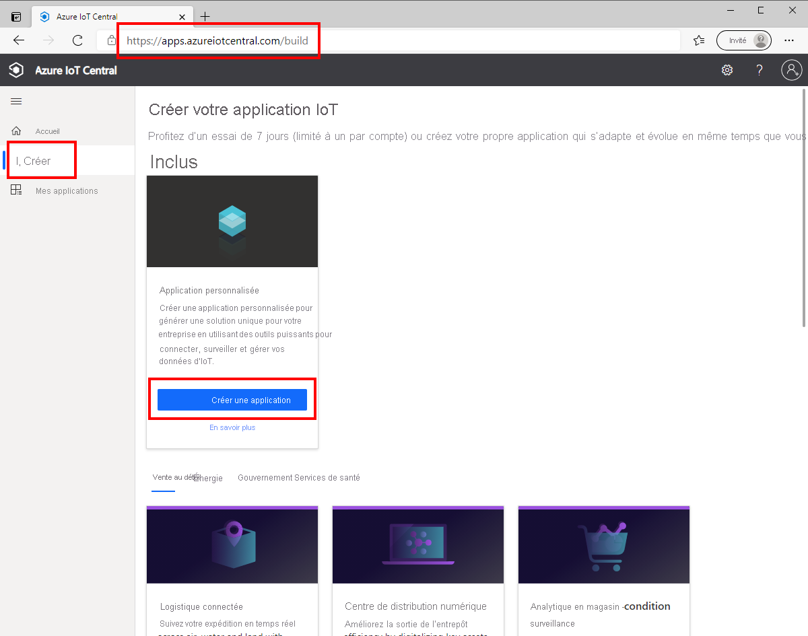
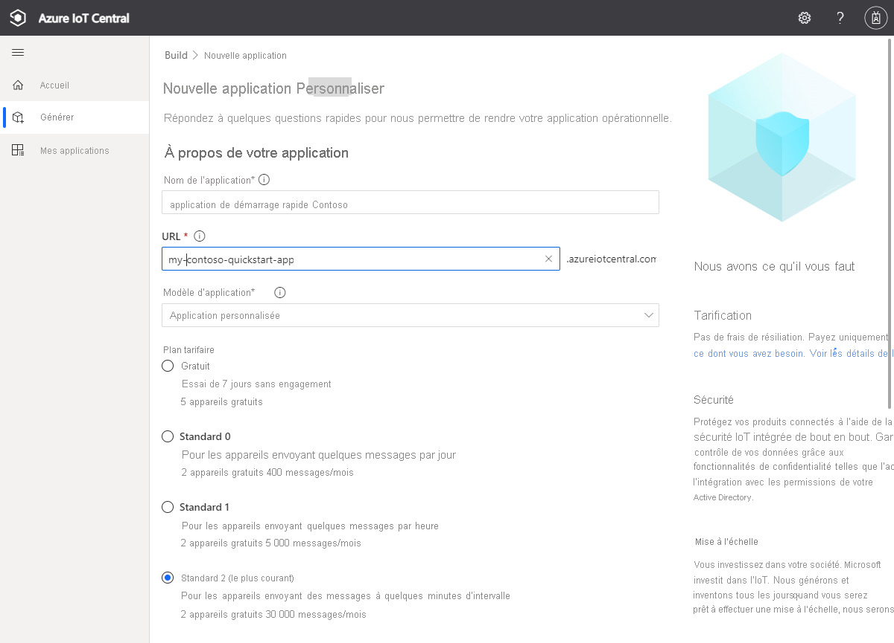
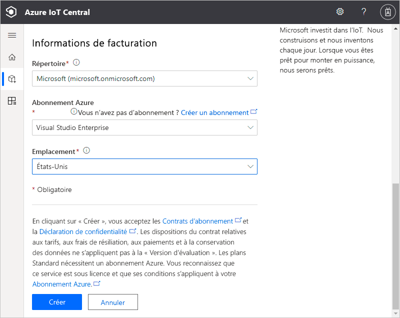
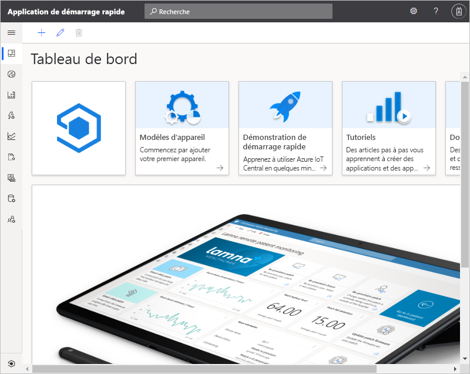

# Créer une application Azure IoT Central

Ce démarrage rapide vous montre comment créer une application Azure IoT Central.

## Créer une application

Accédez au site de [création d’applications Azure IoT Central](https://aka.ms/iotcentral). Ensuite, connectez-vous avec un compte Microsoft personnel, scolaire ou professionnel.

Vous pouvez créer une application à partir de la liste des modèles IoT Central sectoriels pour démarrer rapidement ou la créer en partant de zéro à l’aide d’un modèle **Applications personnalisées**. Dans ce guide de démarrage rapide, vous allez utiliser le modèle **Application personnalisée**.

Pour créer une application Azure IoT Central à partir du modèle **Application personnalisée** :

1. Accédez à la page **Générer** :

    

1. Choisissez **Applications personnalisées** et vérifiez que le modèle **Application personnalisée** est sélectionné.

1. Azure IoT Central suggère automatiquement un **nom d’application** basé sur le modèle d’application que vous avez sélectionné. Vous pouvez utiliser ce nom ou choisir un nom d’application convivial.

1. Azure IoT Central génère automatiquement une **URL d’application** unique, basée sur le nom de l’application. Vous utiliserez cette URL pour accéder à votre application. Si vous le souhaitez, remplacez ce préfixe d’URL par une chaîne plus facile à mémoriser.

    

    

    > [!NOTE]
    > Si vous avez choisi **Application personnalisée** dans la page précédente, vous voyez une liste déroulante **Modèle d’application**. La liste déroulante peut montrer d’autres modèles qui ont été mis à votre disposition par votre organisation. 

    >[!IMPORTANT]
    >Le modèle **Application personnalisée (héritée)** (V2) a été mis hors service, car toutes les fonctionnalités précédemment disponibles dans le modèle d’application héritée sont désormais disponibles dans le dernier modèle **Application personnalisée** (V3). 
    
1. Choisissez de créez cette application avec le plan tarifaire gratuit de 7 jours ou avec l’un des plans tarifaires standard :

    - Les applications que vous créez à partir du plan *gratuit* sont gratuites pendant sept jours et prennent en charge jusqu’à cinq appareils. Vous pouvez les convertir de sorte qu’elles utilisent un plan tarifaire standard à tout moment avant leur expiration.
    - Les applications que vous créez dans le cadre d’un plan *standard* sont facturées par appareil ; vous pouvez choisir un plan tarifaire **Standard 1** ou **Standard 2**, les deux premiers appareils étant gratuits. Découvrez plus en détail les plans tarifaires Gratuit et Standard dans la [page des prix Azure IoT Central](https://azure.microsoft.com/pricing/details/iot-central/). Si vous créez une application en utilisant un plan tarifaire Standard, vous devez sélectionner votre *Annuaire*, votre *Abonnement Azure* et votre *Emplacement* :
        - *Annuaire* correspond à l’annuaire Azure Active Directory dans lequel vous créez votre application. Un annuaire Azure Active Directory contient les identités des utilisateurs, les informations d’identification et d’autres informations de l’organisation. Si vous n’avez pas d’annuaire Azure Active Directory, il s’en crée un automatiquement quand vous créez un abonnement Azure.
        - Un *Abonnement Azure* vous permet de créer des instances de services Azure. IoT Central provisionne des ressources dans votre abonnement. Si vous n’avez pas d’abonnement Azure, vous pouvez en créer un gratuitement dans la [page d’inscription à Azure](https://aka.ms/createazuresubscription). Après avoir créé l’abonnement Azure, revenez à la page **Nouvelle application**. Votre nouvel abonnement apparaît maintenant dans la liste déroulante **Abonnement Azure**.
        - L’*Emplacement* correspond à la [zone géographique](https://azure.microsoft.com/global-infrastructure/geographies/) où vous souhaitez créer votre application. D'une façon générale, il est recommandé de choisir l'emplacement qui est physiquement le plus proche de vos appareils pour obtenir des performances optimales. Une fois que vous avez choisi un emplacement, vous ne pouvez pas par la suite déplacer votre application dans un autre emplacement.

1. Consultez les Conditions d’utilisation et sélectionnez **Créer** en bas de la page. Après quelques minutes, votre application IoT Central est prête à être utilisée :

    

## Étapes suivantes

En suivant ce guide de démarrage rapide, vous avez créé une application IoT Central. Voici l’étape suivante suggérée pour poursuivre votre apprentissage sur IoT Central :

> [!div class="nextstepaction"]
> [Ajouter un appareil simulé à votre application IoT Central](./quick-create-simulated-device.md)

Si vous êtes développeur d’appareils et que vous souhaitez vous immerger dans du code, l’étape suivante suggérée consiste à :
> [!div class="nextstepaction"]
> [Créer et connecter une application cliente à votre application Azure IoT Central](./tutorial-connect-device-nodejs.md)
