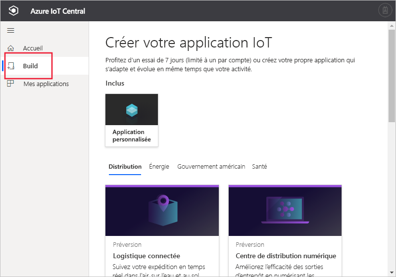

# Créer une application Azure IoT Central

[!INCLUDE [iot-central-original-pnp](../../../includes/iot-central-original-pnp-note.md)]

En tant que _générateur_, vous utilisez l’interface utilisateur d’Azure IoT Central pour définir votre application Microsoft Azure IoT Central. Ce guide de démarrage rapide vous montre comment créer une application Azure IoT Central qui contient un exemple de _modèle d’appareil_. L'application que vous créez n'utilise aucune fonctionnalité d'évaluation.

## Créer une application

Accédez au site web de [création d'applications Azure IoT Central](https://aka.ms/iotcentral). Ensuite, connectez-vous avec un compte Microsoft personnel, scolaire ou professionnel.

Pour commencer à créer une application Azure IoT Central sans fonctionnalité d'évaluation, sélectionnez **Créer**. Ce lien vous mène à la page **Créer votre application IoT**.

Sélectionnez ensuite **Application personnalisée**.

Pour créer une nouvelle application Azure IoT Central :

1. Azure IoT Central suggère automatiquement un nom d’application basé sur le modèle d’application que vous avez sélectionné. Vous pouvez accepter ce nom ou choisir un nom d’application convivial comme **Contoso IoT**. Azure IoT Central génère également une URL unique, basée sur le nom de l'application. Si vous le souhaitez, vous pouvez remplacer ce préfixe d’URL par une chaîne plus facile à mémoriser.

1. Sélectionnez le modèle d’**application héritée** qui n’utilise aucune fonctionnalité d’évaluation.

    | Modèle d’application | Description |
    | -------------------- | ----------- |
    | Application héritée   | Crée une application vide, que vous pouvez remplir avec vos propres modèles d’appareil et vos propres appareils. |

1. Choisissez un plan de paiement :
   - Les applications avec **évaluation gratuite de 7 jours** sont gratuites pendant sept jours avant leur expiration. Vous pouvez les convertir en **paiement à l’utilisation** à tout moment avant leur expiration. Si vous créez une application **d’évaluation**, entrez vos coordonnées et choisissez si vous souhaitez recevoir des informations et des conseils de la part de Microsoft.
   - Les applications avec **paiement à l’utilisation** sont facturées par appareil : les 5 premiers sont gratuits. Si vous créez une application avec **paiement à l’utilisation**, sélectionnez votre *Annuaire*, votre *Abonnement Azure* et votre *Emplacement* :
        - *Annuaire* correspond à l’annuaire Azure Active Directory (AD) servant à créer votre application. Il contient les identités des utilisateurs, les informations d’identification et d’autres informations de l’organisation. Si vous n’avez pas d’annuaire Azure AD, il s’en crée un automatiquement quand vous créez un abonnement Azure.
        - Un *Abonnement Azure* vous permet de créer des instances de services Azure. IoT Central provisionne des ressources dans votre abonnement. Si vous n’avez pas d’abonnement Azure, vous pouvez en créer un dans la [page d’inscription à Azure](https://aka.ms/createazuresubscription). Après avoir créé l’abonnement Azure, revenez à la page **Créer une application**. Votre nouvel abonnement apparaît dans la liste déroulante **Abonnement Azure**.
        - L’*Emplacement* correspond à la [zone géographique](https://azure.microsoft.com/global-infrastructure/geographies/) où vous souhaitez créer votre application. D'une façon générale, il est recommandé de choisir l'emplacement qui est physiquement le plus proche de vos appareils pour obtenir des performances optimales. Azure IoT Central est actuellement disponible aux **États-Unis**, en **Australie**, en **Asie-Pacifique** et en **Europe**.  Une fois que vous aurez choisi un emplacement, vous ne pourrez plus déplacer votre application vers un autre emplacement.

        Apprenez-en davantage au sujet de la tarification sur la [page de tarification d’Azure IoT Central](https://azure.microsoft.com/pricing/details/iot-central/).

1. Renseignez les autres informations concernant le plan de paiement que vous avez sélectionné à l’étape 1.

1. Au bas de la page, sélectionnez **Créer**.

## Étapes suivantes

En suivant ce guide de démarrage rapide, vous avez créé une application IoT Central. Voici la prochaine étape suggérée :

> [!div class="nextstepaction"]
> [Définir un nouveau type d’appareil dans votre application Azure IoT Central](./tutorial-define-device-type.md)
