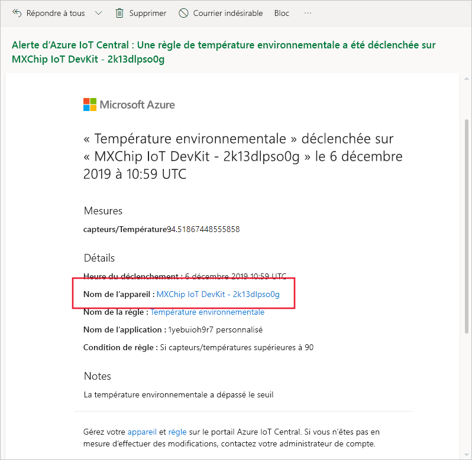
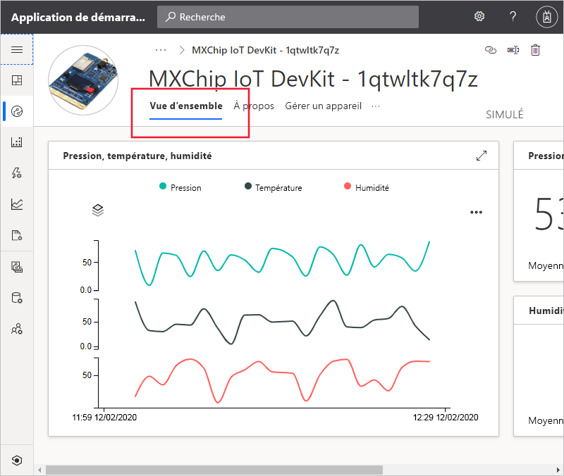
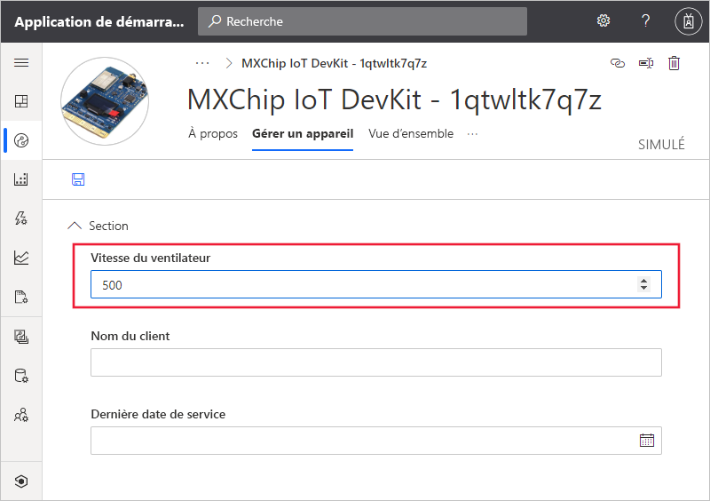

# Démarrage rapide : Utiliser Azure IoT Central pour surveiller vos appareils

*Cet article s’applique aux opérateurs, aux créateurs et aux administrateurs.*

Ce démarrage rapide vous explique comment, en tant qu'opérateur, vous pouvez utiliser votre application Microsoft Azure IoT Central pour surveiller vos appareils et modifier les paramètres.

## Conditions préalables requises

Avant de commencer, vous devez suivre les trois guides de démarrage rapide précédents : [Créer une application Azure IoT Central](./quick-deploy-iot-central.md), [Ajouter un appareil simulé à votre application IoT Central](./quick-create-pnp-device.md) et [Configurer des règles et des actions pour votre appareil](quick-configure-rules.md).

## Recevoir une notification

Azure IoT Central envoie des notifications sur les appareils sous forme de courriers électroniques. Le créateur a ajouté une règle pour qu’une notification soit envoyée quand la température au niveau d’un capteur d’appareil connecté dépasse un seuil. Consultez les courriers électroniques envoyés au compte choisi par le générateur pour recevoir des notifications.

Ouvrez le courrier électronique que vous avez reçu à la fin du guide de démarrage rapide [Configurer des règles et des actions pour votre appareil](quick-configure-rules.md). Dans l’e-mail, sélectionnez le lien vers l’appareil :

La vue **Vue d’ensemble** de l’appareil simulé que vous avez créé dans les démarrages rapides précédents s’ouvre dans votre navigateur :

## Analyser un problème

En tant qu’opérateur, vous pouvez consulter les informations sur l’appareil dans les vues **Vue d'ensemble**, **À propos** et **Commandes**. Le créateur a créé une vue **Gérer l’appareil** pour vous permettre de modifier les informations de l’appareil et définir ses propriétés.

Choisissez **Vue d'ensemble** pour consulter les informations relatives à l'appareil.

Le graphique sur le tableau de bord affiche un tracé de la température de l’appareil. Vous jugez que la température de l'appareil est trop élevée.

## Résoudre un problème

Pour apporter une modification à l’appareil, utilisez la page **Gérer l’appareil**.

Réglez la **vitesse du ventilateur** sur 500 pour refroidir l’appareil. Choisissez **Enregistrer** pour mettre à jour l’appareil. Quand l’appareil confirme la modification du paramètre, l’état de la propriété passe à **synchronisé** :

## Étapes suivantes

Dans ce démarrage rapide, vous avez appris comment :

* Recevoir une notification
* Analyser un problème
* Résoudre un problème

Maintenant que vous savez comment superviser votre appareil, vous pouvez passer à l’étape suivante :

> [!div class="nextstepaction"]
> [Créer et gérer un modèle d'appareil](howto-set-up-template.md).
