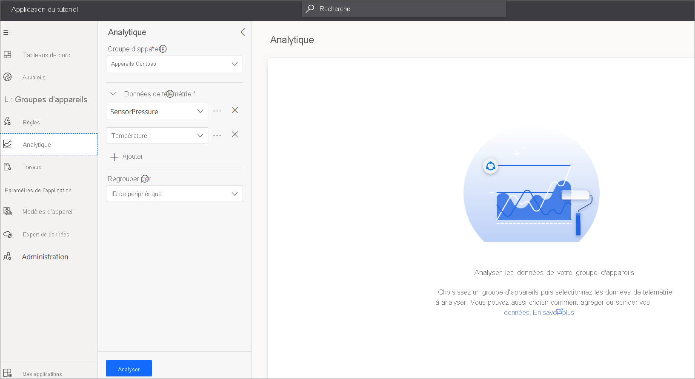

# Tutoriel : Utiliser un groupe d’appareils pour analyser les données de télémétrie des appareils

Cet article décrit comment utiliser des groupes d’appareils en tant qu’opérateur afin d’analyser la télémétrie des appareils dans votre application Azure IoT Central.

Un groupe d’appareils est une liste d’appareils qui sont regroupés, car ils correspondent à certains critères spécifiés. Les groupes d’appareils vous permettent de gérer, de visualiser et d’analyser des appareils à grande échelle en regroupant les appareils dans des groupes logiques plus petits. Par exemple, vous pouvez créer un groupe d’appareils répertoriant tous les appareils de climatisation à Seattle pour permettre à un technicien de rechercher les appareils dont il est responsable.

Dans ce tutoriel, vous allez apprendre à :

> [!div class="checklist"]
> * Créer un groupe d’appareils
> * Utiliser un groupe d'appareils pour analyser les données de télémétrie des appareils

## Prérequis

Avant de commencer, vous devez suivre les deux guides de démarrage rapide [Créer une application Azure IoT Central](./quick-deploy-iot-central.md) et [Ajouter un appareil simulé à votre application IoT Central](./quick-create-simulated-device.md) afin de créer le modèle d'appareil **MXChip IoT DevKit** à utiliser.

## Créer des appareils simulés

Avant de créer un groupe d'appareils, ajoutez au moins cinq appareils simulés à partir du modèle de d'appareil **MXChip IoT DevKit** à utiliser dans ce tutoriel :

Pour quatre des capteurs simulés, utilisez la vue **Gérer l'appareil** afin de définir le nom du client sur *Contoso* :

## Créer un groupe d’appareils

Pour créer un groupe d’appareils :

1. Choisissez **Groupes d'appareils** dans le volet gauche.

1. Sélectionnez **+**  :

    

1. Donnez le nom *Appareils Contoso* à votre groupe d'appareils. Vous pouvez également ajouter une description. Un groupe d’appareils peut contenir seulement des appareils d’un même modèle d’appareil. Choisissez le modèle d'appareil **MXChip IoT DevKit** à utiliser pour ce groupe.

1. Pour personnaliser le groupe d'appareils afin de n'y inclure que les appareils appartenant à **Contoso**, sélectionnez **+ Filtre**. Sélectionnez la propriété **Nom du client**, l'opérateur de comparaison **Égal** et la valeur **Contoso**. Vous pouvez ajouter plusieurs filtres, et les appareils qui répondent à **tous** les critères sont placés dans le groupe d'appareils. Le groupe d'appareils que vous créez est accessible à toutes les personnes qui ont accès à l'application. Celles-ci peuvent donc voir, modifier ou supprimer le groupe d'appareils :

    

    > [!TIP]
    > Le groupe d’appareils est une requête dynamique. Chaque fois que vous visualisez la liste des appareils, des appareils différents peuvent figurer dans la liste. La liste varie selon les appareils qui répondent actuellement aux critères de la requête.

1. Choisissez **Enregistrer**.

> [!NOTE]
> Pour les appareils Azure IoT Edge, sélectionnez les modèles Azure IoT Edge pour créer un groupe d’appareils.

## Analytics

Vous pouvez utiliser **Analytics** avec un groupe d’appareils pour analyser les données de télémétrie des appareils dans le groupe. Par exemple, vous pouvez tracer la température moyenne signalée par tous les capteurs environnementaux de Contoso.

Pour analyser les données de télémétrie d’un groupe d’appareils :

1. Choisissez **Analytics** dans le volet gauche.

1. Sélectionnez le groupe d’appareils intitulé **Appareils Contoso** que vous avez créé. Ajoutez ensuite les types de données de télémétrie **Température** et **Humidité** :

    

    Utilisez les icônes en forme de roue dentée en regard des types données de télémétrie pour sélectionner un type d’agrégation. La valeur par défaut est **Moyenne**. Utilisez **Fractionner par** pour modifier la façon dont les données agrégées sont affichées. Par exemple, si vous sélectionnez **Analyser** alors que vous fractionnez par ID d’appareil, un tracé s’affiche pour chaque appareil.

1. Sélectionnez **Analyser** pour afficher les valeurs de télémétrie moyennes :

    

    Vous pouvez personnaliser l’affichage, modifier la période affichée et exporter les données.

## Étapes suivantes

Maintenant que vous avez appris à utiliser des groupes d’appareils dans votre application Azure IoT Central, voici l’étape suivante suggérée :

> [!div class="nextstepaction"]
> [Guide pratique pour créer des règles de télémétrie](tutorial-create-telemetry-rules.md)
