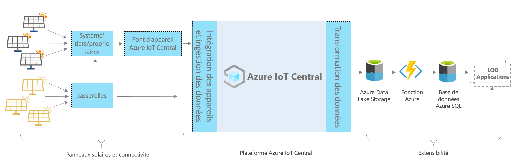

# Azure IoT Central - Architecture d’application pour panneau solaire

Cet article fournit une vue d’ensemble de l’architecture du modèle d’application de suivi de panneau solaire. Le diagramme ci-dessous illustre une architecture couramment utilisée pour l’application de panneau solaire sur Azure à l’aide de la plateforme IoT Central.

> [!div class="mx-imgBorder"]
> 

Cette architecture est constituée des composants suivants. Certaines applications peuvent ne pas avoir besoin de tous les composants listés ici.

## Panneaux solaires et connectivité 

Les panneaux solaires sont l’une des principales sources d’énergie renouvelable. Selon le type de panneau solaire et sa configuration, vous pouvez le connecter via des passerelles ou d’autres appareils intermédiaires et systèmes propriétaires. Vous pouvez être amené à créer un pont d’appareil IoT Central pour connecter les appareils qui ne peuvent pas être connectés directement. Le pont IoT Central est une solution open source ; vous pouvez trouver des informations complètes à son sujet [ici](https://docs.microsoft.com/azure/iot-central/core/howto-build-iotc-device-bridge). 

## Plateforme IoT Central
Azure IoT Central est une plateforme qui simplifie la création de votre solution IoT et contribue à réduire la charge et les coûts liés à la gestion, aux opérations et au développement IoT. Avec IoT Central, vous pouvez facilement connecter, surveiller et gérer facilement vos ressources Internet des objets (IoT) à grande échelle. Une fois que vous avez connecté vos panneaux solaires à IoT Central, le modèle d’application utilise des fonctionnalités intégrées, comme des modèles d’appareil, des commandes et des tableaux de bord. Le modèle d’application utilise également le stockage IoT Central pour les scénarios de chemin à chaud tels que la surveillance, l’analyse, les règles et la visualisation des données de mesure en temps quasi-réel.

## Options d’extensibilité pour créer avec IoT Central
La plateforme IoT Central fournit deux options d’extensibilité : L’exportation de données continue (CDE) et des API. Les clients et partenaires peuvent choisir entre ces options pour personnaliser leurs solutions selon leurs besoins spécifiques. Par exemple, un de nos partenaires a configuré CDE avec Azure Data Lake Storage (ADLS). Il utilise ADLS pour la conservation à long terme des données et d’autres scénarios de stockage à froid, tels que le traitement par lots, l’audit et la création de rapports. 

## Étapes suivantes

* Maintenant que nous vous avons présenté l’architecture, vous pouvez [créer une application de panneau solaire gratuitement](https://apps.azureiotcentral.com/build/new/solar-panel-monitoring)
* Pour plus d’informations sur IoT Central, consultez la [vue d’ensemble d’IoT Central](https://docs.microsoft.com/azure/iot-central/)