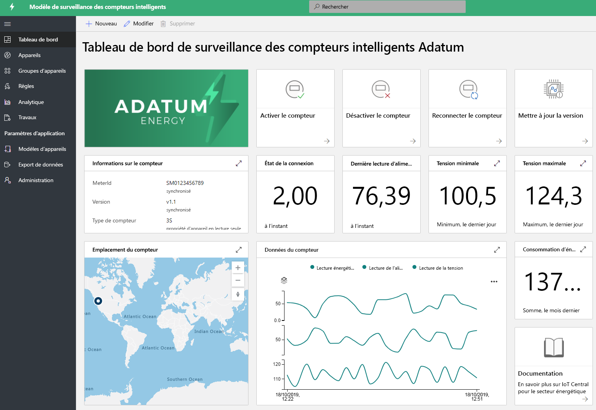
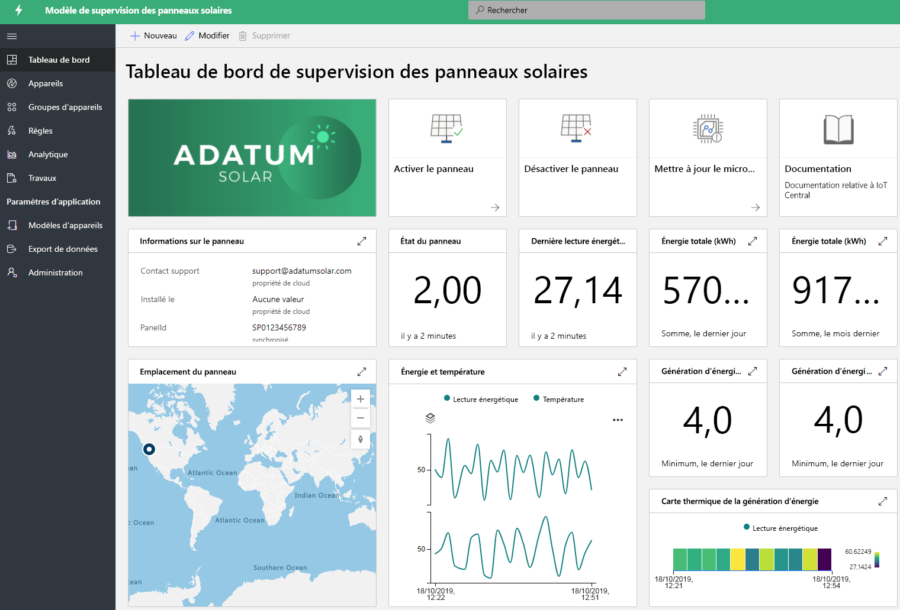

# Créer des solutions énergétiques avec IoT Central 

Les compteurs intelligents et les panneaux solaires jouent un rôle important dans la transformation du secteur de l'énergie. Les compteurs intelligents offrent davantage de contrôles et d'insights en temps réel sur la consommation d'énergie, et la croissance des panneaux solaires stimule la production d'énergies renouvelables. Les applications de suivi des compteurs intelligents et des panneaux solaires sont des exemples de modèles permettant d'illustrer les différentes fonctionnalités. Les partenaires peuvent utiliser ces modèles pour créer des solutions énergétiques avec IoT Central afin de répondre à leurs besoins spécifiques. Le déploiement et l'utilisation de ces applications ne requièrent aucun nouveau code et n'entraînent aucun coût supplémentaire. Découvrez-en plus sur les modèles d'applications énergétiques et leurs fonctionnalités.

## Qu'est-ce que l'application de suivi des compteurs intelligents ?
 Les compteurs intelligents permettent d'automatiser la facturation et offrent des fonctionnalités avancées, telles que les relevés en temps réel et la communication bidirectionnelle. Le modèle d'application de suivi des compteurs intelligents permet aux fournisseurs d'énergie et aux partenaires de suivre l'état et les données des compteurs intelligents, et de définir des alarmes et des notifications. Il propose des exemples de commandes, pour déconnecter les compteurs et mettre à jour les logiciels par exemple. Les données des compteurs peuvent être configurées pour être transférées vers d'autres applications métier et pour développer des solutions personnalisées. 

Fonctionnalités clés de l’application : 

* Modèle d'exemple de compteur 
* Informations sur le compteur et état en temps réel 
* Relevés des compteurs (énergie, puissance et tension, par exemple)
* Exemples de commandes de compteur 
* Visualisations et tableaux de bord intégrés
* Extensibilité pour le développement de solutions personnalisées

Vous pouvez essayer [gratuitement l'application de suivi des compteurs intelligents](https://apps.azureiotcentral.com/build/new/smart-meter-monitoring) sans abonnement Azure et sans engagement.

Une fois l'application déployée, les données simulées des compteurs apparaissent sur le tableau de bord, comme illustré par la figure ci-dessous. Ce modèle est un exemple d'application que vous pouvez facilement étendre et personnaliser pour vos cas d'usage spécifiques.

> [!div class="mx-imgBorder"]
> 

## Qu'est-ce que l'application de suivi des panneaux solaires ?
L'application de suivi des panneaux solaires permet aux fournisseurs d'énergie et aux partenaires de suivre quasiment en temps la production d'énergie et l'état de connexion des panneaux solaires. Elle peut envoyer des notifications en fonction de critères de seuil définis. Elle propose des exemples de commandes, pour mettre à jour le microprogramme et pour définir d'autres propriétés par exemple. Les données des panneaux solaires peuvent être configurées pour être transférées vers d'autres applications métier et pour développer des solutions personnalisées. 

Fonctionnalités clés de l’application : 

* Modèle d'exemple de panneau solaire 
* Informations sur le panneau solaire et état en temps réel
* Production d'énergie solaire et autres relevés
* Exemples de commandes et de contrôles
* Visualisations et tableaux de bord intégrés
* Extensibilité pour le développement de solutions personnalisées

Vous pouvez essayer [gratuitement l'application de suivi des panneaux solaires](https://apps.azureiotcentral.com/build/new/solar-panel-monitoring) sans abonnement Azure et sans engagement.

Une fois l'application déployée, les données simulées des panneaux solaires apparaissent au bout d'une à deux minutes, comme illustré sur le tableau de bord ci-dessous. Ce modèle est un exemple d'application que vous pouvez facilement étendre et personnaliser pour vos cas d'usage spécifiques. 

> [!div class="mx-imgBorder"]
> 

## Étapes suivantes
Pour commencer à créer une solution énergétique :
* Créer gratuitement des modèles d'application : [application de suivi de compteurs intelligents](https://apps.azureiotcentral.com/build/new/smart-meter-monitoring), [application de suivi de panneaux solaires](https://apps.azureiotcentral.com/build/new/solar-panel-monitoring)
* En savoir plus sur les [concepts d'application de suivi des compteurs intelligents](https://docs.microsoft.com/azure/iot-central/energy/concept-iot-central-smart-meter-app)
* En savoir plus sur les [concepts d'application de suivi des panneaux solaires](https://docs.microsoft.com/azure/iot-central/energy/concept-iot-central-solar-panel-app)
* En savoir plus sur la [plateforme IoT Central](https://docs.microsoft.com/azure/iot-central/)
