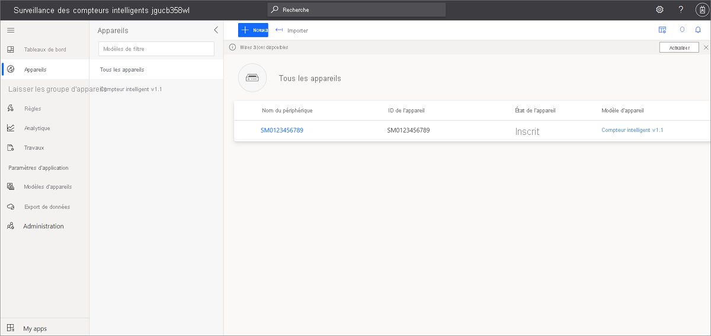
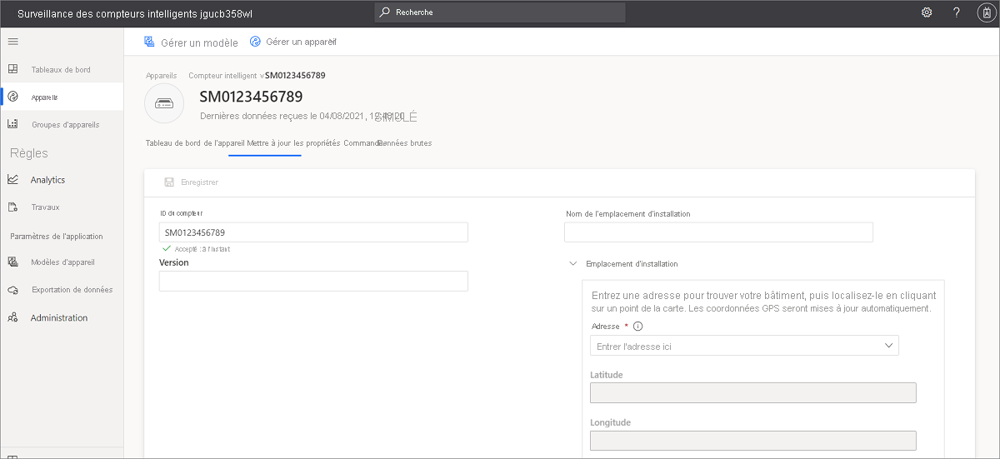

# Tutoriel : Créer et découvrir pas à pas le modèle d’application de surveillance de compteur intelligente 

Ce didacticiel vous guide tout au long du processus de création de l’application de surveillance de compteur intelligente, qui comprend un exemple de modèle d’appareil avec des données simulées. Ce didacticiel vous apprendra à effectuer les opérations suivantes :

> [!div class="checklist"]
> * Créer l’application de compteur intelligent gratuitement
> * Découvrir l'application pas à pas
> * Nettoyer les ressources

Si vous n’avez pas d’abonnement, [créez un compte d’essai gratuit](https://azure.microsoft.com/free)

## Prérequis
- None
- Pour l'essai, un abonnement Azure est recommandé, mais pas obligatoire

## Créer une application intelligente de suivi de compteurs 

Vous pouvez créer cette application en trois étapes simples :

1. Ouvrez la [page d'accueil d'Azure IoT Central](https://apps.azureiotcentral.com), puis cliquez sur **Générer** pour créer une application. 

2. Sélectionnez l’onglet **Énergie**, puis, sous la vignette d’application **Surveillance de compteur intelligente**, cliquez sur **Créer une application**.

    > [!div class="mx-imgBorder"]
    > 
    

3. La commande **Créer une application** ouvre le formulaire **Nouvelle application**. Entrez les détails demandés, comme illustré dans la figure ci-dessous :
    * **Nom de l'application** : choisissez un nom pour votre application IoT Central. 
    * **URL** : choisissez une URL IoT Central. La plateforme vérifie son unicité.
    * **Essai gratuit de 7 jours** : si vous disposez déjà d'un abonnement Azure, le paramètre par défaut est recommandé. Si vous n’avez pas d’abonnement Azure, commencez avec l’évaluation gratuite.
    * **Informations de facturation** : l'application proprement dite est gratuite. Les champs Annuaire, Abonnement Azure et Région doivent obligatoirement être renseignés pour l'approvisionnement des ressources de votre application.
    * Cliquez sur bouton **Créer** en bas de la page pour créer votre application. L'opération prend environ une minute.

        

        

### Vérifier l'application et les données simulées

L’application de compteur intelligente nouvellement créée vous appartient. Vous pouvez la modifier à tout moment. Avant de modifier l’application, vérifions qu’elle est déployée et qu’elle fonctionne comme prévu.

Pour vérifier la création de l'application et la simulation des données, accédez au **Tableau de bord**. Si vous voyez les vignettes et les données qu'elles contiennent, cela signifie que le déploiement de votre application a abouti. Soyez patient, car la simulation des données peut prendre 1 à 2 minutes. 

## Découvrir l'application pas à pas
Une fois le modèle d’application correctement déployé, il comprend un exemple d’appareil de compteur intelligent, un modèle d’appareil et un tableau de bord. 

Adatum est un fournisseur d’énergie fictif qui surveille et gère des compteurs intelligents. Le tableau de bord de surveillance de compteur intelligente, affiche des propriétés, des données et des exemples de commandes. Il permet aux opérateurs et aux équipes de support technique d'effectuer de manière proactive les activités suivantes avant l'apparition d'incidents : 
* Examiner les dernières informations du compteur et l’emplacement où celui-ci est installé sur la carte
* Vérifier de manière proactive le réseau du compteur et son état de la connexion 
* Surveiller les mesures de tensions minimale et maximale pour vérifier l’intégrité du réseau 
* Examiner les tendances en termes d’énergie, de puissance et de tension pour détecter d’éventuelles anomalies 
* Suivre la consommation énergétique totale à des fins de planification et de facturation
* Opérations de commande et de contrôle telles que la reconnexion du compteur et la mise à jour de la version du microprogramme. Dans le modèle, les boutons de commande affichent les fonctionnalités possibles et n'envoient pas de commandes réelles. 

> [!div class="mx-imgBorder"]
> 

### Appareils
L’application est fournie avec un exemple d’appareil de compteur intelligent. Vous pouvez consulter les détails de celui-ci en cliquant sur l'onglet **Appareils**.

> [!div class="mx-imgBorder"]
> 

Cliquez sur le lien de l’exemple d’appareil **SM0123456789** pour afficher les détails de celui-ci. Vous pouvez mettre à jour les propriétés accessibles en écriture de l’appareil dans la page **Mettre à jour les propriétés**, et visualiser les valeurs mises à jour sur le tableau de bord.

> [!div class="mx-imgBorder"]
> 

### Modèle d'appareil
Cliquez sur l’onglet **Modèles d’appareils** pour afficher le modèle d’appareil de compteur intelligent. Le modèle dispose d'une interface prédéfinie pour les données, les propriétés, les commandes et les affichages.

> [!div class="mx-imgBorder"]
> 

## Nettoyer les ressources
Si vous décidez de ne pas continuer à utiliser cette application, supprimez-la en procédant comme suit :

1. Dans le volet gauche, ouvrez l'onglet Administration.
2. Sélectionnez Paramètres de l'application, puis cliquez sur le bouton Supprimer en bas de la page. 

    > [!div class="mx-imgBorder"]
    > 

## Étapes suivantes

Découvrir l’architecture d’application pour compteurs intelligents en consultant 
> [!div class="nextstepaction"]
> [l’article de présentation des concepts](./concept-iot-central-smart-meter-app.md)
* Créer gratuitement des modèles d’application de compteur intelligente : [application de compteur intelligente](https://apps.azureiotcentral.com/build/new/smart-meter-monitoring)
* En savoir plus sur IoT Central en consultant la [présentation d'IoT Central](../index.yml)