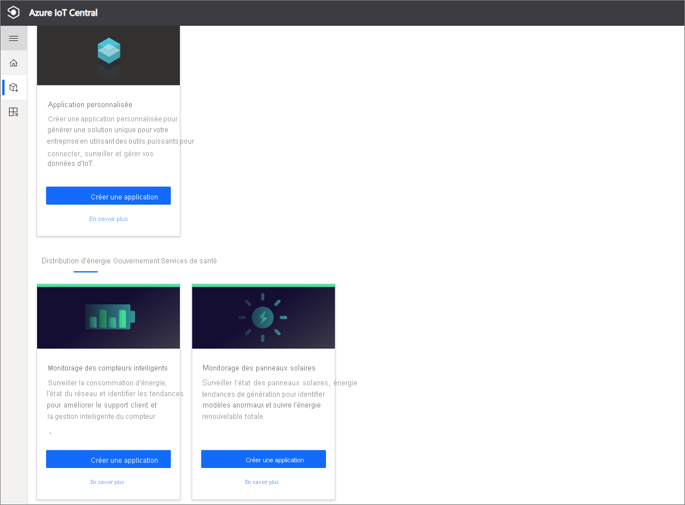
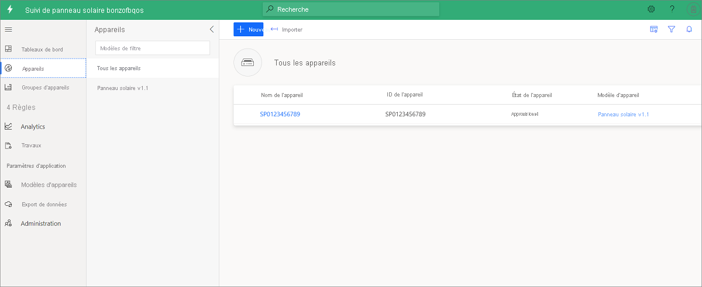

# Tutoriel : Créer et découvrir pas à pas le modèle d'application de suivi des panneaux solaires 

Ce didacticiel vous guide tout au long du processus de création de l'application de suivi des panneaux solaires, qui comprend un exemple de modèle d'appareil avec des données simulées. Ce didacticiel vous apprendra à effectuer les opérations suivantes :

> [!div class="checklist"]
> * Créer gratuitement l'application de suivi des panneaux solaires
> * Découvrir l'application pas à pas
> * Nettoyer les ressources

Si vous n’avez pas d’abonnement, [créez un compte d’essai gratuit](https://azure.microsoft.com/free)

## Prérequis
* None
* Pour l'essai, un abonnement Azure est recommandé, mais pas obligatoire

## Créer une application de suivi de panneaux solaires 

Vous pouvez créer cette application en trois étapes simples :

1. Ouvrez la [page d'accueil d'Azure IoT Central](https://apps.azureiotcentral.com), puis cliquez sur **Générer** pour créer une application. 

1. Sélectionnez l'onglet **Énergie**, puis, sous la vignette d'application **Suivi des panneaux solaires**, cliquez sur **Créer une application**. 

    > [!div class="mx-imgBorder"]
    > 
  
1. La commande **Créer une application** ouvre le formulaire **Nouvelle application**. Entrez les détails demandés, comme illustré dans la figure ci-dessous :
    * **Nom de l'application** : choisissez un nom pour votre application IoT Central. 
    * **URL** : choisissez une URL IoT Central. La plateforme vérifie son unicité.
    * **Essai gratuit de 7 jours** : si vous disposez déjà d'un abonnement Azure, le paramètre par défaut est recommandé. Si vous n’avez pas d’abonnement Azure, commencez avec l’évaluation gratuite.
    * **Informations de facturation** : l'application proprement dite est gratuite. Les champs Annuaire, Abonnement Azure et Région doivent obligatoirement être renseignés pour l'approvisionnement des ressources de votre application.
    * Cliquez sur bouton **Créer** en bas de la page pour créer votre application. L'opération prend environ une minute.
        
        
        

### Vérifier l'application et les données simulées

L'application pour panneaux solaires qui vient d'être créée vous appartient. Vous pouvez donc la modifier à tout moment. Avant de modifier l’application, vérifions qu’elle est déployée et qu’elle fonctionne comme prévu.

Pour vérifier la création de l'application et la simulation des données, accédez au **Tableau de bord**. Si vous voyez les vignettes et les données qu'elles contiennent, cela signifie que le déploiement de votre application a abouti. Soyez patient, car la simulation des données peut prendre 1 à 2 minutes. 

## Découvrir l'application pas à pas
Une fois déployé, le modèle d'application comprend un exemple de compteur intelligent, un modèle d'appareil et un tableau de bord.

Adatum est un fournisseur d'énergie fictif qui assure le suivi et la gestion de panneaux solaires. Le tableau de bord de suivi des panneaux solaires contient des propriétés, des données et des exemples de commandes. Il permet aux opérateurs et aux équipes de support technique d'effectuer de manière proactive les activités suivantes avant l'apparition d'incidents :
* Consulter les dernières informations relatives à un panneau et l'emplacement où celui-ci est installé sur la carte
* Vérifier de manière proactive l'état du panneau et l'état de la connexion
* Examiner les tendances en matière de production d'énergie et de température pour détecter d'éventuelles anomalies
* Suivre la production totale d'énergie à des fins de planification et de facturation
* Opérations de commande et de contrôle telles que l'activation du panneau et la mise à jour de la version du microprogramme. Dans le modèle, les boutons de commande affichent les fonctionnalités possibles et n'envoient pas de commandes réelles.

> [!div class="mx-imgBorder"]
> 

### Appareils
L'application est fournie avec un exemple de panneau solaire. Vous pouvez consulter les détails de celui-ci en cliquant sur l'onglet **Appareils**.

> [!div class="mx-imgBorder"]
> 

Cliquez sur le lien de l'exemple d'appareil **SP0123456789** pour afficher les détails de celui-ci. Sur la page **Mettre à jour les propriétés**, vous pouvez mettre à jour les propriétés accessibles en écriture de l'appareil et visualiser les valeurs mises à jour sur le tableau de bord. 

> [!div class="mx-imgBorder"]
> 

### Modèle d'appareil
Cliquez sur l'onglet **Modèles d'appareils** pour afficher le modèle de panneau solaire. Le modèle dispose d'une interface prédéfinie pour les données, les propriétés, les commandes et les affichages.

> [!div class="mx-imgBorder"]
> 

## Nettoyer les ressources
Si vous décidez de ne pas continuer à utiliser cette application, supprimez-la en procédant comme suit :

1. Dans le volet gauche, ouvrez l'onglet Administration.
1. Sélectionnez Paramètres de l'application, puis cliquez sur le bouton Supprimer en bas de la page. 

    > [!div class="mx-imgBorder"]
    > 

## Étapes suivantes
* Découvrir l’architecture d’application pour panneaux solaires en consultant 
> [!div class="nextstepaction"]
> [l’article de présentation des concepts](./concept-iot-central-solar-panel-app.md)
* Créer gratuitement des modèles d'application pour panneaux solaires : [application pour panneaux solaires](https://apps.azureiotcentral.com/build/new/solar-panel-monitoring)
* En savoir plus sur IoT Central en consultant la [présentation d'IoT Central](../index.yml)
