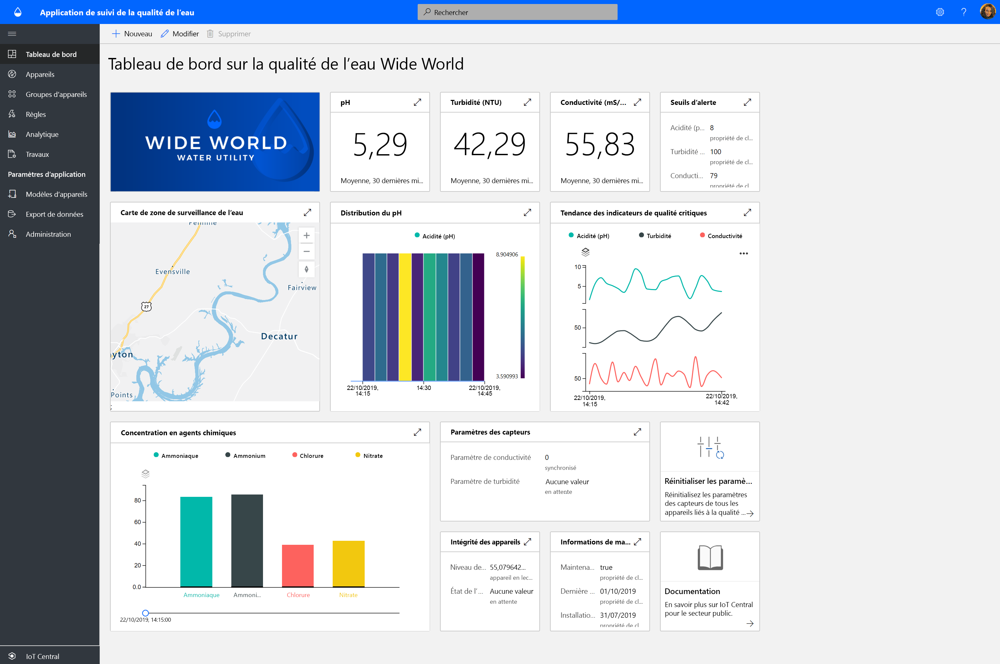
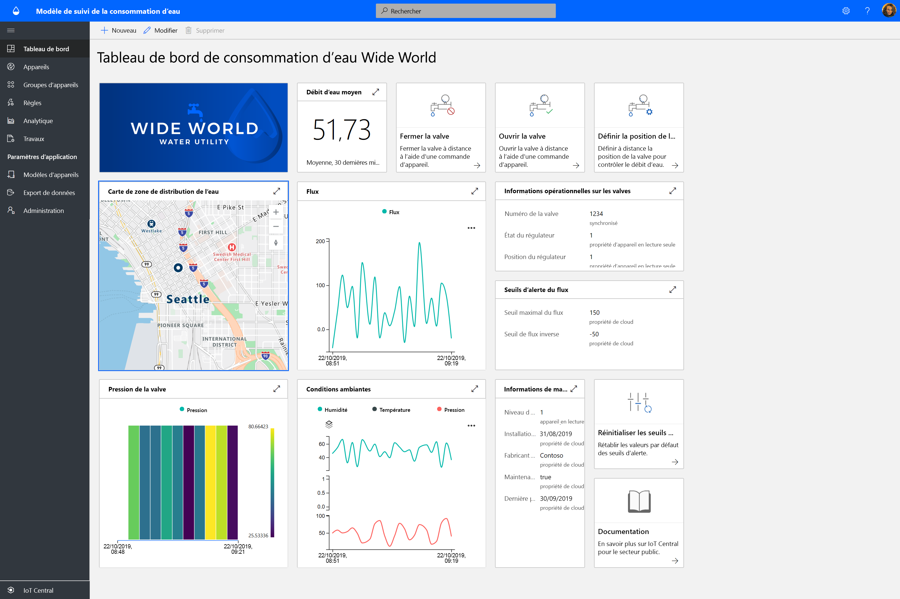
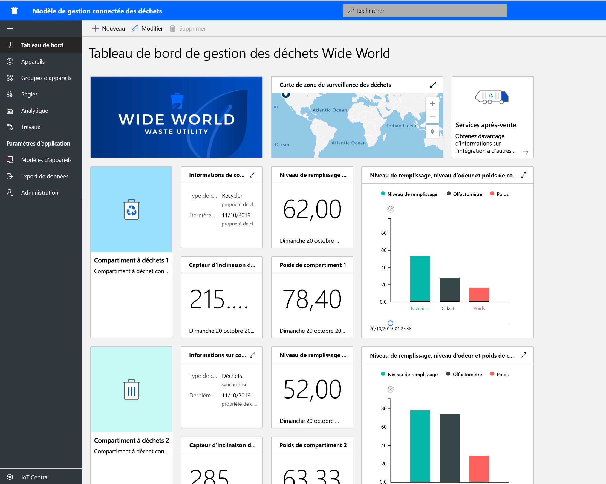

# Présentation des solutions IoT Central pour le secteur public

Lancez-vous dans la génération de solutions de ville intelligente à l’aide de modèles d’application Azure IoT Central. Commencez dès maintenant avec les modèles **Suivi de la qualité de l’eau**, **Suivi de la consommation d’eau** et **Gestion connectée des déchets**.

## Qu’est-ce que le modèle d’application Suivi de la qualité de l’eau ?   

La surveillance de la qualité de l’eau repose sur des techniques d’échantillonnage manuelles et l’analyse en laboratoire de terrain, ce qui est laborieux et coûteux. La supervision à distance de la qualité de l’eau en temps réel permet de gérer les problèmes de qualité de l’eau avant que des citoyens soient affectés. De plus, avec l’analytique avancée, les distributeurs d’eau et les agences environnementales peuvent réagir à des avertissements précoces concernant des problèmes potentiels de qualité de l’eau et planifier le traitement de l’eau.  

L’application Suivi de la qualité de l’eau est un modèle d’application IoT Central destiné à vous aider à démarrer rapidement le développement de votre solution IoT et à permettre aux distributeurs d’eau de surveiller numériquement la qualité de l’eau dans des villes intelligentes. 

Le modèle d’application se compose des éléments suivants :
* Exemples de tableaux de bord d’opérateur
* Exemples de modèles d’appareil de surveillance de la qualité de l’eau
* Appareils de surveillance de la qualité de l’eau simulés
* Règles et travaux préconfigurés
* Personnalisation à l’aide d’un étiquetage blanc 

Prise en main avec le [didacticiel d’application Suivi de la qualité de l’eau](./tutorial-water-quality-monitoring.md).

## Qu’est-ce que le modèle d’application Suivi de la consommation d’eau ? 

Le suivi traditionnel de la consommation d’eau repose sur les distributeurs d’eau qui relèvent manuellement les compteurs de consommation d’eau sur le terrain. De plus en plus de villes remplacent les compteurs traditionnels par des compteurs intelligents avancés permettant une supervision à distance de la consommation, ainsi qu’un contrôle à distance des vannes pour maîtriser le débit d’eau. Le suivi de la consommation d’eau combiné avec un message de commentaire numérique adressé au consommateur peut contribuer à sensibiliser à la consommation d’eau et à la réduction de celle-ci. 

L’application Suivi de la consommation d’eau est un modèle d’application IoT Central destiné à vous aider à démarrer rapidement le développement de votre solution IoT et à permettre aux distributeurs d’eau et aux villes de surveiller et contrôler à distance le début d’eau afin de réduire la consommation. 

  

Le modèle d’application Suivi de la consommation d’eau est constitué des composants préconfigurés suivants :
* Exemples de tableaux de bord d’opérateur
* Exemples de modèles d’appareil de surveillance de la qualité de l’eau
* Appareils de surveillance de la qualité de l’eau simulés
* Règles et travaux préconfigurés
* Personnalisation à l’aide d’un étiquetage blanc 

 Prise en main avec le [didacticiel d’application Suivi de la consommation d’eau](./tutorial-water-consumption-monitoring.md).

## Qu’est-ce que le modèle d’application Gestion connectée des déchets ? 

L’application Gestion connectée des déchets est un modèle d’application IoT Central destiné à vous aider à démarrer rapidement le développement de votre solution IoT afin de permettre aux villes intelligentes d’effectuer une surveillance à distance afin d’optimiser la collecte des déchets. 

 

Le modèle d’application Gestion connectée des déchets est constitué de composants préconfigurés :
* Exemples de tableaux de bord d’opérateur
* Exemples de modèles de conteneur de déchets connectés
* Conteneur de déchets connectés simulés
* Règles et travaux préconfigurés
* Personnalisation à l’aide d’un étiquetage blanc 

Prise en main avec le [didacticiel d’application Gestion connectée des déchets](./tutorial-connected-waste-management.md).

## Étapes suivantes

* Découvrez les [concepts de Suivi de la qualité de l’eau](./concepts-waterqualitymonitoring-architecture.md)
* Découvrez les [concepts de Suivi de la consommation d’eau](./concepts-waterconsumptionmonitoring-architecture.md)
* Découvrez les [concepts de Gestion connectée des déchets](./concepts-connectedwastemanagement-architecture.md)  
