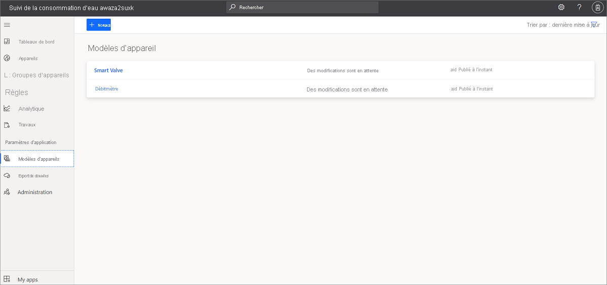

# Tutoriel : déployer et parcourir l’application d’analyse de la consommation d’eau

Utilisez le modèle d’application d’*analyse de la consommation d’eau* IOT Central et les instructions de cet article pour développer une solution d’analyse de la consommation d’eau de bout en bout.

### Appareils et connectivité

Les solutions de gestion de l’eau utilisent des systèmes d’eau intelligents tels que des débitmètres, des analyses de la qualité de l’eau, des vannes intelligentes, des détecteurs de fuite.

Les appareils des solutions d’eau intelligentes peuvent se connecter via des réseaux longue distance à faible puissance (LPWAN) ou via un opérateur réseau tiers. Pour ces types d’appareils, utilisez [Azure IoT Central Device Bridge](../core/howto-build-iotc-device-bridge.md) pour envoyer les données de votre appareil à votre application IoT dans Azure IoT Central. Vous pouvez également utiliser des passerelles d’appareil qui sont compatibles IP et capables de se connecter directement à IoT Central.

### IoT Central

Azure IoT Central est une plateforme d’applications IoT qui vous permet de générer et de déployer rapidement une solution IoT. Vous pouvez personnaliser et intégrer votre solution à des services tiers.

Lorsque vous connectez vos systèmes d’eau intelligents à IoT Central, l’application permet de contrôler les appareils, d’effectuer le suivi et de déclencher des alertes, d’accéder à l’interface utilisateur à laquelle est intégré RBAC et d’accéder aux tableaux de bord configurables, ainsi qu’aux options d’extensibilité.

### Extensibilité et intégrations

Vous pouvez étendre votre application IoT dans IoT Central et si vous le souhaitez :

* Transformer et intégrer vos données IoT en vue d’une analyse avancée, par exemple en effectuant l'apprentissage de modèles Machine Learning via l’exportation continue de données à partir d’une application IoT Central.
* Automatiser des workflows dans d’autres systèmes en déclenchant des actions via Power Automate ou des webhooks à partir d’une application IoT Central.
* Accéder programmatiquement à votre application IoT dans IoT Central via des API IoT Central.

### Applications métier

Vous pouvez utiliser des données IoT pour alimenter diverses applications métier au sein d’une solution pour l’eau. Dans votre [application d’analyse de la consommation d’eau IoT Central](tutorial-water-consumption-monitoring.md), vous pouvez configurer des règles et des actions et les définir pour créer des alertes dans le [Service de terrain connecté](/dynamics365/field-service/connected-field-service). Configurez Power Automate dans les règles d’IoT Central pour automatiser les workflows entre des applications et des services. Par ailleurs, selon les activités de service dans le service de terrain connecté, des informations peuvent être renvoyées à Azure IoT Central.

Dans ce tutoriel, vous allez apprendre à :

> [!div class="checklist"]

> * Utiliser le modèle Azure IoT Central de suivi de la consommation d’eau pour créer votre application de suivi de la consommation d’eau
> * Explorer et personnaliser le tableau de bord.
> * Explorer les modèles d’appareils
> * Explorer les appareils simulés.
> * Explorer et configurer les règles.
> * Configurer des travaux.
> * Personnaliser la marque de votre application à l’aide d’une étiquette blanche

## Prérequis

* Le déploiement de cette application ne nécessite aucun prérequis.
* Vous pouvez utiliser le plan tarifaire gratuit ou utiliser un abonnement Azure.

## Créer une application d’analyse de la consommation d’eau

Créez une application à l’aide de la procédure suivante :

1. Accédez au site de [création d’applications Azure IoT Central](https://aka.ms/iotcentral). Ensuite, connectez-vous avec un compte Microsoft personnel, scolaire ou professionnel. Sélectionnez **Générer** dans la barre de navigation de gauche, puis sélectionnez l’onglet **Gouvernement** : :::image type="content" source="media/tutorial-waterconsumptionmonitoring/iot-central-government-tab-overview1.png" alt-text="Modèle d’application":::

1. Sélectionnez **Créer une application** sous **Analyse de la consommation d’eau**.

Pour plus d’informations, consultez [Créer une application IoT Central](../core/howto-create-iot-central-application.md).

## examiner l’application

Les sections suivantes décrivent les principales fonctionnalités de l’application :

### tableau de bord

Une fois l’application créée, l’exemple **Wide World water consumption dashboard** s’ouvre.
  
:::image type="content" source="media/tutorial-waterconsumptionmonitoring/water-consumption-monitoring-dashboard-full.png" alt-text="Tableau de bord de suivi de la consommation d’eau.":::

Vous pouvez créer et personnaliser des vues dans le tableau de bord pour les opérateurs.

> [!NOTE]
> Toutes les données affichées dans le tableau de bord sont basées sur des données d’appareils simulés, que vous explorerez dans la section suivante.
  
Le tableau de bord est constitué de différents types de vignettes :

* **Vignette d’image Wide World water utility** (Utilitaire Wide World Water) : la première vignette du tableau de bord est une vignette d’image d’un utilitaire fictif Wide World Water. Vous pouvez personnaliser cette vignette en y insérant votre propre image ou en la supprimant.
* **Vignette des KPI de débit moyen d’eau** : la vignette des KPI est configurée pour afficher comme exemple le *débit moyen des 30 dernières minutes*. Vous pouvez personnaliser les vignettes de KPI et définir un type et une plage de temps différents.
* **Vignettes des commandes d’appareil** : il s’agit notamment des vignettes **Close valve** (Fermer la vanne), **Open valve**(Ouvrir la vanne) et **Set valve position** (Régler la position de la vanne). Lorsque vous sélectionnez une commande, vous êtes dirigé vers la page des commandes de l’appareil simulé. Dans Azure IoT Central, une *commande* est un type de *fonctionnalité d’appareil*. Nous aborderons ce concept dans la section [Modèle d’appareil](../government/tutorial-water-consumption-monitoring.md#explore-the-device-template) de ce tutoriel.

* **Carte des zones de distribution de l’eau** : cette carte utilise Azure Maps, que vous pouvez configurer directement dans Azure IoT Central. La mosaïque affiche la [localisation](../core/howto-use-location-data.md) de l’appareil. Essayez les contrôles de la carte, tels que *Zoom avant*, *Zoom arrière* ou *Développer*.

    :::image type="content" source="media/tutorial-waterconsumptionmonitoring/water-consumption-monitoring-dashboard-map.png" alt-text="Carte du tableau de bord de suivi de la consommation d’eau":::

* **Graphique en courbes du débit moyen de l’eau** et **Graphique en courbes des conditions environnementales** : vous pouvez visualiser les données de télémétrie provenant d’un ou de plusieurs appareils sous la forme d’un graphique en courbes représentant les données collectées au cours d’une période donnée.
* **Carte thermique de la pression moyenne des valves** : vous pouvez choisir le type de carte thermique à utiliser pour afficher les données de télémétrie des appareils qui ont été collectées au cours d’une période avec un index de couleurs.
* **Vignette de contenu Réinitialiser les seuils d’alerte** : Vous pouvez inclure des vignettes de contenu d’appel à l’action et incorporer un lien vers une page d’action. Dans ce cas, la vignette Réinitialiser les seuils d’alerte vous dirige vers l’application **Travaux**, dans laquelle vous pouvez mettre à jour les propriétés d’appareil. Vous aborderez cette option dans la section [Configuration des travaux](../government/tutorial-water-consumption-monitoring.md#configure-jobs) de ce tutoriel.
* **Vignettes Propriétés** : le tableau de bord affiche les vignettes **Valve operational info** (Informations opérationnelles de la vanne), **Flow alert thresholds** (Seuils d’alerte de débit) et **Maintenance info** (Informations de maintenance).

### Personnaliser le tableau de bord

Vous pouvez personnaliser les vues du tableau de bord pour les opérateurs.

1. Sélectionnez **Edit** (Modifier) pour personnaliser le tableau de bord **Wide World water consumption dashboard**. Vous pouvez personnaliser ce tableau de bord en sélectionnant le menu **Edit** (Modifier). Une fois que le tableau de bord est en mode **Edit**, vous pouvez ajouter de nouvelles vignettes ou le configurer.

    :::image type="content" source="media/tutorial-waterconsumptionmonitoring/water-consumption-monitoring-edit-dashboard.png" alt-text="Modification du tableau de bord":::

Pour plus d’informations, consultez [Créer et personnaliser des tableaux de bord](../core/howto-manage-dashboards.md).

## Explorer le modèle d’appareil

 Dans Azure IoT Central, un modèle d’appareil définit les fonctionnalités d’un appareil. Les fonctionnalités de l’appareil incluent la télémétrie envoyée par ses capteurs, ses propriétés et les commandes qu’il peut exécuter. Vous pouvez définir un ou plusieurs modèles d’appareil dans Azure IoT Central qui représenteront la fonctionnalité des appareils que vous connecterez.

L’application de suivi de la consommation d’eau est accompagnée de deux modèles d’appareil de référence représentant un *débitmètre* et une *vanne intelligente*.

Pour afficher ce modèle d’appareil :

1. Sélectionnez **Device templates** (Modèles d’appareil) dans le volet de gauche de votre application dans Azure IoT Central. Dans la liste **Device templates** (Modèles d’appareil), vous pouvez voir deux modèles d’appareil : **Smart Valve** (Vanne intelligente) et **Flow meter** (Débitmètre).

   

1. Sélectionnez le modèle d’appareil **Flow meter** (Débitmètre) et familiarisez-vous avec les fonctionnalités de l’appareil.

     

### Personnaliser le modèle d’appareil

Pour personnaliser le modèle d’appareil :

1. Accédez à **Customize** (Personnaliser) dans le menu **Device templates** (Modèles d’appareils).
1. Recherchez le type de données de télémétrie `Temperature`.
1. Mettez à jour le nom d’affichage (**Display name**) en remplaçant `Temperature` par `Reported temperature`.
1. Mettez à jour l’unité de mesure ou définissez la valeur minimale (**Min value**) et la valeur maximale (**Max value**).
1. Sélectionnez **Save** (Enregistrer) pour enregistrer les modifications.

    

### Ajouter une propriété cloud

1. Accédez à **Cloud Properties** (Propriétés cloud) dans le menu **Device templates** (Modèles d’appareils).
1. Ajoutez une propriété cloud en sélectionnant **+ Add Cloud Property** (Ajouter une propriété cloud).
    Dans Azure IoT Central, vous pouvez ajouter une propriété qui s’applique à l’appareil. Par exemple, une propriété cloud peut être un seuil d’alerte propre à la zone d’installation, aux informations sur les ressources ou à d’autres informations de maintenance.
1. Sélectionnez **Save** (Enregistrer) pour enregistrer les modifications.

Pour plus d’informations, consultez [Propriétés du cloud](../core/concepts-device-templates.md#cloud-properties).

### Les vues

Le modèle d’appareil de suivi de la consommation d’eau est fourni avec des vues prédéfinies. Les vues définissent la façon dont les opérateurs verront les données de l’appareil et définiront les valeurs des propriétés du cloud.

  

Pour plus d’informations, consultez [Les vues](../core/concepts-device-templates.md#views).

### Publier le modèle d’appareil

Accédez à la page des modèles d’appareils, puis sélectionnez **Publier** pour enregistrer toutes les modifications apportées au modèle d’appareil.

Pour plus d’informations, consultez [Comment publier des modèles](../core/howto-set-up-template.md#publish-a-device-template).

### Créer un modèle d’appareil

Sélectionnez **+ New** (Nouveau) pour créer un nouveau modèle d’appareil et suivre le processus de création.
Vous pouvez créer un modèle d’appareil personnalisé à partir de zéro ou choisir un modèle d’appareil dans le catalogue d’appareils Azure.

Pour plus d’informations, consultez [Comment ajouter des modèles d’appareil](../core/howto-set-up-template.md).

## Explorer les appareils simulés

Dans Azure IoT Central, vous pouvez créer des appareils simulés pour tester votre modèle d’appareil et votre application. L’application de suivi de la consommation d’eau comprend deux appareils simulés mappés sur les modèles d’appareil **Flow meter** (Débitmètre) et **Smart Valve** (Vanne intelligente).

### Afficher les appareils

1. Sélectionnez **Devices (Appareils)**  > **All devices (Tous les appareils)** dans le volet gauche.

    :::image type="content" source="media/tutorial-waterconsumptionmonitoring/water-consumption-monitoring-devices.png" alt-text="Volet Tous les appareils":::

1. Sélectionnez **Smart Valve 1**.

    :::image type="content" source="media/tutorial-waterconsumptionmonitoring/water-consumption-monitor-device-1.png" alt-text="Smart Valve 1":::

1. Sous l’onglet **Commands** (Commandes), vous pouvez voir les trois commandes de l’appareil (**Close valve** (Fermer la vanne), **Open valve** (Ouvrir la vanne) et **Set valve position** (Régler la position de la vanne)), qui sont les fonctionnalités définies dans le modèle d’appareil **Smart Valve** (Vanne intelligente).

1. Explorez l’onglet **Device Properties** (Propriétés de l’appareil) et l’onglet **Device Dashboard** (Tableau de bord de l’appareil).

> [!NOTE]
> Les vues que vous voyez dans cette page sont configurées avec la page **Modèle d’appareil > Vues**. 

### Ajouter de nouveaux appareils

Ajoutez de nouveaux appareils en sélectionnant **+ New** (Nouveau) sous l’onglet **Devices** (Appareils).

Pour en savoir plus, consultez [Gérer les appareils](../core/howto-manage-devices-individually.md).

## Explorer les règles

Dans Azure IoT Central, vous pouvez créer des règles pour superviser automatiquement les données de télémétrie des appareils et déclencher des actions quand une ou plusieurs conditions sont remplies. Ces actions peuvent inclure l’envoi d’e-mails de notification, le déclenchement d’une action Microsoft Power Automate ou une action webhook pour envoyer des données à d’autres services.

L’application de suivi de la consommation d’eau que vous avez créée a trois règles préconfigurées.

### Afficher les règles

1. Dans le volet gauche, sélectionnez **Rules** (Règles).

    :::image type="content" source="media/tutorial-waterconsumptionmonitoring/water-consumption-monitoring-rules.png" alt-text="Volet Règles":::

1. Sélectionnez **High water flow alert** (Alerte de débit d’eau élevé), qui est l’une des règles préconfigurées dans l’application.

    :::image type="content" source="media/tutorial-waterconsumptionmonitoring/water-consumption-monitoring-high-flow-alert.png" alt-text="Alerte de pH élevé":::

    La règle `High water flow alert` est configurée pour vérifier si la condition `Flow` est `greater than` à `Max flow threshold`. Le seuil de débit est une propriété cloud qui est définie dans le modèle d’appareil **Smart Valve** (Vanne intelligente). La valeur de `Max flow threshold` est définie pour chaque instance d’appareil.

Ensuite, vous pouvez créer une action d’e-mail.

Pour ajouter une action à la règle :

1. Sélectionnez **+ E-mail**.
1. Entrez **High flow alert** (Alerte de débit élevé) comme **Nom d’affichage** convivial pour l’action.
1. Entrez l’adresse e-mail associée à votre compte Azure IoT Central dans **To** (À).
1. Si vous le souhaitez, entrez une note à inclure dans le texte de l’e-mail.
1. Sélectionnez **Terminé** pour terminer l’action.
1. Sélectionnez **Enregistrer** pour enregistrer la nouvelle règle.
1. Activez la règle.

Si la condition configurée est remplie, vous recevrez un e-mail au bout de quelques minutes.

> [!NOTE]
> L’application envoie un e-mail chaque fois qu’une condition est remplie. Sélectionnez **Disable** (Désactiver) pour ne plus recevoir les e-mails qui sont générés par une règle automatisée.
  
Pour créer une nouvelle règle :

Pour créer une règle, sélectionnez **+ Nouveau** sous l’onglet **Règles** dans le volet gauche.

## Configuration des travaux

Dans Azure IoT Central, les travaux vous permettent de déclencher la mise à jour des propriétés d’appareil ou des propriétés cloud sur plusieurs appareils. Outre les propriétés, vous pouvez également utiliser des travaux pour déclencher des commandes d’appareil sur plusieurs appareils. Azure IoT Central automatise le flux de travail pour vous.

1. Dans le volet gauche, sélectionnez **Jobs** (Travaux).
1. Sélectionnez **+New** (Nouveau) et configurez un ou plusieurs travaux.

Pour plus d’informations, consultez [Comment exécuter un travail](../core/howto-manage-devices-in-bulk.md).

## Personnaliser votre application

En tant qu’administrateur, vous pouvez changer plusieurs paramètres pour personnaliser l’expérience utilisateur dans votre application.

1. Sélectionnez **Administration** > **Personnaliser votre application**.
1. Pour choisir l’image à charger en tant que **logo de l’application**, sélectionnez le bouton **Change** (Modifier).
1. Pour choisir l’image de l’**icône du navigateur** qui s’affichera dans les onglets du navigateur, sélectionnez le bouton **Change** (Modifier).
1. Vous pouvez également remplacer les **couleurs du navigateur** par défaut en ajoutant des codes couleur hexadécimaux HTML. Pour plus d’informations sur la notation des couleurs en **valeur hexadécimale (HEX)**, veuillez consulter la page [Couleurs HTML](https://www.w3schools.com/html/html_colors.asp).

   

1. Vous pouvez également modifier les images d’application en sélectionnant **Administration** > **Application settings (Paramètres d’application)** . Pour choisir une image à charger en tant qu’image de l’application, sélectionnez le bouton **Select image** (Sélectionner une image).

## Nettoyer les ressources

Si vous ne comptez pas continuer à utiliser cette application, supprimez-la.

1. Sélectionnez **Administration** dans le volet de gauche de votre application Azure IoT Central.
1. Sélectionnez **Application settings** (Paramètres de l’application), puis sélectionnez le bouton **Delete** (Supprimer) en bas de la page.

## Étapes suivantes
 
En guise d’étape suivante, nous vous suggérons d’en savoir plus sur [l’analyse de la qualité de l’eau](./tutorial-water-quality-monitoring.md).