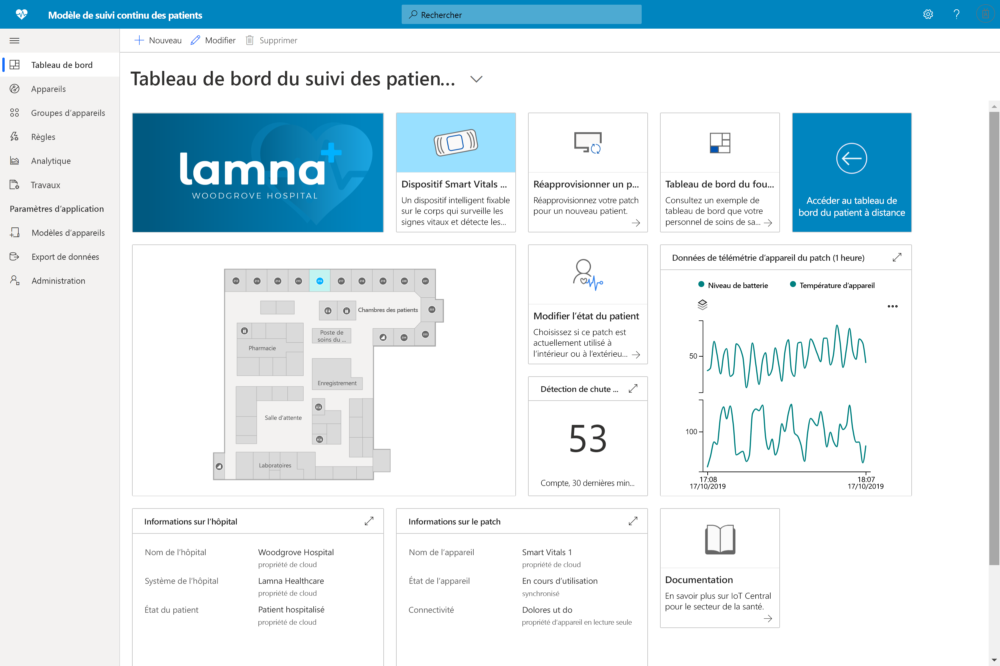

# Présentation des solutions de santé IoT Central

Apprenez à créer des solutions de santé avec Azure IoT Central, à l'aide de modèles d'application.

## Qu'est-ce que le modèle de surveillance continue des patients ?

Dans l'espace IoT dédié à la santé, la Surveillance continue des patients est un élément clé pour réduire le risque de réadmission, gérer plus efficacement les maladies chroniques et améliorer les résultats des patients. La surveillance continue des patients peut être divisée en deux grandes catégories :

1. La **surveillance des patients hospitalisés** : grâce à des dispositifs médicaux portables et à d'autres appareils disponibles à l'hôpital, les équipes de soins peuvent surveiller les constantes vitales et l'état de santé des patients. Il n'est ainsi plus nécessaire d'envoyer une infirmière au chevet du patient plusieurs fois par jour. Et des notifications permettent aux équipes de soins de déterminer quand un patient a besoin d'une attention particulière, ce qui les aide à mieux hiérarchiser leur temps.
1. La **surveillance à distance des patients** : l’utilisation de dispositifs médicaux portables et des résultats rapportés par les patients pour suivre ceux-ci en dehors de l’hôpital peut réduire le risque de réadmission. Les données des patients atteints de maladies chroniques et des patients en rééducation peuvent être recueillies pour s'assurer qu'ils respectent leur traitement et pour veiller à ce que les alertes de détérioration de leur état soient transmises aux équipes de soins avant que cet état ne devienne critique.

Ce modèle d'application peut être utilisé pour créer des solutions dans les deux catégories de surveillance continue des patients. Voici les avantages :

* Connecter de façon continue différentes sortes de dispositifs médicaux portables à une instance IoT Central
* Surveiller et gérer les appareils pour garantir leur intégrité
* Créer des règles personnalisées pour les données des appareils afin de déclencher les alertes appropriées
* Exporter les données médicales des patients vers l'API Azure pour FHIR, un magasin de données conforme
* Exporter les insights agrégés vers des applications métier existantes ou nouvelles

>[!div class="mx-imgBorder"] 
>

## Étapes suivantes

Pour créer une solution de surveillance continue des patients :

* [Déployer le modèle d'application](tutorial-continuous-patient-monitoring.md)
* [Découvrir un exemple d'architecture](concept-continuous-patient-monitoring-architecture.md)