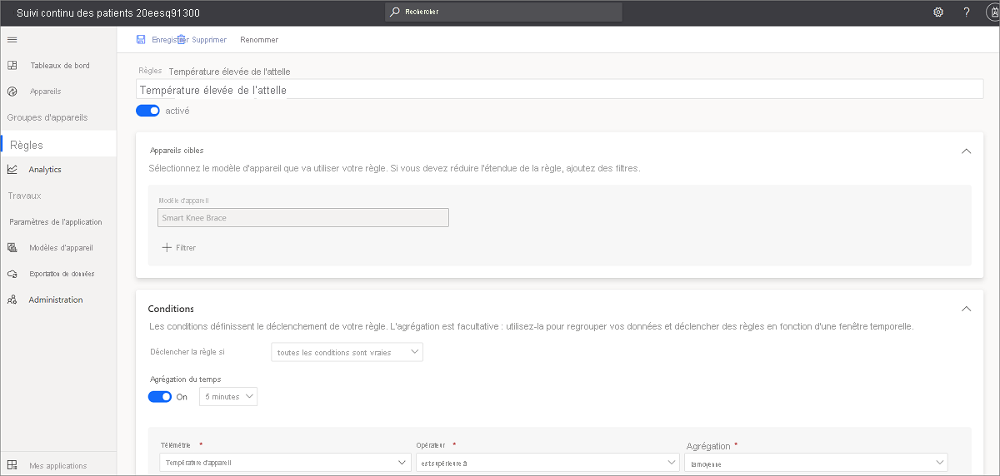
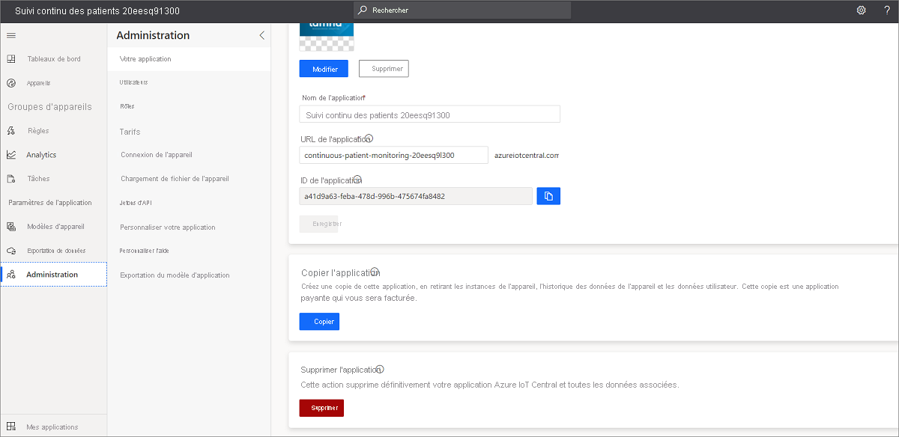

# Tutoriel : Déployer et parcourir pas à pas un modèle d’application de surveillance continue des patients

Ce tutoriel vous montre comment vous lancer, en votre qualité de générateur de solutions, en déployant un modèle d’application de surveillance continue des patients IoT Central. Vous allez apprendre à déployer le modèle, mais aussi découvrir les fonctionnalités prêtes à l’emploi qui vous sont proposées et les différentes possibilités qui s’offrent à vous.

Dans ce tutoriel, vous allez apprendre à :

> [!div class="checklist"]
> * Créer un modèle d’application
> * Parcourir pas à pas le modèle d’application

## Créer un modèle d’application

Accédez au [site web du gestionnaire d’applications Azure IoT Central](https://apps.azureiotcentral.com/). Sélectionnez **Build** (Générer) dans la barre de navigation de gauche, puis cliquez sur l’onglet **Healthcare** (Santé). 

>[!div class="mx-imgBorder"] 
>

Cliquez sur le bouton **Create app** (Créer une application) pour commencer à créer votre application, puis connectez-vous avec un compte Microsoft personnel, professionnel ou scolaire. Cela vous amène la page **New application** (Nouvelle application).

Pour créer votre application :

1. Azure IoT Central suggère automatiquement un nom d’application basé sur le modèle que vous avez sélectionné. Vous pouvez accepter ce nom ou entrer le nom d’application convivial de votre choix, par exemple **Surveillance continue des patients**. Azure IoT Central génère aussi un préfixe d’URL unique basé sur le nom de l’application. Si vous le souhaitez, vous pouvez remplacer ce préfixe d’URL par une chaîne plus facile à mémoriser.

2. Vous pouvez choisir de créer l’application avec le plan tarifaire *gratuit* ou avec l’un des plans tarifaires *standard*. Les applications créées avec le plan gratuit sont utilisables gratuitement pendant sept jours et sur cinq appareils avant leur expiration. Vous pouvez transférer une application du plan gratuit vers un plan tarifaire standard à tout moment avant son expiration. Si vous choisissez le plan gratuit, entrez vos coordonnées et indiquez si vous souhaitez recevoir des informations et des conseils de la part de Microsoft. Les applications créées avec un plan tarifaire standard peuvent être utilisées gratuitement sur deux appareils au maximum et nécessitent vos informations d’abonnement Azure pour la facturation.

3. Sélectionnez **Create** (Créer) au bas de la page pour déployer votre application.

## Parcourir pas à pas le modèle d’application

### Tableaux de bord

Après avoir déployé le modèle d’application, vous accédez dans un premier temps au **tableau de bord de surveillance des patients Lamna**. Lamna Healthcare est un ensemble hospitalier fictif qui se compose de deux hôpitaux : Woodgrove Hospital et Burkville Hospital. Dans ce tableau de bord de commande du Woodgrove Hospital figurent des informations et autres données de télémétrie sur les appareils de ce modèle ainsi qu’un ensemble de commandes, de travaux et d’actions que vous pouvez effectuer. À partir de ce tableau, vous pouvez :

* Consulter les données de télémétrie et les propriétés des appareils, comme le **niveau de charge de la batterie** ou le statut de **connectivité**.

* Affichez le **plan d’étage** et l’emplacement de l’appareil Smart Vitals Patch.

* **Reprovisionner** le Smart Vitals Patch pour un nouveau patient.

* Voir un exemple de **tableau de bord de fournisseur** dont pourrait se servir une équipe de soins hospitaliers pour assurer le suivi de leurs patients.

* Changer le **statut de surveillance** de votre appareil pour indiquer s’il est utilisé à l’hôpital ou dans un scénario à distance.

>[!div class="mx-imgBorder"] 
>

Vous pouvez aussi cliquer sur **Go to remote patient dashboard** (Accéder au tableau de bord de surveillance à distance des patients) pour voir le deuxième tableau de bord de commande utilisé pour le Burkville Hospital. Ce tableau de bord contient un ensemble similaire d’actions, de données de télémétrie et d’informations. Par ailleurs, vous pouvez voir les différents appareils utilisés et **mettre à jour leur microprogramme**.

>[!div class="mx-imgBorder"] 
>

Les deux tableaux de bord proposent des liens pour revenir à cette documentation.

### Modèles d’appareil

Si vous cliquez sur l’onglet **Device templates** (Modèles d’appareils), vous constaterez qu’il existe deux types d’appareil dans le modèle :

* **Smart Vitals Patch** : cet appareil se présente sous la forme d’un patch qui mesure différents types de signes vitaux. Il peut servir à la surveillance des patients dans et en dehors de l’hôpital. Si vous cliquez sur le modèle, vous constaterez qu’en plus d’envoyer des données sur l’appareil comme le niveau de charge de la batterie et la température de l’appareil, le patch envoie aussi des données sur la santé des patients comme la fréquence respiratoire et la pression artérielle.

* **Smart Knee Brace** : cet appareil se présente sous la forme d’une attelle de genou que les patients peuvent utiliser à la suite d’une opération de reconstruction du genou. Si vous cliquez sur ce modèle, outre les données de l’appareil, vous trouverez des informations sur certaines aptitudes, comme l’amplitude de mouvement et la mobilité.

>[!div class="mx-imgBorder"] 
>

### Groupes d’appareils 
Les groupes d’appareils vous permettent de regrouper logiquement un ensemble d’appareils pour effectuer des requêtes ou des opérations en bloc sur ceux-ci. 

Si vous cliquez sur l’onglet Groupes d’appareils, vous voyez que nous avons créé des groupes d’appareils par défaut pour chacun des modèles d’appareils dans l’application. Vous remarquerez que nous avons aussi créé deux exemples de groupes d’appareils supplémentaires appelés « Provision devices » (Appareils de provisionnement) et « Devices with outdated firmware » (Appareils avec microprogramme obsolète). Nous allons utiliser ces exemples de groupes d’appareils comme entrées pour exécuter des [travaux](#jobs).

### Règles

En accédant à l’onglet de règles, vous constaterez la présence de trois règles qui existent dans le modèle d’application :

* **Brace temperature high** (Température élevée de l’attelle) : cette règle se déclenche quand la température de l’attelle de genou Smart Knee Brace est supérieure à 95 &deg;F (35 °C) sur une période de 5 minutes. Vous pouvez utiliser cette règle pour alerter le patient et l’équipe de soins pour qu’elle refroidisse l’appareil à distance.

* **Fall detected** (Chute détectée) : cette règle se déclenche si une chute du patient est détectée. Vous pouvez utiliser cette règle pour configurer une action d’intervention d’équipe opérationnelle pour secourir le patient qui a chuté.

* **Patch battery low** (Faible niveau de charge du patch) : cette règle se déclenche quand le niveau charge de la batterie de l’appareil est inférieur à 10 %. Vous pouvez utiliser cette règle pour déclencher une notification à l’intention du patient pour qu’il charge son appareil.

>[!div class="mx-imgBorder"] 
>

### travaux

Les travaux vous permettent d’exécuter des opérations en bloc sur un ensemble d’appareils, en utilisant des [groupes d’appareils](#device-groups) comme entrée. Nous avons amorcé le modèle d’application avec deux exemples de travaux qu’un opérateur de solution pourrait être amené à exécuter à un moment donné du cycle de vie des appareils :
* **Mettre à jour le microprogramme des genouillères** : Ce travail va rechercher les appareils dans le groupe d’appareils « Devices with outdated firmware » et exécutera une commande pour mettre à jour ces appareils vers la dernière version du microprogramme de la genouillère. Cet exemple de travail suppose que les appareils peuvent recevoir une commande « update » et récupérer directement les fichiers de microprogramme à partir du cloud.  

* **Reprovisionner des appareils** : Si vous avez un ensemble d’appareils qui ont été récemment retournés à l’hôpital et doivent être reprovisionnés pour l’ensemble suivant de patients, vous pouvez exécuter ce travail pour mettre à jour vos appareils de provisionnement en bloc. Dans ce cas, nous prenons tous les appareils d’un groupe d’appareils appelé « Provision devices » et nous exécutons une commande pour les « reprovisionner ». 

### Appareils

Cliquez sur l’onglet **Devices** (Appareils), puis sélectionnez une instance de **Smart Knee Brace**. Vous constatez alors qu’il existe trois vues qui permettent d’explorer les informations sur l’appareil que vous avez sélectionné. Ces vues sont créées et publiées au moment de générer le modèle de l’appareil, ce qui signifie qu’elles sont identiques sur tous les appareils que vous connectez ou simulez.

La vue **Dashboard** (Tableau de bord) offre une vue d’ensemble des données de télémétrie et des propriétés de l’appareil destinées aux opérateurs.

L’onglet **Properties** (Propriétés) vous permet de modifier les propriétés cloud et de lire/écrire les propriétés de l’appareil.

L’onglet **Commands** (Commandes) vous permet d’exécuter des commandes qui ont été modélisées dans votre modèle d’appareil.

>[!div class="mx-imgBorder"] 
>

### Exportation de données

L’exportation de données vous permet d’exporter les données de vos appareil IoT Central en continu vers d’autres services Azure, notamment l’[API Azure pour FHIR](concept-continuous-patient-monitoring-architecture.md#export-to-azure-api-for-fhir).

## Nettoyer les ressources

Si vous n’envisagez pas de continuer à utiliser cette application, supprimez-la en accédant à **Administration > Application settings** (Administration > Paramètre d’application), puis cliquez sur **Delete** (Supprimer).

>[!div class="mx-imgBorder"] 
>

## Étapes suivantes

Passez à l’article suivant pour apprendre à créer un tableau de bord de fournisseur qui se connecte à votre application IoT Central.

> [!div class="nextstepaction"]
> [Créer un tableau de bord de fournisseur](howto-health-data-triage.md)