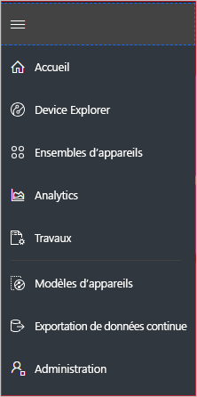
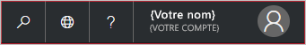
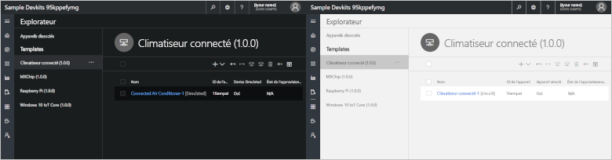
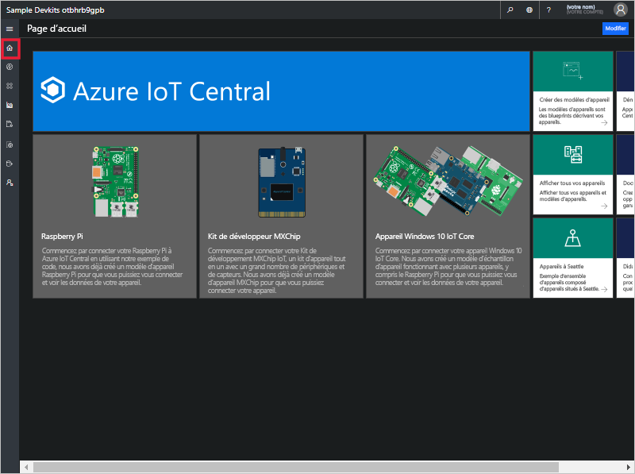
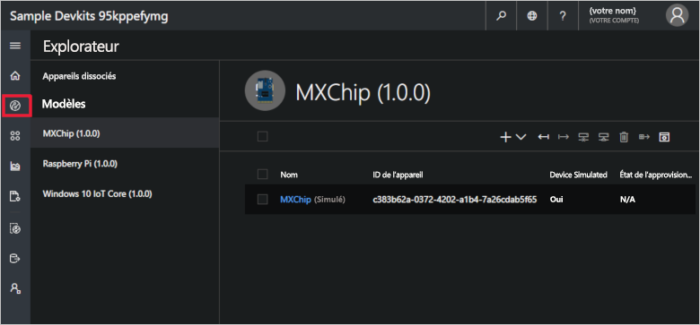
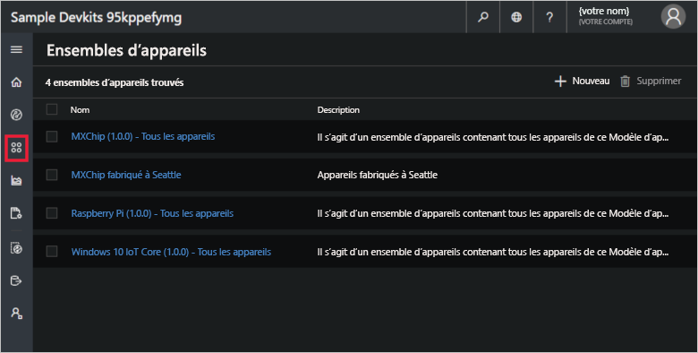
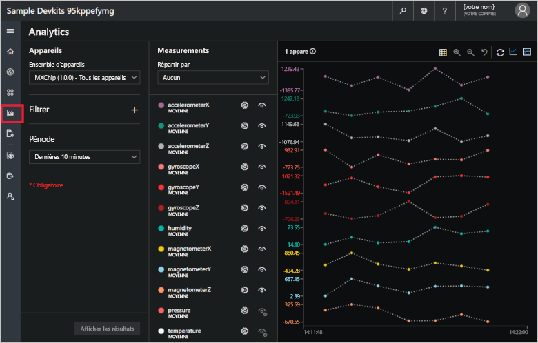
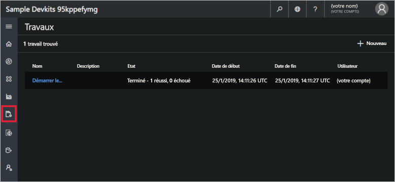
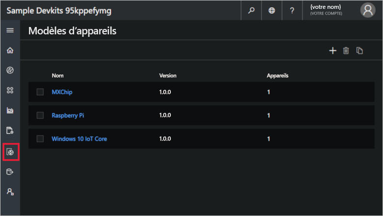
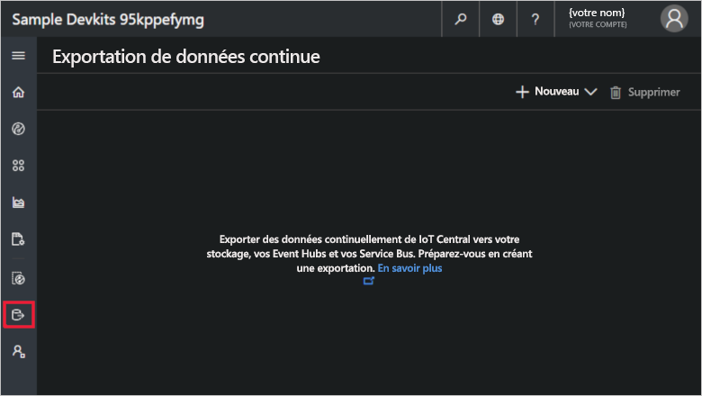

# Visite guidée de l’interface utilisateur Azure IoT Central (refonte de l’interface utilisateur)

Cet article vous présente l’interface utilisateur de Microsoft Azure IoT Central. Vous pouvez utiliser l’interface utilisateur pour créer, gérer et utiliser une solution Azure IoT Central et ses appareils connectés.

En tant que _générateur_, vous utilisez l’interface utilisateur Azure IoT Central pour définir votre solution Azure IoT Central. Vous pouvez utiliser l’interface utilisateur pour :

- Définir les types d’appareils qui se connectent à votre solution.
- Configurer les règles et les actions pour vos appareils.
- Personnaliser l’interface utilisateur pour un _opérateur_ qui utilise votre solution.

En tant qu’_opérateur_, vous utilisez l’interface utilisateur Azure IoT Central pour gérer votre solution Azure IoT Central. Vous pouvez utiliser l’interface utilisateur pour :

- Surveiller vos appareils.
- Configurer vos appareils.
- Dépanner et corrige les problèmes avec vos appareils.
- Approvisionner de nouveaux appareils.

[!INCLUDE [iot-central-experimental-note](../../includes/iot-central-experimental-note.md)]

## Utiliser le menu de navigation gauche

Utilisez le menu de navigation gauche pour accéder aux différentes zones de l’application :

| Menu | Description |
| ---- | ----------- |
|  | <ul><li>Le bouton **Accueil** affiche la page d’accueil de votre application. En tant que générateur, vous pouvez personnaliser cette page d’accueil pour vos opérateurs.</li><li>Le bouton **Device Explorer** liste les appareils simulés et réels associés à chaque modèle d’appareil dans l’application. En tant qu’opérateur, vous utilisez **Device Explorer** pour gérer vos appareils connectés.</li><li>Le bouton **Device Sets** vous permet d’afficher et de créer des ensembles d’appareils. En tant qu’opérateur, vous pouvez créer des ensembles d’appareils comme une collection logique d’appareils spécifiée par une requête.</li><li>Le bouton **Analytique** montre les analytiques dérivées des données de télémétrie de l’appareil pour les appareils et les ensembles d’appareils. En tant qu’opérateur, vous pouvez créer des vues personnalisées sur des données d’appareils pour dégager des insights à partir de votre application.</li><li>Le bouton **Tâches** permet une gestion des appareils en bloc en vous faisant créer et exécuter des tâches pour effectuer des mises à jour à grande échelle.</li><li>Le bouton **Modèles d’appareil** montre les outils qu’un générateur utilise pour créer et gérer des modèles d’appareil.</li><li>Le bouton **Exportation de données continue** sert à un administrateur pour configurer une exportation continue vers d’autres services Azure, tels que le stockage et les files d’attente.</li><li>Le bouton **Administration** montre les pages d’administration de l’application depuis lesquelles un administrateur peut gérer les paramètres, les utilisateurs et les rôles de l’application.</li></ul> |

## Recherche, aide et support

Le menu supérieur s’affiche sur chaque page :

- Pour rechercher des modèles d’appareils et des appareils, choisissez l’icône **Recherche**.
- Pour changer la langue de l’interface utilisateur, choisissez l’icône **Langue**.
- Pour obtenir de l’aide et un support, choisissez la liste déroulante **Aide** pour obtenir une liste des ressources.
- Pour changer le thème de l’interface utilisateur ou vous déconnecter de l’application, choisissez l’icône **Compte**.

Vous pouvez choisir entre un thème clair ou un thème foncé pour l’interface utilisateur :

## page d'accueil

La page d’accueil est la première page que vous voyez lorsque vous vous connectez à votre application Azure IoT Central. En tant que générateur, vous pouvez personnaliser la page d’accueil pour d’autres utilisateurs de l’application en y ajoutant des vignettes. Pour plus d’informations, consultez le didacticiel [Personnaliser la vue d’opérateur de Azure IoT Central](tutorial-customize-operator-experimental.md?toc=/azure/iot-central-experimental/toc.json&bc=/azure/iot-central-experimental/breadcrumb/toc.json).

## Explorateur d’appareils

La page de l’explorateur affiche les _appareils_ dans votre application Azure IoT Central, groupés par _modèle d’appareil_.

* Un modèle d’appareil définit un type d’appareil pouvant se connecter à votre application. Pour plus d’informations, consultez [Définir un nouveau type d’appareil dans votre application Azure IoT Central](tutorial-define-device-type-experimental.md?toc=/azure/iot-central-experimental/toc.json&bc=/azure/iot-central-experimental/breadcrumb/toc.json).
* Un appareil représente un appareil réel ou simulé dans votre application. Pour plus d’informations, consultez l’article [Ajouter un nouvel appareil à votre application Azure IoT Central](tutorial-add-device-experimental.md?toc=/azure/iot-central-experimental/toc.json&bc=/azure/iot-central-experimental/breadcrumb/toc.json).

## Ensembles d’appareils

La page _Ensembles d’appareils_ affiche les ensembles d’appareils créés par le générateur. Un ensemble d’appareils est un regroupement d’appareils associés. Un générateur définit une requête pour identifier les appareils inclus dans un ensemble d’appareils. Vous utilisez des ensembles d’appareils lorsque vous personnalisez les analytiques dans votre application. Pour plus d’informations, consultez l’article [Utiliser des ensembles d’appareils dans votre application Azure IoT Central](howto-use-device-sets-experimental.md?toc=/azure/iot-central-experimental/toc.json&bc=/azure/iot-central-experimental/breadcrumb/toc.json).

## Analytics

La page Analytics affiche les graphiques qui vous aident à comprendre comment se comportent les appareils connectés à votre application. Un opérateur utilise cette page pour surveiller et étudier les problèmes avec les appareils connectés. Le générateur peut définir les graphiques affichés sur cette page. Pour plus d’informations, consultez l’article [Créer des analytiques personnalisés pour votre application Azure IoT Central](howto-use-device-sets-experimental.md?toc=/azure/iot-central-experimental/toc.json&bc=/azure/iot-central-experimental/breadcrumb/toc.json).

## Tâches

La page Tâches vous permet d’effectuer des opérations de gestion d’appareils en bloc sur vos appareils. Le générateur utilise cette page pour mettre à jour des commandes, des paramètres et des propriétés d’appareil. Pour plus d’informations, consultez l’article [Exécuter une tâche](howto-run-a-job-experimental.md?toc=/azure/iot-central-experimental/toc.json&bc=/azure/iot-central-experimental/breadcrumb/toc.json).

## Modèles d’appareil

La page des modèles d’appareil est l’endroit où un générateur crée et gère les modèles d’appareil dans l’application. Pour plus d’informations, consultez le didacticiel [Définir un nouveau type d’appareil dans votre application Azure IoT Central](tutorial-define-device-type-experimental.md?toc=/azure/iot-central-experimental/toc.json&bc=/azure/iot-central-experimental/breadcrumb/toc.json).

## Exportation de données continue

La page d’exportation continue des données est l’endroit où un administrateur définit la façon d’exporter des données, comme les données de télémétrie, à partir de l’application. D’autres services peuvent stocker les données exportées ou les utiliser à des fins d’analyse. Pour en savoir plus, consultez l’article [Exporter vos données dans Azure IoT Central](howto-export-data-experimental.md?toc=/azure/iot-central-experimental/toc.json&bc=/azure/iot-central-experimental/breadcrumb/toc.json).

## Administration

La page d’administration contient des liens vers les outils utilisés par un administrateur, comme la définition des utilisateurs et des rôles dans l’application. Pour plus d’informations, consultez l’article [Administrer votre application Azure IoT Central](howto-administer-experimental.md?toc=/azure/iot-central-experimental/toc.json&bc=/azure/iot-central-experimental/breadcrumb/toc.json).

## Étapes suivantes

Vous avez maintenant une vue d’ensemble de Azure IoT Central et vous êtes familiarisé avec la mise en page de l’interface utilisateur. L’étape suivante suggérée consiste à effectuer le guide de démarrage rapide [Créer une application Azure IoT Central](quick-deploy-iot-central-experimental.md?toc=/azure/iot-central-experimental/toc.json&bc=/azure/iot-central-experimental/breadcrumb/toc.json).