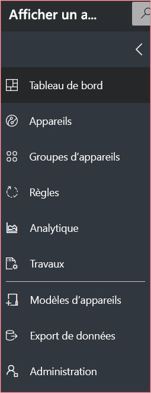
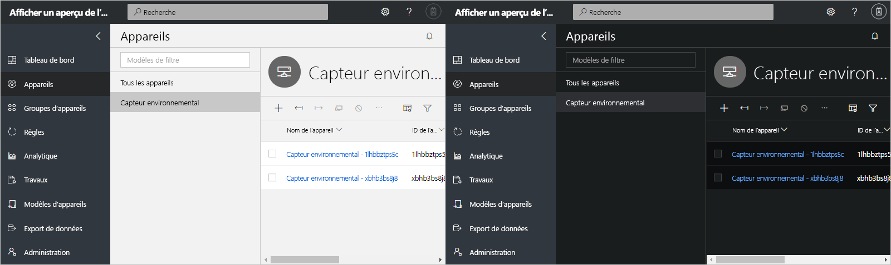
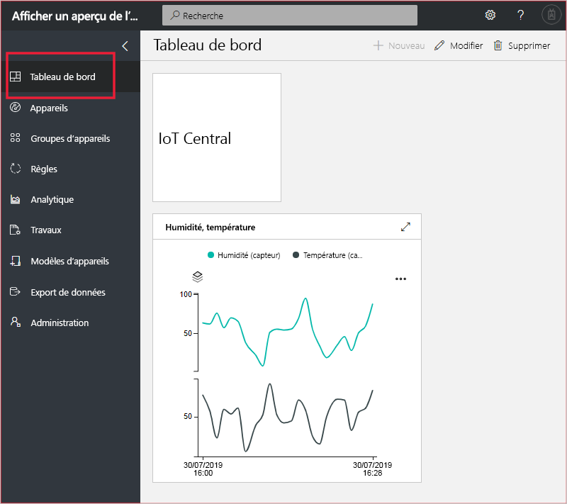
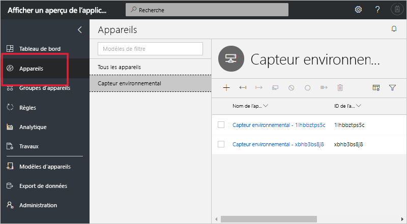
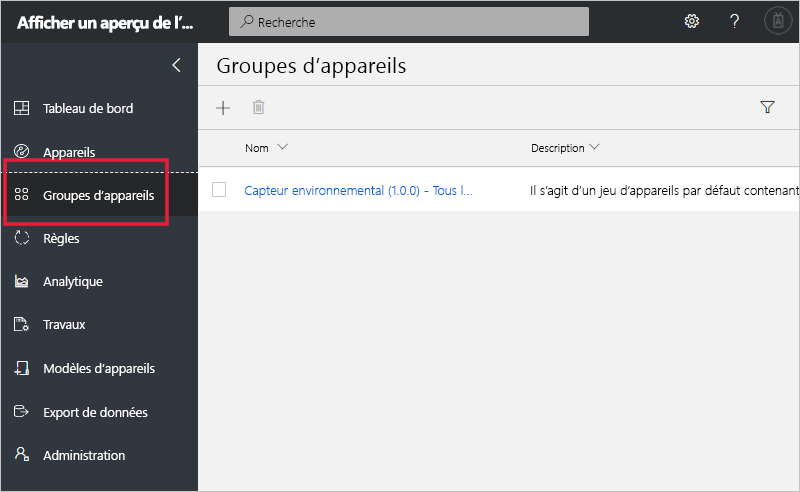
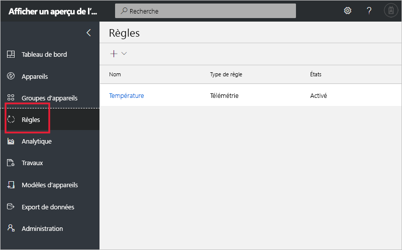
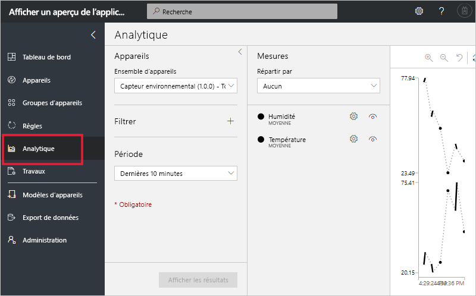
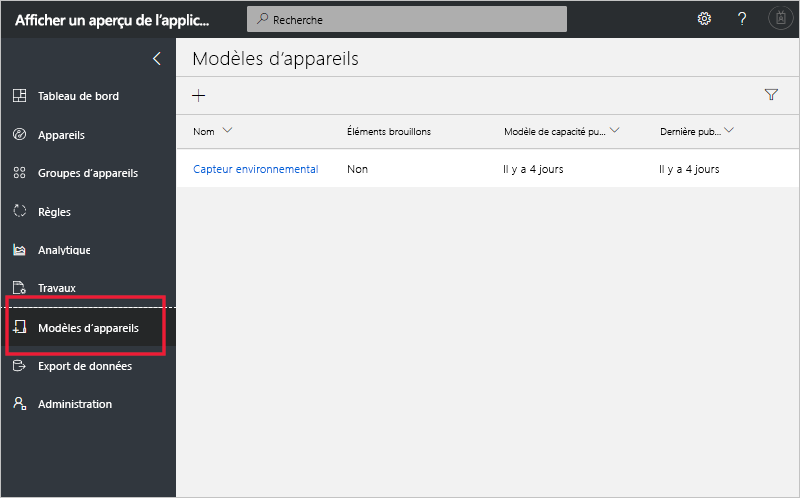
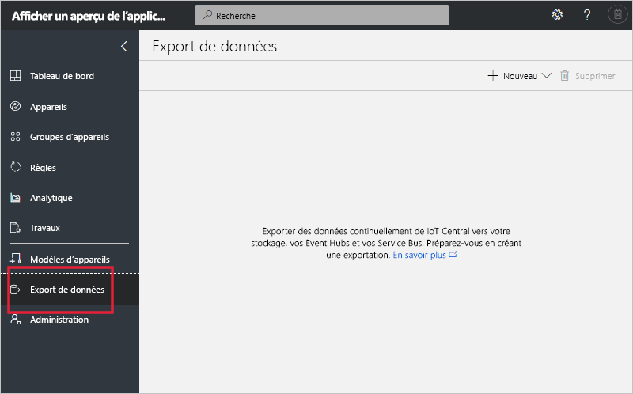
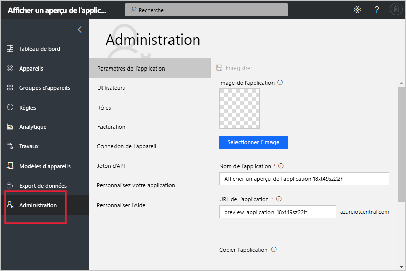

# Visite guidée de l’interface utilisateur Azure IoT Central (fonctionnalités en préversion)

[!INCLUDE [iot-central-pnp-original](../../includes/iot-central-pnp-original-note.md)]

Cet article vous présente l’interface utilisateur de Microsoft Azure IoT Central. Vous pouvez utiliser l’interface utilisateur pour créer, gérer et utiliser une solution Azure IoT Central et ses appareils connectés.

En tant que _générateur_, vous utilisez l’interface utilisateur Azure IoT Central pour définir votre solution Azure IoT Central. Vous pouvez utiliser l’interface utilisateur pour :

* Définir les types d’appareils qui se connectent à votre solution.
* Configurer les règles et les actions pour vos appareils.
* Personnaliser l’interface utilisateur pour un _opérateur_ qui utilise votre solution.

En tant qu’_opérateur_, vous utilisez l’interface utilisateur Azure IoT Central pour gérer votre solution Azure IoT Central. Vous pouvez utiliser l’interface utilisateur pour :

* Surveiller vos appareils.
* Configurer vos appareils.
* Dépanner et corrige les problèmes avec vos appareils.
* Approvisionner de nouveaux appareils.

## Utiliser le menu de navigation gauche

Utilisez le menu de navigation gauche pour accéder aux différentes zones de l’application. Vous pouvez développer ou réduire la barre de navigation en sélectionnant **<** ou **>**  :

| Menu | Description |
| ---- | ----------- |
|  | <ul><li>La page **Tableau de bord** affiche le tableau de bord de votre application. En tant que créateur, vous pouvez personnaliser le tableau de bord pour vos opérateurs. Les utilisateurs peuvent également créer leurs propres tableaux de bord.</li><li>La page **Appareils** liste les appareils simulés et réels associés à chaque modèle d’appareil dans l’application. En tant qu’opérateur, vous utilisez **Appareils** pour gérer vos appareils connectés.</li><li>La page **Groupes d’appareils** vous permet d’afficher et de créer des groupes d’appareils. En tant qu’opérateur, vous pouvez créer des groupes d’appareils comme une collection logique d’appareils spécifiée par une requête.</li><li>La page **Règles** vous permet de modifier les règles qui se déclenchent en fonction des données de télémétrie des appareils et de déclencher des actions personnalisables.</li><li>La page **Analytiques** montre les analytiques dérivées des données de télémétrie de l’appareil pour les appareils et les groupes d’appareils. En tant qu’opérateur, vous pouvez créer des vues personnalisées sur des données d’appareils pour dégager des insights à partir de votre application.</li><li>La page **Tâches** permet une gestion des appareils en bloc en vous faisant créer et exécuter des tâches pour mettre à jour vos appareils à grande échelle.</li><li>La page **Modèles d’appareil** montre les outils qu’un créateur utilise pour créer et gérer des modèles d’appareil.</li><li>La page **Exportation de données** sert à un administrateur pour configurer une exportation continue vers d’autres services Azure, tels que le stockage et les files d’attente.</li><li>La page **Administration** montre les pages d’administration de l’application depuis lesquelles un administrateur peut gérer les paramètres, les utilisateurs et les rôles de l’application.</li></ul> |

## Recherche, aide et support

Le menu supérieur s’affiche sur chaque page :

* Pour rechercher des modèles d’appareils et des appareils, entrez une valeur de **recherche**.
* Pour modifier la langue de l’interface utilisateur ou le thème, choisissez l’icône des **paramètres**.
* Pour vous déconnecter de l’application, choisissez l’icône **Compte**.
* Pour obtenir de l’aide et un support, choisissez la liste déroulante **Aide** pour obtenir une liste des ressources. Dans une application d’essai, les ressources de support incluent l’accès à une [messagerie instantanée](howto-show-hide-chat.md?toc=/azure/iot-central-pnp/toc.json&bc=/azure/iot-central-pnp/breadcrumb/toc.json).

Vous pouvez choisir entre un thème clair ou un thème foncé pour l’interface utilisateur :

> [!NOTE]
> La possibilité de choisir entre des thèmes clairs et foncés n’est pas disponible si votre administrateur a configuré un thème personnalisé pour l’application.

## tableau de bord

* Le tableau de bord est la première page que vous voyez lorsque vous vous connectez à votre application Azure IoT Central. En tant que créateur, vous pouvez personnaliser le tableau de bord pour d’autres utilisateurs de l’application en y ajoutant des vignettes. Pour plus d’informations, consultez le tutoriel [Configurer un modèle d’appareil](tutorial-define-device-type-pnp.md?toc=/azure/iot-central-pnp/toc.json&bc=/azure/iot-central-pnp/breadcrumb/toc.json).

* En tant qu’opérateur, vous pouvez créer des tableaux de bord personnalisés et passer de ces tableaux vers le tableau de bord par défaut. Pour plus d’informations, consultez l’article sur les procédures [Créer et gérer des tableaux de bord personnels](howto-personalize-dashboard.md?toc=/azure/iot-central-pnp/toc.json&bc=/azure/iot-central-pnp/breadcrumb/toc.json).

## Appareils

La page de l’explorateur affiche les _appareils_ dans votre application Azure IoT Central, groupés par _modèle d’appareil_.

* Un modèle d’appareil définit un type d’appareil pouvant se connecter à votre application. Pour plus d’informations, consultez [Définir un nouveau type d’appareil dans votre application Azure IoT Central](tutorial-define-device-type-pnp.md?toc=/azure/iot-central-pnp/toc.json&bc=/azure/iot-central-pnp/breadcrumb/toc.json).
* Un appareil représente un appareil réel ou simulé dans votre application. Pour plus d’informations, consultez l’article [Ajouter un nouvel appareil à votre application Azure IoT Central](tutorial-add-device-pnp.md?toc=/azure/iot-central-pnp/toc.json&bc=/azure/iot-central-pnp/breadcrumb/toc.json).

## Groupes d’appareils

La page _Groupes d’appareils_ affiche les groupes d’appareils créés par le générateur. Un groupe d’appareils est un regroupement d’appareils associés. Un générateur définit une requête pour identifier les appareils inclus dans un groupe d’appareils. Vous utilisez des groupes d’appareils lorsque vous personnalisez les analytiques dans votre application. Pour plus d’informations, consultez l’article [Utiliser des groupes d’appareils dans votre application Azure IoT Central](howto-use-device-groups-pnp.md?toc=/azure/iot-central-pnp/toc.json&bc=/azure/iot-central-pnp/breadcrumb/toc.json).

## Règles

La page Règles vous permet de définir des règles en fonction des événements de télémétrie, de l’état de l’appareil ou des événements de l’appareil. Lorsqu’une règle est déclenchée, elle peut déclencher une action, telle que l’envoi d’un e-mail à un opérateur. Le générateur utilise cette page pour créer et gérer des règles. Pour plus d’informations, consultez [Configurer des règles et des actions pour vos appareils dans Azure IoT Central](tutorial-configure-rules-pnp.md?toc=/azure/iot-central-pnp/toc.json&bc=/azure/iot-central-pnp/breadcrumb/toc.json).

## Analytics

La page Analytics affiche les graphiques qui vous aident à comprendre comment se comportent les appareils connectés à votre application. Un opérateur utilise cette page pour surveiller et étudier les problèmes avec les appareils connectés. Le générateur peut définir les graphiques affichés sur cette page. Pour plus d’informations, consultez l’article [Créer des analytiques personnalisés pour votre application Azure IoT Central](howto-use-device-groups-pnp.md?toc=/azure/iot-central-pnp/toc.json&bc=/azure/iot-central-pnp/breadcrumb/toc.json).

## Tâches

La page Tâches vous permet d’effectuer des opérations de gestion d’appareils en bloc sur vos appareils. Le générateur utilise cette page pour mettre à jour des commandes, des paramètres et des propriétés d’appareil. Pour plus d’informations, consultez l’article [Exécuter une tâche](howto-run-a-job.md?toc=/azure/iot-central-pnp/toc.json&bc=/azure/iot-central-pnp/breadcrumb/toc.json).

## Modèles d’appareil

La page des modèles d’appareil est l’endroit où un générateur crée et gère les modèles d’appareil dans l’application. Un modèle d’appareil spécifie les caractéristiques de celui-ci, notamment :

* La télémétrie, l’état et les mesures d’événement.
* Propriétés.
* Les commandes.

Le générateur peut également créer des formulaires et des tableaux de bord qui permettent aux opérateurs de gérer des appareils.

Pour plus d’informations, consultez le didacticiel [Définir un nouveau type d’appareil dans votre application Azure IoT Central](tutorial-define-device-type-pnp.md?toc=/azure/iot-central-pnp/toc.json&bc=/azure/iot-central-pnp/breadcrumb/toc.json).

## Exportation de données

La page Exportation de données est l’endroit où un administrateur définit la façon de diffuser en continu des données, comme les données de télémétrie, à partir de l’application. D’autres services peuvent stocker les données exportées ou les utiliser à des fins d’analyse. Pour en savoir plus, consultez l’article [Exporter vos données dans Azure IoT Central](howto-export-data.md?toc=/azure/iot-central-pnp/toc.json&bc=/azure/iot-central-pnp/breadcrumb/toc.json).

## Administration

La page d’administration contient des liens vers les outils utilisés par un administrateur, comme la définition des utilisateurs et des rôles dans l’application, ou la personnalisation de l’interface utilisateur. Pour plus d’informations, consultez l’article [Administrer votre application Azure IoT Central](howto-administer-pnp.md?toc=/azure/iot-central-pnp/toc.json&bc=/azure/iot-central-pnp/breadcrumb/toc.json).

## Étapes suivantes

Vous avez maintenant une vue d’ensemble de Azure IoT Central et vous êtes familiarisé avec la mise en page de l’interface utilisateur. L’étape suivante suggérée consiste à effectuer le guide de démarrage rapide [Créer une application Azure IoT Central](quick-deploy-iot-central-pnp.md?toc=/azure/iot-central-pnp/toc.json&bc=/azure/iot-central-pnp/breadcrumb/toc.json).
