# Visite guidée de l’interface utilisateur de Azure IoT Central

[!INCLUDE [iot-central-original-pnp](../../includes/iot-central-original-pnp-note.md)]

Cet article vous présente l’interface utilisateur de Microsoft Azure IoT Central. Vous pouvez utiliser l’interface utilisateur pour créer, gérer et utiliser une solution Azure IoT Central et ses appareils connectés.

En tant que _générateur_, vous utilisez l’interface utilisateur Azure IoT Central pour définir votre solution Azure IoT Central. Vous pouvez utiliser l’interface utilisateur pour :

- Définir les types d’appareils qui se connectent à votre solution.
- Configurer les règles et les actions pour vos appareils.
- Personnaliser l’interface utilisateur pour un _opérateur_ qui utilise votre solution.

En tant qu’_opérateur_, vous utilisez l’interface utilisateur Azure IoT Central pour gérer votre solution Azure IoT Central. Vous pouvez utiliser l’interface utilisateur pour :

- Surveiller vos appareils.
- Configurer vos appareils.
- Dépanner et corrige les problèmes avec vos appareils.
- Approvisionner de nouveaux appareils.

## Utiliser le menu de navigation gauche

Utilisez le menu de navigation gauche pour accéder aux différentes zones de l’application. Vous pouvez développer ou réduire la barre de navigation en sélectionnant **<** ou **>**  :

:::row:::
  :::column span="":::
      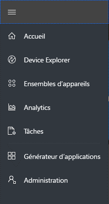
  :::column-end:::
  :::column span="2":::

      **Dashboard** displays your application dashboard. As a builder, you can customize the dashboard for your operators. Users can also create their own  dashboards.
    
      **Device Explorer** lists the simulated and real devices associated with each device template in the application. As an operator, you use the **Device Explorer** to manage your connected devices.
    
      **Device Sets** enables you to view and create device sets. As an operator, you can create device sets as a logical collection of devices specified by a query.
    
      **Analytics** shows analytics derived from device telemetry for devices and device sets. As an operator, you can create custom views on top of device data to derive insights from your application.
    
      **Jobs** enables bulk device management by having you create and run jobs to perform updates at scale.
    
      **Device Templates** shows the tools a builder uses to create and manage device templates.
    
      **Continuous Data Export** enables an administrator to configure a continuous export to other Azure services such as storage and queues.
    
      **Administration** shows the application administration pages where an administrator can manage application settings, users, and roles.
   :::column-end:::
:::row-end:::

## Recherche, aide et support

Le menu supérieur s’affiche sur chaque page :

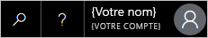

- Pour rechercher des modèles d’appareils et des appareils, entrez une valeur de **recherche**.
- Pour modifier la langue de l’interface utilisateur ou le thème, choisissez l’icône des **paramètres**.
- Pour vous déconnecter de l’application, choisissez l’icône **Compte**.
- Pour obtenir de l’aide et un support, choisissez la liste déroulante **Aide** pour obtenir une liste des ressources. Dans une application d’essai, les ressources de support incluent l’accès à une [messagerie instantanée](howto-show-hide-chat.md).

Vous pouvez choisir entre un thème clair ou un thème foncé pour l’interface utilisateur :

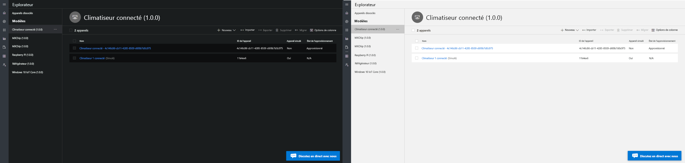

> [!NOTE]
> La possibilité de choisir entre des thèmes clairs et foncés n’est pas disponible si votre administrateur a configuré un thème personnalisé pour l’application.

## tableau de bord

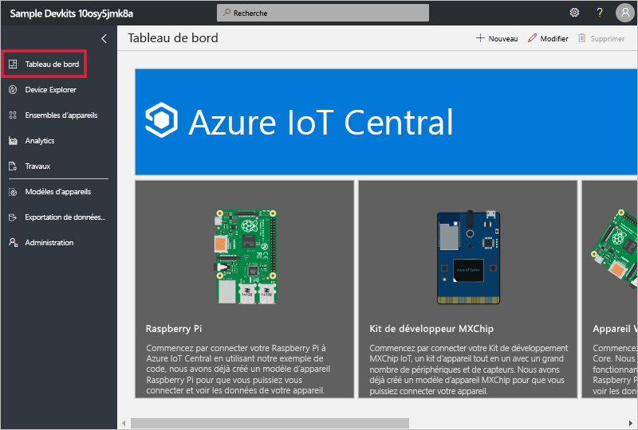

* Le tableau de bord est la première page que vous voyez lorsque vous vous connectez à votre application Azure IoT Central. En tant que créateur, vous pouvez personnaliser le tableau de bord pour d’autres utilisateurs de l’application en y ajoutant des vignettes. Pour plus d’informations, consultez le didacticiel [Personnaliser la vue d’opérateur de Azure IoT Central](tutorial-customize-operator.md).

* En tant qu’opérateur, vous pouvez créer des tableaux de bord personnalisés et passer de ces tableaux vers le tableau de bord par défaut. Pour plus d’informations, consultez l’article sur les procédures [Créer et gérer des tableaux de bord personnels](howto-personalize-dashboard.md).

## Explorateur d’appareils

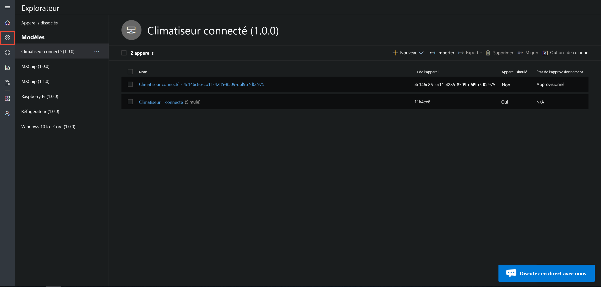

La page de l’explorateur affiche les _appareils_ dans votre application Azure IoT Central, groupés par _modèle d’appareil_.

* Un modèle d’appareil définit un type d’appareil pouvant se connecter à votre application. Pour plus d’informations, consultez [Définir un nouveau type d’appareil dans votre application Azure IoT Central](tutorial-define-device-type.md).
* Un appareil représente un appareil réel ou simulé dans votre application. Pour plus d’informations, consultez l’article [Ajouter un nouvel appareil à votre application Azure IoT Central](tutorial-add-device.md).

## Ensembles d’appareils

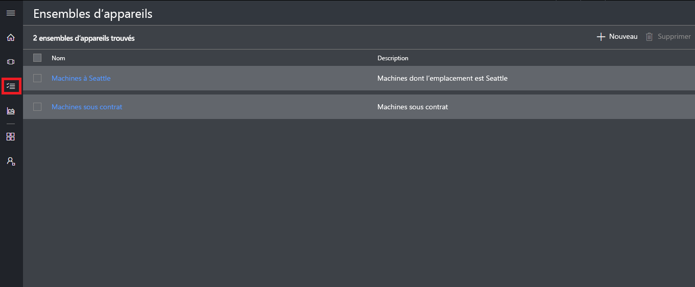

La page _Ensembles d’appareils_ affiche les ensembles d’appareils créés par le générateur. Un ensemble d’appareils est un regroupement d’appareils associés. Un générateur définit une requête pour identifier les appareils inclus dans un ensemble d’appareils. Vous utilisez des ensembles d’appareils lorsque vous personnalisez les analytiques dans votre application. Pour plus d’informations, consultez l’article [Utiliser des ensembles d’appareils dans votre application Azure IoT Central](howto-use-device-sets.md).

## Analytics

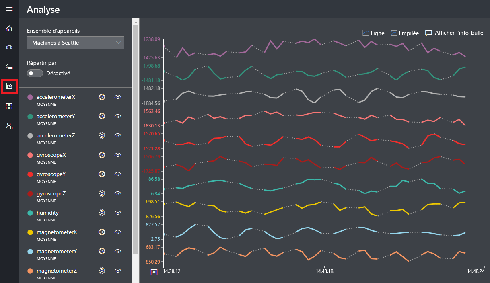

La page Analytics affiche les graphiques qui vous aident à comprendre comment se comportent les appareils connectés à votre application. Un opérateur utilise cette page pour surveiller et étudier les problèmes avec les appareils connectés. Le générateur peut définir les graphiques affichés sur cette page. Pour plus d’informations, consultez l’article [Créer des analytiques personnalisés pour votre application Azure IoT Central](howto-use-device-sets.md).

## Tâches

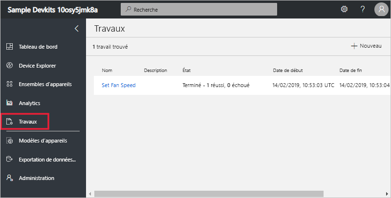

La page Tâches vous permet d’effectuer des opérations de gestion d’appareils en bloc sur vos appareils. Le générateur utilise cette page pour mettre à jour des commandes, des paramètres et des propriétés d’appareil. Pour plus d’informations, consultez l’article [Exécuter une tâche](howto-run-a-job.md).

## Modèles d’appareil

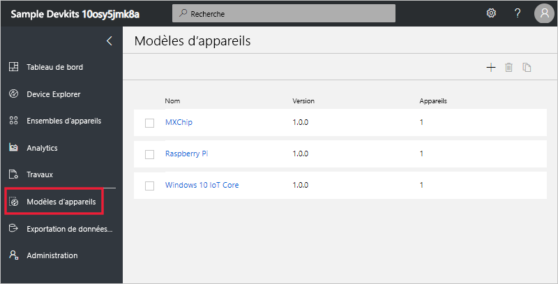

La page des modèles d’appareil est l’endroit où un générateur crée et gère les modèles d’appareil dans l’application. Un modèle d’appareil spécifie les caractéristiques de celui-ci, notamment :

- La télémétrie, l’état et les mesures d’événement.
- Les paramètres et les propriétés.
- Les commandes.
- Les règles basées sur des événements ou des valeurs de télémétrie.

Pour plus d’informations, consultez le didacticiel [Définir un nouveau type d’appareil dans votre application Azure IoT Central](tutorial-define-device-type.md).

## Exportation de données continue

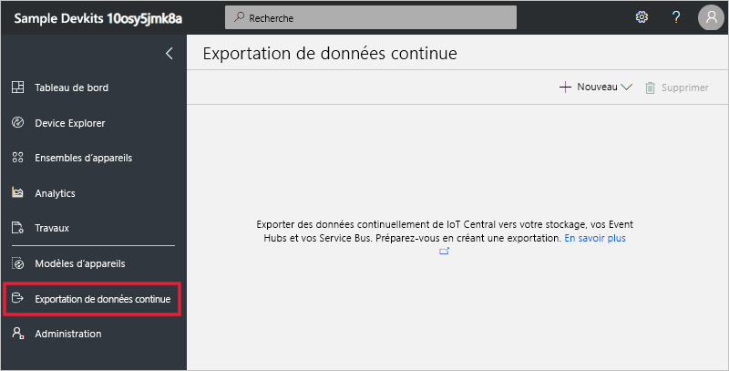

La page d’exportation continue des données est l’endroit où un administrateur définit la façon de diffuser en continu des données, comme les données de télémétrie, à partir de l’application. D’autres services peuvent stocker les données exportées ou les utiliser à des fins d’analyse. Pour en savoir plus, consultez l’article [Exporter vos données dans Azure IoT Central](howto-export-data.md).

## Administration

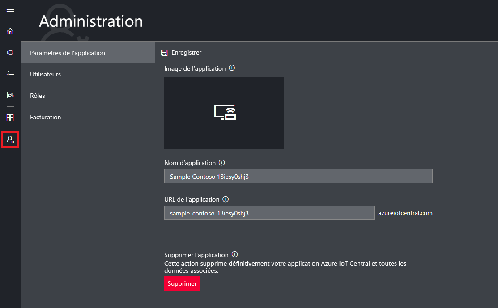

La page d’administration contient des liens vers les outils utilisés par un administrateur, comme la définition des utilisateurs et des rôles dans l’application, ou la personnalisation de l’interface utilisateur. Pour plus d’informations, consultez l’article [Administrer votre application Azure IoT Central](howto-administer.md).

## Étapes suivantes

Vous avez maintenant une vue d’ensemble de Azure IoT Central et vous êtes familiarisé avec la mise en page de l’interface utilisateur. L’étape suivante suggérée consiste à effectuer le guide de démarrage rapide [Créer une application Azure IoT Central](quick-deploy-iot-central.md).