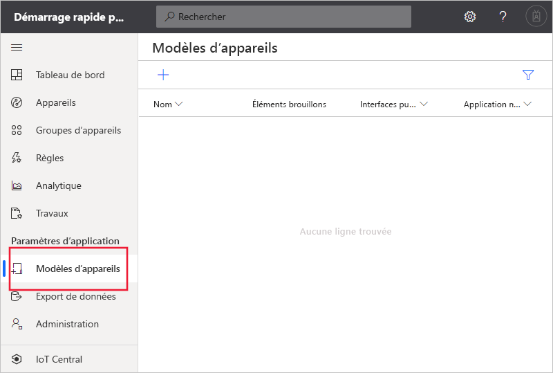
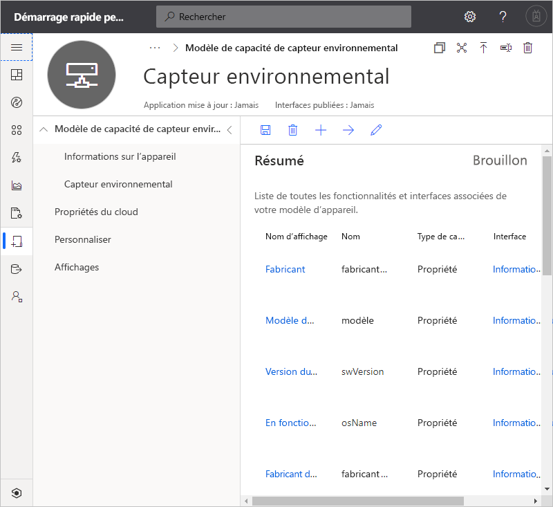
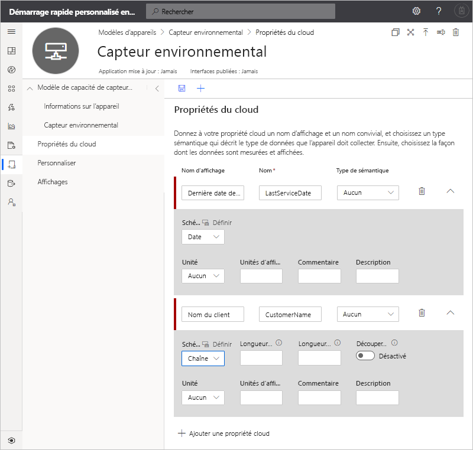
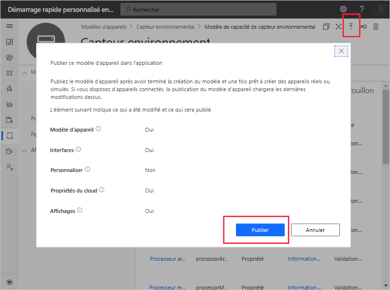
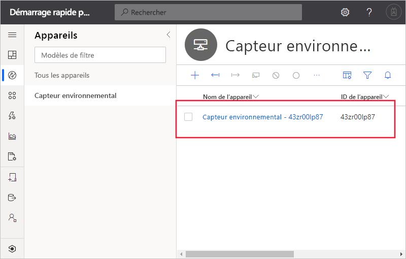
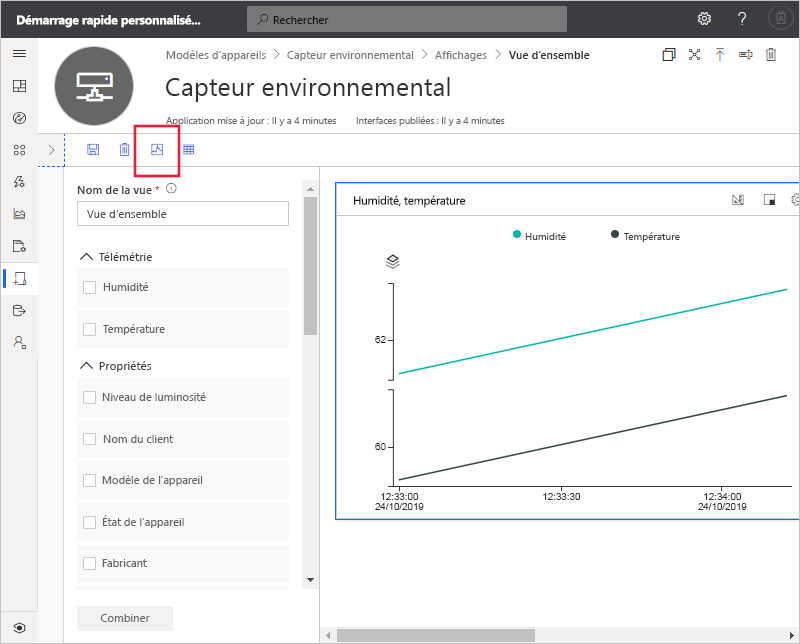

# Démarrage rapide : Ajouter un appareil simulé à votre application IoT Central (fonctionnalités d’évaluation)

*Cet article s’applique aux opérateurs, aux créateurs et aux administrateurs.*

[!INCLUDE [iot-central-pnp-original](../../../includes/iot-central-pnp-original-note.md)]

Un modèle d’appareil définit les fonctionnalités d’un appareil qui se connecte à votre application IoT Central. Les capacités incluent la télémétrie que l’appareil envoie, les propriétés de l’appareil et les commandes auxquelles un appareil répond. À partir d’un modèle d’appareil, un créateur ou un opérateur peut ajouter des appareils réels et simulés à une application. Les appareils simulés sont utiles pour tester le comportement de votre application IoT Central avant de connecter des appareils réels.

Dans ce démarrage rapide, vous créez un modèle d’appareil de **capteur d’environnement** et ajoutez un appareil simulé. Un appareil capteur environnemental :

* Envoie des données de télémétrie comme la température.
* Signale des propriétés propres à l’appareil, telles que le niveau de luminosité.
* Répond aux commandes telles que Activer et Désactiver.
* Signale des propriétés d’appareil génériques, telles que la version du microprogramme et le numéro de série.

## Conditions préalables requises

Suivez le guide de démarrage rapide [Créer une application Azure IoT Central (fonctionnalités en préversion)](./quick-deploy-iot-central.md) pour créer une application IoT Central à l’aide du modèle **Custom app > Preview application** (Application personnalisée > Application en préversion).

Vous avez également besoin d’une copie locale du fichier **EnvironmentalSensorInline.capabilitymodel.json** qui contient le modèle de capacité d’appareil [IoT Plug-and-Play](../../iot-pnp/overview-iot-plug-and-play.md). Vous pouvez le télécharger [ici](https://raw.githubusercontent.com/Azure/IoTPlugandPlay/master/samples/EnvironmentalSensorInline.capabilitymodel.json). Cliquez avec le bouton droit sur la page et sélectionnez **Enregistrer sous**.

Après avoir téléchargé le fichier, ouvrez-le dans un éditeur de texte et remplacez les deux instances de `<YOUR_COMPANY_NAME_HERE>` par votre nom. Utilisez uniquement les caractères a-z, A-Z, 0-9 et le trait de soulignement.

## Créer un modèle

En tant que générateur, vous pouvez créer et modifier les modèles d’appareil dans votre application. Une fois que vous avez publié un modèle d’appareil, vous pouvez générer un appareil simulé ou connecter des appareils réels qui implémentent le modèle d’appareil. Les appareils simulés vous permettent de tester le comportement de votre application avant de connecter un appareil physique.

Pour ajouter un nouveau modèle d’appareil à votre application, accédez à la page **Modèles d’appareil**. Pour ce faire, sélectionnez l’onglet **Modèles d’appareil** dans le volet gauche.

### Ajouter un modèle de capacité d’appareil

Il existe plusieurs options pour créer un modèle de capacité d’appareil dans IoT Central. Vous pouvez choisir de créer un modèle personnalisé à partir de zéro, d’importer à partir d’un fichier, d’effectuer une sélection dans le catalogue d’appareils, ou de connecter un appareil IoT Plug-and-Play par le biais d’une première connexion à l’appareil où le modèle de capacité d’appareil a été publié dans le référentiel public. Dans ce tutoriel, vous importez un modèle de capacité d’appareil à partir d’un fichier.

Les étapes suivantes montrent comment importer le modèle de capacité pour un appareil **Capteur environnemental**. Ces appareils envoient des données de télémétrie, telles que la température, à votre application :

1. Pour ajouter un nouveau modèle d’appareil, sélectionnez **+** dans la page **Modèles d’appareil**.

1. Choisissez **Appareil IoT** dans la liste des modèles d’appareil personnalisés, puis sélectionnez **Suivant : Personnaliser**, puis sélectionnez **Suivant : Examiner**, puis sélectionnez **Créer**.

1. Entrez **Capteur environnemental** comme nom de votre modèle d’appareil.

1. Choisissez **Importer le modèle de capacité** pour créer un modèle de capacité d’appareil à partir d’un fichier JSON. Accédez au dossier dans lequel vous avez enregistré le fichier **EnvironmentalSensorInline.capabilitymodel.json** sur votre ordinateur local. Sélectionnez le fichier **EnvironmentalSensorInline.capabilitymodel.json**, puis sélectionnez **Ouvrir**. Le modèle de capacité de capteur environnemental comprend les interfaces **Capteur environnemental** et **Informations sur l’appareil** :

    

    Ces interfaces définissent les capacités d’un appareil **Capteur environnemental**. Les capacités incluent la télémétrie que l’appareil envoie, les propriétés signalées par un appareil et les commandes auxquelles un appareil répond.

### Ajouter des propriétés du cloud

Un modèle d’appareil peut inclure des propriétés du cloud. Les propriétés du cloud existent uniquement dans l’application IoT Central, et ne sont jamais envoyées à un appareil ni reçues à partir d’un appareil.

1. Sélectionnez **Propriétés du cloud**, puis **+ Ajouter une propriété cloud**. Utilisez les informations du tableau suivant pour ajouter une propriété du cloud à votre modèle d’appareil.

    | Nom d’affichage      | Type sémantique | schéma |
    | ----------------- | ------------- | ------ |
    | Dernière date de service | None          | Date   |
    | Nom du client     | None          | String |

1. Cliquez sur **Enregistrer** pour enregistrer vos modifications :

    

## Créer des vues

En tant que générateur, vous pouvez personnaliser l’application pour présenter des informations pertinentes sur l’appareil capteur environnemental à un opérateur. Vos personnalisations permettent à l’opérateur de gérer l’appareil capteur environnemental raccordé à l’application. Vous pouvez créer deux types de vues permettant à un opérateur d’interagir avec des appareils :

* Formulaires pour voir et modifier les propriétés de l’appareil et du cloud
* Tableaux de bord pour visualiser les appareils

### Générer des vues par défaut

La génération de vues par défaut permet de visualiser rapidement les informations importantes de votre appareil. Vous pouvez avoir jusqu’à trois vues par défaut générées pour votre modèle d’appareil :

* La vue **Commandes** permet à votre opérateur d’envoyer des commandes à votre appareil.
* La vue **Vue d’ensemble** utilise des graphiques et des métriques pour afficher les données de télémétrie des appareils.
* La vue **À propos** affiche les propriétés de l’appareil.

Sélectionnez **Vues**, puis **Générer des vues par défaut**.

### Configurer une vue pour visualiser des appareils

Un tableau de bord d’appareil permet à un opérateur de visualiser un appareil à l’aide de graphiques et de métriques. En tant que générateur, vous pouvez définir les informations qui s’affichent sur le tableau de bord d’un appareil. Vous pouvez définir plusieurs tableaux de bord pour les appareils. Pour créer un tableau de bord afin de visualiser la télémétrie du capteur environnemental, sélectionnez **Vues**, puis **Visualisation de l’appareil** :

1. Toutes les propriétés de l’appareil, les propriétés du cloud, les données de télémétrie et les options statiques sont listées sous **Propriétés**. Vous pouvez glisser-déplacer l’un de ces éléments dans la vue. Faites glisser la propriété **Niveau de luminosité** sur la vue. Vous pouvez configurer la vignette à l’aide de l’icône d’engrenage.

1. Pour ajouter un graphique des données de télémétrie, sélectionnez **Humidité** et **Température**, puis **Combiner**. Pour voir ce graphique dans un autre format tel qu’un graphique à secteurs ou un histogramme, sélectionnez le bouton **Changer de visualisation** en haut de la vignette.

1. Cliquez sur **Enregistrer** pour enregistrer votre vue :

Vous pouvez ajouter d’autres vignettes qui affichent d’autres propriétés ou valeurs de télémétrie. Vous pouvez également ajouter du texte statique, des liens et des images. Pour déplacer ou redimensionner une vignette sur le tableau de bord, déplacez le pointeur de souris sur la vignette, puis faites-la glisser vers un nouvel emplacement ou redimensionnez-la.

### Ajouter un formulaire d’appareil

Un formulaire d’appareil permet à un opérateur de modifier les propriétés de l’appareil et les propriétés du cloud accessibles en écriture. En tant que générateur, vous pouvez définir plusieurs formulaires et choisir les propriétés de l’appareil et du cloud à afficher sur chaque formulaire. Vous pouvez également afficher des propriétés d’appareil en lecture seule sur un formulaire.

Pour créer un formulaire afin de voir et de modifier les propriétés d’un capteur environnemental

1. Accédez à **Vues** dans le modèle **Capteur environnemental**. Sélectionnez la vignette **Modification des données de l’appareil et du cloud** pour ajouter une nouvelle vue.

1. Entrez le nom de formulaire **Propriétés du capteur environnemental**.

1. Faites glisser les propriétés du cloud **Nom du client** et **Dernière date de service** sur la section existante du formulaire.

1. Sélectionnez les propriétés de l’appareil **Niveau de luminosité** et **État de l’appareil**. Sélectionnez ensuite **Ajouter une section**. Remplacez le titre de la section par **Propriétés du capteur**. Sélectionnez **Appliquer**.

1. Sélectionnez les propriétés d’appareil **Modèle d’appareil**, **Version du logiciel**, **Fabricant** et **Fabricant de processeur**. Sélectionnez ensuite **Ajouter une section**. Remplacez le titre de la section par **Propriétés de l’appareil**. Sélectionnez **Appliquer**.

1. Cliquez sur **Enregistrer** pour enregistrer votre vue.

## Publier le modèle d’appareil

Avant de pouvoir créer un capteur environnemental simulé ou connecter un capteur environnemental réel, vous devez publier votre modèle d’appareil.

Pour publier un modèle d’appareil

1. Accédez à votre modèle d’appareil à partir de la page **Modèles d’appareil**.

1. Sélectionnez **Publier**.

1. Dans la boîte de dialogue **Publier un modèle d’appareil**, choisissez **Publier** :

    

Une fois qu’un modèle d’appareil a été publié, il est visible dans la page **Appareils** et par l’opérateur. Dans un modèle d’appareil publié, vous ne pouvez pas modifier un modèle de capacité d’appareil sans créer de nouvelle version. En revanche, vous pouvez effectuer des mises à jour des propriétés du cloud, des personnalisations et des vues dans un modèle d’appareil publié sans gestion des versions. Après avoir apporté des modifications, sélectionnez **Publier** pour envoyer ces modifications à votre opérateur.

## Utiliser un appareil simulé

Pour ajouter un appareil simulé à votre application, vous utilisez le modèle d’appareil de **capteur environnemental** que vous avez créé.

1. Pour ajouter un nouvel appareil en tant qu’opérateur, choisissez **Appareils** dans le volet de gauche. L’onglet **Appareils** affiche **Tous les appareils** et le modèle d’appareil **Capteur environnemental**. Sélectionnez **Capteur environnemental**.

1. Pour ajouter un appareil capteur environnemental simulé, sélectionnez **+ Nouveau**. Utilisez l’**ID d’appareil** suggéré ou entrez votre propre **ID d’appareil** en minuscules. Vous pouvez également entrer un nom pour votre nouvel appareil. Basculez le bouton **simulé** sur **On**, puis sélectionnez **Créer**.

    

Vous pouvez désormais interagir avec les vues qui ont été créées par le générateur pour le modèle d’appareil à l’aide de données simulées.

## Utiliser un appareil simulé pour améliorer les vues

Une fois que vous avez créé un appareil simulé, le générateur peut utiliser cet appareil pour continuer à améliorer les vues du modèle d’appareil.

1. Choisissez **Modèles d’appareil** dans le volet gauche, puis sélectionnez le modèle **Capteur environnemental**.

1. Sélectionnez l’une des vues que vous souhaitez modifier, ou créez une nouvelle vue. Cliquez sur **Configurer l’appareil de préversion**, puis **Sélectionner à partir d’un d’appareil en cours d’exécution**. Vous pouvez choisir entre n’avoir aucun appareil de préversion, utiliser un appareil réel que vous pouvez configurer à des fins de test et choisir un appareil existant que vous avez ajouté dans IoT Central.

1. Choisissez votre appareil simulé dans la liste. Sélectionnez ensuite **Appliquer**. Vous pouvez maintenant voir le même appareil simulé dans votre expérience de génération de vues de modèle d’appareil. Cette vue est utile pour les graphiques et autres visualisations.

    

## Étapes suivantes

Dans ce démarrage rapide, vous avez appris à créer un modèle d’appareil de **capteur environnemental** et à ajouter un appareil simulé à votre application.

Pour en savoir plus sur la surveillance des appareils connectés à votre application, passez au démarrage rapide :

> [!div class="nextstepaction"]
> [Configurer des règles et des actions](./quick-configure-rules.md)
