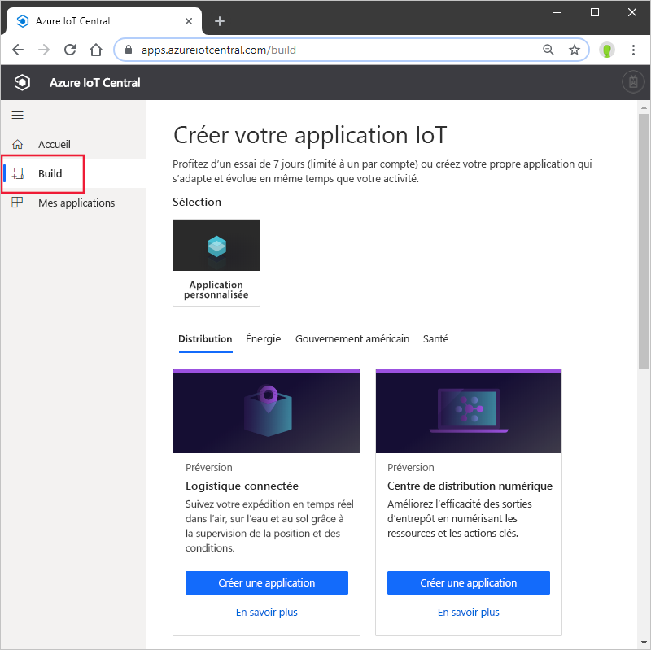
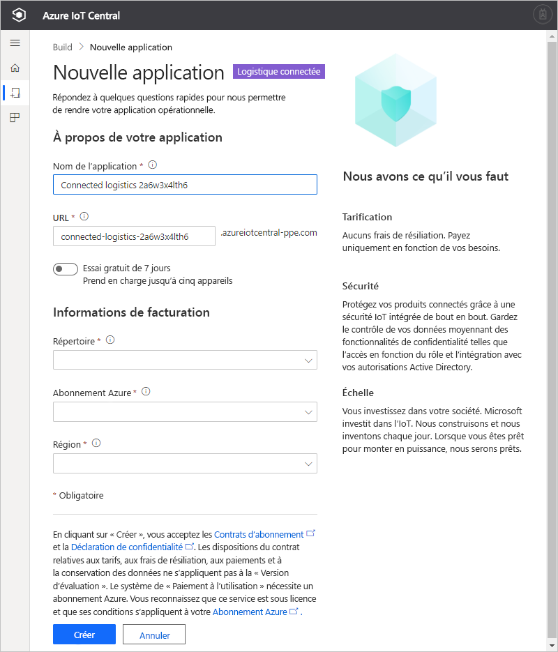

# Créer une application Azure IoT Central (fonctionnalités en préversion)

[!INCLUDE [iot-central-pnp-original](../../../includes/iot-central-pnp-original-note.md)]

Ce guide de démarrage rapide vous explique comment créer une application Azure IoT Central qui contient des fonctionnalités d’évaluation telles qu’IoT Plug-and-Play.

> [!WARNING]
> Les fonctionnalités IoT Plug-and-Play dans Azure IoT Central sont actuellement en préversion publique. N’utilisez pas une application IoT Central sur laquelle IoT Plug-and-Play est activé pour les charges de travail de production. Pour les environnements de production, utilisez une application IoT Central créée à partir d’un modèle d’application actuel, généralement disponible.

## Créer une application

Accédez au site de [création d’applications Azure IoT Central](https://aka.ms/iotcentral). Ensuite, connectez-vous avec un compte Microsoft personnel, scolaire ou professionnel.

Vous pouvez créer une application à partir de la liste des modèles IoT Central sectoriels pour démarrer rapidement ou la créer en partant de zéro à l’aide du modèle **Application personnalisée**.

Pour créer une nouvelle application Azure IoT Central :

1. Pour créer une application Azure IoT Central à partir d’un *modèle sectoriel*, sélectionnez un modèle d’application dans la liste des modèles disponibles sous l’un des secteurs d’activité. Vous pouvez également partir de zéro en choisissant *Application personnalisée*.
1. Azure IoT Central suggère automatiquement un **nom d’application** basé sur le modèle d’application que vous avez sélectionné. Vous pouvez utiliser ce nom ou choisir un nom d’application convivial.
1. Azure IoT Central génère automatiquement une **URL d’application** unique, basée sur le nom de l’application. Vous utiliserez cette URL pour accéder à votre application. Si vous le souhaitez, vous pouvez remplacer ce préfixe d’URL par une chaîne plus facile à mémoriser.

    

    > [!NOTE]
    > Si vous utilisez le modèle Application personnalisée, le champ **Modèle d’application** apparaît dans la liste déroulante. À partir de là, vous pouvez basculer entre les modèles disponibles en préversion et les modèles généralement disponibles. Vous pouvez également voir d’autres modèles mis à la disposition de votre organisation.

1. Choisissez de créer cette application avec une évaluation gratuite de sept jours ou avec un abonnement Paiement à l’utilisation.
    - Les applications **d’évaluation** sont gratuites pendant sept jours et prennent en charge jusqu’à cinq appareils. Elles peuvent être passées en paiement à l’utilisation à tout moment avant leur expiration. Si vous créez une application en essai gratuit (Trial), entrez vos coordonnées et indiquez si vous souhaitez recevoir des informations et des conseils de la part de Microsoft.
    - Les applications avec **paiement à l’utilisation** sont facturées par appareil, les deux premiers étant gratuits. Apprenez-en davantage sur les [tarifs d’IoT Central](https://aka.ms/iotcentral-pricing). Si vous créez une application avec paiement à l’utilisation, vous devez sélectionner votre *Annuaire*, votre *Abonnement Azure* et votre *Emplacement* :
        - *Annuaire* correspond à l’annuaire Azure Active Directory (AAD) dans lequel vous allez créer votre application. Un annuaire Azure AD contient les identités et les informations d’identification des utilisateurs, ainsi que d’autres informations propres à l’organisation. Si vous n’avez pas d’annuaire Azure AD, il s’en crée un automatiquement quand vous créez un abonnement Azure.
        - Un *Abonnement Azure* vous permet de créer des instances de services Azure. IoT Central provisionne des ressources dans votre abonnement. Si vous n’avez pas d’abonnement Azure, vous pouvez en créer un dans la [page d’inscription à Azure](https://aka.ms/createazuresubscription). Après avoir créé l’abonnement Azure, revenez à la page **Créer une application**. Votre nouvel abonnement apparaîtra dans la liste déroulante **Abonnement Azure**.
        - L’*Emplacement* correspond à la [zone géographique](https://azure.microsoft.com/global-infrastructure/geographies/) où vous souhaitez créer votre application. D'une façon générale, il est recommandé de choisir l'emplacement qui est physiquement le plus proche de vos appareils pour obtenir des performances optimales. La préversion publique d’Azure IoT Central est actuellement disponible aux **États-Unis** et en **Europe**. Une fois que vous aurez choisi un emplacement, vous ne pourrez plus déplacer votre application vers un autre emplacement.

        > [!NOTE]
        > Dans le cadre de la préversion publique, les seuls emplacements disponibles pour les **applications en préversion** sont l’**Europe** et les **États-Unis**.

1. Consultez les Conditions d’utilisation et sélectionnez **Créer** en bas de la page.

## Étapes suivantes

En suivant ce guide de démarrage rapide, vous avez créé une application IoT Central. Voici la prochaine étape suggérée :

> [!div class="nextstepaction"]
> [Ajouter un appareil simulé à votre application IoT Central](./quick-create-pnp-device.md)
