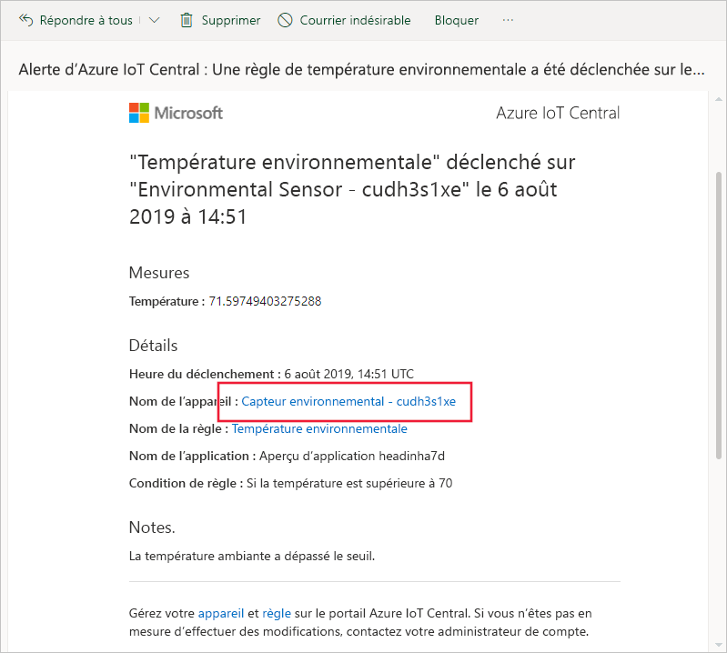
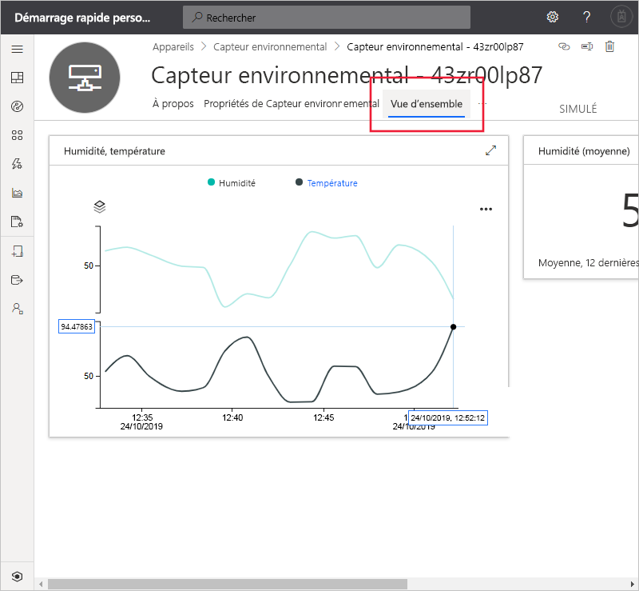
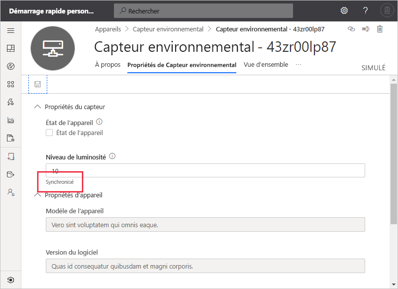

# Démarrage rapide : Utiliser Azure IoT Central pour superviser vos appareils (fonctionnalités de préversion)

*Cet article s’applique aux opérateurs, aux créateurs et aux administrateurs.*

[!INCLUDE [iot-central-pnp-original](../../../includes/iot-central-pnp-original-note.md)]

Ce démarrage rapide vous explique comment, en tant qu'opérateur, vous pouvez utiliser votre application Microsoft Azure IoT Central pour surveiller vos appareils et modifier les paramètres.

## Conditions préalables requises

Avant de commencer, vous devez suivre les trois guides de démarrage rapide précédents : [Créer une application Azure IoT Central](./quick-deploy-iot-central.md), [Ajouter un appareil simulé à votre application IoT Central](./quick-create-pnp-device.md) et [Configurer des règles et des actions pour votre appareil](quick-configure-rules.md).

## Recevoir une notification

Azure IoT Central envoie des notifications sur les appareils sous forme de courriers électroniques. Le générateur a ajouté une règle pour envoyer une notification quand la température dans un capteur environnemental connecté dépasse un seuil. Consultez les courriers électroniques envoyés au compte choisi par le générateur pour recevoir des notifications.

Ouvrez le courrier électronique que vous avez reçu à la fin du guide de démarrage rapide [Configurer des règles et des actions pour votre appareil](quick-configure-rules.md). Dans l’e-mail, sélectionnez le lien vers l’appareil :

La vue **Tableau de bord** de l'appareil simulé Capteur environnemental que vous avez créé dans les guides de démarrage rapide précédents s'ouvre dans votre navigateur :

## Analyser un problème

En tant qu'opérateur, vous pouvez consulter les informations relatives à l'appareil sur les pages **Vue d'ensemble**, **Propriétés du capteur environnemental** et **Commandes**. Le générateur a personnalisé les pages **Tableau de bord** et **Propriétés de Capteur environnemental** pour voir des informations importantes sur un appareil capteur environnemental connecté.

Choisissez **Vue d'ensemble** pour consulter les informations relatives à l'appareil.

Le graphique sur le tableau de bord affiche un tracé de la température de l’appareil. Vous jugez que la température de l'appareil est trop élevée.

## Résoudre un problème

Pour apporter une modification à l'appareil, utilisez la page **Propriétés du capteur environnemental**.

Choisissez **Propriétés de Capteur environnemental**. Affectez la valeur 10 au **Niveau de luminosité**. Choisissez **Enregistrer** pour mettre à jour l’appareil. Quand l’appareil confirme la modification du paramètre, l’état de la propriété passe à **synchronisé** :

## Étapes suivantes

Dans ce démarrage rapide, vous avez appris comment :

* Recevoir une notification
* Analyser un problème
* Résoudre un problème

Maintenant que vous savez comment superviser votre appareil, vous pouvez passer à l’étape suivante :

> [!div class="nextstepaction"]
> [Créer et gérer un modèle d'appareil](howto-set-up-template.md).
