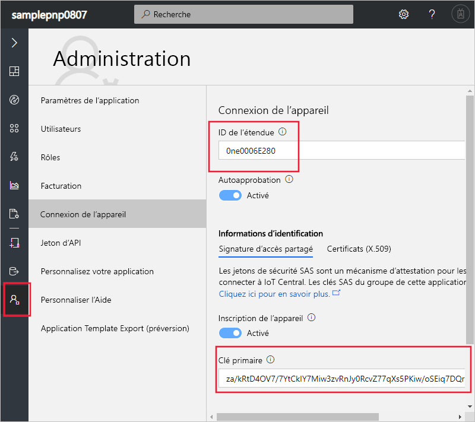
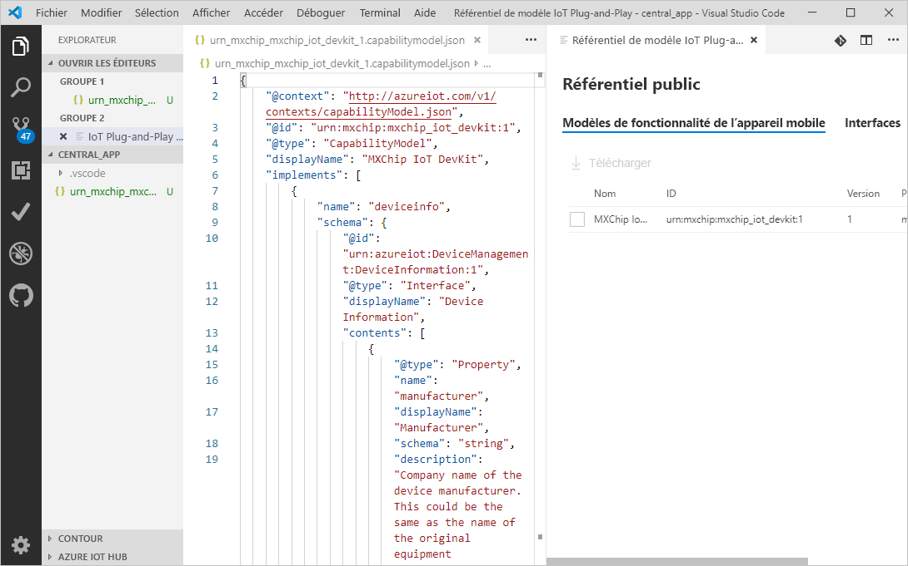
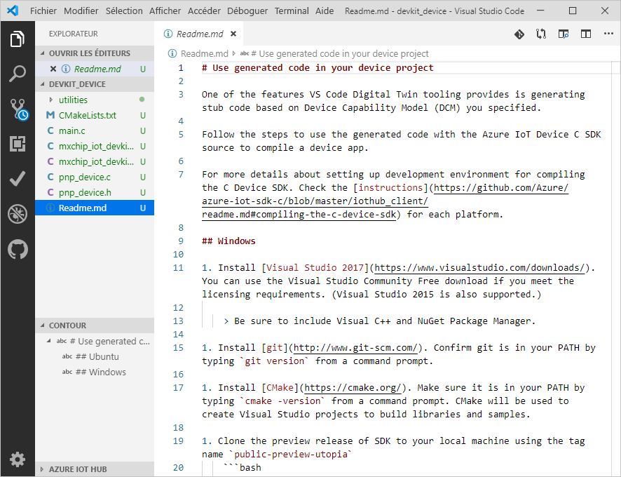
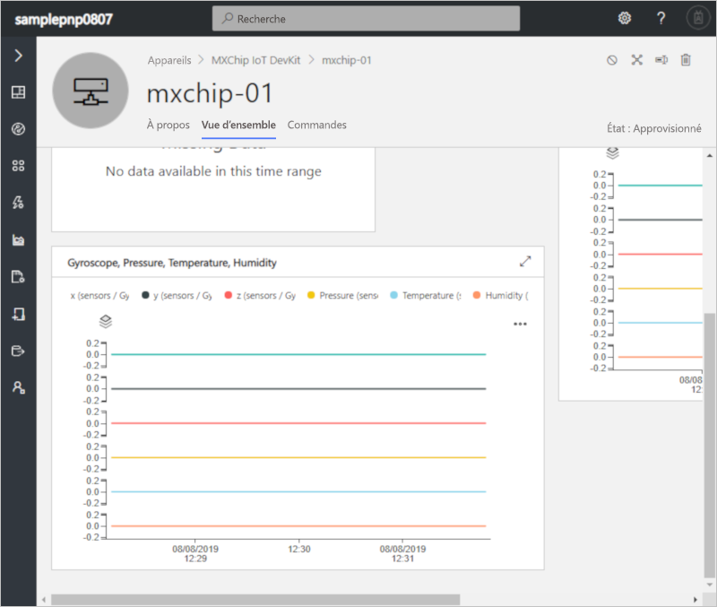
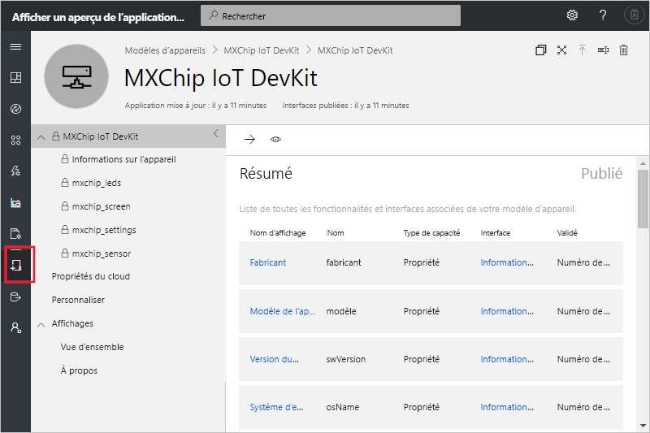

# <a name="quickstart-use-a-device-capability-model-to-create-an-iot-plug-and-play-device-and-connect-it-to-your-iot-central-application"></a>Démarrage rapide : Utiliser un modèle de fonctionnalité d’appareil mobile pour créer un appareil IoT Plug-and-Play et le connecter à votre application IoT Central

[!INCLUDE [iot-central-pnp-original](../../includes/iot-central-pnp-original-note.md)]

Un _modèle de fonctionnalité d’appareil_ décrit les fonctionnalités d’un appareil [IoT Plug-and-Play](../iot-pnp/overview-iot-plug-and-play.md). IoT Central peut utiliser un modèle de fonctionnalité d’appareil pour créer un modèle d’appareil et des visualisations pour un appareil quand l’appareil se connecte pour la première fois. Ce démarrage rapide vous montre comment :

* Utilisez Visual Studio Code pour créer un appareil IoT Plug-and-Play à l’aide d’un modèle de fonctionnalité d’appareil.
* Exécutez le code de l’appareil dans Windows et vérifiez qu’il se connecte à votre application IoT Central.
* Affichez la télémétrie simulée que l’appareil envoie.

## <a name="prerequisites"></a>Prérequis

Suivez le démarrage rapide [Créer une application Azure IoT central (fonctionnalités en préversion)](./quick-deploy-iot-central-pnp.md?toc=/azure/iot-central-pnp/toc.json&bc=/azure/iot-central-pnp/breadcrumb/toc.json) pour créer une application IoT Central à l’aide du modèle d’**application en préversion**.

Pour suivre ce démarrage rapide, vous devez installer les logiciels suivants sur votre machine locale :

* [Visual Studio (Community, Professional ou Enterprise)](https://visualstudio.microsoft.com/downloads/) : assurez-vous d’inclure le composant **Gestionnaire de package NuGet** et la charge de travail **Développement Desktop en C++** lorsque vous installez Visual Studio.
* [Git](https://git-scm.com/download/).
* [CMake](https://cmake.org/download/) : lorsque vous installez **CMake**, sélectionnez l’option **Add CMake to the system PATH (Ajouter CMake au chemin d’accès système)** .
* [Visual Studio Code](https://code.visualstudio.com/).
* [Node.JS](https://nodejs.org/)
* L’utilitaire `dps-keygen` :

    ```cmd/sh
    npm i -g dps-keygen
    ```

### <a name="install-azure-iot-tools"></a>Installer Azure IoT Tools

Pour installer le pack d’extension Azure IoT Tools dans VS Code, effectuez les étapes suivantes :

1. Dans VS Code, sélectionnez l’onglet **Extensions**.
1. Recherchez **Azure IoT Tools**.
1. Sélectionnez **Installer**.

## <a name="prepare-the-development-environment"></a>Préparer l’environnement de développement

### <a name="get-azure-iot-device-sdk-for-c"></a>Se procurer Azure IoT device SDK pour C

Préparez un environnement de développement pour générer le Azure IoT device SDK pour C.

1. Ouvrez une invite de commandes. Exécutez la commande suivante pour cloner le référentiel GitHub du [Kit de développement logiciel (SDK) Azure IoT pour C](https://github.com/Azure/azure-iot-sdk-c) :

    ```cmd/sh
    git clone https://github.com/Azure/azure-iot-sdk-c --recursive -b public-preview
    ```

    Attendez-vous à ce que cette opération prenne plusieurs minutes.

1. Créez un dossier `central_app` à la racine du clone local du dépôt. Vous utilisez ce dossier pour les fichiers de modèle d’appareil et le stub de code d’appareil.

    ```cmd/sh
    cd azure-iot-sdk-c
    mkdir central_app
    ```

## <a name="generate-device-key"></a>Générer la clé de l’appareil

Pour connecter un appareil à une application IoT Central, vous avez besoin d’une clé d’appareil. Pour générer une clé d’appareil :

1. Connectez-vous à l’application IoT Central que vous avez créée dans le démarrage rapide précédent.

1. Accédez à la page **Administration** et sélectionnez **Connexion de l’appareil**.

1. Prenez note des valeurs **ID de portée** et **Clé principale**. Vous utiliserez ces valeurs plus loin dans ce démarrage rapide.

    

1. Ouvrez une invite de commandes et exécutez la commande suivante pour générer une clé d’appareil :

    ```cmd/sh
    dps-keygen  -di:mxchip-01 -mk:{Primary Key from previous step}
    ```

    Prenez note de la _clé d’appareil_ générée. Vous utiliserez cette valeur dans une étape ultérieure de ce démarrage rapide.

## <a name="download-your-model"></a>Télécharger votre modèle

Dans ce démarrage rapide, vous utilisez le modèle de fonctionnalité d’appareil public pour un appareil MxChip IoT DevKit. Vous n’avez pas besoin d’un appareil DevKit réel pour exécuter le code. Dans ce démarrage rapide, vous compilez le code à exécuter sur Windows.

1. Ouvrez le dossier `azure-iot-sdk-c\central_app` avec VS Code.

1. Utilisez **Ctrl + Maj + P** pour ouvrir la palette de commandes, entrez **IoT Plug-and-Play**, puis sélectionnez **Open Model Repository (Ouvrir le référentiel de modèles)** . Sélectionnez **Public repository (Référentiel public)** . VS Code affiche une liste des modèles de fonctionnalités d’appareils dans le référentiel de modèles public.

1. Sélectionnez le modèle de fonctionnalité d’appareil **MXChip IoT DevKit** avec l’ID `urn:mxchip:mxchip_iot_devkit:1`. Ensuite, sélectionnez **Télécharger**. Vous disposez maintenant d’une copie du modèle de fonctionnalité d’appareil dans le dossier `central_app`.



> [!NOTE]
> Pour utiliser IoT Central, le modèle de fonctionnalité d’appareil doit avoir toutes les interfaces définies inline dans le même fichier.

## <a name="generate-the-c-code-stub"></a>Générer le stub de code C

Maintenant que vous avez le modèle de fonctionnalité d’appareil **MXChip IoT DevKit** et ses interfaces associées, vous pouvez générer le code de l’appareil qui implémente le modèle. Pour générer le stub de code C dans VS Code :

1. Avec le dossier contenant les fichiers DCM ouverts, utilisez **Ctrl + Maj + P** pour ouvrir la palette de commandes, entrez **IoT Plug-and-Play**, puis sélectionnez **Generate Device Code Stub (Générer le stub de code de l’appareil)** .

    > [!NOTE]
    > La première fois que vous utilisez l’outil de génération de code IoT Plug-and-Play, le téléchargement prend quelques secondes.

1. Sélectionnez le fichier de modèle de fonctionnalité d’appareil **MXChip IoT DevKit** que vous venez de télécharger.

1. Entrez le nom du projet **devkit_device**.

1. Choisissez **ANSI C** comme langage.

1. Choisissez **Projet CMake** comme type de projet. Ne choisissez pas **Projet MXChip IoT DevKit**. Cette option est prévue pour les appareils DevKit réel.

1. Choisissez la méthode de connexion **Via DPS (Device Provisioning Service) symmetric key (Avec une clé symétrique DPS (service Device Provisioning))** .

1. VS Code ouvre une nouvelle fenêtre avec les fichiers de stub de code d’appareil générés dans le dossier `devkit_device`.



Pour ajouter les informations de connexion au code d’appareil généré :

1. Dans la fenêtre VS Code qui contient le code C généré. Ouvrez le fichier `main.c` .

1. Remplacez `[DPS Id Scope]` par l’**ID de portée** que vous avez noté précédemment.

1. Remplacez `[DPS symmetric key]` par la clé d’appareil que vous avez générée lors d’une étape précédente.

1. Remplacez `[device registration Id]` par `mxchip-01`.

1. Enregistrez vos modifications.

## <a name="build-the-code"></a>Générer le code

Vous utilisez le SDK d’appareil pour générer le stub de code d’appareil généré. L’application que vous créez simule un appareil **MXChip IoT DevKit** et se connecte à votre application IoT central. L’application envoie les données de télémétrie et les propriétés et reçoit des commandes.

1. Dans VS Code, ouvrez le fichier `CMakeLists.txt` dans le dossier `azure-iot-sdk-c`. Veillez à ouvrir le fichier `CMakeLists.txt` du dossier `azure-iot-sdk-c`, et non celui du dossier `devkit_device`.

1. Ajoutez la ligne ci-dessous au bas du fichier `CMakeLists.txt` pour inclure le dossier stub de code de l’appareil lors de la compilation :

    ```txt
    add_subdirectory(central_app/devkit_device)
    ```

1. Créez un dossier `cmake` dans le dossier `azure-iot-sdk-c`, puis accédez à ce dossier à partir d’une invite de commandes :

    ```cmd\sh
    mkdir cmake
    cd cmake
    ```

1. Exécutez les commandes suivantes pour générer le SDK d’appareil et le stub de code généré :

    ```cmd\sh
    cmake .. -Duse_prov_client=ON -Dhsm_type_symm_key:BOOL=ON
    cmake --build . -- /m /p:Configuration=Release
    ```

1. Une fois la création terminée, à la même invite de commandes, exécutez votre application :

    ```cmd\sh
    .\central_app\devkit_device\Release\devkit_device.exe
    ```

1. L’application de l’appareil commence à envoyer des données à votre application IoT Central.

## <a name="view-the-device"></a>Afficher l’appareil

Une fois que le code de votre appareil se connecte à votre application IoT Central, vous pouvez afficher les propriétés et télémétrie qu’il envoie :

1. Dans votre application IoT Central, accédez à la page **Appareils**, puis sélectionnez l’appareil **mxchip-01**. Cet appareil a été automatiquement ajouté quand le code de l’appareil s’est connecté :

    

    Après quelques minutes, cette page affiche les graphiques des données de télémétrie que l’appareil envoie.

1. Sélectionnez la page **À propos de** pour afficher les valeurs de propriété que l’appareil a envoyées.

1. Sélectionnez la page **Commandes** pour appeler des commandes sur l’appareil. Vous pouvez voir que l’appareil répond à l’invite de commandes qui exécute le code de l’appareil.

1. Accédez à la page **Modèles d’appareil** pour voir le modèle que IoT central a créé à partir du modèle de fonctionnalité d’appareil dans le référentiel public :

    

## <a name="next-steps"></a>Étapes suivantes

Dans ce démarrage rapide, vous avez appris à connecter un appareil IoT Plug-and-Play qui a été généré à partir d’un modèle de fonctionnalité d’appareil dans le référentiel de modèles public.

Pour en savoir plus sur les modèles de fonctionnalités d’appareils et sur la façon de créer vos propres modèles, poursuivez avec le guide pratique :

> [!div class="nextstepaction"]
> [Configurer et gérer un modèle d’appareil](./howto-set-up-template-pnp.md?toc=/azure/iot-central-pnp/toc.json&bc=/azure/iot-central-pnp/breadcrumb/toc.json)
