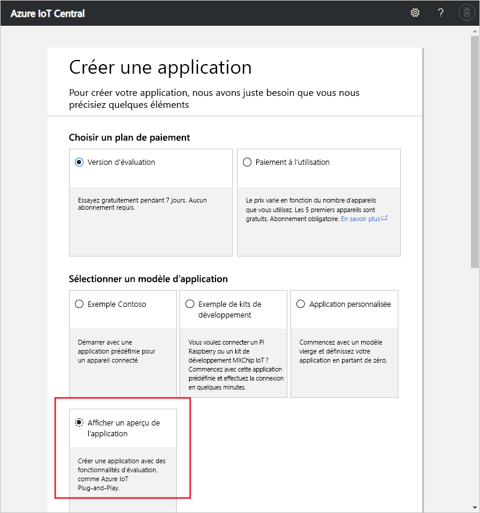

# Créer une application Azure IoT Central (fonctionnalités en préversion)

[!INCLUDE [iot-central-pnp-original](../../includes/iot-central-pnp-original-note.md)]

Ce démarrage rapide vous montre comment créer une application Azure IoT Central qui utilise des fonctionnalités en préversion, notamment IoT Plug-and-Play.

> [!WARNING]
> Les fonctionnalités IoT Plug-and-Play dans Azure IoT Central sont actuellement en préversion publique. N’utilisez pas une application IoT Central sur laquelle IoT Plug-and-Play est activé pour les charges de travail de production. Pour les environnements de production, utilisez une application IoT Central créée à partir d’un modèle d’application actuel, généralement disponible.

## Création d'une application

Accédez au site web [Gestionnaire d’applications Azure IoT Central](https://aka.ms/iotcentral). Ensuite, connectez-vous avec un compte Microsoft personnel, scolaire ou professionnel.

Pour commencer à créer une application Azure IoT Central, sélectionnez **Nouvelle application**. Ce lien vous amène à la page **Créer une application**.

Pour créer une application Azure IoT Central qui utilise des fonctionnalités en préversion, notamment IoT Plug-and-Play :

1. Choisissez un plan de paiement :
   - Les applications **à l’essai** sont gratuites pendant sept jours avant leur expiration. Elles peuvent être passées en paiement à l’utilisation à tout moment avant leur expiration. Si vous créez une application **d’évaluation**, entrez vos coordonnées et choisissez si vous souhaitez recevoir des informations et des conseils de la part de Microsoft.
   - Les applications avec **paiement à l’utilisation** sont facturées par appareil : les 5 premiers sont gratuits. Si vous créez une application avec **paiement à l’utilisation**, sélectionnez votre *Répertoire*, votre *Abonnement Azure* et votre *Région* :
      - *Annuaire* correspond à l’annuaire Azure Active Directory (AD) servant à créer votre application. Il contient les identités des utilisateurs, les informations d’identification et d’autres informations de l’organisation. Si vous n’avez pas d’annuaire Azure AD, il s’en crée un automatiquement quand vous créez un abonnement Azure.
      - Un *Abonnement Azure* vous permet de créer des instances de services Azure. IoT Central approvisionne des ressources dans votre abonnement. Si vous n’avez pas d’abonnement Azure, vous pouvez en créer un dans la [page d’inscription à Azure](https://aka.ms/createazuresubscription). Après avoir créé l’abonnement Azure, revenez à la page **Créer une application**. Votre nouvel abonnement apparaît dans la liste déroulante **Abonnement Azure**.
      - La *Région* est l’emplacement physique où vous souhaitez créer votre application. D’une façon générale, il est recommandé de choisir la région qui est physiquement la plus proche de vos appareils, de façon à obtenir des performances optimales. Vous pouvez voir les régions dans lesquelles Azure IoT Central est disponible dans la page [Disponibilité des produits par région](https://azure.microsoft.com/regions/services/). Une fois que vous aurez choisi une région, vous ne pourrez plus déplacer votre application dans une autre région.

      Apprenez-en davantage au sujet de la tarification sur la [page de tarification d’Azure IoT Central](https://azure.microsoft.com/pricing/details/iot-central/).

1. Choisissez un nom d’application convivial, tel que **Contoso IoT**. Azure IoT Central génère un préfixe d’URL unique pour vous. Vous pouvez remplacer ce préfixe d’URL par une chaîne plus facile à mémoriser.

1. Choisissez le modèle d’application **Preview application** (Application en préversion). Un modèle d’application peut contenir des éléments prédéfinis, comme des modèles d’appareil et des tableaux de bord pour vous aider à démarrer.

1. Au bas de la page, sélectionnez **Créer**.

## Étapes suivantes

En suivant ce démarrage rapide, vous avez créé une application IoT Central qui utilise des fonctionnalités en préversion. Voici la prochaine étape suggérée :

> [!div class="nextstepaction"]
> [Définir un nouveau type d’appareil dans votre application Azure IoT Central](./tutorial-define-device-type-pnp.md?toc=/azure/iot-central-pnp/toc.json&bc=/azure/iot-central-pnp/breadcrumb/toc.json)
