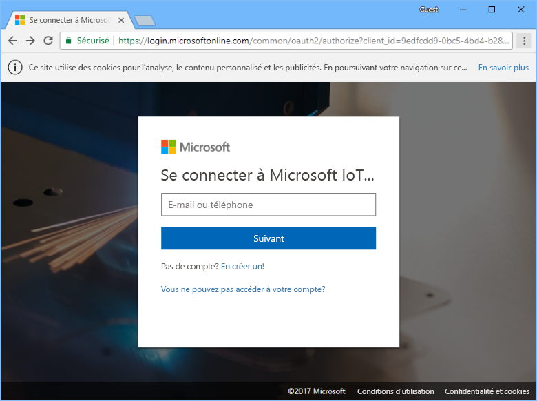
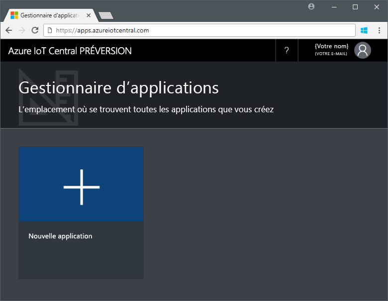
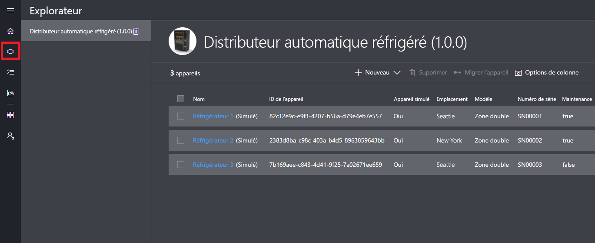
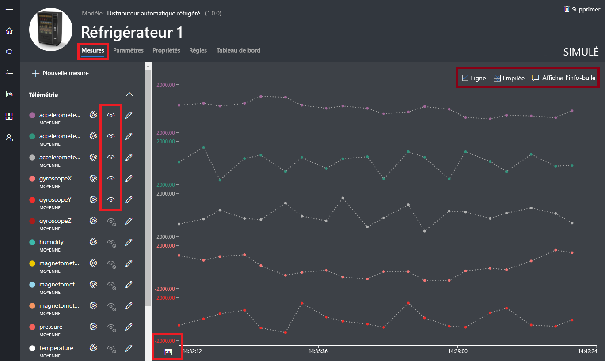
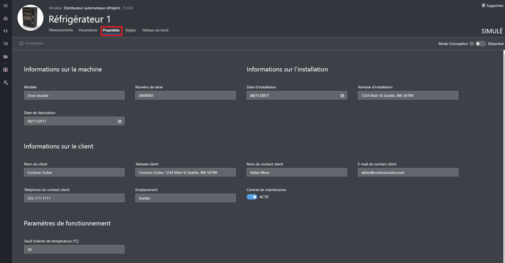
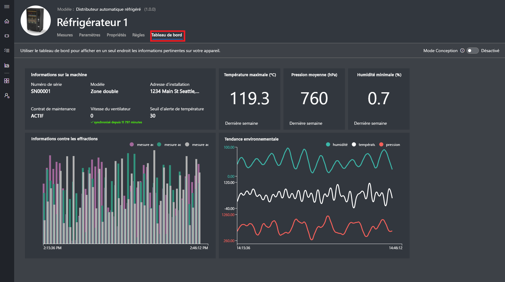
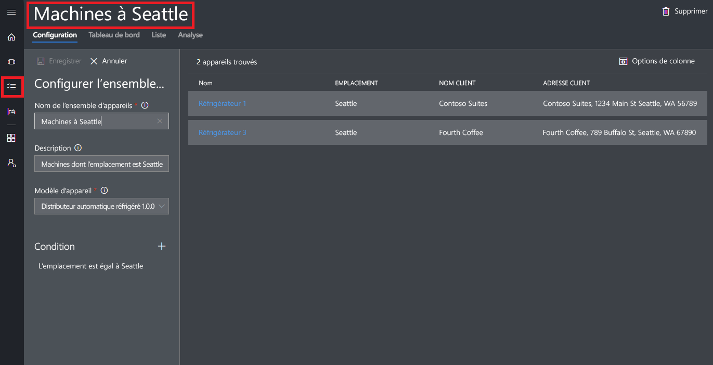
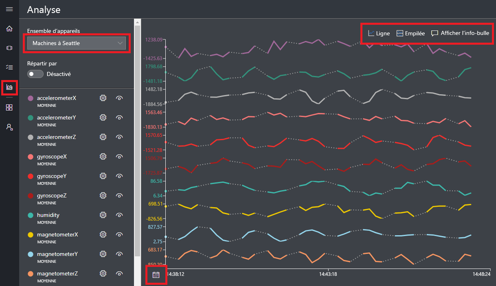

# Créer une application Azure IoT Central

En tant que _générateur_, vous utilisez l’interface utilisateur d’Azure IoT Central pour définir votre application Microsoft Azure IoT Central. Ce démarrage rapide vous montre comment :

- Créez une application Azure IoT Central qui contient un exemple de _modèle d’appareil_ et des _appareils_ simulés.
- Affichez les fonctionnalités du modèle d’appareil **Machine de distribution réfrigérée** dans votre application.
- Affichez les données de télémétrie et l’analyse de vos appareils **Réfrigérateur** simulés.

Dans ce guide de démarrage rapide, vous affichez un appareil **Réfrigérateur** simulé à partir d’un modèle d’appareil. L’appareil simulé :

* Envoie des données de télémétrie, comme la température et la pression, à votre application.
* Rapporte des valeurs de propriété d’appareil, comme une alerte de mouvement, à votre application.
* Comprend des paramètres d’appareil, comme la vitesse du ventilateur, que vous pouvez définir dans l’application.

Lorsque vous créez un appareil simulé à partir d’un modèle d’appareil dans une application Azure IoT Central, l’appareil simulé vous permet de tester votre application avant de raccorder un appareil réel.

## Création de l'application

Pour effectuer ce guide de démarrage rapide, vous devez créer une application Azure IoT Central à partir du modèle d’application **Sample Contoso** (Exemple Contoso).

Accédez à la page [Application Manager](https://aka.ms/iotcentral) (Gestionnaire d’applications) d’Azure IoT Central. Ensuite, entrez l’adresse e-mail et le mot de passe que vous utilisez pour accéder à votre abonnement Azure :

Pour commencer à créer une application Azure IoT Central, choisissez **Nouvelle application** :

Pour créer une nouvelle application Azure IoT Central :

1. Choisissez le plan de paiement **Free Trial Application** (Version d’évaluation gratuite).
1. Choisissez un nom d’application convivial, tel que **Contoso IoT**. Azure IoT Central génère un préfixe d’URL unique pour vous. Vous pouvez remplacer ce préfixe d’URL par une chaîne plus facile à mémoriser.
1. Choisissez le modèle d’application **Sample Contoso** (Exemple Contoso).
1. Sélectionnez ensuite **Créer**.

## Accéder à l’application

Lorsque votre application est prête, la **page d’accueil** de votre application s’affiche. Le _mode Création_ en haut à droite peut être activé ou désactivé pour modifier la page d’accueil. L’URL de l’application est l’URL que vous avez spécifiée à l’étape précédente :

Utilisez le _menu de navigation gauche_ pour accéder aux différentes zones de votre nouvelle application Azure IoT Central :

Pour afficher les modèles d’appareil et les appareils dans votre application, choisissez **Device Explorer** dans le menu de navigation gauche. L’exemple d’application inclut le modèle d’appareil **Machine de distribution réfrigérée**. Trois appareils simulés sont déjà créés à partir de ce modèle d’appareil :

## Afficher le modèle d’appareil et les appareils

Effectuez les étapes suivantes pour afficher un réfrigérateur qui a été créé à partir du modèle d’appareil **Machine de distribution réfrigérée**. Un modèle d’appareil définit :

* Des _mesures_, telles que les données de télémétrie de température, envoyées à partir d’un appareil.
* Des _paramètres_, telles que la vitesse du ventilateur, qui permettent de contrôler l’appareil.
* Des _propriétés_, telles que le numéro de série, qui stockent des informations sur l’appareil.
* Des [règles](howto-create-telemetry-rules.md) qui vous permettent d’automatiser des actions en fonction du comportement de l’appareil.
* Un _tableau de bord_ personnalisable qui affiche des informations sur l’appareil.

Vous pouvez créer des appareils simulés et réels à partir d’un modèle d’appareil.

### Mesures

La page **Mesures** de l’appareil **Réfrigérateur 1** s’affiche. Vous pouvez consulter la liste des mesures envoyés à partir de l’appareil simulé. La page affiche également un graphique personnalisable de toutes les mesures visibles :

Vous pouvez activer ou désactiver la visibilité des éléments individuels et personnaliser le graphique. Le graphique actuel montre la télémétrie d’un appareil simulé. Vous pouvez ajouter de nouvelles mesures au modèle d’appareil si vous disposez des autorisations appropriées.

> [!NOTE]
> Vous devrez peut-être attendre avant que les données simulées apparaissent sur le graphique.

### Paramètres

Choisissez **Paramètres**. Sur la page **Paramètres**, vous pouvez contrôler l’appareil. Par exemple, vous pouvez mettre à jour la vitesse du ventilateur sur le réfrigérateur :

Un paramètre s’affiche comme étant **synchronisé** lorsqu’un appareil accuse réception de la modification.

### properties

Choisissez **Propriétés**. Sur la page **Propriétés**, vous pouvez :

* Gérer les informations sur votre appareil, comme le nom du client.
* Afficher les valeurs de propriété signalées par l’appareil, comme une alerte de mouvement.

### tableau de bord

Choisissez **Tableau de bord**. Le tableau de bord est une vue personnalisée d’informations sur votre appareil, comme des mesures, propriétés et indicateurs de performance clés :

## Afficher l’analyse

La section précédente vous a montré comment afficher des informations sur un appareil individuel. Vous pouvez utiliser des [ensembles d’appareils](howto-use-device-sets.md) et une [analyse](howto-create-analytics.md) pour afficher des informations consolidées de plusieurs appareils.

Un ensemble d’appareils utilise une requête pour sélectionner de manière dynamique un ensemble d’appareils qui correspondent à des critères. Par exemple, l’ensemble d’appareils **Machines à Seattle** sélectionne les réfrigérateurs dont l’emplacement est Seattle. Pour afficher l’ensemble d’appareils **Machines à Seattle**, choisissez **Device Sets** (Ensembles d’appareils) dans le menu de navigation gauche, puis **Machines à Seattle** :

Vous pouvez afficher les données d’analyse des appareils d’un ensemble d’appareils sur la page **Analyse** :

## Étapes suivantes

Dans ce guide de démarrage rapide, vous avez créé une application Azure IoT Central prédéfinie qui contient un modèle d’appareil **Machine de distribution réfrigérée** et des appareils simulés. Consultez [Define a new device template in your application](tutorial-define-device-type.md) (Définir un nouveau modèle d’appareil dans votre application) pour en savoir plus, en tant que générateur, sur la définition de vos propres modèles d’appareil.
