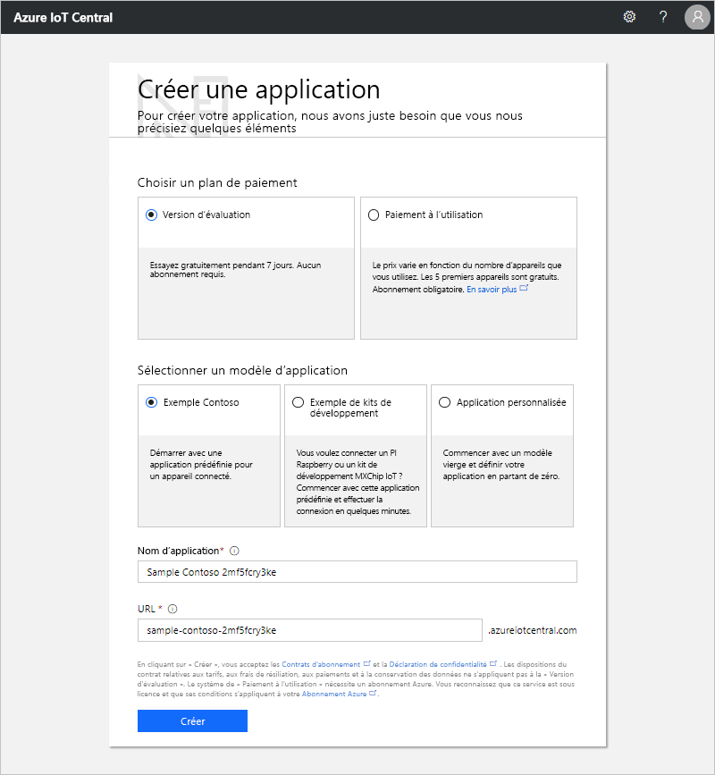

# Créer une application Azure IoT Central

[!INCLUDE [iot-central-original-pnp](../../includes/iot-central-original-pnp-note.md)]

En tant que _générateur_, vous utilisez l’interface utilisateur d’Azure IoT Central pour définir votre application Microsoft Azure IoT Central. Ce démarrage rapide vous montre comment créer une application Azure IoT Central qui contient un exemple de _modèle d’appareil_ et des _appareils_ simulés.

## Création d'une application

Accédez à la page [Application Manager](https://aka.ms/iotcentral) (Gestionnaire d’applications) d’Azure IoT Central. Vous devez vous connecter avec un compte Microsoft personnel, scolaire ou professionnel.

Pour commencer à créer une application Azure IoT Central, sélectionnez **Nouvelle application**. Cela vous amène à la page **Créer une application**.

Pour créer une nouvelle application Azure IoT Central :

1. Choisissez un plan de paiement :
   - Les applications **d’évaluation** sont gratuites pendant 7 jours avant leur expiration. Elles peuvent être passées en paiement à l’utilisation à tout moment avant leur expiration. Si vous créez une application **d’évaluation**, entrez vos coordonnées et choisissez si vous souhaitez recevoir des informations et des conseils de la part de Microsoft.
   - Les applications avec **paiement à l’utilisation** sont facturées par appareil : les 5 premiers sont gratuits. Si vous créez une application avec **paiement à l’utilisation**, sélectionnez votre *Répertoire*, votre *Abonnement Azure* et votre *Région* :
      - *Annuaire* correspond à l’annuaire Azure Active Directory (AD) servant à créer votre application. Il contient les identités des utilisateurs, les informations d’identification et d’autres informations de l’organisation. Si vous n’avez pas d’annuaire Azure AD, il s’en crée un automatiquement quand vous créez un abonnement Azure.
      - Un *Abonnement Azure* vous permet de créer des instances de services Azure. IoT Central approvisionne des ressources dans votre abonnement. Si vous n’avez pas d’abonnement Azure, vous pouvez en créer un dans la [page d’inscription à Azure](https://aka.ms/createazuresubscription). Après avoir créé l’abonnement Azure, revenez à la page **Créer une application**. Votre nouvel abonnement apparaît dans la liste déroulante **Abonnement Azure**.
      - La *Région* est l’emplacement physique où vous souhaitez créer votre application. En règle générale, vous devez choisir la région qui est physiquement la plus proche de vos appareils pour obtenir des performances optimales. Vous pouvez voir les régions dans lesquelles Azure IoT Central est disponible dans la page [Disponibilité des produits par région](https://azure.microsoft.com/regions/services/). Une fois que vous aurez choisi une région, vous ne pourrez plus déplacer votre application dans une autre région.

      Apprenez-en davantage au sujet de la tarification sur la [page de tarification d’Azure IoT Central](https://azure.microsoft.com/pricing/details/iot-central/).

1. Choisissez un modèle d’application. Un modèle d’application peut contenir des éléments prédéfinis, comme des modèles d’appareil et des tableaux de bord pour vous aider à démarrer.

    | Modèle d’application | Description |
    | -------------------- | ----------- |
    | Exemple Contoso       | Crée une application qui comprend un modèle d’appareil déjà créé pour une machine de distribution réfrigérée. Utilisez ce modèle pour commencer à explorer Azure IoT Central. |
    | Exemples de Devkits       | Crée une application avec des modèles d’appareil tout prêts qui vous permettent de connecter un appareil MXChip ou Raspberry Pi. Utilisez ce modèle si vous êtes développeur d’appareils testant l’un de ces appareils. |
    | Application personnalisée   | Crée une application vide, que vous pouvez remplir avec vos propres modèles d’appareil et vos propres appareils. |

1. Entrez un nom d’application convivial tel que **Contoso IoT**. Azure IoT Central génère un préfixe d’URL unique pour vous. Vous pouvez remplacer ce préfixe d’URL par une chaîne plus facile à mémoriser.

1. Cliquez sur **Créer**.

## Étapes suivantes

En suivant ce guide de démarrage rapide, vous avez créé une application IoT Central. Voici la prochaine étape suggérée :

> [!div class="nextstepaction"]
> [Visite guidée d’IoT Central](overview-iot-central-tour.md)
