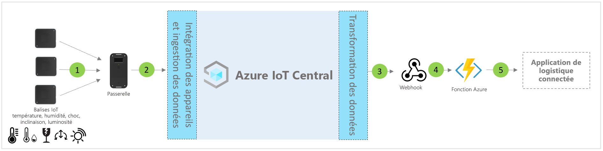

# Architecture du modèle d’application de logistique connectée IoT Central

Les partenaires et les clients peuvent utiliser le modèle d’application et les conseils suivants pour développer des **solutions logistiques connectées** de bout en bout.

> [!div class="mx-imgBorder"]
> 

1. Ensemble de balises IoT envoyant des données de télémétrie à un appareil de passerelle
2. Les appareils de passerelle envoient des données de télémétrie et des insights agrégés à IoT Central
3. Les données sont acheminées vers le service Azure souhaité pour manipulation
4. Les services Azure que sont ASA ou Azure Functions permettent de reformater les flux de données et de les envoyer aux comptes de stockage souhaités
5. Divers flux de travail d’entreprise peuvent reposer sur des applications métier d’utilisateur final

## Détails
La section suivante décrit chaque partie de l’architecture conceptuelle Ingestion de données de télémétrie à partir de balises et de passerelles IoT

## Balises IoT
Les balises IoT fournissent des fonctionnalités de capteur de données physiques, ambiantes et environnementales, avec notamment la température, l’humidité, les chocs, l’inclinaison et l’éclairage. Les balises IoT se connectent généralement à l’appareil de passerelle via Zigbee (802.15.4). Les balises sont des capteurs moins coûteux ; par conséquent, elles peuvent être écartées à la fin d’un parcours logistique classique pour éviter les difficultés liées à la logistique inversée.

## Passerelle
Les passerelles peuvent également agir comme balises IoT avec leurs fonctionnalités de détection des conditions ambiantes. La passerelle permet une connectivité cloud Azure IoT (MQTT) en amont en empruntant des canaux Wi-Fi et cellulaires.  Les modes Bluetooth, NFC et réseau de capteur sans fil 802.15.4 (WSN) sont utilisés pour la communication en aval avec les balises IoT. Les passerelles fournissent une connectivité cloud sécurisée de bout en bout, le jumelage des étiquettes IoT, l’agrégation des données de capteur, la conservation des données et la possibilité de configurer des seuils d’alarme.

## Gestion des appareils avec IoT Central 
Azure IoT Central est une plateforme de développement de solutions qui simplifie la connectivité, la configuration et la gestion des appareils IoT. La plateforme réduit considérablement la charge et les coûts liés à la gestion des appareils IoT, aux opérations et aux développements connexes. Les clients et partenaires peuvent créer des solutions d’entreprise de bout en bout pour obtenir une boucle de retour numérique en logistique.

## Insights métier et actions utilisant la sortie de données 
La plateforme IoT Central offre des options d’extensibilité riches via l’exportation continue des données (CDE) et des API. Les perspectives d’affaires basées sur le traitement des données de télémétrie ou la télémétrie brute sont généralement exportées vers une application métier choisie. Cela peut être réalisé en utilisant un webhook, Service Bus, un hub d’événements ou un stockage Blob de façon à générer, entraîner et déployer des modèles Machine Learning et enrichir les insights.

## Étapes suivantes
* Découvrez comment déployer un [modèle de solution logistique connectée](./tutorial-iot-central-connected-logistics.md)
* En savoir plus sur les [modèles de distribution IoT Central](./overview-iot-central-retail.md)
* En savoir plus sur IoT Central en lisant [Vue d’ensemble d’IoT Central](../core/overview-iot-central.md)
