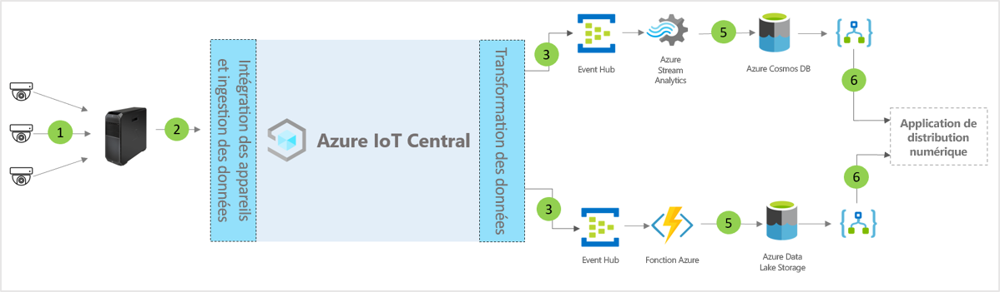

# Modèle d’application d’architecture du centre de distribution numérique IoT Central

Les partenaires et les clients peuvent utiliser le modèle d’application et les conseils suivants pour développer des solutions de **centre de distribution numérique** de bout en bout.

> [!div class="mx-imgBorder"]
> 

1. Ensemble de capteurs IoT envoyant des données de télémétrie à un appareil de passerelle
2. Les appareils de passerelle envoient des données de télémétrie et des insights agrégés à IoT Central
3. Les données sont acheminées vers le service Azure souhaité pour manipulation
4. Les services Azure que sont ASA ou Azure Functions permettent de reformater les flux de données et de les envoyer aux comptes de stockage souhaités
5. Les données traitées sont stockées dans un stockage à chaud pour des actions en quasi temps réel ou dans un stockage à froid pour des améliorations d’insights supplémentaires basées sur l’analyse par lots ou par ML. 
6. Logic Apps peut être utilisé pour alimenter divers flux de travail d’entreprise dans les applications d’entreprise pour utilisateurs finaux

## Détails
La section suivante décrit chaque partie de l’architecture conceptuelle

## Caméras vidéo 
Les caméras vidéo sont les capteurs principaux de cet écosystème à l’échelle de l’entreprise connecté numériquement. Les avancées en matière de Machine Learning et d’intelligence artificielle permettent aux vidéos d’être transformées en données structurées et de les traiter à la périphérie avant de les envoyer au cloud. Nous pouvons utiliser des caméras IP pour capturer des images, les compresser sur l’appareil, puis envoyer les données compressées sur le calcul en périphérie pour le pipeline d’analyse vidéo, ou utiliser des caméras de vision GigE pour capturer des images sur le capteur, puis envoyer ces images directement à Azure IoT Edge , qui compresse ensuite la vidéo avant de la traiter dans le pipeline d’analyse vidéo. 

## Passerelle Azure IoT Edge
Les « caméras en tant que capteurs » et les charges de travail de périphérie sont gérées localement par Azure IoT Edge, et le flux de caméras est traité par le pipeline analytique. Le pipeline de traitement analytique de vidéos sur Azure IoT Edge apporte de nombreux avantages, notamment un temps de réponse réduit et une faible consommation de bande passante, ce qui se traduit par une faible latence pour un traitement rapide des données. Seules les métadonnées, les informations ou les actions les plus essentielles sont envoyées au cloud à des fins d’action ou d’investigation ultérieures. 

## Gestion des appareils avec IoT Central 
Azure IoT Central est une plateforme de développement de solutions qui simplifie la connectivité, la configuration et la gestion des appareils IoT et de la passerelle Azure IoT Edge. La plateforme réduit considérablement la charge et les coûts liés à la gestion des appareils IoT, aux opérations et aux développements connexes. Les clients et partenaires peuvent créer des solutions d’entreprise de bout en bout pour obtenir une boucle de retour numérique dans les centres de distribution.

## Insights métier et actions utilisant la sortie de données 
La plateforme IoT Central offre des options d’extensibilité riches via l’exportation continue des données (CDE) et des API. Les insights métier basés sur le traitement des données de télémétrie ou la télémétrie brute sont généralement exportés vers une application métier choisie. Cela peut être réalisé par webhook, Service Bus, hub d’événements ou stockage Blob pour générer, entraîner et déployer des modèles Machine Learning et enrichir les insights.

## Étapes suivantes
* Découvrez comment déployer un [modèle de centre de distribution numérique](./tutorial-iot-central-digital-distribution-center.md)
* En savoir plus sur les [modèles de distribution IoT Central](./overview-iot-central-retail.md)
* En savoir plus sur IoT Central en lisant [Vue d’ensemble d’IoT Central](../core/overview-iot-central.md)
