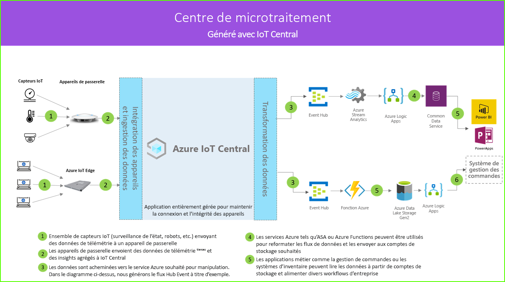

# Architecture du centre de microtraitement

[!INCLUDE [iot-central-pnp-original](../../../includes/iot-central-pnp-original-note.md)]

Les solutions du type Centre de microtraitement vous permettent de vous connecter, de superviser et de gérer numériquement tous les aspects d’un centre de traitement entièrement automatisé en vue de réduire les coûts en éliminant les temps d’arrêt et en augmentant la sécurité et l’efficacité globale. Ces solutions peuvent être créées à l'aide d'un des modèles d’application dans IoT Central et en suivant l’architecture ci-dessous.

- Ensemble de capteurs IoT envoyant des données de télémétrie à un appareil de passerelle
- Les appareils de passerelle envoient des données de télémétrie et des insights agrégés à IoT Central
- Exportation continue des données à destination du service Azure souhaité à des fins de manipulation
- Les données peuvent être structurées dans le format souhaité et envoyées à un service de stockage
- Les applications métier peuvent interroger des données et générer des insights pour les opérations de vente au détail
 
Intéressons-nous aux composants clés qui ont généralement un rôle à jouer dans une solution de type Centre de microtraitement.

## Robots de transport

Les centres de microtraitement disposent généralement d’un grand nombre de robots de transport qui génèrent diverses données de télémétrie. Ces données peuvent être ingérées par un appareil de passerelle, puis agrégées et envoyées à IoT Central, comme vous pouvez le voir sur la gauche du diagramme d’architecture.  

## Capteurs de surveillance de l’état

Une solution IoT commence par un ensemble de capteurs qui capturent des données significatives au sein de votre centre de traitement. Il est représenté par différents capteurs à l’extrême gauche du diagramme d’architecture ci-dessus.

## Appareils de passerelle

De nombreux capteurs IoT peuvent alimenter directement les signaux bruts vers le cloud ou un appareil de passerelle à proximité. L’appareil de passerelle effectue l’agrégation des données en périphérie avant d’envoyer un récapitulatif des insights à une application IoT Central. Le cas échéant, les appareils de passerelle sont également chargés de relayer les opérations de commande et de contrôle vers les capteurs. 

## Application IoT Central

L’application Azure IoT Central ingère des données générées par divers capteurs et robots IoT, ainsi que par les appareils de passerelle situés dans le centre de traitement. Ces données permettent d’obtenir des insights intéressants.

Azure IoT Central offre également une expérience personnalisée au responsable du magasin, en lui permettant de surveiller et de gérer à distance les appareils de l'infrastructure.

## Transformation des données
Au sein d’une solution, l’application Azure IoT Central peut être configurée pour exporter des insights bruts ou agrégés vers un ensemble de services Azure PaaS capables de manipuler les données et d’enrichir ces insights avant de les transférer à une application métier. 

## Applications métier
Les données IoT peuvent être utilisées pour alimenter différentes applications métier au sein d’un environnement de détail. Un responsable ou un employé du centre de traitement peut utiliser ces applications pour visualiser les insights métier et prendre des mesures significatives en temps réel. Pour savoir comment créer un tableau de bord Power BI en temps réel pour votre équipe de vendeurs, suivez [ce tutoriel](./tutorial-in-store-analytics-create-app-pnp.md).

## Étapes suivantes
* Pour bien démarrer, consultez le modèle d’application [Déployer et parcourir un modèle d’application du Centre de microtraitement](https://aka.ms/checkouttemplate). 
* Consultez le [tutoriel](https://aka.ms/mfc-tutorial) qui explique comment créer une solution à partir du modèle d’application Centre de microtraitement.
