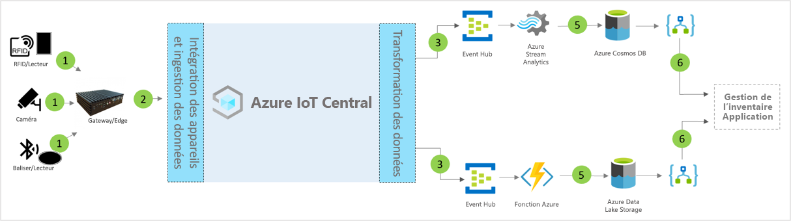

# Architecture du modèle de gestion des stocks intelligente IoT pour Azure IoT Central

Les partenaires et les clients peuvent utiliser le modèle d’application et les conseils suivants pour développer des solutions de **gestion des stocks intelligente** de bout en bout.

> [!div class="mx-imgBorder"]
> 

1. Ensemble de capteurs IoT envoyant des données de télémétrie à un appareil de passerelle
2. Les appareils de passerelle envoient des données de télémétrie et des insights agrégés à IoT Central
3. Les données sont acheminées vers le service Azure souhaité pour manipulation
4. Les services Azure que sont ASA ou Azure Functions permettent de reformater les flux de données et de les envoyer aux comptes de stockage souhaités 
5. Les données traitées sont stockées dans un stockage à chaud pour des actions en quasi temps réel ou dans un stockage à froid pour des améliorations d’insights supplémentaires basées sur l’analyse par lots ou par ML. 
6. Logic Apps peut être utilisé pour alimenter divers flux de travail d’entreprise dans les applications d’entreprise pour utilisateurs finaux

## Détails
La section suivante décrit chaque partie de l’architecture conceptuelle d’ingestion de données de télémétrie à partir de balises d’identification par radiofréquence (RFID, radio frequency identification) et Bluetooth basse énergie (BLE, Bluetooth low energy)

## Balises RFID
Les balises RFID transmettent les données relatives à un élément via des ondes radio. Les balises RFID n’ont généralement pas de batterie, sauf indication contraire. Les balises reçoivent de l’énergie des ondes radio générées par le lecteur et retransmettent un signal au lecteur RFID.

## Balises BLE
Une balise d’énergie diffuse des paquets de données à intervalles réguliers. Les données de la balise sont détectées par des lecteurs BLE ou des services installés sur les smartphones, puis transmises au cloud.

## Lecteurs RFID et BLE
Un lecteur RFID convertit les ondes radio en une forme de données plus exploitables. Les informations collectées à partir des balises sont ensuite stockées dans un serveur Edge local ou envoyées au cloud via JSON-RPC 2.0 sur MQTT.
Les lecteurs BLE, également appelés point d’accès, sont similaires aux lecteurs RFID. Ils servent à détecter les signaux Bluetooth proches et à relayer leurs messages vers un service Azure IoT Edge local ou le cloud via JSON-RPC 2.0 sur MQTT.
De nombreux lecteurs sont capables de lire des signaux RFID et de balises et d’offrir une capacité de capteur supplémentaire liée à la température, à l’humidité, à l’accéléromètre et au gyroscope.

## Passerelle Azure IoT Edge
Le serveur Azure IoT Edge Server fournit un emplacement pour prétraiter les données localement avant de les envoyer au cloud. Nous pouvons aussi déployer des charges de travail cloud d’intelligence artificielle, des services Azure et tiers, et une logique métier utilisant des conteneurs standard.

## Gestion des appareils avec IoT Central 
Azure IoT Central est une plateforme de développement de solutions qui simplifie la connectivité, la configuration et la gestion des appareils IoT. La plateforme réduit considérablement la charge et les coûts liés à la gestion des appareils IoT, aux opérations et aux développements connexes. Les clients et partenaires peuvent créer des solutions d’entreprise de bout en bout pour obtenir une boucle de retour numérique dans une gestion d’inventaire.

## Insights métier et actions utilisant la sortie de données 
La plateforme IoT Central offre des options d’extensibilité riches via l’exportation continue des données (CDE) et des API. Les perspectives d’affaires basées sur le traitement des données de télémétrie ou la télémétrie brute sont généralement exportées vers une application métier choisie. Cela peut être réalisé en utilisant un webhook, Service Bus, un hub d’événements ou un stockage Blob de façon à générer, entraîner et déployer des modèles Machine Learning et enrichir les insights.

## Étapes suivantes
* Découvrir comment déployer un [modèle de gestion intelligente d’inventaire](./tutorial-iot-central-smart-inventory-management.md)
* En savoir plus sur les [modèles de distribution IoT Central](./overview-iot-central-retail.md)
* En savoir plus sur IoT Central en lisant [Vue d’ensemble d’IoT Central](../core/overview-iot-central.md)
