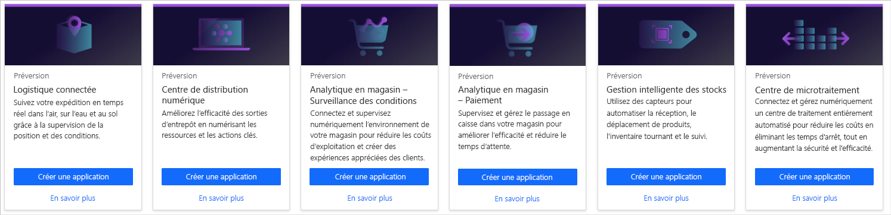
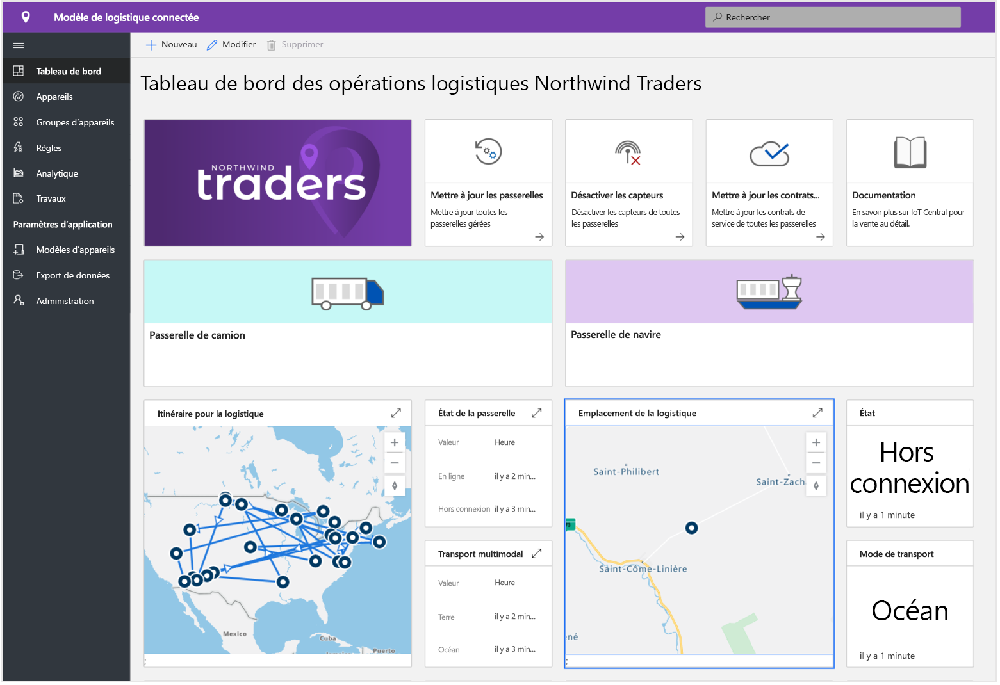
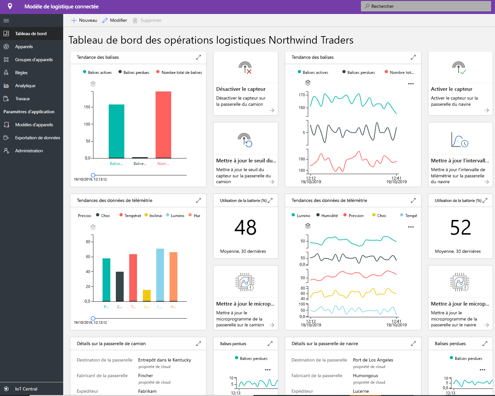
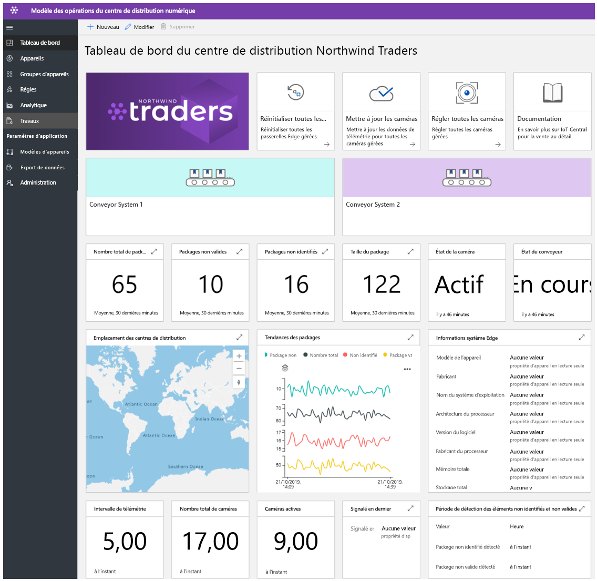
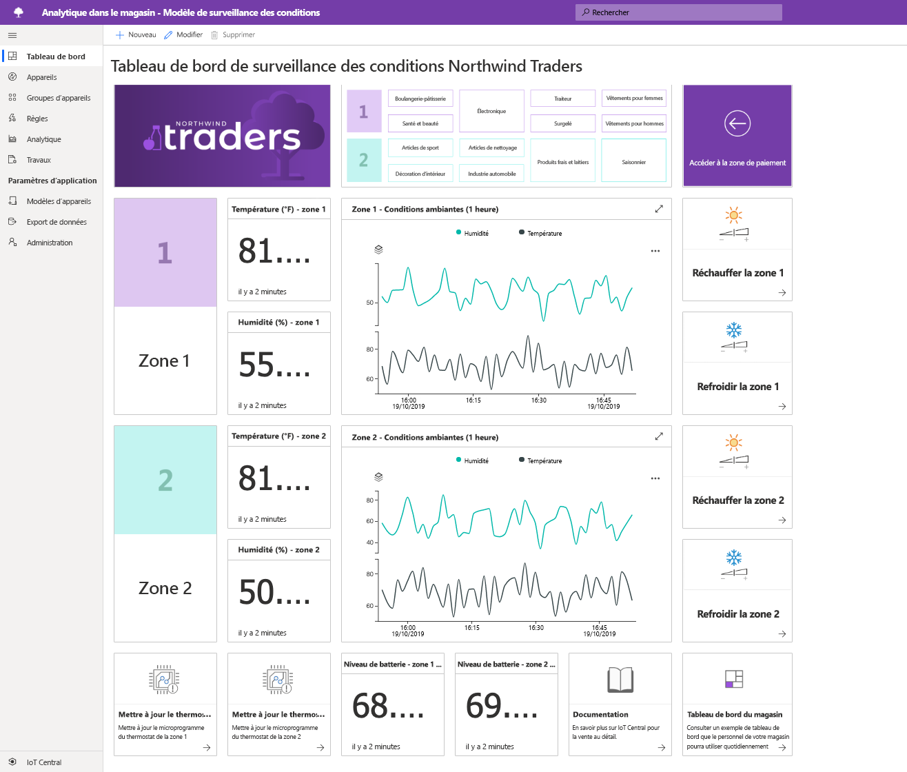
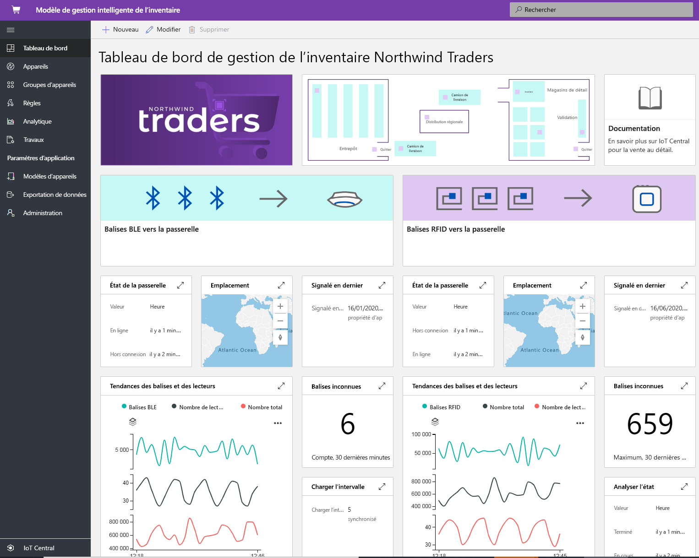

# Création de solutions de vente au détail avec Azure IoT Central

[!INCLUDE [iot-central-pnp-original](../../../includes/iot-central-pnp-original-note.md)]

Azure IoT Central est une plateforme d’application Internet des objets (IoT) pour créateurs de solutions, qui aide à relever les défis liés à la création et à la gestion d’applications évolutives. Dans cet article, nous allons mettre en évidence plusieurs modèles d’application spécifiques de la vente détail au sein d’IoT Central. Les créateurs de solutions peuvent tirer parti de modèles publiés pour créer des solutions IoT afin d’optimiser la chaîne logistique, d’améliorer l’expérience en magasin des clients et de suivre les stocks plus efficacement.

> [!div class="mx-imgBorder"]
> 

## Qu’est-ce qu’une solution de logistique connectée ?
Les coûts logistiques mondiaux devraient atteindre 10,6 billions en 2020. Il s’agit du PIB le plus élevé par secteur. Le transport de marchandises représente la majorité (70 %) des coûts logistiques totaux. Les transporteurs sont soumis à des contraintes et à une pression concurrentielle intenses. Les prestataires logistiques tiers compensent la réduction constante des délais en augmentant les coûts. La logistique est mise à rude épreuve en raison des risques liés à la géopolitique, aux événements climatiques extrêmes et à la criminalité. 

Des capteurs IoT, nous permettent de collecter et de surveiller des conditions ambiantes telles que la température, l’humidité, l’inclinaison, les chocs, l’exposition à la lumière et la localisation des cargaisons par GPS résultant de transformations multimodales en lien avec l’air, l’eau et le sol. Les données collectées à partir des capteurs, des appareils, de la météo et des événements peuvent être intégrées à des systèmes d’aide à la prise de décision basés sur le cloud. Les avantages d’une solution logistique connectée sont les suivants :
* Transfert de cargaison avec traçage et suivi en temps réel 
* Intégrité de la cargaison avec surveillance en temps réel des conditions ambiantes et de la chaîne du froid
* Sécurité de la cargaison en lien avec le vol, la perte ou les dommages
* Délimitation géographique, optimisation des routes et gestion des flottes. Analytique de véhicule
* Prévisions et prévisibilité des arrivées et départs 

### Expérience prête à l’emploi
Les partenaires peuvent tirer parti de modèles pour développer des solutions logistiques connectées de bout en bout et bénéficier des avantages décrits. Ces modèles publiés sont axés sur la connectivité des appareils, ainsi que sur leur configuration et leur gestion dans IoT Central. 

> [!div class="mx-imgBorder"]
> 

> [!div class="mx-imgBorder"]
> 

Notez que le tableau de bord ci-dessus est un exemple d’expérience et que vous pouvez personnaliser complètement cette application pour l’adapter à votre cas d’utilisation.

Commencez avec un [didacticiel de bout en bout](./tutorial-iot-central-connected-logistics-pnp.md) qui vous guide tout au long de la création d’une solution tirant parti de l’un des modèles de solutions logistiques connectées.

## Qu’est-ce que la solution de centre de distribution numérique ?
À mesure que les fabricants et détaillants établissent leur présence dans le monde entier, leurs chaînes logistiques se ramifient et deviennent plus complexes que jamais. Les centres de distribution deviennent un défi de premier plan. Les centres de distribution et les entrepôts subissent la pression de l’e-commerce. Les consommateurs s’attendent à ce que de vastes éventails de produits soient disponibles et à ce que leurs achats leur soient livrés dans un délai d’un ou deux jours après l’achat. Les centres de distribution doivent s’adapter à ces tendances tout en éliminant des inefficacités existantes. 

Aujourd’hui, la dépendance excessive du travail manuel implique que le prélèvement et le conditionnement représentent de 55 à 65 % des coûts des centres de distribution. Outre le fait que le travail manuel ralentit le centre de distribution, les besoins en personnel fluctuants (personnel décuplé en période de fêtes) viennent encore compliquer la gestion des volumes d’expédition. Ces fluctuations saisonnières entraînent une rotation importante du personnel et augmentent la probabilité d’erreurs ainsi que celle de reprises coûteuses.
Des solutions basées sur des caméras compatibles IoT peuvent offrir des avantages en permettant la mise en place d’une boucle de rétroaction numérique. Ce flux de données au sein du centre de distribution aboutit à des insights actionnables qui, à leur tour, produisent de meilleures données.

Les avantages sont les suivants : 
* Supervision à l’aide de caméras des marchandises à mesure qu’elles arrivent et transitent par le système d’acheminement
* Identification des produits défectueux et envoi de ceux-ci en réparation
* Suivi efficace des commandes
* Réduction les coûts, amélioration de la productivité et optimisation de l’utilisation

### Expérience prête à l’emploi
Les partenaires peuvent tirer parti de ce modèle d’application pour créer un centre de distribution numérique afin d’obtenir des insights actionnables ainsi que les avantages décrits ci-dessus. Le modèle publié est axé sur la configuration de la connectivité des appareils et la gestion des caméras et autres périphériques dans IoT Central. 

> [!div class="mx-imgBorder"]
> 

Notez que le tableau de bord ci-dessus est un exemple d’expérience et que vous pouvez personnaliser complètement cette application pour l’adapter à votre cas d’utilisation.

Commencez avec un [didacticiel de bout en bout](./tutorial-iot-central-digital-distribution-center-pnp.md) qui vous guide tout au long de la création d’une solution tirant parti de l’un des modèles de centre de distribution numérique.

## Qu’est-ce que la surveillance des conditions d’analytique en magasin
Dans le contexte concurrentiel actuel, les détaillants recherchent de nouveaux moyens d’offrir aux clients quelque chose d’unique ou de spécial afin de générer du trafic dans leurs magasins physiques. De nombreux détaillants reconnaissent l’importance des conditions environnementales dans leurs magasins en tant que moyen de se démarquer par rapport à la concurrence. Les détaillants veulent maintenir à tout moment des conditions agréables dans leurs magasins afin d’offrir une expérience confortable à leurs clients.  

Le modèle d’application de surveillance des conditions d’analytique en magasin disponible dans IoT Central fournit au créateur de solution un canevas utilisable pour créer une solution de bout en bout. Le modèle d’application leur permet de connecter et de surveiller numériquement un environnement de magasin de détail à l’aide de divers capteurs. Ces capteurs collectent des signaux significatifs qui peuvent être convertis en informations commerciales permettant aux détaillants de réduire leurs coûts d’exploitation et d’offrir des expériences appréciées des clients.

Le modèle d’application offre les possibilités suivantes :

*  Connecter en toute transparence une série de capteurs IoT à une instance d’application IoT Central.
*  Surveiller et gérer l’intégrité du réseau de capteurs, ainsi que les périphériques de passerelle dans l’environnement.
*  Créer des règles personnalisées en lien avec les conditions environnementales au sein d’un magasin afin de déclencher des alertes appropriées.
*  Convertir les conditions environnementales du magasin en informations exploitables par l’équipe.
* Exporter les informations agrégées dans des applications métier existantes ou nouvelles qui outillent les membres du personnel de vente.

### Expérience prête à l’emploi
Le modèle d’application est fourni avec un ensemble de modèles d’appareil et une interface d’opérateur prête à l’emploi. Il se sert d’un ensemble de périphériques simulés pour renseigner les éléments du tableau de bord. Une fois que vous avez déployé une application IoT Central à l’aide du modèle d’application de [surveillance des conditions d’analytique en magasin](https://aka.ms/conditiontemplate), vous accédez au tableau de bord par défaut de l’application, comme illustré ci-dessous. 

> [!div class="mx-imgBorder"]
> 

Notez que le tableau de bord ci-dessus est un exemple d’expérience et que vous pouvez personnaliser complètement cette application pour l’adapter à votre cas d’utilisation. 

Commencez avec un [didacticiel de bout en bout](./tutorial-in-store-analytics-create-app-pnp.md) qui vous guide tout au long de la création d’une solution tirant parti de l’un des modèles de surveillance des conditions d’analytique en magasin.

## Qu’est-ce que la caisse d’analytique en magasin
Dans un environnement de plus en plus concurrentiel, les détaillants modernes sont soumis à une pression croissante pour offrir une expérience en magasin qui dépasse les attentes des clients et les incite à revenir. Alors que plusieurs détaillants ont commencé à déployer de la technologie pour répondre à ce besoin, l’expérience de la caisse est un aspect souvent négligé.

Le modèle d’application de caisse d’analytique en magasin dans IoT Central permet aux concepteurs de solutions de créer des expériences permettant au personnel de vente de disposer d’informations significatives sur la zone de caisses du magasin. Il se sert d’un ensemble d’appareils simulés pour déterminer le statut d’occupation de chacune des allées de caisse dans un magasin de vente au détail. Les capteurs vous permettent de relever le nombre de personnes, ainsi que le temps d’attente moyen dans chacune des allées de caisse.

Le modèle aide le créateur de solutions à accélérer ses plans de commercialisation en fournissant une solution IoT de base qui lui offre les possibilités suivantes : 

* Connecter en toute transparence une série de capteurs IoT à une instance d’application IoT Central.
* Surveiller et gérer l’intégrité du réseau de capteurs, ainsi que les périphériques de passerelle dans l’environnement.
* Créez des règles personnalisées autour des conditions de caisse d’un magasin afin de déclencher des alertes appropriées.
* Convertir les conditions de caisse du magasin en informations exploitables par l’équipe.
* Exporter les informations agrégées dans des applications métier existantes ou nouvelles qui outillent les membres du personnel de vente.

### Expérience prête à l’emploi
Le modèle d’application est fourni avec un ensemble de modèles d’appareil et une interface d’opérateur prête à l’emploi. Il se sert d’un ensemble de périphériques simulés pour renseigner les éléments du tableau de bord. Une fois que vous avez déployé une application IoT Central à l’aide du modèle d’application de [surveillance des conditions d’analytique en magasin](https://aka.ms/checkouttemplate), vous accédez au tableau de bord par défaut de l’application, comme illustré ci-dessous. 

> [!div class="mx-imgBorder"]
> 

Notez que le tableau de bord ci-dessus est un exemple d’expérience et que vous pouvez personnaliser complètement cette application pour l’adapter à votre cas d’utilisation. 

Commencez avec un [didacticiel de bout en bout](./tutorial-in-store-analytics-create-app-pnp.md) qui vous guide tout au long de la création d’une solution tirant parti de l’un des modèles de caisse d’analytique en magasin.

## Qu’est-ce que la gestion intelligente d’inventaire
L’« inventaire » est le stock de marchandises que détient un détaillant. Tout détaillant a besoin d’un inventaire pour gérer les délais d’approvisionnement et de logistique. L’inventaire est sans doute la ressource la plus précieuse que tout détaillant doit commercialiser. Dans le monde omnicanal actuel, la gestion de l’inventaire est une condition essentielle pour s’assurer que le bon produit se trouve au bon endroit au bon moment. Un stock excessif ou insuffisant peut nuire aux affaires du détaillant. Chaque année, les détaillants perdent de 8 à 10% de recettes en raison de capacités de gestion d’inventaire insuffisantes.

Les données IoT recueillies grâce à l’identification par radiofréquence (RFID), aux balises et aux caméra offrent la possibilité de relever ce défi d’envergure. La connectivité et l’analytique en temps réel inhérentes aux signaux IoT sont devenues la clé du succès pour les problèmes d’inventaire des détaillants.  Les données collectées à partir des capteurs, des appareils, de la météo et des événements peuvent être intégrées à des systèmes d’aide à la prise de décision basés sur le cloud.  
Les avantages de la gestion intelligente d’inventaire sont les suivants : 
* Protection de l’organisation contre les ruptures de stock et garantie d’offrir le niveau de service client souhaité. 
* Analyse approfondie et informations précises sur l’inventaire en quasi temps réel
* Détermination de la quantité d’inventaire appropriée pour répondre aux commandes des clients

### Expérience prête à l’emploi
Les partenaires peuvent tirer parti de modèles pour développer des solutions de gestion intelligente d’inventaire de bout en bout et bénéficier des avantages décrits. Ce modèle publié est axé sur la connectivité des appareils, ainsi que sur la configuration et la gestion de lecteurs d’identification par radiofréquence (RFID) et Bluetooth basse énergie (BLE, Bluetooth low energy) dans IoT Central. 

> [!div class="mx-imgBorder"]
> 

Notez que le tableau de bord ci-dessus est un exemple d’expérience et que vous pouvez personnaliser complètement cette application pour l’adapter à votre cas d’utilisation. 

Commencez avec un [didacticiel de bout en bout](./tutorial-iot-central-smart-inventory-management-pnp.md) qui vous guide tout au long de la création d’une solution tirant parti de l’un des modèles de gestion intelligente d’inventaire.

## Étapes suivantes
Pour commencer à créer une solution de vente au détail :
* Commencez avec un [didacticiel de bout en bout](./tutorial-in-store-analytics-create-app-pnp.md) qui vous guide tout au long de la création d’une solution tirant parti de l’un des modèles d’application d’analytique en magasin.
* Découvrez comment déployer un [modèle de solution logistique connectée](./tutorial-iot-central-connected-logistics-pnp.md)
* Découvrez comment déployer un [modèle de centre de distribution numérique](./tutorial-iot-central-digital-distribution-center-pnp.md)
* Découvrez comment déployer un [modèle de gestion intelligente d’inventaire](./tutorial-iot-central-smart-inventory-management-pnp.md)
* Pour plus d’informations sur IoT Central, voir la [vue d’ensemble d’IoT Central](../preview/overview-iot-central.md)
