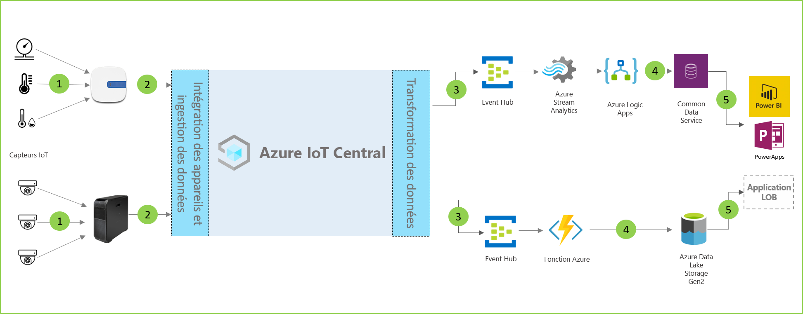

# Architecture de l'analytique en magasin

[!INCLUDE [iot-central-pnp-original](../../../includes/iot-central-pnp-original-note.md)]

Les solutions d'analytique en magasin vous permettent de surveiller différentes conditions d'un environnement de magasin de détail. Ces solutions peuvent être créées à l'aide d'un des modèles d’application dans IoT Central et en suivant l’architecture ci-dessous.

- Ensemble de capteurs IoT envoyant des données de télémétrie à un appareil de passerelle
- Les appareils de passerelle envoient des données de télémétrie et des insights agrégés à IoT Central
- Exportation continue des données à destination du service Azure souhaité à des fins de manipulation
- Les données peuvent être structurées dans le format souhaité et envoyées à un service de stockage
- Les applications métier peuvent interroger des données et générer des insights pour les opérations de vente au détail
 
Intéressons-nous aux composants clés qui ont généralement un rôle à jouer dans une solution d'analytique en magasin.

## Capteurs de surveillance de l’état

Une solution IoT commence par un ensemble de capteurs capturant des signaux significatifs à partir d’un environnement de magasin de détail. Il est représenté par différents capteurs à l’extrême gauche du diagramme d’architecture ci-dessus.

## Appareils de passerelle

De nombreux capteurs IoT peuvent alimenter directement les signaux bruts vers le cloud ou un appareil de passerelle à proximité. L’appareil de passerelle effectue l’agrégation des données en périphérie avant d’envoyer un récapitulatif des insights à une application IoT Central. Le cas échéant, les appareils de passerelle sont également chargés de relayer les opérations de commande et de contrôle vers les capteurs. 

## Application IoT Central

L’application Azure IoT Central ingère des données à partir de divers capteurs IoT, ainsi que des appareils de passerelle au sein de l’environnement du magasin de détail, et génère un ensemble pertinent d'insights.

Azure IoT Central offre également une expérience personnalisée au responsable du magasin, en lui permettant de surveiller et de gérer à distance les appareils de l'infrastructure.

## Transformation des données
Au sein d'une solution, l’application Azure IoT Central peut être configurée pour exporter des insights bruts ou agrégés vers un ensemble de services Azure PaaS capables de manipuler les données et d'enrichir ces insights avant de les transférer à une application métier. 

## Applications métier
Les données IoT peuvent être utilisées pour alimenter différentes applications métier au sein d’un environnement de détail. Un responsable ou un employé de magasin de détail peut utiliser ces applications pour visualiser les insights métier et prendre des mesures significatives en temps réel. Pour savoir comment créer un tableau de bord Power BI en temps réel pour votre équipe de vente au détail, suivez le [didacticiel](./tutorial-in-store-analytics-create-app-pnp.md).

## Étapes suivantes
* Prise en main des modèles d'application [Analytique dans le magasin](https://aka.ms/checkouttemplate) et [Surveillance des conditions d’analytique en magasin](https://aka.ms/conditiontemplate). 
* Suivez un [didacticiel de bout en bout](https://aka.ms/storeanalytics-tutorial) qui vous guide tout au long de la création d’une solution tirant parti de l’un des modèles d’application d’analytique en magasin.
