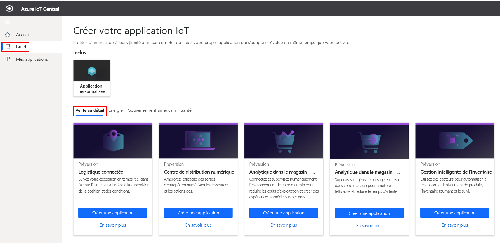
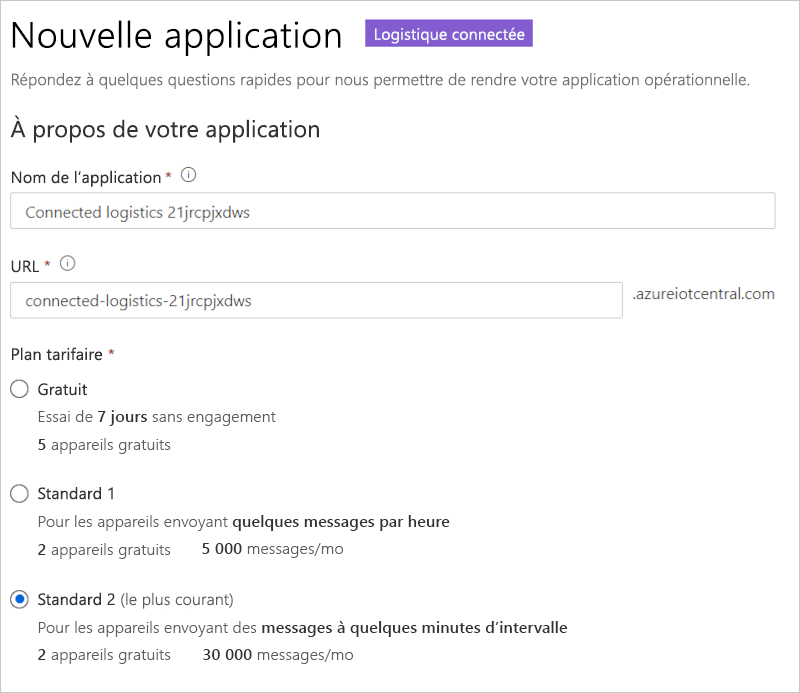
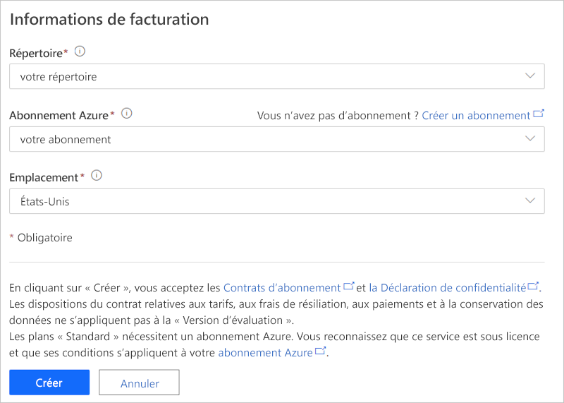

# Tutoriel : Déployer et découvrir un modèle d’application logistique connectée

Ce tutoriel vous montre comment bien démarrer avec le modèle d’application de *logistique connectée* IoT Central. Vous allez voir comment déployer et utiliser ce modèle.

Dans ce tutoriel, vous allez apprendre à :

> [!div class="checklist"]
> * Créer une application de logistique connectée
> * Utiliser les fonctionnalités clés de l’application
> * Utiliser le tableau de bord pour présenter l’activité des opérations de l’appareil de logistique critique
> * Utiliser le modèle d’appareil
> * Suivre les règles
> * Utiliser des travaux

## Prérequis

* Le déploiement de cette application ne nécessite aucun prérequis.
* Vous pouvez utiliser le plan tarifaire gratuit ou utiliser un abonnement Azure.

## Créer une application de logistique connectée

Créez une application à l’aide de la procédure suivante :

1. Accédez au site de [création d’applications Azure IoT Central](https://aka.ms/iotcentral). Ensuite, connectez-vous avec un compte Microsoft personnel, scolaire ou professionnel. Sélectionnez **Générer** dans la barre de navigation de gauche, puis sélectionnez l’onglet **Distribution** :

    :::image type="content" source="media/tutorial-iot-central-connected-logistics/iotc-retail-homepage.png" alt-text="Modèle de logistique connectée":::

1. Sélectionnez **Créer une application** sous **Application de logistique connectée**.

1. La commande **Créer une application** ouvre le formulaire **Nouvelle application**. Entrez les informations suivantes :

    * **Nom de l’application** : vous pouvez utiliser le nom suggéré par défaut ou entrer le nom convivial de l’application.
    * **URL** : vous pouvez utiliser l’URL par défaut suggérée ou entrer votre URL conviviale unique et facile à mémoriser. Ensuite, le paramètre par défaut est recommandé si vous disposez déjà d’un abonnement Azure. Vous pouvez commencer avec le plan tarifaire d’essai gratuit de 7 jours pour ensuite le convertir en plan tarifaire standard à tout moment avant l’expiration de l’essai gratuit.
    * **Informations de facturation** : Les informations sur l’annuaire, l’abonnement Azure et la région sont nécessaires pour provisionner les ressources.
    * **Créer** : Sélectionnez Créer en bas de la page pour déployer votre application.

    :::image type="content" source="media/tutorial-iot-central-connected-logistics/connected-logistics-app-create.png" alt-text="Modèle d’application de logistique connectée":::

    :::image type="content" source="media/tutorial-iot-central-connected-logistics/connected-logistics-app-create-billinginfo.png" alt-text="Informations de facturation concernant la logistique connectée":::

## examiner l’application

Vous trouverez ci-dessous une capture d’écran montrant comment sélectionner le modèle d’application de logistique connectée.

> [!div class="mx-imgBorder"]
> 

Les sections suivantes passent en revue les principales fonctionnalités de l’application.

### Tableau de bord

Une fois le modèle d’application déployé, votre tableau de bord par défaut devient un portail dédié à l’opérateur de logistique connectée. Northwind Trader est une entreprise logistique fictive qui gère une flotte d’engins de transport de marchandises par voie maritime et voie terrestre. Dans ce tableau de bord figurent deux passerelles qui fournissent des données de télémétrie sur les expéditions, ainsi que les commandes, tâches et actions qui leur sont associées.

> [!div class="mx-imgBorder"]
> 

> [!div class="mx-imgBorder"]
> 

Ce tableau de bord est préconfiguré pour présenter l’activité des opérations de l’appareil de logistique critique.

Le tableau de bord permet d’effectuer deux opérations de gestion des appareils de passerelle :

* Afficher les itinéraires des expéditions par camion, ainsi que l’emplacement précis lors des expéditions par voie maritime
* Afficher l’état de la passerelle et d’autres informations pertinentes

:::image type="content" source="media/tutorial-iot-central-connected-logistics/connected-logistics-dashboard1.png" alt-text="Tableau de bord de logistique connectée":::

* Vous pouvez effectuer le suivi du nombre total de passerelles, ainsi que des balises actives et inconnues.
* Vous pouvez effectuer des opérations de gestion des appareils telles que la mise à jour des microprogrammes, la désactivation et l’activation des capteurs, la modification du seuil des capteurs, la modification des intervalles de télémétrie ou la modification des contrats de service des appareils.
* Consultez la consommation de la batterie des appareils.

:::image type="content" source="media/tutorial-iot-central-connected-logistics/connected-logistics-dashboard2.png" alt-text="État du tableau de bord de logistique connectée":::

#### Modèle d'appareil

Sélectionnez **Modèles d’appareils** pour voir le modèle de fonctions de la passerelle. Un modèle de fonctions est structuré autour de deux interfaces : **Propriétés et télémétrie de la passerelle** et **Commandes de la passerelle**

**Propriétés et télémétrie de la passerelle** : cette interface définit toutes les données de télémétrie relatives aux capteurs, à l’emplacement et aux informations sur l’appareil. L’interface définit également les fonctionnalités des propriétés des jumeaux d’appareil, telles que les seuils de capteur et les intervalles de mise à jour.

:::image type="content" source="media/tutorial-iot-central-connected-logistics/connected-logistics-devicetemplate1.png" alt-text="Interface Propriétés et télémétrie":::

**Commandes de la passerelle** - Cette interface organise toutes les fonctionnalités de commande de la passerelle :

:::image type="content" source="media/tutorial-iot-central-connected-logistics/connected-logistics-devicetemplate2.png" alt-text="Interface des commandes de la passerelle":::

### Règles

Sélectionnez l’onglet **Règles** pour les règles de ce modèle d’application. Ces règles sont configurées pour envoyer des notifications par e-mail aux opérateurs à des fins d’investigation supplémentaire.

**Alerte de vol de passerelle** : Cette règle est déclenchée quand les capteurs détectent une lumière inattendue pendant le trajet. Les opérateurs doivent être informés immédiatement afin d’enquêter sur un vol éventuel.

**Aucune réponse de la passerelle** : Cette règle se déclenche si la passerelle ne se signale pas au cloud pendant une période prolongée. L’absence de réponse de la passerelle peut être due à une batterie faible, à une perte de la connectivité ou encore à un appareil endommagé.

:::image type="content" source="media/tutorial-iot-central-connected-logistics/connected-logistics-rules.png" alt-text="Définitions des règles":::

### travaux

Sélectionnez l’onglet **Travaux** pour afficher les travaux de cette application :

:::image type="content" source="media/tutorial-iot-central-connected-logistics/connected-logistics-jobs.png" alt-text="Travaux à exécuter":::

Vous pouvez utiliser les travaux pour effectuer des opérations à l’échelle de l’application. Les travaux de cette application utilisent les commandes de l’appareil ainsi que des fonctionnalités de jumeau pour notamment désactiver des capteurs spécifiques sur l’ensemble de la passerelle ou modifier le seuil des capteurs en fonction de l’itinéraire et du mode de transport :

* La désactivation des capteurs de chocs lors du transport maritime est une opération standard. Elle permet d’économiser la batterie ou d’abaisser le seuil de température en cas de transport frigorifique.

* La fonctionnalité Tâches vous permet d’effectuer des opérations à l’échelle du système comme la mise à jour des microprogrammes sur les passerelles ou celle du contrat de service pour le fonctionnement normal des activités de maintenance.

## Nettoyer les ressources

Si vous n’envisagez pas de continuer à utiliser cette application, supprimez le modèle d’application en accédant à **Administration** > **Paramètres de l’application**, puis sélectionnez **Supprimer**.

:::image type="content" source="media/tutorial-iot-central-connected-logistics/connected-logistics-cleanup.png" alt-text="Nettoyage du modèle":::

## Étapes suivantes

En savoir plus sur  :

> [!div class="nextstepaction"]
> [Concepts de la logistique connectée](./architecture-connected-logistics.md)
