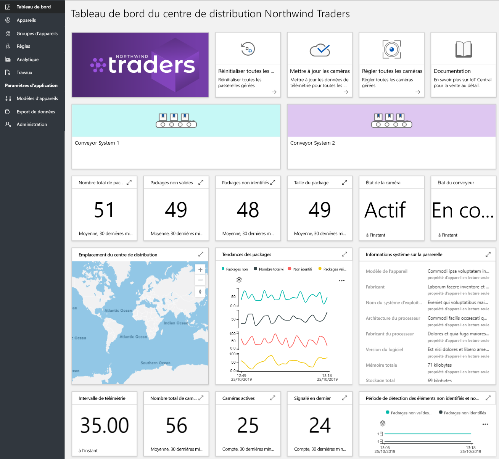
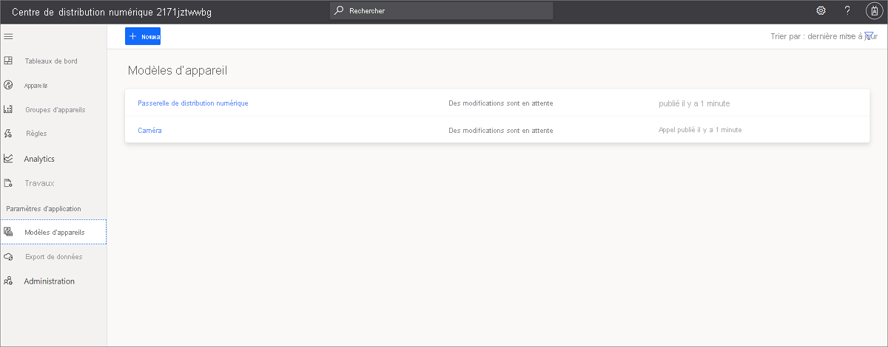
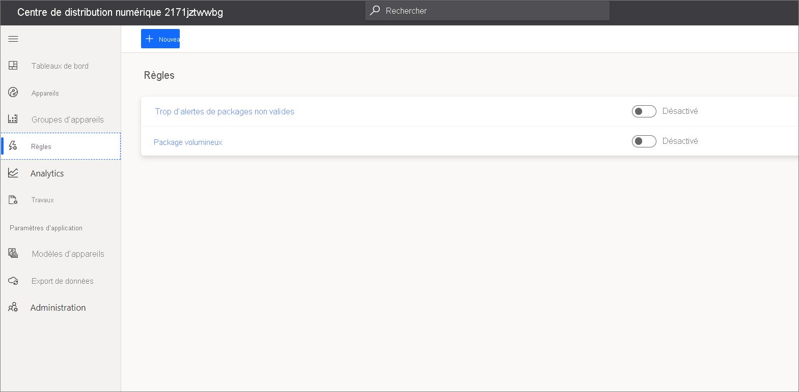
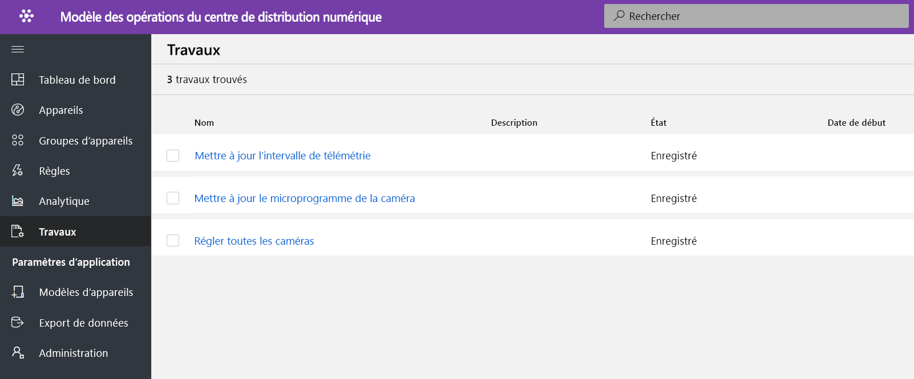
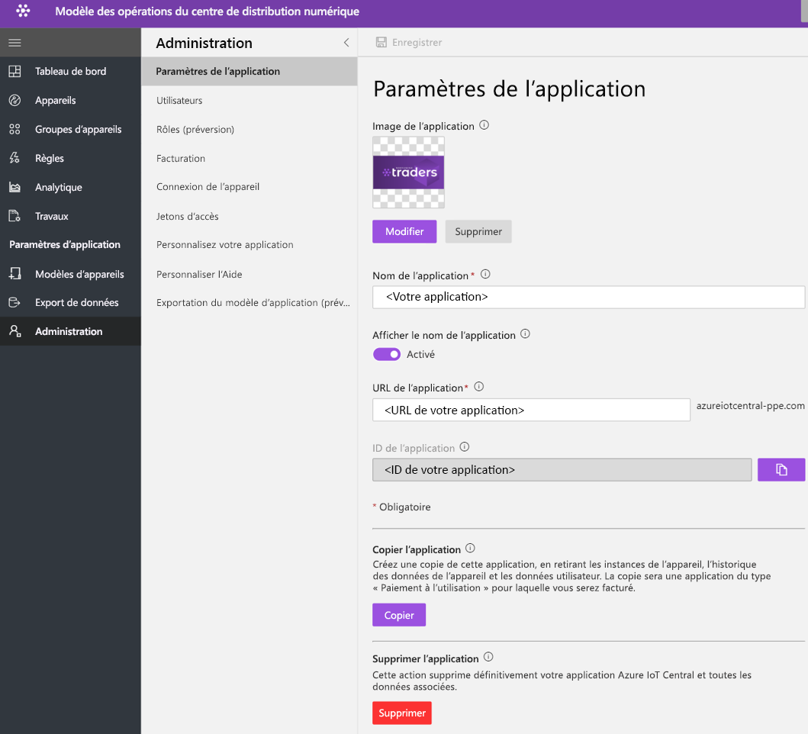

# Tutoriel : Déployer et parcourir un modèle d’application du centre de distribution numérique

Ce didacticiel vous montre comment prendre en main le déploiement d’un modèle d’application du **centre de distribution numérique** IoT Central. Vous allez apprendre à déployer le modèle et découvrir les fonctionnalités prêtes à l’emploi incluses ainsi que les différentes possibilités qui s’offrent à vous.

Ce tutoriel vous montre comment effectuer les opérations suivantes : 

> [!div class="checklist"]
> Créer une application de centre de distribution numérique et parcourir l’application 

## Prérequis
* Aucune configuration requise spécifique n’est requise pour déployer cette application
* Il est recommandé d’avoir un abonnement Azure, mais vous pouvez essayer sans

## Créer un modèle d’application pour un centre de distribution numérique

Vous pouvez créer une application à l’aide de la procédure suivante

1. Accédez au site web du gestionnaire d’applications Azure IoT Central. Sélectionnez **Générer** dans la barre de navigation de gauche, puis cliquez sur l’onglet **Distribution**.

    :::image type="content" source="media/tutorial-iot-central-ddc/iotc-retail-homepage.png" alt-text="Modèle d’application pour un centre de distribution numérique":::
1. Sélectionnez l’onglet **Distribution** et **Créer une application** en dessous de **application de centre de distribution numérique**.

1. **Créer une application** ouvre le nouveau formulaire d’application et remplit les détails demandés comme indiqué ci-dessous.
   **Nom de l’application** : vous pouvez utiliser le nom suggéré par défaut ou entrer le nom convivial de l’application.
   **URL** : vous pouvez utiliser l’URL par défaut suggérée ou entrer votre URL conviviale unique et facile à mémoriser. Ensuite, le paramètre par défaut est recommandé si vous disposez déjà d’un abonnement Azure. Vous pouvez commencer avec le plan tarifaire d’essai gratuit de 7 jours pour ensuite le convertir en plan tarifaire standard à tout moment avant l’expiration de l’essai gratuit.
   **Informations de facturation** : Les informations sur le répertoire, l’abonnement Azure et la région sont requises pour configurer les ressources.
   **Créer** : Sélectionnez Créer en bas de la page pour déployer votre application.

   :::image type="content" source="media/tutorial-iot-central-ddc/ddc-create.png" alt-text="Capture d’écran montrant comment créer une application à partir du modèle application du centre de distribution numérique":::

   :::image type="content" source="media/tutorial-iot-central-ddc/ddc-create-billinginfo.png" alt-text="Capture d’écran montrant les options de facturation lors de la création de l’application":::

## Examiner le tableau de bord de l’application 

Après le déploiement réussi du modèle d’application, votre tableau de bord par défaut est un portail dédié à l’opérateur du centre de distribution. Northwind Trader est un fournisseur de solutions de centres de distribution fictifs qui gère les systèmes de transport. 

Dans ce tableau de bord, vous verrez une passerelle et une caméra faisant office d’appareil IoT. La passerelle fournit des données de télémétrie sur les packages tels que valide, non valide, non identifié et taille, ainsi que les propriétés de jumeaux d’appareil associées. Toutes les commandes en aval sont exécutées sur des appareils IoT, tels qu’une caméra. Ce tableau de bord est préconfiguré pour présenter l’activité des opérations de l’appareil du centre de distribution critique.

Le tableau de bord est structuré de manière logique pour afficher les fonctionnalités de gestion des périphériques de la passerelle Azure IoT et de l’appareil IoT.  
   * Vous pouvez exécuter des tâches de commande et de contrôle de la passerelle
   * Gérez toutes les caméras qui font partie de la solution. 

> [!div class="mx-imgBorder"]
> 

## Modèle d'appareil

Cliquez sur l’onglet Modèles d’appareils pour voir le modèle de capacité de la passerelle. Un modèle de fonctionnalités est structuré autour de deux interfaces différentes **Caméra** et **Passerelle de distribution numérique**

> [!div class="mx-imgBorder"]
> 

**Caméra** : cette interface organise toutes les fonctionnalités de commande propres à la caméra 

> [!div class="mx-imgBorder"]
> 

**Passerelle de distribution numérique** : cette interface représente toutes les données de télémétrie provenant de la caméra, les propriétés du jumeau d'appareil définies dans le cloud et les informations sur la passerelle.

> [!div class="mx-imgBorder"]
> 

## Commandes de la passerelle
Cette interface organise toutes les fonctionnalités de commande de la passerelle

> [!div class="mx-imgBorder"]
> 

## Règles
Sélectionnez l’onglet Règles pour afficher deux règles différentes qui existent dans ce modèle d’application. Ces règles sont configurées pour envoyer des notifications par e-mail aux opérateurs pour des investigations supplémentaires.

 **Un trop grand nombre d’alertes de packages non valides** : cette règle est déclenchée lorsque la caméra détecte un nombre élevé de packages non valides circulant dans le système de transport.
 
**Packages volumineux** : cette règle est déclenchée si la caméra détecte un paquet volumineux qui ne peut pas être inspecté pour la qualité. 

> [!div class="mx-imgBorder"]
> 

## travaux
Sélectionnez l’onglet Tâches pour afficher cinq types de tâches disponibles dans le cadre de ce modèle d’application : Vous pouvez tirer parti de la fonctionnalité Tâches pour effectuer des opérations sur l’ensemble de la solution. Ici, les travaux du centre de distribution numérique utilisent les commandes de l’appareil et la fonctionnalité de jumeau pour effectuer des tâches telles que,
   * l’étalonnage de la caméra avant le lancement de la détection du package 
   * la mise à jour périodique du microprogramme de la caméra
   * la modification de l’intervalle de télémétrie pour gérer le chargement de données

> [!div class="mx-imgBorder"]
> 

## Nettoyer les ressources
Si vous n’envisagez pas de continuer à utiliser cette application, supprimez le modèle d’application en accédant à **Administration** > **Paramètres de l’application**, puis cliquez sur **supprimer**.

> [!div class="mx-imgBorder"]
> 

## Étapes suivantes

En savoir plus sur l’architecture de la solution du centre de distribution numérique :

> [!div class="nextstepaction"]
> [Concept du centre de distribution numérique](./architecture-digital-distribution-center.md)
