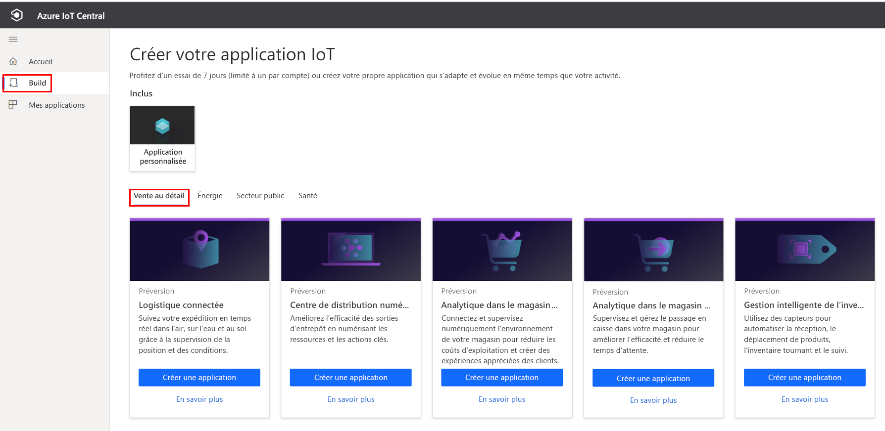
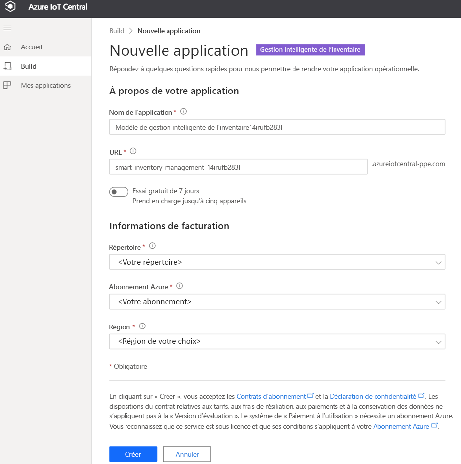
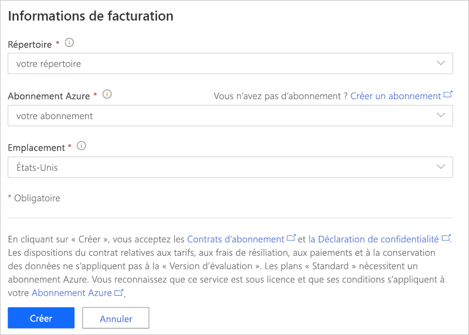
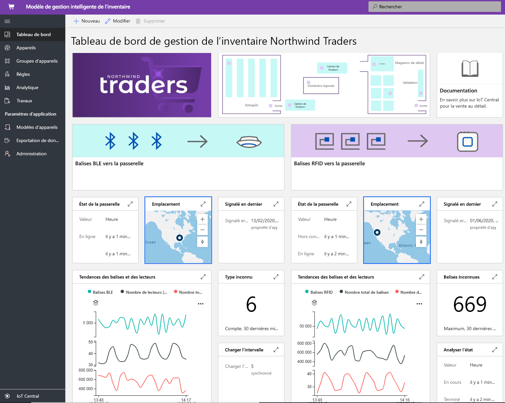
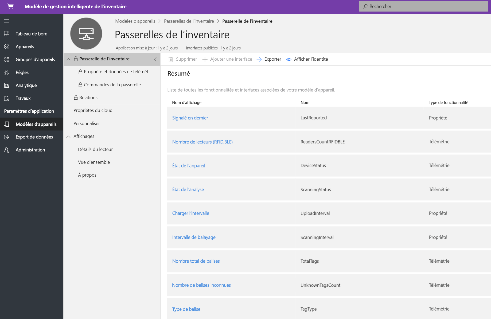
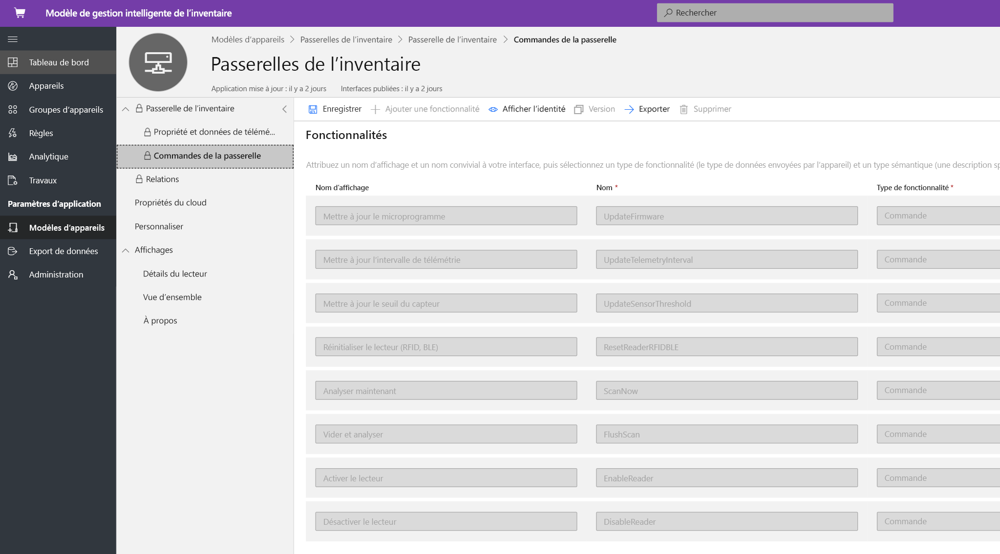
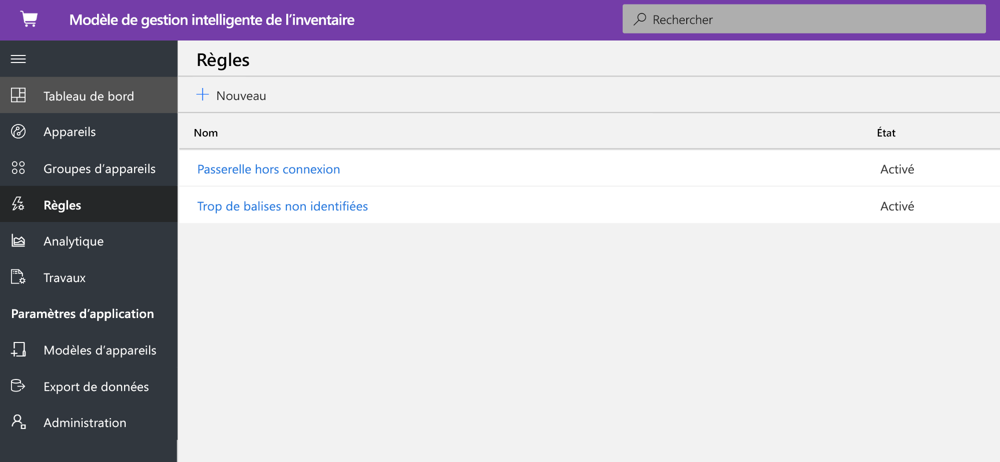
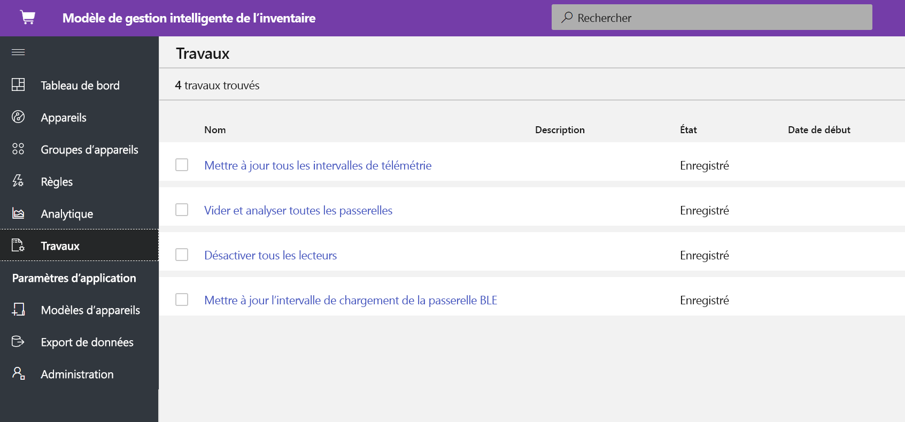
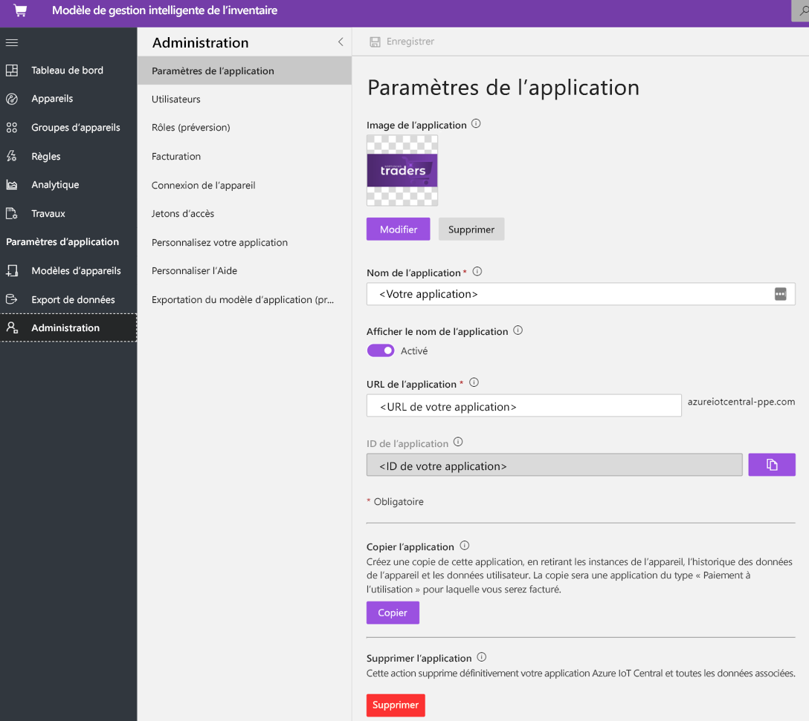

# Tutoriel : Déployer et découvrir un modèle de gestion intelligente des stocks IoT pour Azure IoT Central

Ce didacticiel vous montre comment prendre en main le déploiement d’un modèle d’application de **gestion intelligente des stocks** IoT Central. Vous allez apprendre à déployer le modèle et découvrir les fonctionnalités prêtes à l’emploi incluses ainsi que les différentes possibilités qui s’offrent à vous.

Ce tutoriel vous montre comment effectuer les opérations suivantes : 
* Créer une application de gestion intelligente des stocks 
* Examiner l’application 

## Prérequis

* Aucune configuration requise spécifique n’est requise pour déployer cette application
* Il est recommandé d’avoir un abonnement Azure, mais vous pouvez essayer sans

## Créer un modèle d’application de gestion intelligente des stocks

Vous pouvez créer une application à l’aide de la procédure suivante

1. Accédez au site web du gestionnaire d’applications Azure IoT Central. Sélectionnez **Générer** dans la barre de navigation de gauche, puis cliquez sur l’onglet **Distribution**.

    > [!div class="mx-imgBorder"]
    > 

2. Sélectionnez l’onglet **Détail**, puis **Créer une application** en dessous de **Gestion des stocks intelligente**.

3. **Créer une application** ouvre le nouveau formulaire d’application et remplit les détails demandés comme indiqué ci-dessous.
   **Nom de l’application** : vous pouvez utiliser le nom suggéré par défaut ou entrer le nom convivial de l’application.
   **URL** : vous pouvez utiliser l’URL par défaut suggérée ou entrer votre URL conviviale unique et facile à mémoriser. Ensuite, le paramètre par défaut est recommandé si vous disposez déjà d’un abonnement Azure. Vous pouvez commencer avec le plan tarifaire d’essai gratuit de 7 jours pour ensuite le convertir en plan tarifaire standard à tout moment avant l’expiration de l’essai gratuit.
   **Informations de facturation** : Les informations sur le répertoire, l’abonnement Azure et la région sont requises pour configurer les ressources.
   **Créer** : Sélectionnez Créer en bas de la page pour déployer votre application.

    > [!div class="mx-imgBorder"]
    > 

    > [!div class="mx-imgBorder"]
    > 

## examiner l’application 

### tableau de bord 

Après le déploiement réussi du modèle d’application, votre tableau de bord par défaut est un portail dédié à l’opérateur de gestion intelligente des stocks. Northwind Trader est un fournisseur de stocks intelligent fictif qui gère l’entrepôt en utilisant la technologie Bluetooth Low Energy (BLE) et un magasin de vente au détail avec la technologie d’identification radiofréquence (RFID). Dans ce tableau de bord, deux passerelles différentes fournissent des données de télémétrie sur les stocks ainsi que les commandes, tâches et actions associées que vous pouvez effectuer. Ce tableau de bord est préconfiguré pour présenter l’activité des opérations de l’appareil de gestion intelligente des stocks.
Le tableau de bord distingue logiquement deux opérations de gestion des appareils de passerelle différentes : 
   * L’entrepôt est déployé avec une passerelle BLE fixe et des balises BLE sur les palettes pour assurer le suivi des stocks dans un site plus important
   * Le magasin de vente au détail est doté d’une passerelle RFID fixe et de balises RFID sur chaque article, pour assurer le suivi des stocks dans un point de vente
   * Afficher l’emplacement de la passerelle, son état et ses détails connexes 

> [!div class="mx-imgBorder"]
> 

   * Vous pouvez facilement effectuer le suivi du nombre total de passerelles, des balises actives et inconnues.
   * Vous pouvez effectuer des opérations de gestion des appareils telles que la mise à jour des microprogrammes, la désactivation et l’activation des capteurs, la modification du seuil des capteurs, la modification des intervalles de télémétrie ou la modification des contrats de service des appareils.
   * Les appareils de passerelle peuvent effectuer une gestion des stocks à la demande avec une analyse complète ou incrémentielle.

> [!div class="mx-imgBorder"]
> 

## Modèle d'appareil
Cliquez sur l’onglet Modèles d’appareils pour voir le modèle de capacité de la passerelle. Un modèle de capacité est structuré autour de deux interfaces différentes, **Propriétés et télémétrie de la passerelle** et **Commandes de la passerelle**

**Propriétés et télémétrie de la passerelle** – Cette interface représente toutes les données de télémétrie liées aux capteurs, à la localisation, aux informations d’appareil et à la capacité de propriété de jumeau d’appareil telle que les seuils et les intervalles de mise à jour de la passerelle.

> [!div class="mx-imgBorder"]
> 

**Commandes de la passerelle** : cette interface organise toutes les fonctionnalités de commande de la passerelle

> [!div class="mx-imgBorder"]
> 

## Règles
Sélectionnez l’onglet Règles pour afficher deux règles différentes qui existent dans ce modèle d’application. Ces règles sont configurées pour envoyer des notifications par e-mail aux opérateurs pour des investigations supplémentaires.

**Passerelle en mode hors connexion** : Cette règle se déclenche si la passerelle ne se signale pas au cloud pendant une période prolongée. L’absence de réponse de la passerelle peut être due à une batterie faible, à une perte de connectivité ou encore à l’intégrité de l’appareil.

**Balises inconnues** : Il est essentiel d’effectuer le suivi de toutes les balises RFID et BLE associées à une ressource. Si la passerelle détecte un trop grand nombre de balises inconnues, cela indique que les applications d’approvisionnement des balises rencontrent des problèmes de synchronisation.

> [!div class="mx-imgBorder"]
> 

## travaux
Sélectionnez l’onglet Tâches pour afficher cinq types de tâches disponibles dans le cadre de ce modèle d’application : Vous pouvez utiliser la fonctionnalité Tâches pour effectuer des opérations sur l’ensemble de la solution. Ici, les tâches de gestion des stocks utilisent les commandes de l’appareil et la fonctionnalité de jumeau pour effectuer des tâches telles que :
   * la désactivation des lecteurs sur l’ensemble de la passerelle ;
   * la modification du seuil de télémétrie ; 
   * l’analyse de stock à la demande sur l’ensemble de la solution.

> [!div class="mx-imgBorder"]
> 

## Nettoyer les ressources

Si vous n’envisagez pas de continuer à utiliser cette application, supprimez le modèle d’application en accédant à **Administration** > **Paramètres de l’application**, puis cliquez sur **supprimer**.

> [!div class="mx-imgBorder"]
> 

## Étapes suivantes
* En savoir plus sur la gestion intelligente des stocks[concept de gestion intelligente des stocks](./architecture-smart-inventory-management-pnp.md)
* En savoir plus sur d’autres [modèles de distribution IoT Central](./overview-iot-central-retail-pnp.md)
* En savoir plus sur IoT Central en lisant [Vue d’ensemble d’IoT Central](../core/overview-iot-central.md)
