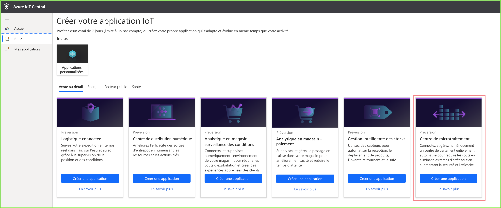
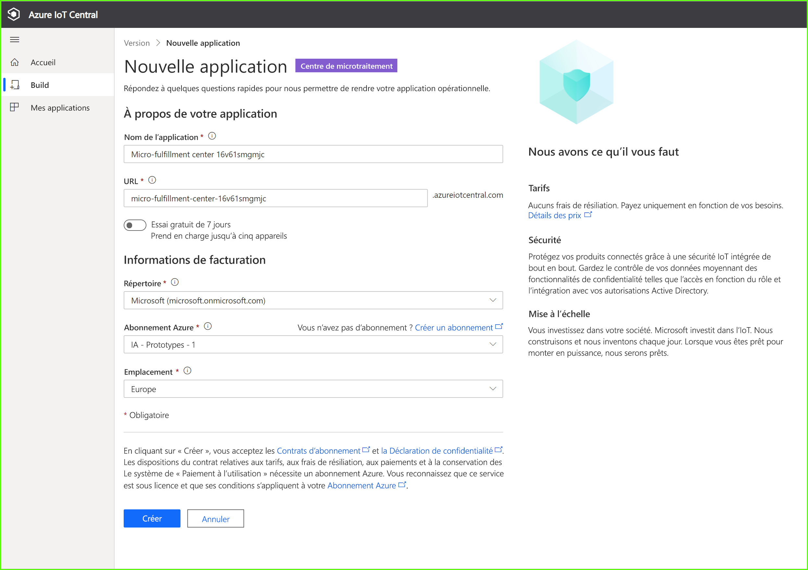
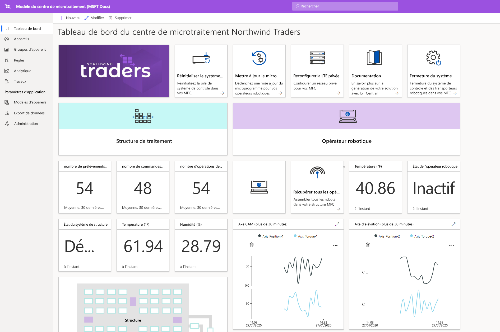
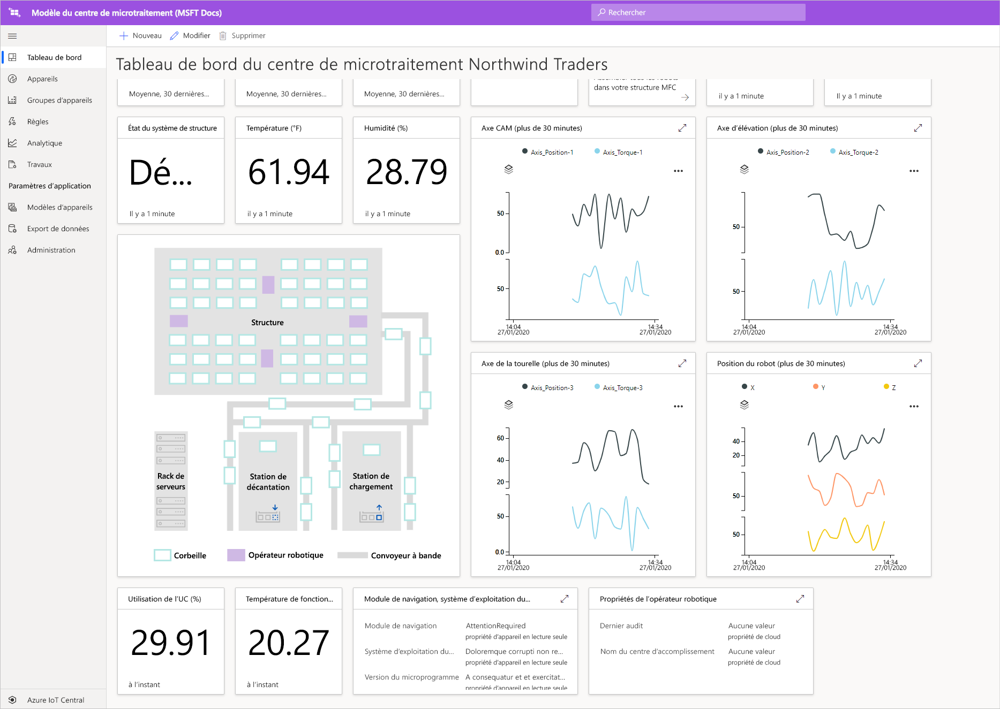
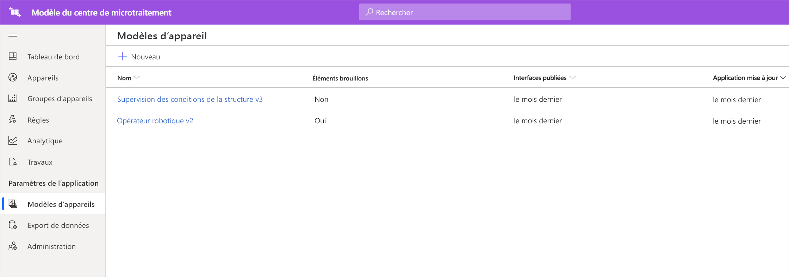
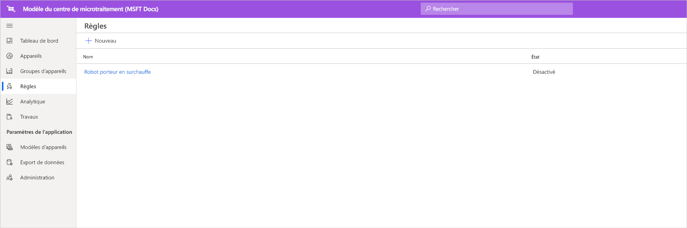
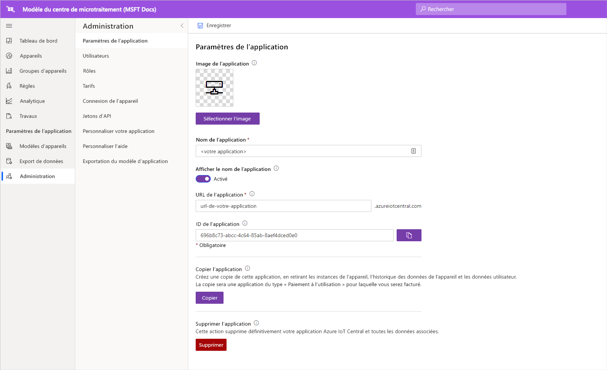

# Tutoriel : Déployer et parcourir un modèle d’application Centre de microtraitement

Dans ce tutoriel, nous allons nous servir du modèle d’application ***Centre de microtraitement*** Azure IoT Central pour générer une solution de vente au détail. Vous allez découvrir comment déployer le modèle Centre de microtraitement, les fonctionnalités prêtes à l’emploi qu’il propose et les différentes possibilités qui s’offrent à vous.

Dans ce tutoriel, vous allez apprendre à : 
> [!div class="checklist"]
> * Utiliser le modèle **Centre de microtraitement** Azure IoT Central pour créer une application de vente au détail
> * Parcourir l’application 

## Conditions préalables requises
Pour réaliser cette série de tutoriels, vous avez besoin des éléments suivants :
* Un abonnement Azure. Vous pouvez éventuellement utiliser une version d’évaluation gratuite de 7 jours. Si vous n’avez pas d’abonnement Azure, vous pouvez en créer un sur la [page d’inscription à Azure](https://aka.ms/createazuresubscription).

## Créer une application 
Dans cette section, vous créerez une application Azure IoT Central à partir d’un modèle. Vous utiliserez cette application tout au long de la série de tutoriels pour générer une solution complète.

Pour créer une nouvelle application Azure IoT Central :

1. Accédez au site web du [gestionnaire d’applications d’Azure IoT Central](https://aka.ms/iotcentral).
1. Si vous disposez d’un abonnement Azure, connectez-vous avec les informations d’identification que vous utilisez pour y accéder. Sinon, connectez-vous à l’aide d’un compte Microsoft :

   

1. Pour commencer à créer une application Azure IoT Central, sélectionnez **Nouvelle application**.

1. Sélectionnez **Distribution**.  La page de vente au détail affiche plusieurs modèles d’application de vente au détail.

Pour créer une application de centre de microtraitement qui utilise les fonctionnalités de préversion :  
1. Sélectionnez le modèle d’application **Centre de microtraitement**. Ce modèle comprend des modèles d’appareil pour tous les appareils utilisés dans le tutoriel. Le modèle propose aussi un tableau de bord de commande pour superviser l’état de votre centre de traitement ainsi que celui de vos robots porteurs. 

    > [!div class="mx-imgBorder"]
    > 
    
1. Si vous le souhaitez, choisissez un **nom d’application** convivial.  Le modèle d’application est basé sur la société fictive Northwind Traders. 

    > [!NOTE]
    > Si vous utilisez un **nom d’application** convivial, vous devez toujours utiliser une valeur unique pour l’**URL** de l’application.

1. Si vous disposez d’un abonnement Azure, entrez vos informations *Répertoire, Abonnement Azure et Région*. Si vous n’avez pas d’abonnement, vous pouvez activer une **version d’évaluation gratuite de 7 jours** et remplir les coordonnées requises.  

    Pour plus d’informations sur les répertoires et les abonnements, consultez le guide de démarrage rapide [Créer une application](../preview/quick-deploy-iot-central.md).

1. Sélectionnez **Create** (Créer).

> [!div class="mx-imgBorder"]
> 

## examiner l’application 

### tableau de bord 

Après avoir déployé le modèle d’application, vous accédez directement au **tableau de bord du centre de microtraitement de Northwind Traders**. Northwind Trader est un détaillant fictif dont le centre de microtraitement est géré dans cette application IoT Central. Dans ce tableau de bord de commande figurent des informations et autres données de télémétrie sur les appareils de ce modèle ainsi qu’un ensemble de commandes, de tâches et d’actions que vous pouvez effectuer. Le tableau de bord se divise logiquement en deux parties (gauche et droite). À gauche, vous pouvez superviser les conditions ambiantes au sein de la structure de traitement et à droite, vous pouvez superviser l’intégrité d’un robot porteur au sein de l’installation.  

À partir de ce tableau, vous pouvez :
   * Consulter les données de télémétrie d’appareils, par exemple le nombre de prélèvements, le nombre de commandes traitées et certaines propriétés comme l’état du système de la structure, etc.  
   * Examiner le **plan d’étage** et l’emplacement des robots porteurs au sein de la structure de traitement.
   * Déclencher des commandes pour, par exemple, réinitialiser le système de contrôle, mettre à jour le microprogramme du porteur, reconfigurer le réseau, etc.

> [!div class="mx-imgBorder"]
> 
   * Consultez un exemple du tableau de bord dont peut se servir un opérateur pour superviser les conditions au sein du centre de traitement. 
   * Supervisez l’intégrité des charges utiles s’exécutant sur l’appareil de passerelle au sein du centre de traitement.    

> [!div class="mx-imgBorder"]
> 

## Modèle d'appareil
Si vous cliquez sur l’onglet Modèles d’appareil, vous constatez qu’il existe deux types d’appareil dans le modèle : 
   * **Robotic Carrier** (Robot porteur) : Ce modèle d’appareil correspond à la définition d’un robot porteur fonctionnel qui a été déployé dans la structure de traitement et qui assure des opérations utiles de stockage et de récupération. Si vous cliquez sur le modèle, vous verrez que le robot envoie des données d’appareil comme la température, la position des axes ainsi que des propriétés comme le statut du robot porteur, etc. 
   * **Structure Condition Monitoring** (Supervision des conditions de la structure) : Ce modèle d’appareil représente un ensemble d’appareils qui vous permet de superviser les conditions ambiantes ainsi que l’appareil de passerelle hébergeant diverses charges de travail de périphérie sur lesquelles repose votre centre de traitement. L’appareil envoie des données de télémétrie comme la température, le nombre de prélèvements, le nombre de commandes, etc. en plus de l’état et de l’intégrité des charges de travail de calcul s’exécutant dans votre environnement. 

> [!div class="mx-imgBorder"]
> 

Si vous cliquez sur l’onglet Groupes d’appareils, vous constatez aussi que des groupes d’appareils sont créés automatiquement pour ces modèles d’appareil.

## Règles
Quand vous accédez à l’onglet Règles, vous pouvez constater que le modèle d’application comporte un exemple de règle destiné à superviser les conditions de température pour le robot porteur. Vous pouvez utiliser cette règle pour alerter l’opérateur qu’un certain robot au sein de l’installation est en surchauffe et qu’il doit être déconnecté et révisé. 

Inspirez-vous de l’exemple de règle pour définir des règles adaptées à votre activité.

   - **Robotic carrier too warm** (Robot porteur en surchauffe) : Cette règle se déclenche si le robot porteur atteint un seuil de température au cours d’une période. 

> [!div class="mx-imgBorder"]
> 

## Nettoyer les ressources

Si vous n’envisagez pas de continuer à utiliser cette application, supprimez le modèle d’application en accédant à **Administration** > **Paramètres de l’application**, puis cliquez sur **supprimer**.

> [!div class="mx-imgBorder"]
> 

## Étapes suivantes
* Découvrir plus en détail l’[architecture de la solution de centre de microtraitement](./architecture-micro-fulfillment-center-pnp.md)
* En savoir plus sur d’autres [modèles de distribution IoT Central](./overview-iot-central-retail-pnp.md)
* En savoir plus sur IoT Central en lisant [Vue d’ensemble d’IoT Central](../preview/overview-iot-central.md)