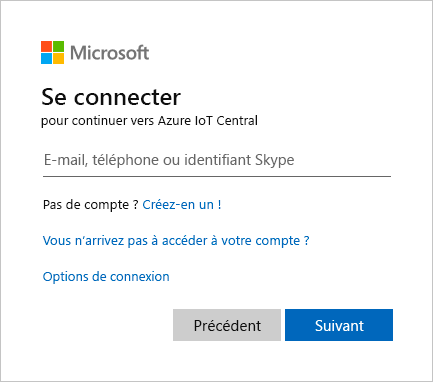
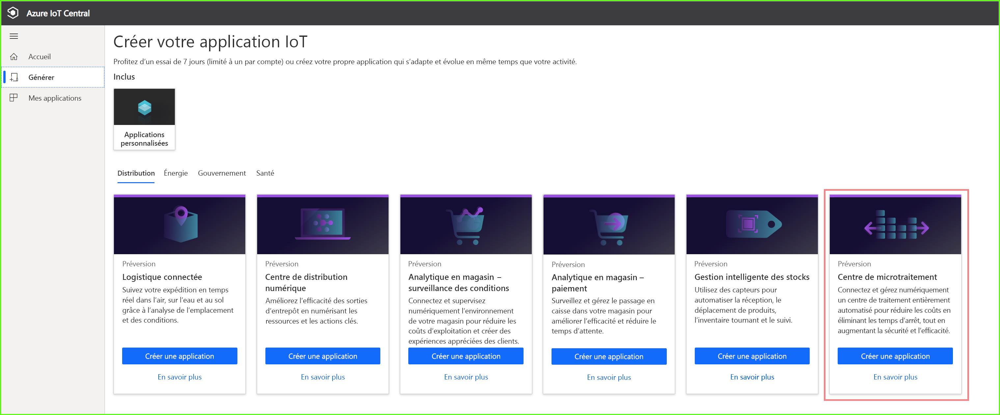
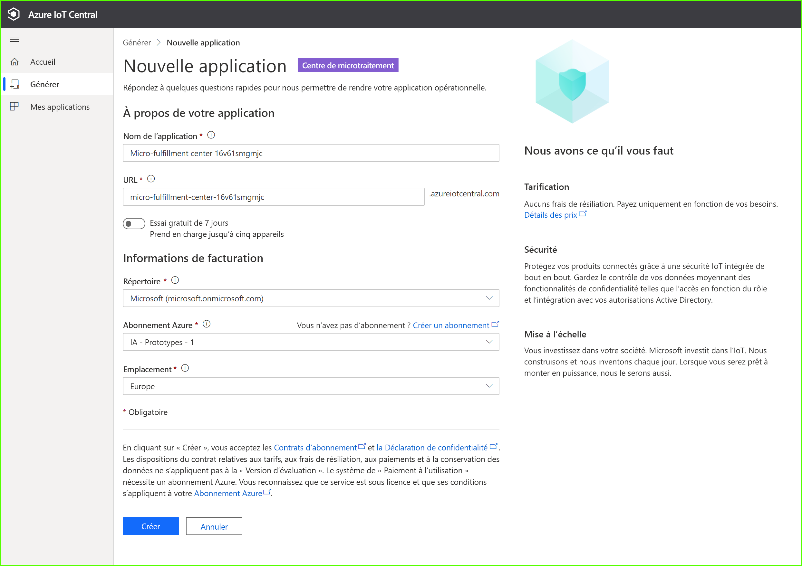
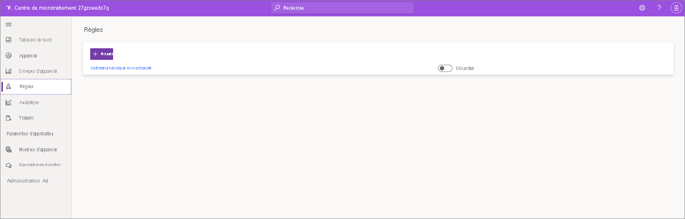
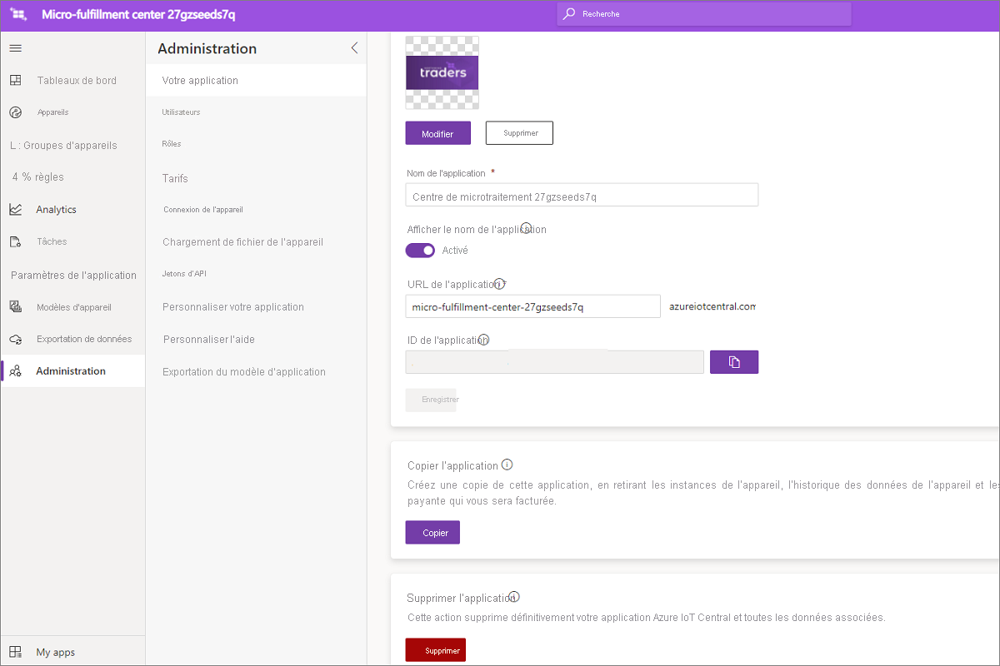

# Tutoriel : Déployer et parcourir un modèle d’application Centre de microtraitement

Dans ce tutoriel, vous utilisez le modèle d’application de centre de microtraitement Azure IoT Central pour générer une solution de vente au détail.

Dans ce tutoriel, vous allez voir comment :

> [!div class="checklist"]
> * Déployer le modèle d’application
> * Utiliser le modèle d’application

## Prérequis
Pour suivre cette série de tutoriels, vous avez besoin d’un abonnement Azure. Vous pouvez éventuellement utiliser une version d’évaluation gratuite de 7 jours. Si vous n’avez pas d’abonnement Azure, vous pouvez en créer un sur la [page d’inscription à Azure](https://aka.ms/createazuresubscription).

## Créer une application 
Dans cette section, vous créerez une application Azure IoT Central à partir d’un modèle. Vous utiliserez cette application tout au long de la série de tutoriels pour générer une solution complète.

Pour créer une nouvelle application Azure IoT Central :

1. Accédez au site web du [gestionnaire d’applications Azure IoT Central](https://aka.ms/iotcentral).
1. Si vous disposez d’un abonnement Azure, connectez-vous avec les informations d’identification que vous utilisez pour y accéder. Sinon, connectez-vous à l’aide d’un compte Microsoft :

   

1. Pour commencer à créer une application Azure IoT Central, sélectionnez **Nouvelle application**.

1. Sélectionnez **Distribution**.  La page de vente au détail affiche plusieurs modèles d’application de vente au détail.

Pour créer une application de centre de microtraitement qui utilise les fonctionnalités de préversion :  
1. Sélectionnez le modèle d’application **Centre de microtraitement**. Ce modèle comprend des modèles d’appareil pour tous les appareils utilisés dans le tutoriel. Le modèle fournit aussi un tableau de bord pour superviser l’état de votre centre de traitement ainsi que celui de vos robots porteurs. 

    
    
1. Si vous le souhaitez, choisissez un **nom d’application** convivial. Le modèle d’application est basé sur la société fictive Northwind Traders. 

    >[!NOTE]
    >Si vous utilisez un nom d’application convivial, vous devez toujours utiliser une valeur unique pour l’URL de l’application.

1. Si vous avez déjà un abonnement Azure, entrez les informations concernant l’annuaire, l’abonnement Azure et la région. Si vous n’avez pas d’abonnement, vous pouvez activer une version d’essai gratuit de 7 jours et remplir les coordonnées requises.  

1. Sélectionnez **Create** (Créer).

    

    

## examiner l’application 

Une fois le modèle d’application déployé, le **tableau de bord du centre de microtraitement de Northwind Traders** s’affiche. Northwind Trader est un détaillant fictif dont le centre de microtraitement est géré dans cette application Azure IoT Central. Dans ce tableau de bord figurent des informations et autres données de télémétrie sur les appareils de ce modèle ainsi qu’un ensemble de commandes, de tâches et d’actions que vous pouvez effectuer. Le tableau de bord se divise logiquement en deux parties. À gauche, vous pouvez superviser les conditions ambiantes au sein de la structure de traitement et à droite, vous pouvez superviser l’intégrité d’un robot porteur au sein de l’installation.  

À partir de ce tableau de bord, vous pouvez :
   * Consulter les données de télémétrie des appareils, par exemple le nombre de prélèvements, le nombre de commandes traitées et certaines propriétés comme l’état du système de la structure.  
   * Examiner le plan d’étage et l’emplacement des robots porteurs au sein de la structure de traitement.
   * Déclencher des commandes pour réinitialiser le système de contrôle, mettre à jour le microprogramme du porteur et reconfigurer le réseau, par exemple.

     
   * Consulter un exemple du tableau de bord dont peut se servir un opérateur pour superviser les conditions au sein du centre de traitement. 
   * Superviser l’intégrité des charges utiles qui s’exécutent sur l’appareil de passerelle au sein du centre de traitement.    

     

## Modèle d’appareil
Si vous sélectionnez l’onglet Modèles d’appareil, vous constatez qu’il existe deux types d’appareils dans le modèle : 
   * **Robotic Carrier** (Robot porteur) : ce modèle d’appareil correspond à la définition d’un robot porteur opérationnel qui a été déployé dans la structure de traitement et qui assure des opérations utiles de stockage et de récupération. Si vous sélectionnez le modèle, vous voyez que le robot envoie diverses données d’appareil, comme la température et la position des axes, ainsi que des propriétés comme l’état du robot porteur. 
   * **Structure Condition Monitoring** (Supervision des conditions de la structure) : Ce modèle d’appareil représente un ensemble d’appareils qui vous permet de superviser les conditions ambiantes, et l’appareil de passerelle qui héberge diverses charges de travail de périphérie sur lesquelles repose votre centre de traitement. L’appareil envoie des données de télémétrie, telles que la température, le nombre de prélèvements et le nombre de commandes. Il envoie aussi des informations sur l’état et l’intégrité des charges de travail de calcul s’exécutant dans votre environnement. 

     

Si vous sélectionnez l’onglet Groupes d’appareils, vous constatez aussi que des groupes d’appareils sont créés automatiquement pour ces modèles d’appareil.

## Règles
Sous l’onglet **Règles**, vous voyez que le modèle d’application comporte un exemple de règle destiné à superviser les conditions de température pour le robot porteur. Vous pouvez utiliser cette règle pour alerter l’opérateur qu’un certain robot au sein de l’installation est en surchauffe et qu’il doit être mis hors connexion et révisé. 

Inspirez-vous de l’exemple de règle pour définir des règles adaptées à votre activité.

## Nettoyer les ressources

Si vous ne comptez pas continuer à utiliser cette application, supprimez le modèle d’application. Accédez à **Administration** > **Paramètres d’application** et sélectionnez **Supprimer**.

## Étapes suivantes

Pour en savoir plus :

> [!div class="nextstepaction"]
> [Architecture de la solution du centre de microtraitement](./architecture-micro-fulfillment-center.md)
