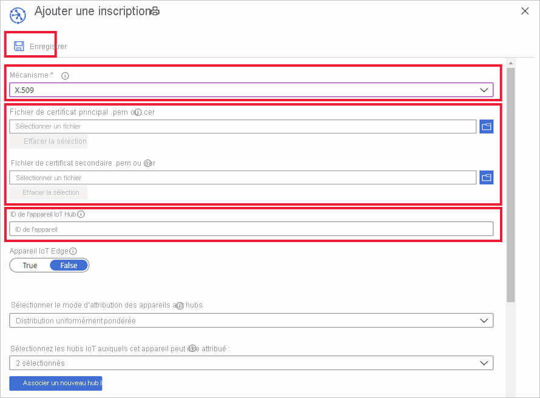

# Guide pratique pour gérer les inscriptions d’appareils avec le portail Azure

Une *inscription d’appareil* crée un enregistrement d’un appareil ou d’un groupe d’appareils susceptibles d’être inscrits au service Azure IoT Hub Device Provisioning à un moment donné. L’enregistrement contient la configuration initiale pour le ou les appareils dans le cadre de cette inscription. La configuration inclut le hub IoT auquel un appareil est affecté ou une stratégie d’allocation qui configure le hub à partir d’un ensemble de hubs. Cet article explique comment gérer les inscriptions d’appareil dans votre service d’approvisionnement.

## Créer une inscription d’appareil

Il existe deux façons de procéder à l’inscription de vos appareils auprès du service d’approvisionnement :

* Un **Groupe d’inscription** est une entrée pour un groupe d’appareils qui partagent un mécanisme d’attestation commun. Nous vous recommandons d’utiliser un groupe d’inscription pour un grand nombre d’appareils qui partagent une configuration initiale ou pour des appareils destinés au même locataire. Les appareils qui utilisent une [clé symétrique](concepts-symmetric-key-attestation.md) ou des [certificats X.509](concepts-x509-attestation.md) sont pris en charge. 

    Pour obtenir des instructions pas à pas sur la création et l’utilisation de groupes d’inscription avec des clés symétriques, consultez le didacticiel [Provisionner des appareils avec des clés symétriques](how-to-legacy-device-symm-key.md).

    Vous pouvez créer un groupe d’inscriptions dans le portail pour un groupe d’appareils en effectuant les étapes suivantes :

    1. Connectez-vous au portail Azure et cliquez dans le menu de gauche sur **Toutes les ressources**.  
    1. Dans la liste des ressources, cliquez sur le service Device Provisioning auquel vous souhaitez inscrire votre appareil.  
    1. Dans votre service d’approvisionnement, cliquez sur **Gérer les inscriptions**, puis cliquez sur le bouton **Ajouter un groupe d’inscription** au-dessus.  
     
        
        
    1. Lorsque le panneau « Ajouter un groupe d’inscription » s’affiche, saisissez les informations pour votre inscription et cliquez sur **Enregistrer**.  
     
        
        
        | Champ | Description |
        | :--- | :--- |
        | **Nom du groupe** | Nom requis pour votre groupe d’appareils. |
        | **Type d’attestation** | Cliquez sur **Certificat** ou **Clé symétrique** pour le type d’attestation en fonction de la méthode d’attestation utilisée par vos appareils. |
        | **Type de certificat** | Disponible si vous utilisez l’attestation de certificat. Sélectionnez **Certificat d’autorité de certification** ou **Intermédiaire** en fonction du certificat qui a signé vos certificats d’appareil. |
        | **Certificat principal** | Si vous signez vos certificats d’appareil avec un certificat d’autorité de certification racine, le certificat d’autorité de certification racine doit afficher le statut Terminé pour la [preuve de possession](how-to-verify-certificates.md). Vous pouvez alors le sélectionner en tant que **certificat principal** pour le groupe d’appareils.  Si vous signez vos certificats d’appareil avec un certificat intermédiaire, un bouton Charger sera disponible pour vous permettre de charger votre certificat intermédiaire. Le certificat qui a signé le certificat intermédiaire doit également disposer d’une [preuve de possession](how-to-verify-certificates.md). |

        
    

* Une **Inscription individuelle** est une entrée permettant de connecter un seul appareil qui peut être assigné à un hub IoT. Les appareils qui utilisent une [clé symétrique](concepts-symmetric-key-attestation.md), des [certificats X.509](concepts-x509-attestation.md) et une [attestation TPM](concepts-tpm-attestation.md) sont pris en charge. 

    Vous pouvez créer une inscription individuelle dans le portail en suivant les étapes décrites ici :

    1. Connectez-vous au portail Azure et cliquez dans le menu de gauche sur **Toutes les ressources**.
    1. Dans la liste des ressources, cliquez sur le service Device Provisioning auquel vous souhaitez inscrire votre appareil.
    1. Dans votre service d’approvisionnement, cliquez sur **Gérer les inscriptions**, puis cliquez sur le bouton **Ajouter une inscription individuelle** au-dessus.   

       

    1. Lorsque le panneau « Ajouter un groupe d’inscription » s’affiche, saisissez les informations pour l’inscription d’appareil individuel et cliquez sur **Enregistrer**. 
     
        
    
        | Champ | Description |
        | :--- | :--- |
        | **Mécanisme** | Sélectionnez **X.509**, **TPM** ou **Clé symétrique** pour le mécanisme d’attestation à utiliser en fonction de la méthode d’attestation utilisée par vos appareils. |
        | Paramètres d’attestation | Pour obtenir des instructions pas à pas sur la création et l’utilisation d’inscriptions individuelles avec des clés symétriques ou des certificats X.509, consultez l’un des démarrages rapides [Provisionner un appareil symétrique](quick-create-simulated-device-symmetric-key-java.md#create-a-device-enrollment) ou [Provisionner un appareil avec certificat X.509](quick-create-simulated-device-x509-java.md#create-a-self-signed-x509-device-certificate-and-individual-enrollment-entry).  Pour obtenir des instructions pas à pas sur la création et l’utilisation d’inscriptions individuelles à l’aide de l’attestation TPM, consultez l’un des exemples [Provisionner un appareil TPM simulé](quick-create-simulated-device-tpm-java.md#create-a-device-enrollment-entry).|
        | **ID de l’appareil IoT Hub** |  Cet ID représente votre appareil. Les utilisateurs doivent se conformer aux règles en vigueur concernant l’ID d’appareil. Pour plus d’informations, consultez la rubrique [Propriétés d’identité des appareils](../iot-hub/iot-hub-devguide-identity-registry.md#device-identity-properties).  Lorsque vous utilisez des certificats X.509, ce texte doit être le nom de l’objet sur le certificat de l’appareil que vous chargez pour l’inscription. Ce nom d’objet doit être conforme aux règles applicables à l’ID d’un appareil.|
            

## Mettre à jour une entrée d’inscription
Vous pouvez mettre à jour une entrée d’inscription existante dans le portail en effectuant les étapes suivantes :

1. Ouvrez votre service Device Provisioning dans le portail Azure et cliquez sur **Gérer les inscriptions**. 
1. Accédez à l’entrée d’inscription que vous souhaitez modifier. Cliquez sur l’entrée pour afficher des informations récapitulatives sur votre inscription d’appareil. 
1. Dans cette page, vous pouvez modifier d’autres éléments que le type de sécurité ou les informations d’identification, par exemple le hub IoT auquel l’appareil doit être lié et l’ID de l’appareil. Vous pouvez également modifier l’état initial du jumeau d’appareil. 
1. Lorsque vous avez terminé, cliquez sur **Enregistrer** pour mettre à jour votre inscription d’appareil. 

    

## Supprimer une inscription d’appareil
Si votre ou vos appareils n’ont pas besoin d’être provisionnés sur un hub IoT, vous pouvez supprimer l’entrée d’inscription correspondante dans le portail en effectuant les étapes suivantes :

1. Ouvrez votre service Device Provisioning dans le portail Azure et cliquez sur **Gérer les inscriptions**. 
1. Accédez à l’entrée d’inscription que vous souhaitez supprimer et sélectionnez-la. 
1. Cliquez sur le bouton **Supprimer** tout en haut et sélectionnez **Oui** lorsque vous êtes invité à confirmer l’action. 
1. Lorsque l’opération est terminée, votre entrée a été supprimée de la liste des inscriptions d’appareil. 
 
    