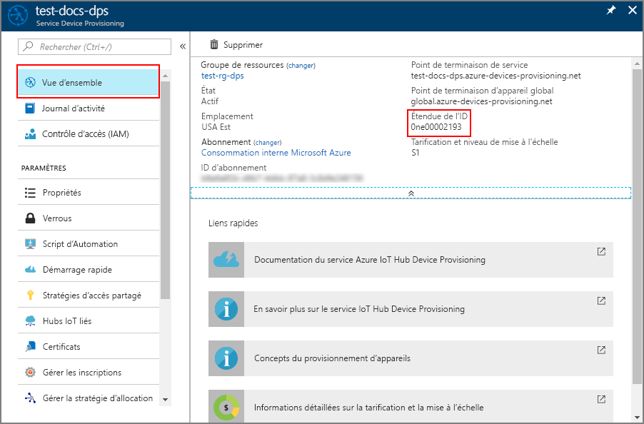

# <a name="how-to-provision-for-multitenancy"></a>Comment provisionner des appareils multilocataires 

Les stratégies d’allocation définies par le service Device Provisioning permettent de gérer divers scénarios d’allocation. Voici deux scénarios courants :

* **Géolocalisation / Géolatence** : quand un appareil change d’emplacement, il doit être provisionné dans le hub IoT le plus proche de son emplacement pour améliorer la latence du réseau. Dans ce scénario, un groupe de hubs IoT couvrant plusieurs régions sont sélectionnés pour les inscriptions. La stratégie d’allocation **Latence la plus faible** est sélectionnée pour ces inscriptions. Avec cette stratégie, le service Device Provisioning évalue la latence des appareils et détermine quel hub IoT dans le groupe de hubs IoT est le plus proche. 

* **Multilocation** : les appareils utilisés dans une solution IoT doivent parfois être affectés à un hub IoT ou à un groupe de hubs IoT spécifique. La solution peut nécessiter que tous les appareils d’un locataire particulier communiquent avec un groupe spécifique de hubs IoT. Dans certains cas, un locataire peut avoir ses propres hubs IoT et exiger que les appareils soient assignés à ses hubs IoT.

Il est courant de combiner ces deux scénarios. Par exemple, une solution IoT multilocataire assigne généralement ses appareils locataires dans un groupe de hubs IoT répartis entre plusieurs régions. Ces appareils locataires peuvent être assignés au hub IoT qui, dans ce groupe, a la latence la plus faible par rapport à l’emplacement géographique.

Cet article utilise un exemple d’appareil simulé du [SDK Azure IoT pour C](https://github.com/Azure/azure-iot-sdk-c) afin de montrer comment provisionner des appareils dans un scénario de solution multilocataire entre plusieurs régions. Dans cet article, vous allez effectuer les étapes suivantes :

* Utiliser Azure CLI pour créer deux hubs IoT régionaux (**West US** et **East US**)
* Créer une inscription multilocataire
* Utiliser Azure CLI pour créer deux machines virtuelles Linux régionales jouant le rôle d’appareils dans les mêmes régions (**West US** et **East US**)
* Configurer l’environnement de développement nécessaire au SDK Azure IoT pour C sur les deux machines virtuelles Linux
* Simuler les appareils afin de vérifier qu’ils sont provisionnés pour le même locataire dans la région la plus proche


[!INCLUDE [quickstarts-free-trial-note](../../includes/quickstarts-free-trial-note.md)]


## <a name="prerequisites"></a>Prérequis

* Avoir effectué les étapes décrites dans le guide de démarrage rapide [Configurer le service IoT Hub Device Provisioning avec le portail Azure](./quick-setup-auto-provision.md).


[!INCLUDE [cloud-shell-try-it.md](../../includes/cloud-shell-try-it.md)]


## <a name="create-two-regional-iot-hubs"></a>Créer deux hubs IoT régionaux

Dans cette section, vous allez utiliser Azure Cloud Shell pour créer deux hubs IoT régionaux dans les régions **West US** et **East US** d’un locataire.


1. Dans Azure Cloud Shell, créez un groupe de ressources avec la commande [az group create](/cli/azure/group#az-group-create). Un groupe de ressources Azure est un conteneur logique dans lequel les ressources Azure sont déployées et gérées. 

    L’exemple suivant crée un groupe de ressources nommé *contoso-us-resource-group* dans la région *eastus*. Il est recommandé d’utiliser ce groupe pour toutes les ressources créées dans cet article. Cela facilitera la suppression des ressources quand vous aurez terminé l’article.

    ```azurecli-interactive 
    az group create --name contoso-us-resource-group --location eastus
    ```

2. Dans Azure Cloud Shell, créez un hub IoT dans la région **eastus** avec la commande [az iot hub create](/cli/azure/iot/hub#az-iot-hub-create). Le hub IoT sera ajouté au groupe *contoso-us-resource-group*.

    L’exemple suivant crée un hub IoT nommé *contoso-east-hub* dans la région *eastus*. Remplacez **contoso-east-hub** par le nom unique de votre propre hub.

    ```azurecli-interactive 
    az iot hub create --name contoso-east-hub --resource-group contoso-us-resource-group --location eastus --sku S1
    ```
    
    Cette commande peut prendre plusieurs minutes.

3. Dans Azure Cloud Shell, créez un hub IoT dans la région **westus** avec la commande [az iot hub create](/cli/azure/iot/hub#az-iot-hub-create). Ce hub IoT sera également ajouté au groupe *contoso-us-resource-group*.

    L’exemple suivant crée un hub IoT nommé *contoso-west-hub* dans la région *westus*. Remplacez **contoso-west-hub** par le nom unique de votre propre hub.

    ```azurecli-interactive 
    az iot hub create --name contoso-west-hub --resource-group contoso-us-resource-group --location westus --sku S1
    ```

    Cette commande peut prendre plusieurs minutes.


## <a name="create-the-multitenant-enrollment"></a>Créer l’inscription multilocataire

Dans cette section, vous allez créer un groupe d’inscription pour les appareils locataires.  

Par souci de simplicité, cet article utilise [l’attestation de clé symétrique](concepts-symmetric-key-attestation.md) avec l’inscription. Pour sécuriser votre solution, utilisez plutôt [l’attestation de certificat X.509](concepts-security.md#x509-certificates) avec une chaîne d’approbation.

1. Connectez-vous au [portail Azure](https://portal.azure.com) et ouvrez votre instance du service Device Provisioning.

2. Sélectionnez l’onglet **Gérer les inscriptions**, puis cliquez sur le bouton **Ajouter un groupe d’inscriptions** en haut de la page. 

3. Dans **Ajouter un groupe d’inscriptions**, entrez les informations suivantes, puis cliquez sur le bouton **Enregistrer**.

    **Nom du groupe** : entrez **contoso-us-devices**.

    **Type d’attestation** : sélectionnez **Clé symétrique**.

    **Générer automatiquement les clés** : cette case est normalement déjà cochée.

    **Sélectionner le mode d’affectation des appareils aux hubs** : sélectionnez **Latence la plus faible**.

    


4. Sous **Ajouter un groupe d’inscriptions**, cliquez sur **Lier un nouveau hub IoT** pour lier les deux hubs régionaux.

    **Abonnement**: si vous avez plusieurs abonnements, sélectionnez celui où vous avez créé les hubs IoT régionaux.

    **Hub IoT** : sélectionnez un des hubs régionaux que vous avez créés.

    **Stratégie d’accès** : choisissez **iothubowner**.

    


5. Une fois que vous avez lié les deux hubs IoT régionaux, sélectionnez-les pour les ajouter au groupe d’inscription, puis cliquez sur **Enregistrer** afin de créer le groupe de hubs IoT régionaux pour l’inscription.

    


6. Après avoir enregistré l’inscription, rouvrez-la et notez la valeur de la **Clé primaire**. Vous devez d’abord enregistrer l’inscription pour permettre la génération des clés. Cette clé primaire servira ultérieurement à générer des clés uniques pour les deux appareils simulés.


## <a name="create-regional-linux-vms"></a>Créer des machines virtuelles Linux régionales

Dans cette section, vous créez deux machines virtuelles Linux régionales. Ces machines virtuelles exécutent un exemple de simulation d’appareils de deux régions afin d’illustrer le provisionnement d’appareils locataires dans chaque région.

Pour faciliter la suppression des ressources à la fin de l’article, nous ajoutons ces machines virtuelles au même groupe de ressources où vous avez créé les hubs IoT, à savoir *contoso-us-resource-group*. En revanche, nous exécutons les machines virtuelles dans des régions distinctes (**West US** et **East US**).

1. Dans Azure Cloud Shell, exécutez la commande ci-dessous pour créer une machine virtuelle dans la région **East US**, après avoir modifié les paramètres de la commande de la façon suivante :

    **--name** : entrez un nom unique pour la machine virtuelle de la région **USA Est**. 

    **--admin-username** : utilisez votre propre nom d’utilisateur administrateur.

    **--admin-password** : utilisez votre propre mot de passe d’administrateur.

    ```azurecli-interactive
    az vm create \
    --resource-group contoso-us-resource-group \
    --name ContosoSimDeviceEast \
    --location eastus \
    --image Canonical:UbuntuServer:18.04-LTS:18.04.201809110 \
    --admin-username contosoadmin \
    --admin-password myContosoPassword2018 \
    --authentication-type password
    ```

    Cette commande prend plusieurs minutes. Une fois la commande terminée, notez la valeur **publicIpAddress** de la machine virtuelle de la région East US.

1. Dans Azure Cloud Shell, exécutez la commande ci-dessous pour créer une machine virtuelle dans la région **West US**, après avoir modifié les paramètres de la commande de la façon suivante :

    **--name** : entrez un nom unique pour la machine virtuelle de la région **USA Ouest**. 

    **--admin-username** : utilisez votre propre nom d’utilisateur administrateur.

    **--admin-password** : utilisez votre propre mot de passe d’administrateur.

    ```azurecli-interactive
    az vm create \
    --resource-group contoso-us-resource-group \
    --name ContosoSimDeviceWest \
    --location westus \
    --image Canonical:UbuntuServer:18.04-LTS:18.04.201809110 \
    --admin-username contosoadmin \
    --admin-password myContosoPassword2018 \
    --authentication-type password
    ```

    Cette commande prend plusieurs minutes. Une fois la commande terminée, notez la valeur **publicIpAddress** de la machine virtuelle de la région West US.

1. Ouvrez deux interpréteurs en ligne de commande. Connectez-vous à l’une des machines virtuelles régionales dans chaque interpréteur à l’aide de SSH. 

    Dans SSH, entrez votre nom d’utilisateur administrateur ainsi que l’adresse IP publique que vous avez notée pour la machine virtuelle. Entrez le mot de passe d’administrateur lorsque vous y êtes invité.

    ```bash
    ssh contosoadmin@1.2.3.4

    contosoadmin@ContosoSimDeviceEast:~$
    ```

    ```bash
    ssh contosoadmin@5.6.7.8

    contosoadmin@ContosoSimDeviceWest:~$
    ```


## <a name="prepare-the-azure-iot-c-sdk-development-environment"></a>Préparer l’environnement de développement nécessaire au SDK Azure IoT pour C

Dans cette section, vous allez cloner le SDK Azure IoT pour C sur chaque machine virtuelle. Le SDK contient un exemple qui simule le provisionnement d’appareils locataires dans chaque région.


1. Sur chaque machine virtuelle, installez **Cmake**, **g++** , **gcc** et [Git](https://git-scm.com/book/en/v2/Getting-Started-Installing-Git) à l’aide des commandes suivantes :

    ```bash
    sudo apt-get update
    sudo apt-get install cmake build-essential libssl-dev libcurl4-openssl-dev uuid-dev git-all
    ```


1. Clonez le [SDK Azure IoT pour C](https://github.com/Azure/azure-iot-sdk-c) sur les deux machines virtuelles.

    ```bash
    cd ~/
    git clone https://github.com/Azure/azure-iot-sdk-c.git --recursive
    ```

    Attendez-vous à ce que cette opération prenne plusieurs minutes.

1. Sur les deux machines virtuelles, créez un dossier **cmake** dans le référentiel et accédez à ce dossier.

    ```bash
    mkdir ~/azure-iot-sdk-c/cmake
    cd ~/azure-iot-sdk-c/cmake
    ```

1. Sur les deux machines virtuelles, exécutez la commande suivante qui génère une version du SDK propre à votre plateforme cliente de développement. 

    ```bash
    cmake -Dhsm_type_symm_key:BOOL=ON -Duse_prov_client:BOOL=ON  ..
    ```

    Une fois la génération terminée, les dernières lignes de sortie doivent ressembler à la sortie suivante :

    ```bash
    -- IoT Client SDK Version = 1.2.9
    -- Provisioning client ON
    -- Provisioning SDK Version = 1.2.9
    -- target architecture: x86_64
    -- Checking for module 'libcurl'
    --   Found libcurl, version 7.58.0
    -- Found CURL: curl
    -- target architecture: x86_64
    -- target architecture: x86_64
    -- target architecture: x86_64
    -- target architecture: x86_64
    -- iothub architecture: x86_64
    -- target architecture: x86_64
    -- Configuring done
    -- Generating done
    -- Build files have been written to: /home/contosoadmin/azure-iot-sdk-c/cmake
    ```    


## <a name="derive-unique-device-keys"></a>Dériver les clés d’appareil uniques

Quand vous utilisez l’attestation de clé symétrique avec des inscriptions de groupe, vous ne vous servez pas directement des clés du groupe d’inscriptions. À la place, vous créez une clé dérivée unique pour chaque appareil, comme cela est décrit dans [Inscriptions de groupe avec des clés symétriques](concepts-symmetric-key-attestation.md#group-enrollments).

Pour générer la clé de l’appareil, calculez le code [HMAC-SHA256](https://wikipedia.org/wiki/HMAC) de l’ID d’inscription unique de l’appareil en utilisant la clé de groupe principale, puis convertissez le résultat au format Base64.

N’incluez pas votre clé de groupe principale dans le code de l’appareil.

Utilisez l’exemple d’interpréteur de commandes Bash afin de créer une clé dérivée pour chaque appareil à l’aide de la commande **openssl**.

- Remplacez la valeur **KEY** par la **clé primaire** que vous avez précédemment notée pour votre inscription.

- Remplacez la valeur **REG_ID** par votre propre ID d’inscription unique pour chaque appareil. Utilisez des caractères alphanumériques en minuscules et des tirets (« - ») pour définir les deux ID.

Exemple de génération d’une clé d’appareil pour *contoso-simdevice-east* :

```bash
KEY=rLuyBPpIJ+hOre2SFIP9Ajvdty3j0EwSP/WvTVH9eZAw5HpDuEmf13nziHy5RRXmuTy84FCLpOnhhBPASSbHYg==
REG_ID=contoso-simdevice-east

keybytes=$(echo $KEY | base64 --decode | xxd -p -u -c 1000)
echo -n $REG_ID | openssl sha256 -mac HMAC -macopt hexkey:$keybytes -binary | base64
```

```bash
p3w2DQr9WqEGBLUSlFi1jPQ7UWQL4siAGy75HFTFbf8=
```

Exemple de génération d’une clé d’appareil pour *contoso-simdevice-west* :

```bash
KEY=rLuyBPpIJ+hOre2SFIP9Ajvdty3j0EwSP/WvTVH9eZAw5HpDuEmf13nziHy5RRXmuTy84FCLpOnhhBPASSbHYg==
REG_ID=contoso-simdevice-west

keybytes=$(echo $KEY | base64 --decode | xxd -p -u -c 1000)
echo -n $REG_ID | openssl sha256 -mac HMAC -macopt hexkey:$keybytes -binary | base64
```

```bash
J5n4NY2GiBYy7Mp4lDDa5CbEe6zDU/c62rhjCuFWxnc=
```


Chaque appareil locataire utilisera sa clé d’appareil dérivée et un ID d’inscription unique pour effectuer l’attestation de clé symétrique avec le groupe d’inscription lors du provisionnement dans les hubs IoT locataires.


## <a name="simulate-the-devices-from-each-region"></a>Simuler les appareils de chaque région


Dans cette section, vous allez mettre à jour un exemple de provisionnement du SDK Azure IoT pour C sur les deux machines virtuelles régionales. 

L’exemple de code simule une séquence de démarrage d’un appareil qui envoie la demande de provisionnement à votre instance du service Device Provisioning. La séquence de démarrage entraîne la reconnaissance de l’appareil et son assignation au hub IoT le plus proche en fonction de la latence.

1. Dans le portail Azure, sélectionnez l’onglet **Vue d’ensemble** de votre service Device Provisioning et notez les valeurs de **_Étendue de l’ID_** .

     

1. Ouvrez **~/azure-iot-sdk-c/provisioning\_client/samples/prov\_dev\_client\_sample/prov\_dev\_client\_sample.c** sur les deux machines virtuelles à modifier.

    ```bash
    vi ~/azure-iot-sdk-c/provisioning_client/samples/prov_dev_client_sample/prov_dev_client_sample.c
    ```

1. Recherchez la constante `id_scope` et remplacez la valeur par la valeur **Étendue de l’ID** que vous avez copiée précédemment. 

    ```c
    static const char* id_scope = "0ne00002193";
    ```

1. Recherchez la définition de la fonction `main()` dans le même fichier. Assurez-vous que la variable `hsm_type` est définie sur `SECURE_DEVICE_TYPE_SYMMETRIC_KEY`, comme dans l’exemple ci-dessous, pour correspondre à la méthode d’attestation du groupe d’inscription. 

    Enregistrez vos modifications dans les fichiers sur les deux machines virtuelles.

    ```c
    SECURE_DEVICE_TYPE hsm_type;
    //hsm_type = SECURE_DEVICE_TYPE_TPM;
    //hsm_type = SECURE_DEVICE_TYPE_X509;
    hsm_type = SECURE_DEVICE_TYPE_SYMMETRIC_KEY;
    ```

1. Sur les deux machines virtuelles, recherchez l’appel à `prov_dev_set_symmetric_key_info()` dans **prov\_dev\_client\_sample.c**, qui est placé en commentaire.

    ```c
    // Set the symmetric key if using they auth type
    //prov_dev_set_symmetric_key_info("<symm_registration_id>", "<symmetric_Key>");
    ```

    Décommentez l’appel de fonction et remplacez les valeurs des espaces réservés (y compris les crochets) par les ID d’inscription uniques et les clés d’appareil dérivées pour chaque appareil. Les clés montrées ci-dessous sont données seulement à des fins d’exemple. Utilisez les clés que vous avez générées précédemment.

    USA Est :
    ```c
    // Set the symmetric key if using they auth type
    prov_dev_set_symmetric_key_info("contoso-simdevice-east", "p3w2DQr9WqEGBLUSlFi1jPQ7UWQL4siAGy75HFTFbf8=");
    ```

    USA Ouest :
    ```c
    // Set the symmetric key if using they auth type
    prov_dev_set_symmetric_key_info("contoso-simdevice-west", "J5n4NY2GiBYy7Mp4lDDa5CbEe6zDU/c62rhjCuFWxnc=");
    ```

    Enregistrez les fichiers.

1. Sur les deux machines virtuelles, accédez au dossier d’exemple ci-dessous et générez l’exemple.

    ```bash
    cd ~/azure-iot-sdk-c/cmake/provisioning_client/samples/prov_dev_client_sample/
    cmake --build . --target prov_dev_client_sample --config Debug
    ```

1. Une fois l’exemple généré, exécutez **prov\_dev\_client\_sample.exe** sur les deux machines virtuelles pour simuler un appareil locataire de chaque région. Notez que chaque appareil est alloué à l’hub IoT locataire le plus proche des régions de l’appareil simulé.

    Exécutez la simulation :
    ```bash
    ~/azure-iot-sdk-c/cmake/provisioning_client/samples/prov_dev_client_sample/prov_dev_client_sample
    ```

    Exemple de sortie de la machine virtuelle USA Est :

    ```bash
    contosoadmin@ContosoSimDeviceEast:~/azure-iot-sdk-c/cmake/provisioning_client/samples/prov_dev_client_sample$ ./prov_dev_client_sample
    Provisioning API Version: 1.2.9

    Registering Device

    Provisioning Status: PROV_DEVICE_REG_STATUS_CONNECTED
    Provisioning Status: PROV_DEVICE_REG_STATUS_ASSIGNING
    Provisioning Status: PROV_DEVICE_REG_STATUS_ASSIGNING

    Registration Information received from service: contoso-east-hub.azure-devices.net, deviceId: contoso-simdevice-east
    Press enter key to exit:

    ```

    Exemple de sortie de la machine virtuelle USA Ouest :
    ```bash
    contosoadmin@ContosoSimDeviceWest:~/azure-iot-sdk-c/cmake/provisioning_client/samples/prov_dev_client_sample$ ./prov_dev_client_sample
    Provisioning API Version: 1.2.9

    Registering Device

    Provisioning Status: PROV_DEVICE_REG_STATUS_CONNECTED
    Provisioning Status: PROV_DEVICE_REG_STATUS_ASSIGNING
    Provisioning Status: PROV_DEVICE_REG_STATUS_ASSIGNING

    Registration Information received from service: contoso-west-hub.azure-devices.net, deviceId: contoso-simdevice-west
    Press enter key to exit:
    ```


## <a name="clean-up-resources"></a>Supprimer des ressources

Si vous envisagez de continuer à utiliser les ressources créées dans cet article, vous pouvez les conserver. Sinon, effectuez les étapes suivantes pour supprimer toutes les ressources qui ont été créées dans le cadre de cet article, et ainsi éviter des frais inutiles.

Les étapes décrites supposent que vous avez créé toutes les ressources utilisées dans cet article dans le même groupe de ressources nommé **contoso-us-resource-group**, comme nous vous l’avions demandé.

> [!IMPORTANT]
> La suppression d’un groupe de ressources est irréversible. Le groupe de ressources et toutes les ressources qu’il contient sont supprimés définitivement. Veillez à ne pas supprimer accidentellement des ressources ou un groupe de ressources incorrects. Si vous avez créé l’IoT Hub à l’intérieur d’un groupe de ressources existant qui concerne des ressources que vous souhaitez conserver, supprimer uniquement la ressource de l’ IoT Hub au lieu de supprimer le groupe de ressources.
>

Pour supprimer le groupe de ressources par nom :

1. Connectez-vous au [Portail Azure](https://portal.azure.com) et cliquez sur **Groupes de ressources**.

2. Dans la zone de texte **Filtrer par nom...** , tapez le nom du groupe de ressources contenant vos ressources (ici, **contoso-us-resource-group**). 

3. À droite de votre groupe de ressources dans la liste des résultats, cliquez sur **...** , puis sur **Supprimer le groupe de ressources**.

4. Il vous sera demandé de confirmer la suppression du groupe de ressources. Saisissez de nouveau le nom de votre groupe de ressources pour confirmer, puis cliquez sur **Supprimer**. Après quelques instants, le groupe de ressources et toutes les ressources qu’il contient sont supprimés.

## <a name="next-steps"></a>Étapes suivantes

- Pour en savoir plus sur le reprovisionnement, consultez [Concepts du reprovisionnement d’appareils IoT Hub](concepts-device-reprovision.md) 
- Pour en savoir plus sur le déprovisionnement, consultez [Guide pratique pour déprovisionner des appareils auparavant provisionnés automatiquement](how-to-unprovision-devices.md) 


